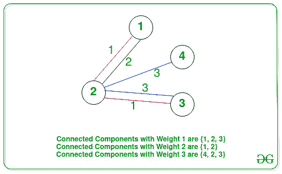

# 图中最大连通分量的一对节点的最大乘积

> 原文:[https://www . geeksforgeeks . org/从图中最大连接组件获得最大一对节点乘积/](https://www.geeksforgeeks.org/maximum-product-of-a-pair-of-nodes-from-largest-connected-component-in-a-graph/)

给定一个由 **N** 顶点和 **M** 边组成的[无向加权图](https://www.geeksforgeeks.org/graph-and-its-representations/) **G** ，以及分别由图的 **M** 边和每条边的权值组成的两个数组**边【】【2】**和**权值】**，任务是找出图的[最大连通分量的任意两个顶点的最大乘积](https://www.geeksforgeeks.org/connected-components-in-an-undirected-graph/)

**示例:**

> **输入:** N = 4，边[][] = {{1，2}，{1，2}，{2，3}，{2，3}，{2，4}}，权重[] = {1，2，1，3，3 }
> T3】输出:12
> T6】解释:
> 
> [](https://media.geeksforgeeks.org/wp-content/cdn-uploads/20210406152929/559949.jpg)
> 
> *   权重 1 的边的分量，1 ↔ 2 ↔ 3。这个分量的任意两个顶点的最大乘积是 6。
> *   权重 2 的边的分量，1 ↔ 2。这个分量的任意两个顶点的最大乘积是 2。
> *   权重的边的分量 3，4 ↔ 2 ↔ 3。这个分量的任意两个顶点的最大乘积是 12。
> 
> 因此，大小为 3(最大值)的所有连接组件中的最大乘积是 12。
> 
> **输入:** N = 5，边[][] = {{1，5}，{2，5}，{3，5}，{4，5}，{1，2}，{2，3}，{3，4}}，权重[] = {1，1，1，1，2，2，2}
> **输出:** 20

**方法:**给定的问题可以通过在给定的图上执行 [DFS 遍历来解决，并且对于相同权重的所有连接的组件，最大化第一和第二最大节点的乘积。按照以下步骤解决问题:](https://www.geeksforgeeks.org/depth-first-search-or-dfs-for-a-graph/)

*   将所有唯一权重对应的所有边存储在[地图](https://www.geeksforgeeks.org/map-associative-containers-the-c-standard-template-library-stl/) **M** 中。
*   初始化一个变量，将 **res** 设为 **0** 来存储相同权重的连接组件的任意两个节点的最大乘积。
*   [遍历地图](https://www.geeksforgeeks.org/traversing-a-map-or-unordered_map-in-cpp-stl/)并为每个关键点作为权重[通过连接所有用特定权重映射的边来创建图形](https://www.geeksforgeeks.org/graph-and-its-representations/)，并执行以下操作:
    *   通过对创建的图执行 DFS 遍历，找到**最大值**(比如说 **M1** )和**第二最大值**(比如说 **M2** )节点的值和图的所有[连接组件的**T9】大小。**](https://www.geeksforgeeks.org/connected-components-in-an-undirected-graph/)
    *   将 **res** 的值更新为 **res** 、 **M1** 和 **M2** 的最大值，如果当前连接组件的尺寸为**至少为之前找到的[最大尺寸连接组件](https://www.geeksforgeeks.org/largest-connected-component-on-a-grid/)。**
*   完成上述步骤后，打印 **res** 的值作为最大乘积。

下面是上述方法的实现:

## C++

```
// C++ program for the above approach

#include <bits/stdc++.h>
using namespace std;

// Stores the first and second largest
// element in a connected component
int Max, sMax;

// Stores the count of nodes
// in the connected components
int cnt = 0;

// Function to perform DFS Traversal
// on a given graph and find the first
// and the second largest elements
void dfs(int u, int N, vector<bool>& vis,
         vector<vector<int> >& adj)
{
    // Update the maximum value
    if (u > Max) {
        sMax = Max;
        Max = u;
    }

    // Update the second max value
    else if (u > sMax) {
        sMax = u;
    }

    // Increment size of component
    cnt++;

    // Mark current node visited
    vis[u] = true;

    // Traverse the adjacent nodes
    for (auto to : adj[u]) {

        // If to is not already visited
        if (!vis[to]) {
            dfs(to, N, vis, adj);
        }
    }

    return;
}

// Function to find the maximum
// product of a connected component
int MaximumProduct(
    int N, vector<pair<int, int> > Edge,
    vector<int> wt)
{
    // Stores the count of edges
    int M = wt.size();

    // Stores all the edges mapped
    // with a particular weight
    unordered_map<int,
                  vector<pair<int, int> > >
        mp;

    // Update the map mp
    for (int i = 0; i < M; i++)
        mp[wt[i]].push_back(Edge[i]);

    // Stores the result
    int res = 0;

    // Traverse the map mp
    for (auto i : mp) {

        // Stores the adjacency list
        vector<vector<int> > adj(N + 1);

        // Stores the edges of
        // a particular weight
        vector<pair<int, int> > v = i.second;

        // Traverse the vector v
        for (int j = 0; j < v.size(); j++) {

            int U = v[j].first;
            int V = v[j].second;

            // Add an edge
            adj[U].push_back(V);
            adj[V].push_back(U);
        }

        // Stores if a vertex
        // is visited or not
        vector<bool> vis(N + 1, 0);

        // Stores the maximum
        // size of a component
        int cntMax = 0;

        // Iterate over the range [1, N]
        for (int u = 1; u <= N; u++) {

            // Assign Max, sMax, count = 0
            Max = sMax = cnt = 0;

            // If vertex u is not visited
            if (!vis[u]) {

                dfs(u, N, vis, adj);

                // If cnt is greater
                // than cntMax
                if (cnt > cntMax) {

                    // Update the res
                    res = Max * sMax;
                    cntMax = cnt;
                }

                // If already largest
                // connected component
                else if (cnt == cntMax) {

                    // Update res
                    res = max(res, Max * sMax);
                }
            }
        }
    }

    // Return res
    return res;
}

// Driver Code
int main()
{
    int N = 5;
    vector<pair<int, int> > Edges
        = { { 1, 2 }, { 2, 5 }, { 3, 5 }, { 4, 5 }, { 1, 2 }, { 2, 3 }, { 3, 4 } };

    vector<int> Weight = { 1, 1, 1, 1,
                           2, 2, 2 };
    cout << MaximumProduct(N, Edges, Weight);

    return 0;
}
```

**Output:** 

```
20
```

***时间复杂度:**O(N<sup>2</sup>* log N+M)*
***辅助空间:** O(N <sup>2</sup> )*