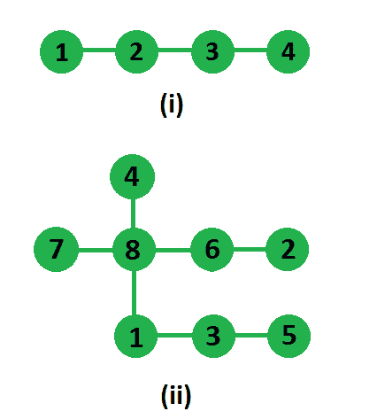

# 树中两条不相交路径的最大乘积

> 原文:[https://www . geeksforgeeks . org/树中两条不相交路径的最大乘积/](https://www.geeksforgeeks.org/maximum-product-of-two-non-intersecting-paths-in-a-tree/)

给定一个有 N 个节点(和 N-1 条边)的无向连通树，我们需要在这个树中找到两条路径，使得它们不相交，并且它们长度的乘积最大。

示例:

```
In first tree two paths which are non-intersecting
and have highest product are, 1-2 and 3-4, so answer
is 1*1 = 1
In second tree two paths which are non-intersecting 
and has highest product are, 1-3-5  and  7-8-6-2 
(or 4-8-6-2), so answer is 3*2 = 6
```



我们可以通过深度优先搜索树来解决这个问题，方法如下，因为树是连通的，路径是不相交的，如果我们选择任何一对这样的路径，就必须有第三条路径，连接这两条路径，如果我们从第三条路径中去掉一条边，那么树将被分成两部分——一部分包含第一条路径，另一部分包含第二条路径。这一观察给我们提出了算法:在边上迭代；对于每条边，删除它，找到两个连接组件中的路径长度，并乘以这些路径的长度。树中路径的长度可以通过修改深度优先搜索找到，我们将在每个邻居处调用最大路径，并将返回的两个最大长度相加，这将是以当前节点为根的子树处的最大路径长度。

实现细节:
输入是一棵树，但是其中没有指定的根，因为我们只有边的集合。该树表示为无向图。我们遍历邻接表。对于每条边，我们在它的两边找到最大长度的路径(在移除边之后)。我们跟踪由边缘去除引起的最大产品。

## C++

```
// C++ program to find maximum product of two
// non-intersecting paths
#include <bits/stdc++.h>
using namespace std;

/*  Returns maximum length path in subtree rooted
    at u after removing edge connecting u and v */
int dfs(vector<int> g[], int& curMax, int u, int v)
{
    // To find lengths of first and second maximum
    // in subtrees. currMax is to store overall
    // maximum.
    int max1 = 0, max2 = 0, total = 0;

    //  loop through all neighbors of u
    for (int i = 0; i < g[u].size(); i++)
    {
        //  if neighbor is v, then skip it
        if (g[u][i] == v)
            continue;

        //  call recursively with current neighbor as root
        total = max(total, dfs(g, curMax, g[u][i], u));

        //  get max from one side and update
        if (curMax > max1)
        {
            max2 = max1;
            max1 = curMax;
        }
        else
            max2 = max(max2, curMax);
    }

    // store total length by adding max
    // and second max
    total = max(total, max1 + max2);

    // update current max by adding 1, i.e.
    // current node is included
    curMax = max1 + 1;
    return total;
}

// method returns maximum product of length of
// two non-intersecting paths
int maxProductOfTwoPaths(vector<int> g[], int N)
{
    int res = INT_MIN;
    int path1, path2;

    // one by one removing all edges and calling
    // dfs on both subtrees
    for (int i = 1; i < N+2; i++)
    {
        for (int j = 0; j < g[i].size(); j++)
        {
            // calling dfs on subtree rooted at
            // g[i][j], excluding edge from g[i][j]
            // to i.
            int curMax = 0;
            path1 = dfs(g, curMax, g[i][j], i);

            //  calling dfs on subtree rooted at
            // i, edge from i to g[i][j]
            curMax = 0;
            path2 = dfs(g, curMax, i, g[i][j]);

            res = max(res, path1 * path2);
        }
    }
    return res;
}

// Utility function to add an undirected edge (u,v)
void addEdge(vector<int> g[], int u, int v)
{
    g[u].push_back(v);
    g[v].push_back(u);
}

//  Driver code to test above methods
int main()
{
    int edges[][2] = {{1, 8}, {2, 6}, {3, 1},
                      {5, 3}, {7, 8}, {8, 4},
                      {8, 6} };
    int N = sizeof(edges)/sizeof(edges[0]);

    // there are N edges, so +1 for nodes and +1
    // for 1-based indexing
    vector<int> g[N + 2];
    for (int i = 0; i < N; i++)
         addEdge(g, edges[i][0], edges[i][1]);

    cout << maxProductOfTwoPaths(g, N) << endl;
    return 0;
}
```

## Java 语言(一种计算机语言，尤用于创建网站)

```
// Java program to find maximum product
// of two non-intersecting paths
import java.util.*;

class GFG{
static int curMax;

// Returns maximum length path in
// subtree rooted at u after 
// removing edge connecting u and v 
static int dfs(Vector<Integer> g[],  
               int u, int v)
{

    // To find lengths of first and 
    // second maximum in subtrees. 
    // currMax is to store overall
    // maximum.
    int max1 = 0, max2 = 0, total = 0;

    // Loop through all neighbors of u
    for(int i = 0; i < g[u].size(); i++)
    {

        // If neighbor is v, then skip it
        if (g[u].get(i) == v)
            continue;

        // Call recursively with current 
        // neighbor as root
        total = Math.max(total, dfs(
            g, g[u].get(i), u));

        // Get max from one side and update
        if (curMax > max1)
        {
            max2 = max1;
            max1 = curMax;
        }
        else
            max2 = Math.max(max2, curMax);
    }

    // Store total length by adding max
    // and second max
    total = Math.max(total, max1 + max2);

    // Update current max by adding 1, i.e.
    // current node is included
    curMax = max1 + 1;
    return total;
}

// Method returns maximum product of 
// length of two non-intersecting paths
static int maxProductOfTwoPaths(Vector<Integer> g[],
                                int N)
{
    int res = Integer.MIN_VALUE;
    int path1, path2;

    // One by one removing all edges and 
    // calling dfs on both subtrees
    for(int i = 1; i < N + 2; i++)
    {
        for(int j = 0; j < g[i].size(); j++)
        {

            // Calling dfs on subtree rooted at
            // g[i][j], excluding edge from g[i][j]
            // to i.
            curMax = 0;
            path1 = dfs(g, g[i].get(j), i);

            // Calling dfs on subtree rooted at
            // i, edge from i to g[i][j]
            curMax = 0;
            path2 = dfs(g,i, g[i].get(j));

            res = Math.max(res, path1 * path2);
        }
    }
    return res;
}

// Utility function to add an 
// undirected edge (u,v)
static void addEdge(Vector<Integer> g[], 
                    int u, int v)
{
    g[u].add(v);
    g[v].add(u);
}

//  Driver code 
public static void main(String[] args)
{
    int edges[][] = { { 1, 8 }, { 2, 6 }, 
                      { 3, 1 }, { 5, 3 },
                      { 7, 8 }, { 8, 4 },
                      { 8, 6 } };

    int N = edges.length;

    // There are N edges, so +1 for nodes
    // and +1 for 1-based indexing
    @SuppressWarnings("unchecked")
    Vector<Integer> []g = new Vector[N + 2];
    for(int i = 0; i < g.length; i++)
        g[i] = new Vector<Integer>();

    for(int i = 0; i < N; i++)
         addEdge(g, edges[i][0], edges[i][1]);

    System.out.print(maxProductOfTwoPaths(g, N) + "\n");
}
}

// This code is contributed by Princi Singh
```

## 蟒蛇 3

```
# Python3 program to find maximum product of two 
# non-intersecting paths 

# Returns maximum length path in subtree rooted 
# at u after removing edge connecting u and v 
def dfs(g, curMax, u, v):

    # To find lengths of first and second maximum 
    # in subtrees. currMax is to store overall 
    # maximum. 
    max1 = 0
    max2 = 0
    total = 0

    # loop through all neighbors of u 
    for i in range(len(g[u])):

        # if neighbor is v, then skip it 
        if (g[u][i] == v):
            continue

        # call recursively with current neighbor as root 
        total = max(total, dfs(g, curMax, g[u][i], u)) 

        # get max from one side and update 
        if (curMax[0] > max1):
            max2 = max1 
            max1 = curMax[0]
        else:
            max2 = max(max2, curMax[0])

    # store total length by adding max 
    # and second max 
    total = max(total, max1 + max2) 

    # update current max by adding 1, i.e. 
    # current node is included 
    curMax[0] = max1 + 1
    return total

# method returns maximum product of length of 
# two non-intersecting paths 
def maxProductOfTwoPaths(g, N):
    res = -999999999999
    path1, path2 = None, None

    # one by one removing all edges and calling 
    # dfs on both subtrees
    for i in range(N):
        for j in range(len(g[i])):

            # calling dfs on subtree rooted at 
            # g[i][j], excluding edge from g[i][j] 
            # to i. 
            curMax = [0] 
            path1 = dfs(g, curMax, g[i][j], i) 

            # calling dfs on subtree rooted at 
            # i, edge from i to g[i][j] 
            curMax = [0] 
            path2 = dfs(g, curMax, i, g[i][j]) 

            res = max(res, path1 * path2)
    return res

# Utility function to add an undirected edge (u,v) 
def addEdge(g, u, v):
    g[u].append(v) 
    g[v].append(u)

# Driver code  
if __name__ == '__main__':
    edges = [[1, 8], [2, 6], [3, 1], [5, 3], [7, 8], [8, 4], [8, 6]] 
    N = len(edges) 

    # there are N edges, so +1 for nodes and +1 
    # for 1-based indexing 
    g = [[] for i in range(N + 2)]
    for i in range(N):
        addEdge(g, edges[i][0], edges[i][1])
    print(maxProductOfTwoPaths(g, N))

# This code is contributed by PranchalK    
```

## C#

```
// C# program to find maximum product
// of two non-intersecting paths
using System;
using System.Collections.Generic;

public class GFG
{
  static int curMax;

  // Returns maximum length path in
  // subtree rooted at u after 
  // removing edge connecting u and v 
  static int dfs(List<int> []g,  
                 int u, int v)
  {

    // To find lengths of first and 
    // second maximum in subtrees. 
    // currMax is to store overall
    // maximum.
    int max1 = 0, max2 = 0, total = 0;

    // Loop through all neighbors of u
    for(int i = 0; i < g[u].Count; i++)
    {

      // If neighbor is v, then skip it
      if (g[u][i] == v)
        continue;

      // Call recursively with current 
      // neighbor as root
      total = Math.Max(total, dfs(
        g, g[u][i], u));

      // Get max from one side and update
      if (curMax > max1)
      {
        max2 = max1;
        max1 = curMax;
      }
      else
        max2 = Math.Max(max2, curMax);
    }

    // Store total length by adding max
    // and second max
    total = Math.Max(total, max1 + max2);

    // Update current max by adding 1, i.e.
    // current node is included
    curMax = max1 + 1;
    return total;
  }

  // Method returns maximum product of 
  // length of two non-intersecting paths
  static int maxProductOfTwoPaths(List<int> []g,
                                  int N)
  {
    int res = int.MinValue;
    int path1, path2;

    // One by one removing all edges and 
    // calling dfs on both subtrees
    for(int i = 1; i < N + 2; i++)
    {
      for(int j = 0; j < g[i].Count; j++)
      {

        // Calling dfs on subtree rooted at
        // g[i,j], excluding edge from g[i,j]
        // to i.
        curMax = 0;
        path1 = dfs(g, g[i][j], i);

        // Calling dfs on subtree rooted at
        // i, edge from i to g[i,j]
        curMax = 0;
        path2 = dfs(g,i, g[i][j]);

        res = Math.Max(res, path1 * path2);
      }
    }
    return res;
  }

  // Utility function to add an 
  // undirected edge (u,v)
  static void addEdge(List<int> []g, 
                      int u, int v)
  {
    g[u].Add(v);
    g[v].Add(u);
  }

  //  Driver code 
  public static void Main(String[] args)
  {
    int [,]edges = { { 1, 8 }, { 2, 6 }, 
                    { 3, 1 }, { 5, 3 },
                    { 7, 8 }, { 8, 4 },
                    { 8, 6 } };

    int N = edges.GetLength(0);

    // There are N edges, so +1 for nodes
    // and +1 for 1-based indexing
    List<int> []g = new List<int>[N + 2];
    for(int i = 0; i < g.Length; i++)
      g[i] = new List<int>();

    for(int i = 0; i < N; i++)
      addEdge(g, edges[i,0], edges[i,1]);

    Console.Write(maxProductOfTwoPaths(g, N) + "\n");
  }
}

// This code is contributed by aashish1995 
```

## java 描述语言

```
<script>
    // Javascript program to find maximum product of two
    // non-intersecting paths
    let curMax;

    // Returns maximum length path in
    // subtree rooted at u after
    // removing edge connecting u and v
    function dfs(g, u, v)
    {

      // To find lengths of first and
      // second maximum in subtrees.
      // currMax is to store overall
      // maximum.
      let max1 = 0, max2 = 0, total = 0;

      // Loop through all neighbors of u
      for(let i = 0; i < g[u].length; i++)
      {

        // If neighbor is v, then skip it
        if (g[u][i] == v)
          continue;

        // Call recursively with current
        // neighbor as root
        total = Math.max(total, dfs(
          g, g[u][i], u));

        // Get max from one side and update
        if (curMax > max1)
        {
          max2 = max1;
          max1 = curMax;
        }
        else
          max2 = Math.max(max2, curMax);
      }

      // Store total length by adding max
      // and second max
      total = Math.max(total, max1 + max2);

      // Update current max by adding 1, i.e.
      // current node is included
      curMax = max1 + 1;
      return total;
    }

    // Method returns maximum product of
    // length of two non-intersecting paths
    function maxProductOfTwoPaths(g, N)
    {
      let res = Number.MIN_VALUE;
      let path1, path2;

      // One by one removing all edges and
      // calling dfs on both subtrees
      for(let i = 1; i < N + 2; i++)
      {
        for(let j = 0; j < g[i].length; j++)
        {

          // Calling dfs on subtree rooted at
          // g[i,j], excluding edge from g[i,j]
          // to i.
          curMax = 0;
          path1 = dfs(g, g[i][j], i);

          // Calling dfs on subtree rooted at
          // i, edge from i to g[i,j]
          curMax = 0;
          path2 = dfs(g,i, g[i][j]);

          res = Math.max(res, path1 * path2);
        }
      }
      return res;
    }

    // Utility function to add an
    // undirected edge (u,v)
    function addEdge(g, u, v)
    {
      g[u].push(v);
      g[v].push(u);
    }

    let edges = [ [ 1, 8 ], [ 2, 6 ],
                    [ 3, 1 ], [ 5, 3 ],
                    [ 7, 8 ], [ 8, 4 ],
                    [ 8, 6 ] ];

    let N = edges.length;

    // There are N edges, so +1 for nodes
    // and +1 for 1-based indexing
    let g = [];
    for(let i = 0; i < N + 2; i++)
    {
        g.push([]);
    }
    for(let i = 0; i < g.length; i++)
      g[i] = [];

    for(let i = 0; i < N; i++)
      addEdge(g, edges[i][0], edges[i][1]);

    document.write(maxProductOfTwoPaths(g, N) + "</br>");

// This code is contributed by divyesh072019.
</script>
```

**输出:**

```
6
```

本文由 [**乌卡什·特里维迪**](https://in.linkedin.com/in/utkarsh-trivedi-253069a7) 供稿。如果你喜欢 GeeksforGeeks 并想投稿，你也可以使用[write.geeksforgeeks.org](https://write.geeksforgeeks.org)写一篇文章或者把你的文章邮寄到 review-team@geeksforgeeks.org。看到你的文章出现在极客博客主页上，帮助其他极客。
如果发现有不正确的地方，或者想分享更多关于上述话题的信息，请写评论。