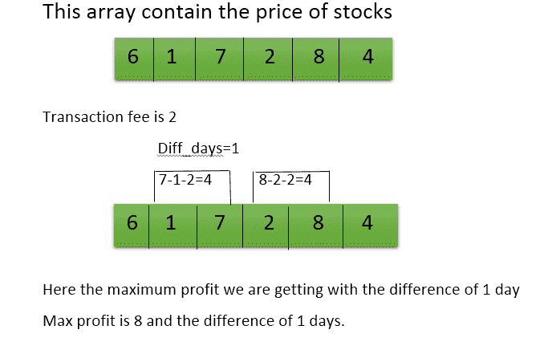

# 带交易费买卖股票后的最大利润

> 原文:[https://www . geeksforgeeks . org/带交易费的股票买卖后最大利润/](https://www.geeksforgeeks.org/maximum-profit-after-buying-and-selling-the-stocks-with-transaction-fees/)

给定一组包含股票价格和交易费的正整数，任务是找到最大利润和你获得最大利润的天数差。
**例:**

```
Input: arr[] = {6, 1, 7, 2, 8, 4}
      transactionFee = 2
Output: 8 1

Input: arr[] = {7, 1, 5, 3, 6, 4}
       transactionFee = 1
Output: 5 1
```



**解释:**考虑第一个例子:arr[] = {6，1，7，2，8，4}，transactionFee = 2

1.  如果我们在**同一天**买卖，我们将**得不到任何利润**这就是为什么买卖之差必须至少为 1。
2.  有了第 **1 天**的差价，如果我们买一只 1 卢比的股票，用第 1 天**的差价卖出 7 卢比，这意味着第 2 天买入，第二天**卖出，那么在支付了 2 卢比的交易费，即 7-1-2=4 之后，我们将获得 4 卢比的利润，就像我们在第 4 天买入，第 5 天用第 1 天的差价卖出一样，那么我们将获得 4 卢比的利润。所以总利润是 **8 卢比**。
3.  有了 **2 天**的差价，我们**就没有任何利润了**。
4.  有了 **3 天**的差价，如果我们买入 1 卢比的股票，以 3 天**的差价卖出 8 卢比，这意味着在第 2 天买入，3 天后卖出**，那么支付 2 卢比的交易费后的最大利润，即 8-1-2=5，我们将获得 **5 卢比的利润。**
5.  有了 **4 天**的差价，如果我们买入 1 卢比的股票，卖出 4 卢比，差价为 4 天**，这意味着在第 2 天买入，4 天后卖出**，那么在支付 2 卢比的交易费，即 4-1-2=1 之后，我们将获得 **1 卢比**的利润。
6.  有了 **5 天**的差价，我们**就没有任何利润了。**

**进场:**

1.  用每天的差异遍历整个数组。
2.  通过减去每天的价格(包括交易费)来检查利润。
3.  追踪最大利润并存储我们获得最大利润的不同日期。
4.  重复上述步骤，直到循环终止。

以下是上述方法的实现:

## C++

```
// C++ implementation of above approach
#include <bits/stdc++.h>
using namespace std;

int max_profit(int a[],int b[],int n,int fee)
{
int i, j, profit;

int l, r, diff_day = 1, sum = 0;

//b[0] will contain the maximum profit
    b[0]=0;                
//b[1] will contain the day
//on which we are getting the maximum profit
    b[1]=diff_day;
for(i=1;i<n;i++)
{
    l=0;
    r=diff_day;
        sum=0;    

    for(j=n-1;j>=i;j--)
        {
        //here finding the max profit
            profit=(a[r]-a[l])-fee;

        //if we get less then or equal to zero
        // it means we are not getting the profit
            if(profit>0)    
                {
                sum=sum+profit;
                }
            l++;

            r++;
            }
//check if sum is greater then maximum then store the new maximum
    if(b[0] < sum)
{
    b[0] = sum;

    b[1] = diff_day;

    }
diff_day++;
}

return 0;
}

// Driver code
int main()
{
    int arr[] = { 6, 1, 7, 2, 8, 4 };
    int n = sizeof(arr) / sizeof(arr[0]);
    int b[2];
    int tranFee = 2;

    max_profit(arr, b, n, tranFee);

    cout << b[0] << ", " << b[1] << endl;

    return 0;
}
```

## Java 语言(一种计算机语言，尤用于创建网站)

```
// Java implementation of above approach
import java.util.*;

class solution
{

static int max_profit(int a[],int b[],int n,int fee)
{
int i, j, profit;

int l, r, diff_day = 1, sum = 0;

//b[0] will contain the maximum profit
    b[0]=0;                
//b[1] will contain the day
//on which we are getting the maximum profit
    b[1]=diff_day;
for(i=1;i<n;i++)
{
    l=0;
    r=diff_day;
        sum=0;    

    for(j=n-1;j>=i;j--)
        {
        //here finding the max profit
            profit=(a[r]-a[l])-fee;

        //if we get less then or equal to zero
        // it means we are not getting the profit
            if(profit>0)    
                {
                sum=sum+profit;
                }
            l++;

            r++;
            }
//check if sum is greater then maximum then store the new maximum
    if(b[0] < sum)
{
    b[0] = sum;

    b[1] = diff_day;

    }
diff_day++;
}

return 0;
}

// Driver code
public static void main(String args[])
{
    int arr[] = { 6, 1, 7, 2, 8, 4 };
    int n = arr.length;
    int[] b = new int[2];
    int tranFee = 2;

    max_profit(arr, b, n, tranFee);

    System.out.println(b[0]+", "+b[1]);

}
}

//This code is contributed by Surendra_Gangwar
```

## 蟒蛇 3

```
# Python3 implementation of above approach
def max_profit(a, b, n, fee):

    i, j, profit = 1, n - 1, 0

    l, r, diff_day = 0, 0, 1

    # b[0] will contain the maximum profit
    b[0] = 0   

    # b[1] will contain the day on which
    # we are getting the maximum profit
    b[1] = diff_day

    for i in range(1, n):
        l = 0
        r = diff_day
        Sum = 0

        for j in range(n - 1, i - 1, -1):

            # here finding the max profit
            profit = (a[r] - a[l]) - fee

            # if we get less then or equal to zero
            # it means we are not getting the profit
            if(profit > 0):
                Sum = Sum + profit

            l += 1
            r += 1

        # check if Sum is greater then maximum
        # then store the new maximum
        if(b[0] < Sum):
            b[0] = Sum
            b[1] = diff_day

    diff_day += 1

    return 0

# Driver code
arr = [6, 1, 7, 2, 8, 4]
n = len(arr)
b = [0 for i in range(2)]
tranFee = 2

max_profit(arr, b, n, tranFee)

print(b[0], ",", b[1])

# This code is contributed by
# Mohit kumar 29
```

## C#

```
// C# implementation of above approach
using System;

class GFG
{

static int max_profit(int []a, int []b,
                      int n, int fee)
{
int i, j, profit;

int l, r, diff_day = 1, sum = 0;

// b[0] will contain the
// maximum profit
b[0] = 0;

// b[1] will contain the day on which
// we are getting the maximum profit
b[1] = diff_day;
for(i = 1; i < n; i++)
{
    l = 0; r = diff_day; sum = 0;

    for(j = n - 1; j >= i; j--)
        {
            // here finding the max profit
            profit = (a[r] - a[l]) - fee;

            // if we get less then or equal
            // to zero it means we are not
            // getting the profit
            if(profit > 0)
            {
                sum = sum + profit;
            }
            l++;

            r++;
        }

    // check if sum is greater then maximum
    // then store the new maximum
    if(b[0] < sum)
    {
        b[0] = sum;

        b[1] = diff_day;

    }
    diff_day++;
}

return 0;
}

// Driver code
static public void Main ()
{
    int []arr = { 6, 1, 7, 2, 8, 4 };
    int n = arr.Length;
    int[] b = new int[2];
    int tranFee = 2;

    max_profit(arr, b, n, tranFee);

    Console.WriteLine(b[0] + ", " + b[1]);
}
}

// This code is contributed by Sachin
```

## 服务器端编程语言（Professional Hypertext Preprocessor 的缩写）

```
<?php
// PHP implementation of above approach

function max_profit(&$a, &$b, $n, $fee)
{
    $diff_day = 1;
    $sum = 0;

    // b[0] will contain the maximum profit
    $b[0] = 0;

    // b[1] will contain the day on which we
    // are getting the maximum profit
    $b[1] = $diff_day;

    for($i = 1; $i < $n; $i++)
    {
        $l = 0;
        $r = $diff_day;
        $sum = 0;

        for($j = $n - 1; $j >= $i; $j--)
        {
            // here finding the max profit
            $profit = ($a[$r] - $a[$l]) - $fee;

            // if we get less then or equal to zero
            // it means we are not getting the profit
            if($profit > 0)    
            {
                $sum = $sum + $profit;
            }
            $l++;

            $r++;
        }

        // check if sum is greater then maximum
        // then store the new maximum
        if($b[0] < $sum)
        {
            $b[0] = $sum;

            $b[1] = $diff_day;
        }
        $diff_day++;
    }

}

// Driver code
$arr = array(6, 1, 7, 2, 8, 4 );
$n = sizeof($arr);
$b = array();
$tranFee = 2;

max_profit($arr, $b, $n, $tranFee);
echo($b[0]);
echo(", ");
echo($b[1]);

// This code is contributed
// by Shivi_Aggarwal
?>
```

## java 描述语言

```
<script>

// Javascript implementation of above approach

    function max_profit(a , b , n , fee) {
        var i, j, profit;

        var l, r, diff_day = 1, sum = 0;

        // b[0] will contain the maximum profit
        b[0] = 0;
        // b[1] will contain the day
        // on which we are getting the maximum profit
        b[1] = diff_day;
        for (i = 1; i < n; i++) {
            l = 0;
            r = diff_day;
            sum = 0;

            for (j = n - 1; j >= i; j--) {
                // here finding the max profit
                profit = (a[r] - a[l]) - fee;

                // if we get less then or equal to zero
                // it means we are not getting the profit
                if (profit > 0) {
                    sum = sum + profit;
                }
                l++;

                r++;
            }
            // check if sum is greater then maximum
            // then store the new maximum
            if (b[0] < sum) {
                b[0] = sum;

                b[1] = diff_day;

            }
            diff_day++;
        }

        return 0;
    }

    // Driver code

        var arr = [ 6, 1, 7, 2, 8, 4 ];
        var n = arr.length;
        var b = Array(2).fill(0);
        var tranFee = 2;

        max_profit(arr, b, n, tranFee);

        document.write(b[0] + ", " + b[1]);

// This code contributed by Rajput-Ji

</script>
```

**Output:** 

```
8, 1
```

**时间复杂度:** O(N <sup>2</sup> )

**更好的方法:**

与 https://www.geeksforgeeks.org/stock-buy-sell/相同，但也增加了不同的天数

## 蟒蛇 3

```
from typing import List, Tuple

def max_profit(prices: List[int], transaction_fee:int = 0) -> Tuple[int, int]:
    n = len(prices)
    start = 0
    end = 1
    profit = 0
    max_profit_till_now = float('-inf')
    diff = 0
    while start < n - 1 and end < n:
        while start < n - 1 and prices[start] > prices[start + 1]:
            start += 1
        end = start + 1
        while end < n - 1 and prices[end] < prices[end + 1]:
            end += 1
            if end == n:
                continue
        cur_profit = prices[end] - prices[start] - transaction_fee
        if cur_profit > 0:
            profit += cur_profit
        if max_profit_till_now < cur_profit:
            max_profit_till_now = cur_profit
            diff = end - start
        start = end + 1
    return profit, diff
print(max_profit([6, 1, 7, 2, 8, 4], 2))
```

**输出:**

```
(8, 1)
```

**时间复杂度** : O(N)

**辅助空间** : O(1)