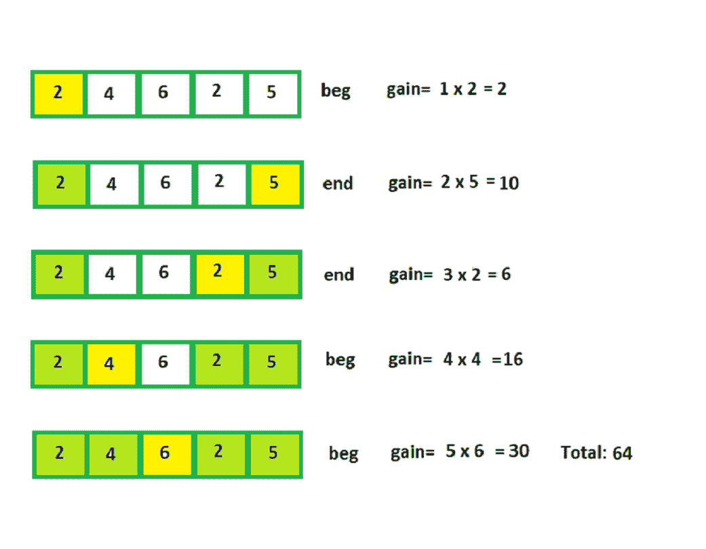

# 葡萄酒销售的最大利润

> 原文:[https://www.geeksforgeeks.org/maximum-profit-sale-wines/](https://www.geeksforgeeks.org/maximum-profit-sale-wines/)

给定连续 n 款酒，整数分别表示每款酒的成本。每年你都可以出售这一排的第一款或最后一款葡萄酒。然而，葡萄酒的价格会随着时间的推移而上涨。让葡萄酒的最初利润来自 P1、P2、P3……Pn。第三年，第四款酒的利润将是 Y*Pi。对于每一年，你的任务是打印“乞求”或“结束”表示第一个或最后一个葡萄酒应该出售。另外，计算所有葡萄酒的最大利润。
**例:**

```
Input: Price of wines: 2 4 6 2 5
Output: beg end end beg beg 
         64
Explanation :
```



**逼近:**是标准的动态规划问题。最初看起来像是一个贪婪的问题，我们应该每年出售更便宜的葡萄酒，但案例(第二年)清楚地证明了这种方法是错误的。有时，我们需要更早地出售昂贵的葡萄酒，以便为以后的年份节省相对昂贵的葡萄酒(这里，如果在第二年出售 4 瓶，在第四年，我们必须出售 2 瓶，这将浪费一个沉重的系数)。
第二个问题是“存储策略”，以获得计算价格，该价格有一个相当标准的方法，也可以用于其他问题。这个想法是存储每个状态的最佳动作，并使用它从初始状态开始在最佳状态中导航。

## C++

```
// Program to calculate maximum price of wines
#include <bits/stdc++.h>
using namespace std;

#define N 1000

int dp[N][N];

// This array stores the "optimal action"
// for each state i, j
int sell[N][N];

// Function to maximize profit
int maxProfitUtil(int price[], int begin,
                  int end, int n) {
    if (dp[begin][end] != -1)
        return dp[begin][end];

    int year = n - (end - begin);

    if (begin == end)
        return year * price[begin];   

    // x = maximum profit on selling the
    // wine from the front this year
    int x = price[begin] * year +
            maxProfitUtil(price, begin + 1, end, n);

    // y = maximum profit on selling the
    // wine from the end this year
    int y = price[end] * year +
            maxProfitUtil(price, begin, end - 1, n);

    int ans = max(x, y);
    dp[begin][end] = ans;

    if (x >= y)
        sell[begin][end] = 0;
    else
        sell[begin][end] = 1;

    return ans;
}

// Util Function to calculate maxProfit
int maxProfit(int price[], int n) {
    // reseting the dp table
    for (int i = 0; i < N; i++)
        for (int j = 0; j < N; j++)
            dp[i][j] = -1;

    int ans = maxProfitUtil(price, 0, n - 1, n);

    int i = 0, j = n - 1;

    while (i <= j) {
        // sell[i][j]=0 implies selling the
        // wine from beginning will be more
        // profitable in the long run
        if (sell[i][j] == 0) {
            cout << "beg ";
            i++;
        }  else {
            cout << "end ";
            j--;
        }
    }

    cout << endl;

    return ans;
}

// Driver code
int main() {
    // Price array
    int price[] = { 2, 4, 6, 2, 5 };

    int n = sizeof(price) / sizeof(price[0]);

    int ans = maxProfit(price, n);

    cout << ans << endl;

    return 0;
}
```

## Java 语言(一种计算机语言，尤用于创建网站)

```
// Program to calculate maximum price of wines
import java.io.*;

class GFG {

    static int N = 1000;

    static int [][]dp = new int[N][N];

    // This array stores the "optimal action"
    // for each state i, j
    static int [][]sell = new int[N][N];

    // Function to maximize profit
    static int maxProfitUtil(int price[],
                   int begin, int end, int n)
    {
        if (dp[begin][end] != -1)
            return dp[begin][end];

        int year = n - (end - begin);

        if (begin == end)
            return year * price[begin];

        // x = maximum profit on selling the
        // wine from the front this year
        int x = price[begin] * year +
                maxProfitUtil(price, begin + 1,
                                       end, n);

        // y = maximum profit on selling the
        // wine from the end this year
        int y = price[end] * year +
                maxProfitUtil(price, begin,
                                  end - 1, n);

        int ans = Math.max(x, y);
        dp[begin][end] = ans;

        if (x >= y)
            sell[begin][end] = 0;
        else
            sell[begin][end] = 1;

        return ans;
    }

    // Util Function to calculate maxProfit
    static int maxProfit(int price[], int n)
    {

        // reseting the dp table
        for (int i = 0; i < N; i++)
            for (int j = 0; j < N; j++)
                dp[i][j] = -1;

        int ans = maxProfitUtil(price, 0,
                                  n - 1, n);

        int i = 0, j = n - 1;

        while (i <= j) {

            // sell[i][j]=0 implies selling
            // the wine from beginning will
            // be more profitable in the
            // long run
            if(sell[i][j] == 0){
                System.out.print( "beg ");
                i++;
            }
            else
            {
                System.out.print( "end ");
                j--;
            }
        }

        System.out.println();

        return ans;
    }

    // Driver code
    public static void main (String[] args)
    {
        // Price array
        int price[] = { 2, 4, 6, 2, 5 };

        int n = price.length;

        int ans = maxProfit(price, n);

        System.out.println( ans );
    }
}

// This code is contributed by anuj_67.
```

## 蟒蛇 3

```
# Python3 Program to calculate
# maximum price of wines
N = 1000
dp = [ [-1 for col in range(N)]    
           for row in range(N)]

# This array stores the "optimal action"
# for each state i, j
sell = [ [0 for col in range(N)]
            for row in range(N)]

# Function to maximize profit
def maxProfitUtil(price, begin, end, n):

    if (dp[begin][end] != -1):
        return dp[begin][end]

    year = n - (end - begin)

    if (begin == end):
        return year * price[begin]

    # x = maximum profit on selling the
    # wine from the front this year
    x = price[begin] * year + \
        maxProfitUtil(price, begin + 1, end, n)

    # y = maximum profit on selling the
    # wine from the end this year
    y = price[end] * year + \
        maxProfitUtil(price, begin, end - 1, n)

    ans = max(x, y)
    dp[begin][end] = ans

    if (x >= y):
        sell[begin][end] = 0
    else:
        sell[begin][end] = 1

    return ans

# Util Function to calculate maxProfit
def maxProfit(price, n):

    ans = maxProfitUtil(price, 0, n - 1, n)

    i = 0
    j = n - 1

    while (i <= j):

        # sell[i][j]=0 implies selling the
        # wine from beginning will be more
        # profitable in the long run
        if (sell[i][j] == 0):
            print("beg", end = " ")
            i = i + 1
        else:
            print("end", end = " ")
            j = j - 1

    print(" ")
    return ans

# Driver code

# Price array
price = [ 2, 4, 6, 2, 5 ]

size = 5

ans = maxProfit(price, size);

print(ans)

# This code is contributed by ashutosh450
```

## C#

```
// C# Program to calculate maximum
// price of wines
using System;
class GFG {

    static int N = 1000;
    static int [,]dp = new int[N, N];

    // This array stores the "optimal action"
    // for each state i, j
    static int [,]sell = new int[N,N];

    // Function to maximize profit
    static int maxProfitUtil(int []price,
               int begin, int end, int n)
    {
        if (dp[begin,end] != -1)
            return dp[begin,end];

        int year = n - (end - begin);

        if (begin == end)
            return year * price[begin];

        // x = maximum profit on selling the
        // wine from the front this year
        int x = price[begin] * year +
                maxProfitUtil(price, begin + 1,
                                       end, n);

        // y = maximum profit on selling the
        // wine from the end this year
        int y = price[end] * year +
                maxProfitUtil(price, begin,
                                end - 1, n);

        int ans = Math.Max(x, y);
        dp[begin,end] = ans;

        if (x >= y)
            sell[begin,end] = 0;
        else
            sell[begin,end] = 1;

        return ans;
    }

    // Util Function to calculate maxProfit
    static int maxProfit(int []price, int n)
    {
        int i, j;

        // reseting the dp table
        for(i = 0; i < N; i++)
            for(j = 0; j < N; j++)
                dp[i, j] = -1;

        int ans = maxProfitUtil(price, 0,
                                n - 1, n);

        i = 0; j = n - 1;

        while (i <= j) {

            // sell[i][j]=0 implies selling
            // the wine from beginning will
            // be more profitable in the
            // long run
            if(sell[i, j] == 0){
                Console.Write( "beg ");
                i++;
            }
            else
            {
                Console.Write( "end ");
                j--;
            }
        }

    Console.WriteLine();

        return ans;
    }

    // Driver Code
    public static void Main ()
    {

        // Price array
        int []price = {2, 4, 6, 2, 5};
        int n = price.Length;
        int ans = maxProfit(price, n);
        Console.WriteLine( ans );
    }
}

// This code is contributed by anuj_67.
```

## java 描述语言

```
<script>
    // Program to calculate maximum price of wines

    let N = 1000;

    let dp = new Array(N);

    // This array stores the "optimal action"
    // for each state i, j
    let sell = new Array(N);

    for(let i = 0; i < N; i++)
    {
        dp[i] = new Array(N);
        sell[i] = new Array(N);
        for(let j = 0; j < N; j++)
        {
            dp[i][j] = 0;
            sell[i][j] = 0;
        }
    }

    // Function to maximize profit
    function maxProfitUtil(price, begin, end, n)
    {
        if (dp[begin][end] != -1)
            return dp[begin][end];

        let year = n - (end - begin);

        if (begin == end)
            return year * price[begin];

        // x = maximum profit on selling the
        // wine from the front this year
        let x = price[begin] * year +
                maxProfitUtil(price, begin + 1,
                                       end, n);

        // y = maximum profit on selling the
        // wine from the end this year
        let y = price[end] * year +
                maxProfitUtil(price, begin,
                                  end - 1, n);

        let ans = Math.max(x, y);
        dp[begin][end] = ans;

        if (x >= y)
            sell[begin][end] = 0;
        else
            sell[begin][end] = 1;

        return ans;
    }

    // Util Function to calculate maxProfit
    function maxProfit(price, n)
    {

        // reseting the dp table
        for (let i = 0; i < N; i++)
            for (let j = 0; j < N; j++)
                dp[i][j] = -1;

        let ans = maxProfitUtil(price, 0, n - 1, n);

        let i = 0, j = n - 1;

        while (i <= j) {

            // sell[i][j]=0 implies selling
            // the wine from beginning will
            // be more profitable in the
            // long run
            if(sell[i][j] == 0){
                document.write( "beg ");
                i++;
            }
            else
            {
                document.write( "end ");
                j--;
            }
        }

        document.write("</br>");

        return ans;
    }

    // Price array
    let price = [ 2, 4, 6, 2, 5 ];
    let n = price.length;
    let ans = maxProfit(price, n);
    document.write( ans );

    // This code is contributed by divyeshrabadiya07.
</script>
```

**Output:** 

```
beg end end beg beg 
64
```

**时间复杂度:** O(n <sup>2</sup> )