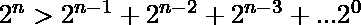
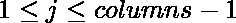

# 翻转二元矩阵氛围 K 次后的最高分

> 原文:[https://www . geeksforgeeks . org/翻转后最大分数-a-二进制-矩阵-atmat-k-times/](https://www.geeksforgeeks.org/maximum-score-after-flipping-a-binary-matrix-atmost-k-times/)

给定一个 0 和 1 的二维矩阵 **A** 和一个整数 **K** 。
在每次移动中，您可以选择任意行或列，并切换该行或列中的每个值。也就是将所有 **0s 改为 1s** ，或者将所有 **1s 改为 0s** 。在进行了 K 次移动之后，这个矩阵的每一行都代表一个二进制数。
任务是返回这些数字总和的最大可能值。
**示例** :

```
Input : A[][] = { { 0, 0, 1, 1 }, 
                  { 1, 0, 1, 0 }, 
                  { 1, 1, 0, 0 } }; 
        K = 2
Output : 36

Input : A[][] = { { 0, 1 }, 
                  { 1, 0 }, 
                  { 1, 1 } }; 
        K = 1
Output : 7
```

请注意，**右侧**的**第一列**中的一个 **1** 为分数贡献了 **2 <sup>i</sup>** 。
也知道这样一个事实，，最左边的数字最大化比其他任何数字都重要。因此，应切换任何行，使得最左边的列应为全部 **0** 或全部 **1** (以便在切换最左边的列后[如有必要]，最左边的列应为全部 **1** )。
现在对于第一个元素为 0 的行，制作一个地图，该行的**值**为**键**，该行的**索引**为**元素**。现在，我们切换具有最小值的行，以便在更新后，它对我们的总分贡献最大。
现在，对于后续的其他列，我们计算总数**0**和**1**。

*   如果**(零>1 和 K > 0 )** 我们切换列并更新我们的答案为 **ans = ans +零* pow( 2，列–j–1)**，对于所有的并将 **K** 递减 1。
*   否则，我们更新所有的**ans = ans+1 * pow(2，列–j–1)**的答案。

以下是上述方法的实现:

## C++

```
// C++ program to find the maximum score after
// flipping a Binary Matrix atmost K times
#include <bits/stdc++.h>
using namespace std;

const int n = 3;
const int m = 4;

// Function to find maximum score of matrix
int maxMatrixScore(int A[n][m], int K)
{
    map<int, int> update;

    // find value of rows having first
    // column value equal to zero
    for (int i = 0; i < n; ++i) {
        if (A[i][0] == 0) {
            int ans = 0;

            for (int j = 1; j < m; ++j)
                ans = ans + A[i][j] * pow(2, m - j - 1);

            update[ans] = i;
        }
    }

    // update those rows which lead to
    // maximum score after toggle
    map<int, int>::iterator it = update.begin();

    while (K > 0 && it != update.end()) {

        int idx = it->second;

        for (int j = 0; j < m; ++j)
            A[idx][j] = (A[idx][j] + 1) % 2;

        it++;
        K--;
    }

    // Calculating answer
    int ans = 0;

    for (int j = 0; j < m; ++j) {

        int zero = 0, one = 0;

        for (int i = 0; i < n; ++i) {
            A[i][j] == 0 ? zero++ : one++;
        }

        // check if K > 0 we can toggle if necessary.
        if (K > 0 && zero > one) {
            ans += zero * pow(2, m - j - 1);
            K--;
        }
        else
            ans += one * pow(2, m - j - 1);
    }

    // return max answer possible
    return ans;
}

// Driver program
int main()
{
    int A[n][m] = { { 0, 0, 1, 1 },
                    { 1, 0, 1, 0 },
                    { 1, 1, 0, 0 } };
    int K = 2;
    // function call to print required answer
    cout << maxMatrixScore(A, K);

    return 0;
}
```

## Java 语言(一种计算机语言，尤用于创建网站)

```
// Java program to find the maximum score after
// flipping a Binary Matrix atmost K times
import java.util.*;

class GFG
{

static int n = 3;
static int m = 4;

// Function to find maximum score of matrix
static int maxMatrixScore(int A[][], int K)
{
    HashMap<Integer,Integer> update =
        new HashMap<Integer,Integer>();

    // find value of rows having first
    // column value equal to zero
    for (int i = 0; i < n; ++i)
    {
        if (A[i][0] == 0)
        {
            int ans = 0;

            for (int j = 1; j < m; ++j)
                ans = (int) (ans + A[i][j] *
                        Math.pow(2, m - j - 1));

            update.put(ans, i);
        }
    }

    // Update those rows which lead to
    // maximum score after toggle
    for (Map.Entry<Integer,Integer> it : update.entrySet())
    if (K > 0 )
    {
        int idx = it.getValue();

        for (int j = 0; j < m; ++j)
            A[idx][j] = (A[idx][j] + 1) % 2;

        K--;
    }

    // Calculating answer
    int ans = 0;

    for (int j = 0; j < m; ++j)
    {

        int zero = 0, one = 0;

        for (int i = 0; i < n; ++i)
        {
            if(A[i][j] == 0)
                zero++;
            else
                one++;
        }

        // Check if K > 0 we can toggle if necessary.
        if (K > 0 && zero > one)
        {
            ans += zero * Math.pow(2, m - j - 1);
            K--;
        }
        else
            ans += one * Math.pow(2, m - j - 1);
    }

    // return max answer possible
    return ans;
}

// Driver code
public static void main(String[] args)
{
    int A[][] = { { 0, 0, 1, 1 },
                    { 1, 0, 1, 0 },
                    { 1, 1, 0, 0 } };
    int K = 2;

    // function call to print required answer
    System.out.print(maxMatrixScore(A, K));
}
}

// This code is contributed by PrinciRaj1992
```

## 蟒蛇 3

```
# Python3 program to find the maximum
# score after flipping a Binary Matrix
# atmost K times

n = 3
m = 4

# Function to find maximum score of matrix
def maxMatrixScore(A, K):

    update = {}

    # Find value of rows having first
    # column value equal to zero
    for i in range(0, n):
        if A[i][0] == 0:

            ans = 0
            for j in range(1, m):
                ans = ans + A[i][j] * 2 ** (m - j - 1)

            update[ans] = i

    # update those rows which lead to
    # maximum score after toggle
    for idx in update.values():

        for j in range(0, m):
            A[idx][j] = (A[idx][j] + 1) % 2

        K -= 1
        if K <= 0:
            break

    # Calculating answer
    ans = 0
    for j in range(0, m):

        zero, one = 0, 0

        for i in range(0, n):
            if A[i][j] == 0: zero += 1
            else: one += 1

        # check if K > 0 we can
        # toggle if necessary.
        if K > 0 and zero > one:
            ans += zero * 2 ** (m - j - 1)
            K -= 1

        else:
            ans += one * 2 ** (m - j - 1)

    # return max answer possible
    return ans

# Driver Code
if __name__ == "__main__":

    A = [[0, 0, 1, 1],
         [1, 0, 1, 0],
         [1, 1, 0, 0]]

    K = 2

    # function call to print required answer
    print(maxMatrixScore(A, K))

# This code is contributed by Rituraj Jain
```

## C#

```
// C# program to find the maximum score after
// flipping a Binary Matrix atmost K times
using System;
using System.Collections.Generic;

class GFG
{

static int n = 3;
static int m = 4;

// Function to find maximum score of matrix
static int maxMatrixScore(int [,]A, int K)
{
    Dictionary<int,int> update =
        new Dictionary<int,int>();

    // find value of rows having first
    // column value equal to zero
    int ans=0;
    for (int i = 0; i < n; ++i)
    {
        if (A[i, 0] == 0)
        {
            ans = 0;

            for (int j = 1; j < m; ++j)
                ans = (int) (ans + A[i, j] *
                        Math.Pow(2, m - j - 1));

            update.Add((int)ans, i);
        }
    }

    // Update those rows which lead to
    // maximum score after toggle
    foreach(KeyValuePair<int, int> it in update)
    if (K > 0 )
    {
        int idx = it.Value;

        for (int j = 0; j < m; ++j)
            A[idx, j] = (A[idx, j] + 1) % 2;

        K--;
    }

    // Calculating answer
    ans = 0;

    for (int j = 0; j < m; ++j)
    {

        int zero = 0, one = 0;

        for (int i = 0; i < n; ++i)
        {
            if(A[i, j] == 0)
                zero++;
            else
                one++;
        }

        // Check if K > 0 we can toggle if necessary.
        if (K > 0 && zero > one)
        {
            ans += zero * (int)Math.Pow(2, m - j - 1);
            K--;
        }
        else
            ans += one * (int)Math.Pow(2, m - j - 1);
    }

    // return max answer possible
    return ans;
}

// Driver code
public static void Main(String[] args)
{
    int [,]A = { { 0, 0, 1, 1 },
                    { 1, 0, 1, 0 },
                    { 1, 1, 0, 0 } };
    int K = 2;

    // function call to print required answer
    Console.Write(maxMatrixScore(A, K));
}
}

// This code is contributed by 29AjayKumar
```

## java 描述语言

```
<script>

// Javascript program to find the maximum score after
// flipping a Binary Matrix atmost K times

var n = 3;
var m = 4;

// Function to find maximum score of matrix
function maxMatrixScore(A, K)
{
    var update = new Map();

    // find value of rows having first
    // column value equal to zero
    for (var i = 0; i < n; ++i) {
        if (A[i][0] == 0) {
            var ans = 0;

            for (var j = 1; j < m; ++j)
                ans = ans + A[i][j] * Math.pow(2, m - j - 1);

            update.set(ans, i);
        }
    }

    // update those rows which lead to
    // maximum score after toggle

    update.forEach((value, key) => {
        if(K>0)
        {
            var idx = value;

        for (var j = 0; j < m; ++j)
            A[idx][j] = (A[idx][j] + 1) % 2;

        K--;
        }
    });

    // Calculating answer
    var ans = 0;

    for (var j = 0; j < m; ++j) {

        var zero = 0, one = 0;

        for (var i = 0; i < n; ++i) {
            A[i][j] == 0 ? zero++ : one++;
        }

        // check if K > 0 we can toggle if necessary.
        if (K > 0 && zero > one) {
            ans += zero * Math.pow(2, m - j - 1);
            K--;
        }
        else
            ans += one * Math.pow(2, m - j - 1);
    }

    // return max answer possible
    return ans;
}

// Driver program
var A = [ [ 0, 0, 1, 1 ],
                [ 1, 0, 1, 0 ],
                [ 1, 1, 0, 0 ] ];
var K = 2;
// function call to print required answer
document.write( maxMatrixScore(A, K));

// This code is contributed by noob2000.
</script>
```

**Output:** 

```
36
```

**时间复杂度:** O(N*M)