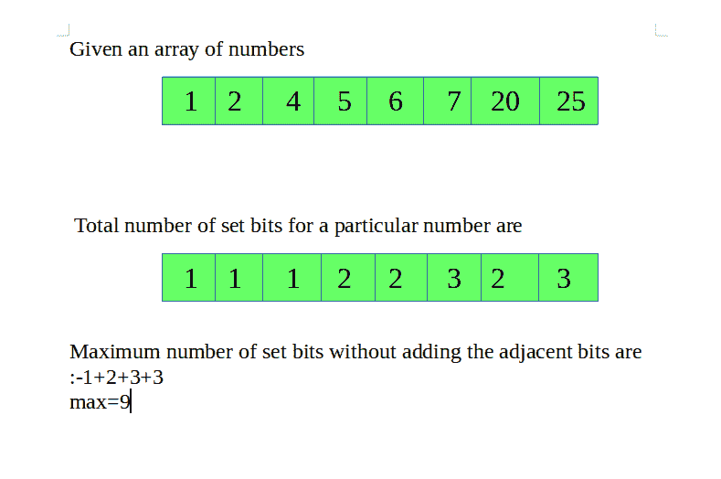

# 不考虑相邻元素的数组中最大设置位和

> 原文:[https://www . geesforgeks . org/不考虑相邻元素的数组中最大设置位和/](https://www.geeksforgeeks.org/maximum-set-bit-sum-in-array-without-considering-adjacent-elements/)

给定整数数组 arr[]。任务是在不添加数组相邻元素的设置位的情况下，找到(数组元素的)设置位的最大和。
**例:**

```
Input : arr[] = {1, 2, 4, 5, 6, 7, 20, 25}
Output : 9

Input : arr[] = {5, 7, 9, 5, 13, 7, 20, 25}
Output : 11
```



**接近** :

1.  首先，找到数组中每个元素的设置位的总数，并将其存储在不同的数组或相同的数组中(以避免使用额外的空间)。
2.  现在，问题简化为寻找数组中的最大和，这样就没有两个元素相邻。
3.  对 arr[]中的所有元素进行循环，并维护包含和不包含两个总和，其中包含=包含前一个元素的最大总和，不包含=不包含前一个元素的最大总和。
4.  不包括当前元素的最大总和将为最大(包括，不包括)，包括当前元素的最大总和将为不包括+当前元素(注意，仅考虑不包括，因为元素不能相邻)。
5.  在循环结束时，返回最大值包括和不包括

以下是上述方法的实现:

## C++

```
// C++ program to maximum set bit sum in array
// without considering adjacent elements
#include<bits/stdc++.h>
using namespace std;

// Function to count total number
// of set bits in an integer
int bit(int n)
{
    int count = 0;

    while(n)
    {
        count++;
        n = n & (n - 1);
    }

    return count;
}

// Maximum sum of set bits
int maxSumOfBits(int arr[], int n)
{
    // Calculate total number of
    // set bits for every element
    // of the array
    for(int i = 0; i < n; i++)
    {
        // find total set bits for
        // each number and store
        // back into the array
        arr[i] = bit(arr[i]);
    }

    int incl = arr[0];
    int excl = 0;
    int excl_new;

    for (int i = 1; i < n; i++)
    {
        // current max excluding i
        excl_new = (incl > excl) ?
                            incl : excl;

        // current max including i
        incl = excl + arr[i];
        excl = excl_new;
    }

    // return max of incl and excl
    return ((incl > excl) ?
                     incl : excl);
}

// Driver code
int main()
{
    int arr[] = {1, 2, 4, 5,
                 6, 7, 20, 25};

    int n = sizeof(arr) / sizeof(arr[0]);

    cout << maxSumOfBits(arr, n);

    return 0;
}
```

## Java 语言(一种计算机语言，尤用于创建网站)

```
// Java program to maximum set bit sum in array
// without considering adjacent elements
import java.util.*;
import java.lang.*;
import java.io.*;

class GFG
{
// Function to count total number 
// of set bits in an integer
static int bit(int n)
{
    int count = 0;

    while(n > 0)
    {
        count++;
        n = n & (n - 1);
    }

    return count;
}

// Maximum sum of set bits
static int maxSumOfBits(int arr[], int n)
{
// Calculate total number of set bits
// for every element of the array
for(int i = 0; i < n; i++)
{
    // find total set bits for
    // each number and store
    // back into the array
    arr[i] = bit(arr[i]);
}

int incl = arr[0];
int excl = 0;
int excl_new;

for (int i = 1; i < n; i++)
{
    // current max excluding i
    excl_new = (incl > excl) ? 
                        incl : excl;

    // current max including i
    incl = excl + arr[i];
    excl = excl_new;
}

// return max of incl and excl
return ((incl > excl) ?
                 incl : excl);
}

// Driver code
public static void main(String args[])
{
    int arr[] = {1, 2, 4, 5,
                 6, 7, 20, 25};

    int n = arr.length;

    System.out.print(maxSumOfBits(arr, n));
}
}

// This code is contributed
// by Subhadeep
```

## 蟒蛇 3

```
# Python3 program to maximum set bit sum in
# array without considering adjacent elements

# Function to count total number
# of set bits in an integer
def bit(n):

    count = 0

    while(n):

        count += 1
        n = n & (n - 1)

    return count

# Maximum sum of set bits
def maxSumOfBits(arr, n):

    # Calculate total number of set bits
    # for every element of the array
    for i in range( n):

        # find total set bits for each
        # number and store back into the array
        arr[i] = bit(arr[i])

    incl = arr[0]
    excl = 0

    for i in range(1, n) :

        # current max excluding i
        if incl > excl:
            excl_new = incl
        else:
            excl_new = excl

        # current max including i
        incl = excl + arr[i];
        excl = excl_new

    # return max of incl and excl
    if incl > excl:
        return incl
    else :
        return excl

# Driver code
if __name__ == "__main__":

    arr = [1, 2, 4, 5,
           6, 7, 20, 25]

    n = len(arr)

    print (maxSumOfBits(arr, n))

# This code is contributed by ita_c
```

## C#

```
// C# program to maximum set bit sum in array
// without considering adjacent elements
using System;

class GFG
{
// Function to count total number
// of set bits in an integer
static int bit(int n)
{
    int count = 0;

    while(n > 0)
    {
        count++;
        n = n & (n - 1);
    }

    return count;
}

// Maximum sum of set bits
static int maxSumOfBits(int []arr, int n)
{

// Calculate total number of set bits
// for every element of the array
for(int i = 0; i < n; i++)
{

    // find total set bits for
    // each number and store
    // back into the array
    arr[i] = bit(arr[i]);
}

int incl = arr[0];
int excl = 0;
int excl_new;

for (int i = 1; i < n; i++)
{
    // current max excluding i
    excl_new = (incl > excl) ?
                        incl : excl;

    // current max including i
    incl = excl + arr[i];
    excl = excl_new;
}

// return max of incl and excl
return ((incl > excl) ?
                 incl : excl);
}

// Driver code
public static void Main()
{
    int []arr = {1, 2, 4, 5,
                 6, 7, 20, 25};

    int n = arr.Length;

    Console.WriteLine(maxSumOfBits(arr, n));
}
}

// This code is contributed
// by chandan_jnu.
```

## 服务器端编程语言（Professional Hypertext Preprocessor 的缩写）

```
<?php
// PHP program to maximum set bit sum in array
// without considering adjacent elements

// Function to count total number
// of set bits in an integer

function bit($n)
{
     $count = 0;

    while($n)
    {
        $count++;
        $n = $n & ($n - 1);
    }

    return $count;
}

// Maximum sum of set bits
function  maxSumOfBits($arr, $n)
{
    // Calculate total number of
    // set bits for every element
    // of the array
    for( $i = 0; $i < $n; $i++)
    {
        // find total set bits for
        // each number and store
        // back into the array
        $arr[$i] = bit($arr[$i]);
    }

    $incl = $arr[0];
    $excl = 0;
    $excl_new;

    for ($i = 1; $i < $n; $i++)
    {
        // current max excluding i
        $excl_new = ($incl > $excl) ?
                            $incl : $excl;

        // current max including i
        $incl = $excl + $arr[$i];
        $excl = $excl_new;
    }

    // return max of incl and excl
    return (($incl > $excl) ?
                    $incl : $excl);
}

// Driver code

    $arr = array(1, 2, 4, 5,
                6, 7, 20, 25);

     $n = sizeof($arr) / sizeof($arr[0]);

    echo  maxSumOfBits($arr, $n);

#This Code is Contributed by ajit   
?>
```

## java 描述语言

```
<script>

    // Javascript program to maximum
    // set bit sum in array
    // without considering adjacent elements

    // Function to count total number
    // of set bits in an integer
    function bit(n)
    {
        let count = 0;

        while(n > 0)
        {
            count++;
            n = n & (n - 1);
        }

        return count;
    }

    // Maximum sum of set bits
    function maxSumOfBits(arr, n)
    {

        // Calculate total number of set bits
        // for every element of the array
        for(let i = 0; i < n; i++)
        {

            // find total set bits for
            // each number and store
            // back into the array
            arr[i] = bit(arr[i]);
        }

        let incl = arr[0];
        let excl = 0;
        let excl_new;

        for (let i = 1; i < n; i++)
        {
            // current max excluding i
            excl_new = (incl > excl) ? incl : excl;

            // current max including i
            incl = excl + arr[i];
            excl = excl_new;
        }

        // return max of incl and excl
        return ((incl > excl) ? incl : excl);
    }

    let arr = [1, 2, 4, 5, 6, 7, 20, 25];

    let n = arr.length;

    document.write(maxSumOfBits(arr, n));

</script>
```

**输出:**

```
9
```

**时间复杂度** : O(Nlogn)
**辅助空间** : O(1)
**注意:**以上代码可以优化为 **O(N)** 使用 [__builtin_popcount](https://www.geeksforgeeks.org/count-set-bits-in-an-integer/) 功能对 **O(1)时间**中的设置位进行计数。