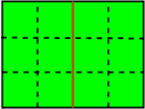
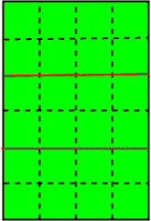

# 给定矩形的精确 k 切割所能得到的最小可能面积的最大值

> 原文:[https://www . geeksforgeeks . org/最大-最小-可能-面积-可以-精确-k-切割-给定-矩形/](https://www.geeksforgeeks.org/maximum-smallest-possible-area-can-get-exactly-k-cut-given-rectangular/)

给定 **n×m** 个单位正方形的大矩形区域，允许 k 次切割，切割应是直的(水平的或垂直的)，并应沿着单位正方形的边缘。用 k 个切口，他能得到的最小块的最大可能面积是多少。

**示例:**

```
Input : 3 4 1
Output : 6

Input : 6 4 2
Output : 8
```



第二次输入的图像



第一次输入的图像

因为这是 n×m 的矩形区域，所以有(n-1)行和(m-1)列。所以**如果 k>(n+m–2)那么，那么切割是不可能的**。那么，如果 k 小于这个数。会有两种情况

1.  当 k 小于 max( n，m)–1 时:在第一种情况下，如果 k 小于 max( n，m)–1，**则 m * ( n / ( k+1))或 n * ( m / ( k+1))最大**，这里我们用(k+1)除，因为水平或垂直(即 m * n =总块数)被分成(k+1)个部分。
2.  当 k 大于或等于 max( n，m)–1 时:在第二种情况下，如果 k >= max( n，m)–1，则在行和列上都将进行切割，因此最大可能的最小面积将是**m/(k–n+2)或 n/(k–m+2)**。在这种情况下，假设如果 n > m，那么首先 n-1(行或列)切割是可能的。之后，将在 m–1 上进行(k–n)切割。因此，这里我们调整了这个(k–n)切割，使得最小可能的分割应该是最大的。

**代码–**以下是以下方法的实现

## C++

```
// C++ code for Maximum of smallest
// possible area that can get with
// exactly k cut of given rectangular
#include <bits/stdc++.h>
using namespace std;

void max_area(int n, int m, int k)
{
    if (k > (n + m - 2))

        cout << "Not possible" << endl;

    else {

        int result;

        // for the 1st case
        if (k < max(m, n) - 1) {

            result = max(m * (n / (k + 1)), n * (m / (k + 1)));
        }

        // for the second case
        else {

            result = max(m / (k - n + 2), n / (k - m + 2));
        }

        // print final result
        cout << result << endl;
    }
}

// driver code
int main()
{

    int n = 3, m = 4, k = 1;
    max_area(n, m, k);
}
```

## Java 语言(一种计算机语言，尤用于创建网站)

```
// Java code for Maximum of smallest
// possible area that can get with
// exactly k cut of given rectangular

class GFG {

    //Utility Function
    static void max_area(int n, int m, int k)
    {
        if (k > (n + m - 2))

            System.out.println("Not possible");

        else {

            int result;

            // for the 1st case
            if (k < Math.max(m, n) - 1)
            {
                result = Math.max(m * (n / (k + 1)),
                         n * (m / (k + 1)));
            }

            // for the second case
            else {

                result = Math.max(m / (k - n + 2),
                         n / (k - m + 2));
            }

            // print final result
            System.out.println(result);
        }
    }

    // Driver code
    public static void main (String[] args)
    {
        int n = 3, m = 4, k = 1;
        max_area(n, m, k);
    }
}

// This code is contributed by Anant Agarwal.
```

## 蟒蛇 3

```
# Python3 code for Maximum of smallest
# possible area that can get with
# exactly k cut of given rectangular

def max_area(n,m,k):
    if (k > (n + m - 2)):
        print("Not possible")
    else:
        # for the 1st case
        if (k < max(m,n) - 1):
            result = max(m * (n / (k + 1)), n * (m / (k + 1)));

        # for the second case
        else:
            result = max(m / (k - n + 2), n / (k - m + 2));

        # print final result
        print(result)

# driver code
n = 3
m = 4
k = 1

max_area(n, m, k)

# This code is contributed
# by Azkia Anam.
```

## C#

```
// C# code for Maximum of smallest
// possible area that can get with
// exactly k cut of given rectangular
using System;

class GFG {

    //Utility Function
    static void max_area(int n, int m, int k)
    {
        if (k > (n + m - 2))

            Console.WriteLine("Not possible");

        else {

            int result;

            // for the 1st case
            if (k < Math.Max(m, n) - 1)
            {
                result = Math.Max(m * (n / (k + 1)),
                        n * (m / (k + 1)));
            }

            // for the second case
            else {

                result = Math.Max(m / (k - n + 2),
                        n / (k - m + 2));
            }

            // print final result
            Console.WriteLine(result);
        }
    }

    // Driver code
    public static void Main ()
    {
        int n = 3, m = 4, k = 1;

        max_area(n, m, k);
    }
}

// This code is contributed by vt_m.
```

## 服务器端编程语言（Professional Hypertext Preprocessor 的缩写）

```
<?php
// PHP code for Maximum of smallest
// possible area that can get with
// exactly k cut of given rectangular
function max_area($n, $m, $k)
{
    if ($k > ($n + $m - 2))

        echo "Not possible" ,"\n";

    else
    {
        $result;

        // for the 1st case
        if ($k < max($m, $n) - 1)
        {

            $result = max($m * ($n / ($k + 1)),
                          $n * ($m / ($k + 1)));
        }

        // for the second case
        else
        {

            $result = max($m / ($k - $n + 2),
                          $n / ($k - $m + 2));
        }

        // print final result
    echo $result ,"\n";
    }
}

// Driver Code
$n = 3; $m = 4; $k = 1;
max_area($n, $m, $k);

// This code is contributed by ajit
?>
```

## java 描述语言

```
<script>

// JavaScript code for Maximum of smallest
// possible area that can get with
// exactly k cut of given rectangular

// Utility Function
function max_area(n, m, k)
{
    if (k > (n + m - 2))

        document.write("Not possible");
    else
    {
        let result;

        // For the 1st case
        if (k < Math.max(m, n) - 1)
        {
            result = Math.max(m * (n / (k + 1)),
                              n * (m / (k + 1)));
        }

        // For the second case
        else
        {
            result = Math.max(m / (k - n + 2),
                              n / (k - m + 2));
        }

        // Print final result
        document.write(result);
    }
}

// Driver Code
let n = 3, m = 4, k = 1;

max_area(n, m, k);

// This code is contributed by susmitakundugoaldanga

</script>
```

**输出:**

```
6
```

***时间复杂度:** O(1)*
***辅助空间:** O(1)*