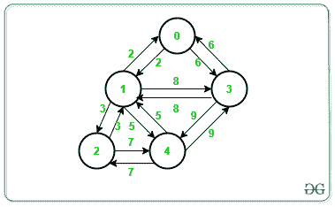

# 使用 Prim 算法的最大生成树

> 原文:[https://www . geeksforgeeks . org/最大生成树-使用-prims-算法/](https://www.geeksforgeeks.org/maximum-spanning-tree-using-prims-algorithm/)

给定[无向加权图](https://www.geeksforgeeks.org/graph-and-its-representations/) **G** ，任务是使用 [Prim 算法](https://www.geeksforgeeks.org/prims-mst-for-adjacency-list-representation-greedy-algo-6/)找到图的**最大生成树**

> [Prims 算法](https://www.geeksforgeeks.org/prims-minimum-spanning-tree-mst-greedy-algo-5/)是一个[贪婪算法](https://www.geeksforgeeks.org/greedy-algorithms/)，可以用来寻找一个[图](https://www.geeksforgeeks.org/graph-data-structure-and-algorithms/)的[最小生成树(MST)](https://www.geeksforgeeks.org/tag/minimum-spanning-tree/) 以及**最大生成树**。

**示例:**

> **输入:**图形[V][V] = {{0，2，0，6，0}，{2，0，3，8，5}，{0，3，0，0，7}，{6，8，0，0，9}，{0，5，7，9，0}}
> **输出:**
> 最大生成树的总权重为 30。
> 边权重
> 3–1 8
> 4–2 7
> 0–3 6
> 3–4 9
> **说明:**
> 选择其他边不会产生最大生成树。
> 
> [](https://media.geeksforgeeks.org/wp-content/uploads/20201118133458/graph1.png)

**最大生成树:**

给定一个[无向加权图](https://www.geeksforgeeks.org/graph-and-its-representations/)，最大生成树是一个具有最大权重的生成树。使用[普里姆算法](https://www.geeksforgeeks.org/prims-minimum-spanning-tree-mst-greedy-algo-5/?ref=lbp)可以很容易地计算出来。这里的目标是从所有可能的生成树中找到权重最大的生成树。

**普里姆算法:**

[Prim 的算法](https://www.geeksforgeeks.org/prims-minimum-spanning-tree-mst-greedy-algo-5/?ref=lbp)是一种贪婪算法，它的工作原理是一棵生成树的所有顶点都必须连通。该算法的工作原理是，从一个任意的起始顶点开始，一次构建一个顶点，并将树中最昂贵的连接添加到另一个顶点，这将为我们提供**最大生成树(MST)** 。

按照以下步骤解决问题:

*   初始化[布尔数据类型](https://www.geeksforgeeks.org/bool-data-type-in-c/)的访问数组，以跟踪到目前为止访问的顶点。用**假**初始化所有值。
*   初始化一个数组**权重[]** ，代表连接该顶点的最大权重。用某个最小值初始化所有值。
*   初始化一个数组**父[]** ，以跟踪**最大生成树**。
*   赋一些大的值，作为第一个顶点和父顶点的权重为 **-1** ，这样就先拾取了，没有父顶点。
*   从所有未访问的顶点中，选择一个权重最大的顶点 **v** ，并将其标记为已访问。
*   更新 **v** 所有未访问的相邻顶点的权重。要更新权重，遍历 **v** 的所有未访问邻居。对于每个相邻的顶点 **x** ，如果 **v** 和 **x** 之间的边的权重大于 **v** 的前一个值，则用该权重更新 **v** 的值。

下面是上述算法的实现:

## C++

```
// C++ program for the above algorithm

#include <bits/stdc++.h>
using namespace std;
#define V 5

// Function to find index of max-weight
// vertex from set of unvisited vertices
int findMaxVertex(bool visited[], int weights[])
{

    // Stores the index of max-weight vertex
    // from set of unvisited vertices
    int index = -1;

    // Stores the maximum weight from
    // the set of unvisited vertices
    int maxW = INT_MIN;

    // Iterate over all possible
    // nodes of a graph
    for (int i = 0; i < V; i++) {

        // If the current node is unvisited
        // and weight of current vertex is
        // greater than maxW
        if (visited[i] == false
            && weights[i] > maxW) {

            // Update maxW
            maxW = weights[i];

            // Update index
            index = i;
        }
    }
    return index;
}

// Utility function to find the maximum
// spanning tree of graph
void printMaximumSpanningTree(int graph[V][V],
                              int parent[])
{

    // Stores total weight of
    // maximum spanning tree
    // of a graph
    int MST = 0;

    // Iterate over all possible nodes
    // of a graph
    for (int i = 1; i < V; i++) {

        // Update MST
        MST += graph[i][parent[i]];
    }

    cout << "Weight of the maximum Spanning-tree "
         << MST << '\n'
         << '\n';

    cout << "Edges \tWeight\n";

    // Print the Edges and weight of
    // maximum spanning tree of a graph
    for (int i = 1; i < V; i++) {
        cout << parent[i] << " - " << i << " \t"
             << graph[i][parent[i]] << " \n";
    }
}

// Function to find the maximum spanning tree
void maximumSpanningTree(int graph[V][V])
{

    // visited[i]:Check if vertex i
    // is visited or not
    bool visited[V];

    // weights[i]: Stores maximum weight of
    // graph to connect an edge with i
    int weights[V];

    // parent[i]: Stores the parent node
    // of vertex i
    int parent[V];

    // Initialize weights as -INFINITE,
    // and visited of a node as false
    for (int i = 0; i < V; i++) {
        visited[i] = false;
        weights[i] = INT_MIN;
    }

    // Include 1st vertex in
    // maximum spanning tree
    weights[0] = INT_MAX;
    parent[0] = -1;

    // Search for other (V-1) vertices
    // and build a tree
    for (int i = 0; i < V - 1; i++) {

        // Stores index of max-weight vertex
        // from a set of unvisited vertex
        int maxVertexIndex
            = findMaxVertex(visited, weights);

        // Mark that vertex as visited
        visited[maxVertexIndex] = true;

        // Update adjacent vertices of
        // the current visited vertex
        for (int j = 0; j < V; j++) {

            // If there is an edge between j
            // and current visited vertex and
            // also j is unvisited vertex
            if (graph[j][maxVertexIndex] != 0
                && visited[j] == false) {

                // If graph[v][x] is
                // greater than weight[v]
                if (graph[j][maxVertexIndex] > weights[j]) {

                    // Update weights[j]
                    weights[j] = graph[j][maxVertexIndex];

                    // Update parent[j]
                    parent[j] = maxVertexIndex;
                }
            }
        }
    }

    // Print maximum spanning tree
    printMaximumSpanningTree(graph, parent);
}

// Driver Code
int main()
{

    // Given graph
    int graph[V][V] = { { 0, 2, 0, 6, 0 },
                        { 2, 0, 3, 8, 5 },
                        { 0, 3, 0, 0, 7 },
                        { 6, 8, 0, 0, 9 },
                        { 0, 5, 7, 9, 0 } };

    // Function call
    maximumSpanningTree(graph);

    return 0;
}
```

## Java 语言(一种计算机语言，尤用于创建网站)

```
// Java program for the above algorithm
import java.io.*;
class GFG
{
  public static int V = 5;

  // Function to find index of max-weight
  // vertex from set of unvisited vertices
  static int findMaxVertex(boolean visited[],
                           int weights[])
  {

    // Stores the index of max-weight vertex
    // from set of unvisited vertices
    int index = -1;

    // Stores the maximum weight from
    // the set of unvisited vertices
    int maxW = Integer.MIN_VALUE;

    // Iterate over all possible
    // nodes of a graph
    for (int i = 0; i < V; i++)
    {

      // If the current node is unvisited
      // and weight of current vertex is
      // greater than maxW
      if (visited[i] == false && weights[i] > maxW)
      {

        // Update maxW
        maxW = weights[i];

        // Update index
        index = i;
      }
    }
    return index;
  }

  // Utility function to find the maximum
  // spanning tree of graph
  static void printMaximumSpanningTree(int graph[][],
                                       int parent[])
  {

    // Stores total weight of
    // maximum spanning tree
    // of a graph
    int MST = 0;

    // Iterate over all possible nodes
    // of a graph
    for (int i = 1; i < V; i++)
    {

      // Update MST
      MST += graph[i][parent[i]];
    }

    System.out.println("Weight of the maximum Spanning-tree "
                       + MST);
    System.out.println();
    System.out.println("Edges \tWeight");

    // Print the Edges and weight of
    // maximum spanning tree of a graph
    for (int i = 1; i < V; i++)
    {
      System.out.println(parent[i] + " - " + i + " \t"
                         + graph[i][parent[i]]);
    }
  }

  // Function to find the maximum spanning tree
  static void maximumSpanningTree(int[][] graph)
  {

    // visited[i]:Check if vertex i
    // is visited or not
    boolean[] visited = new boolean[V];

    // weights[i]: Stores maximum weight of
    // graph to connect an edge with i
    int[] weights = new int[V];

    // parent[i]: Stores the parent node
    // of vertex i
    int[] parent = new int[V];

    // Initialize weights as -INFINITE,
    // and visited of a node as false
    for (int i = 0; i < V; i++) {
      visited[i] = false;
      weights[i] = Integer.MIN_VALUE;
    }

    // Include 1st vertex in
    // maximum spanning tree
    weights[0] = Integer.MAX_VALUE;
    parent[0] = -1;

    // Search for other (V-1) vertices
    // and build a tree
    for (int i = 0; i < V - 1; i++) {

      // Stores index of max-weight vertex
      // from a set of unvisited vertex
      int maxVertexIndex
        = findMaxVertex(visited, weights);

      // Mark that vertex as visited
      visited[maxVertexIndex] = true;

      // Update adjacent vertices of
      // the current visited vertex
      for (int j = 0; j < V; j++) {

        // If there is an edge between j
        // and current visited vertex and
        // also j is unvisited vertex
        if (graph[j][maxVertexIndex] != 0
            && visited[j] == false) {

          // If graph[v][x] is
          // greater than weight[v]
          if (graph[j][maxVertexIndex]
              > weights[j]) {

            // Update weights[j]
            weights[j]
              = graph[j][maxVertexIndex];

            // Update parent[j]
            parent[j] = maxVertexIndex;
          }
        }
      }
    }

    // Print maximum spanning tree
    printMaximumSpanningTree(graph, parent);
  }

  // Driver Code
  public static void main(String[] args)
  {

    // Given graph
    int[][] graph = { { 0, 2, 0, 6, 0 },
                     { 2, 0, 3, 8, 5 },
                     { 0, 3, 0, 0, 7 },
                     { 6, 8, 0, 0, 9 },
                     { 0, 5, 7, 9, 0 } };

    // Function call
    maximumSpanningTree(graph);
  }
}

// This code is contributed by Dharanendra L V
```

## 蟒蛇 3

```
# Python program for the above algorithm
import sys
V = 5;

# Function to find index of max-weight
# vertex from set of unvisited vertices
def findMaxVertex(visited, weights):

    # Stores the index of max-weight vertex
    # from set of unvisited vertices
    index = -1;

    # Stores the maximum weight from
    # the set of unvisited vertices
    maxW = -sys.maxsize;

    # Iterate over all possible
    # Nodes of a graph
    for i in range(V):

        # If the current Node is unvisited
        # and weight of current vertex is
        # greater than maxW
        if (visited[i] == False and weights[i] > maxW):

            # Update maxW
            maxW = weights[i];

            # Update index
            index = i;
    return index;

# Utility function to find the maximum
# spanning tree of graph
def printMaximumSpanningTree(graph, parent):

    # Stores total weight of
    # maximum spanning tree
    # of a graph
    MST = 0;

    # Iterate over all possible Nodes
    # of a graph
    for i in range(1, V):

        # Update MST
        MST += graph[i][parent[i]];

    print("Weight of the maximum Spanning-tree ", MST);
    print();
    print("Edges \tWeight");

    # Print Edges and weight of
    # maximum spanning tree of a graph
    for i in range(1, V):
        print(parent[i] , " - " , i , " \t" , graph[i][parent[i]]);

# Function to find the maximum spanning tree
def maximumSpanningTree(graph):

    # visited[i]:Check if vertex i
    # is visited or not
    visited = [True]*V;

    # weights[i]: Stores maximum weight of
    # graph to connect an edge with i
    weights = [0]*V;

    # parent[i]: Stores the parent Node
    # of vertex i
    parent = [0]*V;

    # Initialize weights as -INFINITE,
    # and visited of a Node as False
    for i in range(V):
        visited[i] = False;
        weights[i] = -sys.maxsize;

    # Include 1st vertex in
    # maximum spanning tree
    weights[0] = sys.maxsize;
    parent[0] = -1;

    # Search for other (V-1) vertices
    # and build a tree
    for i in range(V - 1):

        # Stores index of max-weight vertex
        # from a set of unvisited vertex
        maxVertexIndex = findMaxVertex(visited, weights);

        # Mark that vertex as visited
        visited[maxVertexIndex] = True;

        # Update adjacent vertices of
        # the current visited vertex
        for j in range(V):

            # If there is an edge between j
            # and current visited vertex and
            # also j is unvisited vertex
            if (graph[j][maxVertexIndex] != 0 and visited[j] == False):

                # If graph[v][x] is
                # greater than weight[v]
                if (graph[j][maxVertexIndex] > weights[j]):

                    # Update weights[j]
                    weights[j] = graph[j][maxVertexIndex];

                    # Update parent[j]
                    parent[j] = maxVertexIndex;

    # Print maximum spanning tree
    printMaximumSpanningTree(graph, parent);

# Driver Code
if __name__ == '__main__':
    # Given graph
    graph = [[0, 2, 0, 6, 0], [2, 0, 3, 8, 5], [0, 3, 0, 0, 7], [6, 8, 0, 0, 9],
                                                                 [0, 5, 7, 9, 0]];

    # Function call
    maximumSpanningTree(graph);

    # This code is contributed by 29AjayKumar
```

## C#

```
// C# program for the above algorithm
using System;
class GFG
{
  public static int V = 5;

  // Function to find index of max-weight
  // vertex from set of unvisited vertices
  static int findMaxVertex(bool[] visited,
                           int[] weights)
  {

    // Stores the index of max-weight vertex
    // from set of unvisited vertices
    int index = -1;

    // Stores the maximum weight from
    // the set of unvisited vertices
    int maxW = int.MinValue;

    // Iterate over all possible
    // nodes of a graph
    for (int i = 0; i < V; i++)
    {

      // If the current node is unvisited
      // and weight of current vertex is
      // greater than maxW
      if (visited[i] == false && weights[i] > maxW)
      {

        // Update maxW
        maxW = weights[i];

        // Update index
        index = i;
      }
    }
    return index;
  }

  // Utility function to find the maximum
  // spanning tree of graph
  static void printMaximumSpanningTree(int[, ] graph,
                                       int[] parent)
  {

    // Stores total weight of
    // maximum spanning tree
    // of a graph
    int MST = 0;

    // Iterate over all possible nodes
    // of a graph
    for (int i = 1; i < V; i++)
    {

      // Update MST
      MST += graph[i, parent[i]];
    }

    Console.WriteLine(
      "Weight of the maximum Spanning-tree " + MST);

    Console.WriteLine();
    Console.WriteLine("Edges \tWeight");

    // Print the Edges and weight of
    // maximum spanning tree of a graph
    for (int i = 1; i < V; i++) {
      Console.WriteLine(parent[i] + " - " + i + " \t"
                        + graph[i, parent[i]]);
    }
  }

  // Function to find the maximum spanning tree
  static void maximumSpanningTree(int[, ] graph)
  {

    // visited[i]:Check if vertex i
    // is visited or not
    bool[] visited = new bool[V];

    // weights[i]: Stores maximum weight of
    // graph to connect an edge with i
    int[] weights = new int[V];

    // parent[i]: Stores the parent node
    // of vertex i
    int[] parent = new int[V];

    // Initialize weights as -INFINITE,
    // and visited of a node as false
    for (int i = 0; i < V; i++) {
      visited[i] = false;
      weights[i] = int.MinValue;
    }

    // Include 1st vertex in
    // maximum spanning tree
    weights[0] = int.MaxValue;
    parent[0] = -1;

    // Search for other (V-1) vertices
    // and build a tree
    for (int i = 0; i < V - 1; i++) {

      // Stores index of max-weight vertex
      // from a set of unvisited vertex
      int maxVertexIndex
        = findMaxVertex(visited, weights);

      // Mark that vertex as visited
      visited[maxVertexIndex] = true;

      // Update adjacent vertices of
      // the current visited vertex
      for (int j = 0; j < V; j++) {

        // If there is an edge between j
        // and current visited vertex and
        // also j is unvisited vertex
        if (graph[j, maxVertexIndex] != 0
            && visited[j] == false) {

          // If graph[v][x] is
          // greater than weight[v]
          if (graph[j, maxVertexIndex]
              > weights[j]) {

            // Update weights[j]
            weights[j]
              = graph[j, maxVertexIndex];

            // Update parent[j]
            parent[j] = maxVertexIndex;
          }
        }
      }
    }

    // Print maximum spanning tree
    printMaximumSpanningTree(graph, parent);
  }

  // Driver Code
  static public void Main()
  {

    // Given graph
    int[, ] graph = { { 0, 2, 0, 6, 0 },
                     { 2, 0, 3, 8, 5 },
                     { 0, 3, 0, 0, 7 },
                     { 6, 8, 0, 0, 9 },
                     { 0, 5, 7, 9, 0 } };

    // Function call
    maximumSpanningTree(graph);
  }
}

// This code is contributed by Dharanendra L V
```

## java 描述语言

```
<script>

// Javascript program for the above algorithm

var V = 5;

// Function to find index of max-weight
// vertex from set of unvisited vertices
function findMaxVertex(visited, weights)
{

    // Stores the index of max-weight vertex
    // from set of unvisited vertices
    var index = -1;

    // Stores the maximum weight from
    // the set of unvisited vertices
    var maxW = -1000000000;

    // Iterate over all possible
    // nodes of a graph
    for (var i = 0; i < V; i++) {

        // If the current node is unvisited
        // and weight of current vertex is
        // greater than maxW
        if (visited[i] == false
            && weights[i] > maxW) {

            // Update maxW
            maxW = weights[i];

            // Update index
            index = i;
        }
    }
    return index;
}

// Utility function to find the maximum
// spanning tree of graph
function printMaximumSpanningTree(graph, parent)
{

    // Stores total weight of
    // maximum spanning tree
    // of a graph
    var MST = 0;

    // Iterate over all possible nodes
    // of a graph
    for (var i = 1; i < V; i++) {

        // Update MST
        MST += graph[i][parent[i]];
    }

    document.write( "Weight of the maximum Spanning-tree "
         + MST + '<br>'
         + '<br>');

    document.write( "Edges \tWeight<br>");

    // Print the Edges and weight of
    // maximum spanning tree of a graph
    for (var i = 1; i < V; i++) {
        document.write( parent[i] + " - " + i + "      "
             + graph[i][parent[i]] + " <br>");
    }
}

// Function to find the maximum spanning tree
function maximumSpanningTree(graph)
{

    // visited[i]:Check if vertex i
    // is visited or not
    var visited = Array(V).fill(false);

    // weights[i]: Stores maximum weight of
    // graph to connect an edge with i
    var weights = Array(V).fill(-1000000000);

    // parent[i]: Stores the parent node
    // of vertex i
    var parent = Array(V).fill(0);

    // Include 1st vertex in
    // maximum spanning tree
    weights[0] = 1000000000;
    parent[0] = -1;

    // Search for other (V-1) vertices
    // and build a tree
    for (var i = 0; i < V - 1; i++) {

        // Stores index of max-weight vertex
        // from a set of unvisited vertex
        var maxVertexIndex
            = findMaxVertex(visited, weights);

        // Mark that vertex as visited
        visited[maxVertexIndex] = true;

        // Update adjacent vertices of
        // the current visited vertex
        for (var j = 0; j < V; j++) {

            // If there is an edge between j
            // and current visited vertex and
            // also j is unvisited vertex
            if (graph[j][maxVertexIndex] != 0
                && visited[j] == false) {

                // If graph[v][x] is
                // greater than weight[v]
                if (graph[j][maxVertexIndex] > weights[j]) {

                    // Update weights[j]
                    weights[j] = graph[j][maxVertexIndex];

                    // Update parent[j]
                    parent[j] = maxVertexIndex;
                }
            }
        }
    }

    // Print maximum spanning tree
    printMaximumSpanningTree(graph, parent);
}

// Driver Code
// Given graph
var graph = [ [ 0, 2, 0, 6, 0 ],
                    [ 2, 0, 3, 8, 5 ],
                    [ 0, 3, 0, 0, 7 ],
                    [ 6, 8, 0, 0, 9 ],
                    [ 0, 5, 7, 9, 0 ] ];
// Function call
maximumSpanningTree(graph);

// This code is contributed by rutvik_56.
</script>
```

**Output:** 

```
Weight of the maximum Spanning-tree 30

Edges     Weight
3 - 1     8 
4 - 2     7 
0 - 3     6 
3 - 4     9
```

***时间复杂度:** O(V <sup>2</sup> )其中 V 是图中的节点数。*
***辅助空间:** O(V <sup>2</sup> )*