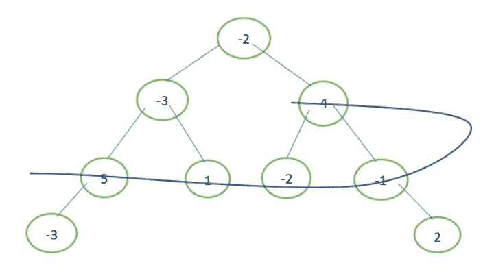

# 二叉树中的最大螺旋和

> 原文:[https://www . geeksforgeeks . org/二进制树中最大螺旋和/](https://www.geeksforgeeks.org/maximum-spiral-sum-in-binary-tree/)

给定一个包含 **n 个**节点的二叉树。问题是求树螺旋遍历时得到的最大和。在螺旋遍历中，一个接一个地遍历所有级别，根级别从右向左遍历，然后下一级从左向右遍历，然后下一级从右向左遍历，以此类推。

示例:



最大螺旋和= 4 + (-1) + (-2) + 1 + 5 = 7

**方法:**借助两个栈获取给定二叉树的螺旋形式的[级序遍历](https://www.geeksforgeeks.org/level-order-traversal-in-spiral-form/)，并将其存储在数组中。找到如此获得的数组的[最大和子数组](https://www.geeksforgeeks.org/largest-sum-contiguous-subarray/)。

## C++

```
// C++ implementation to find maximum spiral sum
#include <bits/stdc++.h>

using namespace std;

// structure of a node of binary tree
struct Node {
    int data;
    Node *left, *right;
};

// A utility function to create a new node
Node* newNode(int data)
{
    // allocate space
    Node* node = new Node;

    // put in the data
    node->data = data;
    node->left = node->right = NULL;

    return node;
}

// function to find the maximum sum contiguous subarray.
// implements kadane's algorithm
int maxSum(vector<int> arr, int n)
{
    // to store the maximum value that is ending
    // up to the current index
    int max_ending_here = INT_MIN;

    // to store the maximum value encountered so far
    int max_so_far = INT_MIN;

    // traverse the array elements
    for (int i = 0; i < n; i++) {

        // if max_ending_here < 0, then it could
        // not possibly contribute to the maximum
        // sum further
        if (max_ending_here < 0)
            max_ending_here = arr[i];

        // else add the value arr[i] to max_ending_here
        else
            max_ending_here += arr[i];

        // update max_so_far
        max_so_far = max(max_so_far, max_ending_here);
    }

    // required maximum sum contiguous subarray value
    return max_so_far;
}

// function to find maximum spiral sum
int maxSpiralSum(Node* root)
{
    // if tree is empty
    if (root == NULL)
        return 0;

    // Create two stacks to store alternate levels
    stack<Node*> s1; // For levels from right to left
    stack<Node*> s2; // For levels from left to right

    // vector to store spiral order traversal
    // of the binary tree
    vector<int> arr;

    // Push first level to first stack 's1'
    s1.push(root);

    // traversing tree in spiral form until
    // there are elements in any one of the
    // stacks
    while (!s1.empty() || !s2.empty()) {

        // traverse current level from s1 and
        // push nodes of next level to s2
        while (!s1.empty()) {
            Node* temp = s1.top();
            s1.pop();

            // push temp-data to 'arr'
            arr.push_back(temp->data);

            // Note that right is pushed before left
            if (temp->right)
                s2.push(temp->right);
            if (temp->left)
                s2.push(temp->left);
        }

        // traverse current level from s2 and
        // push nodes of next level to s1
        while (!s2.empty()) {
            Node* temp = s2.top();
            s2.pop();

            // push temp-data to 'arr'
            arr.push_back(temp->data);

            // Note that left is pushed before right
            if (temp->left)
                s1.push(temp->left);
            if (temp->right)
                s1.push(temp->right);
        }
    }

    // required maximum spiral sum
    return maxSum(arr, arr.size());
}

// Driver program to test above
int main()
{
    Node* root = newNode(-2);
    root->left = newNode(-3);
    root->right = newNode(4);
    root->left->left = newNode(5);
    root->left->right = newNode(1);
    root->right->left = newNode(-2);
    root->right->right = newNode(-1);
    root->left->left->left = newNode(-3);
    root->right->right->right = newNode(2);

    cout << "Maximum Spiral Sum = "
         << maxSpiralSum(root);

    return 0;
}
```

## Java 语言(一种计算机语言，尤用于创建网站)

```
// Java implementation to find maximum spiral sum
import java.util.ArrayList;
import java.util.Stack;
public class MaxSpiralSum {

    // function to find the maximum sum contiguous subarray.
    // implements kadane's algorithm
    static int maxSum(ArrayList<Integer> arr)
    {
        // to store the maximum value that is ending
        // up to the current index
        int max_ending_here = Integer.MIN_VALUE;

        // to store the maximum value encountered so far
        int max_so_far = Integer.MIN_VALUE;

        // traverse the array elements
        for (int i = 0; i < arr.size(); i++)
        {        
            // if max_ending_here < 0, then it could
            // not possibly contribute to the maximum 
            // sum further
            if (max_ending_here < 0)
                max_ending_here = arr.get(i);

            // else add the value arr[i] to max_ending_here
            else
                max_ending_here +=arr.get(i);

            // update max_so_far
            max_so_far = Math.max(max_so_far, max_ending_here);
        }

        // required maximum sum contiguous subarray value
        return max_so_far;
    }

    // Function to find maximum spiral sum
    public static int maxSpiralSum(Node root)
    { 
        // if tree is empty
        if (root == null)
            return 0;

        // Create two stacks to store alternate levels
        Stack<Node> s1=new Stack<>();// For levels from right to left
        Stack<Node> s2=new Stack<>(); // For levels from left to right

        // ArrayList to store spiral order traversal
        // of the binary tree
        ArrayList<Integer> arr=new ArrayList<>();

        // Push first level to first stack 's1'
        s1.push(root);

        // traversing tree in spiral form until 
        // there are elements in any one of the 
        // stacks
        while (!s1.isEmpty() || !s2.isEmpty())
        {

            // traverse current level from s1 and
            // push nodes of next level to s2
            while (!s1.isEmpty())
            {
                Node temp = s1.pop();

                // push temp-data to 'arr'
                arr.add(temp.data);

                // Note that right is pushed before left
                if (temp.right!=null)
                    s2.push(temp.right);
                if (temp.left!=null)
                    s2.push(temp.left);
            }

            // traverse current level from s2 and
            // push nodes of next level to s1
            while (!s2.isEmpty())
            {
                Node temp = s2.pop();
                // push temp-data to 'arr'
                arr.add(temp.data);
                // Note that left is pushed before right
                if (temp.left!=null)
                    s1.push(temp.left);
                if (temp.right!=null)
                    s1.push(temp.right);
            }
        }

        // required maximum spiral sum
        return maxSum(arr);
    }

    public static void main(String args[]) {
        Node root = new Node(-2);
        root.left = new Node(-3);
        root.right = new Node(4);
        root.left.left = new Node(5);
        root.left.right = new Node(1);
        root.right.left = new Node(-2);
        root.right.right = new Node(-1);
        root.left.left.left = new Node(-3);
        root.right.right.right = new Node(2);
        System.out.print("Maximum Spiral Sum = "+maxSpiralSum(root));
    }
}

/* A binary tree node has data, pointer to left child
   and a pointer to right child */
class Node
{
    int data ;
    Node  left,  right ;
    Node(int data)
    {
        this.data=data;
        left=right=null;
    }

};
//This code is contributed by Gaurav Tiwari
```

## 蟒蛇 3

```
# Python3 Implementation to find the maximum Spiral Sum

# Structure of a node in binary tree
class Node:

    def __init__(self, data):

        self.data = data
        self.left = None
        self.right = None

# function to find the maximum sum contiguous subarray
# implementing kadane's algorithm
def maxSum(Arr):

    currSum = maxSum = 0
    for element in Arr:
        currSum = max(currSum + element, element)
        maxSum = max(maxSum, currSum)

    return maxSum

# function to find maximum spiral sum
def maxSpiralSum(root):

    # if tree is empty
    if not root:
        return 0

    # create two stacks to stopre alternative levels
    stack_s1 = [] # from levels right to left
    stack_s2 = [] # from levels left to right

    # store spiral order traversal in Arr
    Arr = []
    stack_s1.append(root)

    # traversing tree in spiral form
    # until there are elements in any one
    # of the stack
    while stack_s1 or stack_s2:

        # traverse current level from s1 and
        # push node of next level to s2
        while stack_s1:

            temp = stack_s1.pop()

            # append temp-> data to Arr
            Arr.append(temp.data)

            if temp.right:
                stack_s2.append(temp.right)
            if temp.left:
                stack_s2.append(temp.left)

        # traverse current level from s2 and
        # push node of next level to s1
        while stack_s2:

            temp = stack_s2.pop()

            # append temp-> data to Arr
            Arr.append(temp.data)

            if temp.left:
                stack_s1.append(temp.left)
            if temp.right:
                stack_s1.append(temp.right)

    return maxSum(Arr)

# Driver code
if __name__ == "__main__":

    root = Node(-2)
    root.left = Node(-3)
    root.right = Node(4)
    root.left.left = Node(5)
    root.left.right = Node(1)
    root.right.left = Node(-2)
    root.right.right = Node(-1)
    root.left.left.left = Node(-3)
    root.right.right.right = Node(2)

    print("Maximum Spiral Sum is : ", maxSpiralSum(root))

# This code is contributed by
# Mayank Chaudhary (chaudhary_19)
```

## C#

```
// C# implementation to find maximum spiral sum
using System;
using System.Collections.Generic;

public class MaxSpiralSum
{

    // function to find the maximum
    // sum contiguous subarray.
    // implements kadane's algorithm
    static int maxSum(List<int> arr)
    {
        // to store the maximum value that is ending
        // up to the current index
        int max_ending_here = int.MinValue;

        // to store the maximum value encountered so far
        int max_so_far = int.MinValue;

        // traverse the array elements
        for (int i = 0; i < arr.Count; i++)
        {        
            // if max_ending_here < 0, then it could
            // not possibly contribute to the maximum
            // sum further
            if (max_ending_here < 0)
                max_ending_here = arr[i];

            // else add the value arr[i]
            // to max_ending_here
            else
                max_ending_here +=arr[i];

            // update max_so_far
            max_so_far = Math.Max(max_so_far, max_ending_here);
        }

        // required maximum sum
        // contiguous subarray value
        return max_so_far;
    }

    // Function to find maximum spiral sum
    public static int maxSpiralSum(Node root)
    {
        // if tree is empty
        if (root == null)
            return 0;

        // Create two stacks to store alternate levels
        Stack<Node> s1 = new Stack<Node>();// For levels from right to left
        Stack<Node> s2 = new Stack<Node>(); // For levels from left to right

        // ArrayList to store spiral order traversal
        // of the binary tree
        List<int> arr=new List<int>();

        // Push first level to first stack 's1'
        s1.Push(root);

        // traversing tree in spiral form until
        // there are elements in any one of the
        // stacks
        while (s1.Count != 0 || s2.Count != 0)
        {

            // traverse current level from s1 and
            // push nodes of next level to s2
            while (s1.Count != 0)
            {
                Node temp = s1.Pop();

                // push temp-data to 'arr'
                arr.Add(temp.data);

                // Note that right is pushed before left
                if (temp.right != null)
                    s2.Push(temp.right);
                if (temp.left != null)
                    s2.Push(temp.left);
            }

            // traverse current level from s2 and
            // push nodes of next level to s1
            while (s2.Count != 0)
            {
                Node temp = s2.Pop();

                // push temp-data to 'arr'
                arr.Add(temp.data);

                // Note that left is pushed before right
                if (temp.left != null)
                    s1.Push(temp.left);
                if (temp.right != null)
                    s1.Push(temp.right);
            }
        }

        // required maximum spiral sum
        return maxSum(arr);
    }

    // Driver code
    public static void Main(String []args)
    {
        Node root = new Node(-2);
        root.left = new Node(-3);
        root.right = new Node(4);
        root.left.left = new Node(5);
        root.left.right = new Node(1);
        root.right.left = new Node(-2);
        root.right.right = new Node(-1);
        root.left.left.left = new Node(-3);
        root.right.right.right = new Node(2);
        Console.Write("Maximum Spiral Sum = " +
                      maxSpiralSum(root));
    }
}

/* A binary tree node has data,
pointer to left child and
a pointer to right child */
public class Node
{
    public int data ;
    public Node left, right ;
    public Node(int data)
    {
        this.data = data;
        left = right = null;
    }

};

// This code is contributed Rajput-Ji
```

## java 描述语言

```
<script>

    // JavaScript implementation to find maximum spiral sum

    /* A binary tree node has data, pointer to left child
   and a pointer to right child */
    class Node
    {
        constructor(data) {
           this.left = null;
           this.right = null;
           this.data = data;
        }
    }

    // function to find the maximum sum contiguous subarray.
    // implements kadane's algorithm
    function maxSum(arr)
    {
        // to store the maximum value that is ending
        // up to the current index
        let max_ending_here = Number.MIN_VALUE;

        // to store the maximum value encountered so far
        let max_so_far = Number.MIN_VALUE;

        // traverse the array elements
        for (let i = 0; i < arr.length; i++)
        {       
            // if max_ending_here < 0, then it could
            // not possibly contribute to the maximum
            // sum further
            if (max_ending_here < 0)
                max_ending_here = arr[i];

            // else add the value arr[i] to max_ending_here
            else
                max_ending_here +=arr[i];

            // update max_so_far
            max_so_far = Math.max(max_so_far, max_ending_here);
        }

        // required maximum sum contiguous subarray value
        return max_so_far;
    }

    // Function to find maximum spiral sum
    function maxSpiralSum(root)
    {
        // if tree is empty
        if (root == null)
            return 0;

        // Create two stacks to store alternate levels
        let s1 = [];// For levels from right to left
        let s2 = []; // For levels from left to right

        // ArrayList to store spiral order traversal
        // of the binary tree
        let arr = [];

        // Push first level to first stack 's1'
        s1.push(root);

        // traversing tree in spiral form until
        // there are elements in any one of the
        // stacks
        while (s1.length > 0 || s2.length > 0)
        {

            // traverse current level from s1 and
            // push nodes of next level to s2
            while (s1.length > 0)
            {
                let temp = s1.pop();

                // push temp-data to 'arr'
                arr.push(temp.data);

                // Note that right is pushed before left
                if (temp.right!=null)
                    s2.push(temp.right);
                if (temp.left!=null)
                    s2.push(temp.left);
            }

            // traverse current level from s2 and
            // push nodes of next level to s1
            while (s2.length > 0)
            {
                let temp = s2.pop();
                // push temp-data to 'arr'
                arr.push(temp.data);
                // Note that left is pushed before right
                if (temp.left!=null)
                    s1.push(temp.left);
                if (temp.right!=null)
                    s1.push(temp.right);
            }
        }

        // required maximum spiral sum
        return maxSum(arr);
    }

    let root = new Node(-2);
    root.left = new Node(-3);
    root.right = new Node(4);
    root.left.left = new Node(5);
    root.left.right = new Node(1);
    root.right.left = new Node(-2);
    root.right.right = new Node(-1);
    root.left.left.left = new Node(-3);
    root.right.right.right = new Node(2);
    document.write("Maximum Spiral Sum = "+maxSpiralSum(root));

</script>
```

**输出:**

```
Maximum Spiral Sum = 7
```

**时间复杂度:** O(n)。
**辅助空间:** O(n)。