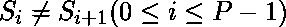

# 最大字符串划分

> 原文:[https://www.geeksforgeeks.org/maximum-string-partition/](https://www.geeksforgeeks.org/maximum-string-partition/)

给定一个字符串。任务是找到最大数量 **P** ，使得给定的**串**可以被划分成 P 个连续的子串，使得任何两个相邻的子串必须不同。更正式地说，和。

**示例:**

> **输入:** str = "aabccd"
> **输出:** 4
> **解释:**
> 我们可以把给定的字符串分成四个字符串，像“a”、“ab”、“c”、“cd”。我们不能把它分成四个以上的部分。如果我们这样做了，那么条件将不会满足
> 
> **输入:**str = " AAAA "
> T3】输出: 3

**进场:**

*   这里我们只需要关注 P 的值，而不是寻找那些 P 子串。
*   我们会贪婪地解决它。我们总是将当前的字符串与之前的字符串进行比较。
*   如果我们发现两者相同，那么我们将继续前进，否则，在这里创建一个分区，并将字符串的前一个轨道更改为当前字符串，这意味着我们将把当前字符串作为前一个字符串进行处理，以便将来进行比较。

下面是上述方法的实现:

## C++

```
// C++ implementation of the above approach
#include <bits/stdc++.h>
using namespace std;

// Return the count of string
int maxPartition(string s)
{
    // P will store the answer
    int n = s.length(), P = 0;

    // Current will store current string
    // Previous will store the previous
    // string that has been taken already
    string current = "", previous = "";

    for (int i = 0; i < n; i++) {

        // Add a character to current string
        current += s[i];

        if (current != previous) {

            // Here we will create a partition and
            // update the previous string with
            // current string
            previous = current;

            // Now we will clear the current string
            current.clear();

            // Increment the count of partition.
            P++;
        }
    }

    return P;
}

// Driver code
int main()
{

    string s = "geeksforgeeks";

    int ans = maxPartition(s);

    cout << ans << "\n";

    return 0;
}
```

## Java 语言(一种计算机语言，尤用于创建网站)

```
// Java implementation of the above approach
class GFG
{
// Return the count of string
static int maxPartition(String s)
{
    // P will store the answer
    int n = s.length(), P = 0;

    // Current will store current string
    // Previous will store the previous
    // string that has been taken already
    String current = "", previous = "";

    for (int i = 0; i < n; i++)
    {

        // Add a character to current string
        current += s.charAt(i);

        if (!current.equals(previous))
        {

            // Here we will create a partition and
            // update the previous string with
            // current string
            previous = current;

            // Now we will clear the current string
            current = "";

            // Increment the count of partition.
            P++;
        }
    }
    return P;
}

// Driver code
public static void main (String[] args)
{
    String s = "geeksforgeeks";

    int ans = maxPartition(s);

    System.out.println(ans);
}
}

// This code is contributed by ihritik
```

## 蟒蛇 3

```
# Python3 implementation of the above approach

# Return the count of string
def maxPartition(s):

    # P will store the answer
    n = len(s)
    P = 0

    # Current will store current string
    # Previous will store the previous
    # that has been taken already
    current = ""
    previous = ""

    for i in range(n):

        # Add a character to current string
        current += s[i]

        if (current != previous):

            # Here we will create a partition and
            # update the previous with
            # current string
            previous = current

            # Now we will clear the current string
            current = ""

            # Increment the count of partition.
            P += 1

    return P

# Driver code
s = "geeksforgeeks"

ans = maxPartition(s)

print(ans)

# This code is contributed by Mohit Kumar
```

## C#

```
// C# implementation of the above approach
using System;
class GFG
{
// Return the count of string
static int maxPartition(string s)
{
    // P will store the answer
    int n = s.Length, P = 0;

    // Current will store current string
    // Previous will store the previous
    // string that has been taken already
    string current = "", previous = "";

    for (int i = 0; i < n; i++)
    {

        // Add a character to current string
        current += s[i];

        if (!current.Equals(previous))
        {

            // Here we will create a partition and
            // update the previous string with
            // current string
            previous = current;

            // Now we will clear the current string
            current = "";

            // Increment the count of partition.
            P++;
        }
    }
    return P;
}

// Driver code
public static void Main ()
{
    string s = "geeksforgeeks";

    int ans = maxPartition(s);

    Console.WriteLine(ans);
}
}

// This code is contributed by ihritik
```

## java 描述语言

```
<script>

// Javascript implementation of the above approach

// Return the count of string
function maxPartition(s)
{
    // P will store the answer
    var n = s.length, P = 0;

    // Current will store current string
    // Previous will store the previous
    // string that has been taken already
    var current = "", previous = "";

    for (var i = 0; i < n; i++) {

        // Add a character to current string
        current += s[i];

        if (current != previous) {

            // Here we will create a partition and
            // update the previous string with
            // current string
            previous = current;

            // Now we will clear the current string
            current = "";

            // Increment the count of partition.
            P++;
        }
    }

    return P;
}

// Driver code
var s = "geeksforgeeks";
var ans = maxPartition(s);
document.write( ans);

</script>
```

**Output:** 

```
11
```

**时间复杂度:** O(N)，其中 N 为字符串的长度。