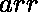
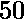
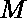
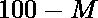

# 给每个人发奖金且不超过 100 分的最大学生通过数

> 原文:[https://www . geeksforgeeks . org/给每个人都发奖金且不超过 100 分的学生最高通过率/](https://www.geeksforgeeks.org/maximum-students-to-pass-after-giving-bonus-to-everybody-and-not-exceeding-100-marks/)

给定一个代表学生分数的数组。及格分数为，学生最高分为，任务是通过给学生加分来最大化通过考试的学生。
请注意，如果一名学生获得了加分，那么所有其他学生也将获得相同数量的加分，并且没有任何学生的分数超过。打印最终能通过考试的学生总数。
**举例:**

> **输入:** arr[] = {0，21，83，45，64}
> **输出:** 3
> 我们最多只能给所有学生的分数加 17 个加分分。于是，最后的数组变成了{17，38，100，62，81}
> 只有 3 个学生会通过考试。
> **输入:** arr[] = {99，50，46，47，48，49，98}
> **输出:** 4

**方法:**让成为学生在所有其他分数中的最高分数，那么可以给出的最高奖励分数将是。现在，对于每个**分数+(100–M)≥50**的学生，递增计数。最后打印计数。
以下是上述方法的实现:

## C++

```
// C++ Implementation of above approach.
#include<iostream>
#include<algorithm>
using namespace std;

// Function to return the number
// of students that can pass
int check(int n, int marks[])
{
    // maximum marks
    int* x = std::max_element(marks,marks+5);

    // maximum bonus marks that can be given
    int bonus = 100-(int)(*x);
    int c = 0;
    for(int i=0; i<n;i++)
    {

        // counting the number of
        // students that can pass
        if(marks[i] + bonus >= 50)
            c += 1;
    }
    return c;
}

// Driver code
int main()
{
int n = 5;
int marks[] = {0, 21, 83, 45, 64};
cout<<check(n, marks)<<endl;
return 0;
}
// This code is contributed by mits
```

## Java 语言(一种计算机语言，尤用于创建网站)

```
// Java Implementation of above approach.
import java.util.*;
class GFG{
// Function to return the number
// of students that can pass
static int check(int n, List<Integer> marks)
{
    // maximum marks
    Integer x = Collections.max(marks);

    // maximum bonus marks that can be given
    int bonus = 100-x;
    int c = 0;
    for(int i=0; i<n;i++)
    {

        // counting the number of
        // students that can pass
        if(marks.get(i) + bonus >= 50)
            c += 1;
    }
    return c;
}

// Driver code
public static void main(String[] args)
{
int n = 5;
 List<Integer> marks = Arrays.asList(0, 21, 83, 45, 64);
System.out.println(check(n, marks));
}
}
// This code is contributed by mits
```

## 蟒蛇 3

```
# Python3 Implementation of above approach.

# Function to return the number
# of students that can pass
def check(n, marks):

    # maximum marks
    x = max(marks)

    # maximum bonus marks that can be given
    bonus = 100-x
    c = 0
    for i in range(n):

        # counting the number of
        # students that can pass
        if(marks[i] + bonus >= 50):
            c += 1

    return c

# Driver code
n = 5
marks = [0, 21, 83, 45, 64]
print(check(n, marks))
```

## C#

```
// C# Implementation of above approach.
using System;
using System.Collections.Generic;
using System.Collections;
using System.Linq;
class GFG{
// Function to return the number
// of students that can pass
static int check(int n, List<int> marks)
{
    // maximum marks
    int x = marks.Max();

    // maximum bonus marks that can be given
    int bonus = 100-x;
    int c = 0;
    for(int i=0; i<n;i++)
    {

        // counting the number of
        // students that can pass
        if(marks[i] + bonus >= 50)
            c += 1;
    }
    return c;
}

// Driver code
public static void Main()
{
int n = 5;
List<int> marks = new List<int>(new int[]{0, 21, 83, 45, 64});
Console.WriteLine(check(n, marks));
}
}
// This code is contributed by mits
```

## 服务器端编程语言（Professional Hypertext Preprocessor 的缩写）

```
<?php

// PHP Implementation of above approach.

// Function to return the number
// of students that can pass
function check($n, $marks)
{
    // maximum marks
    $x = max($marks);

    // maximum bonus marks that can be given
    $bonus = 100-$x;
    $c = 0;
    for($i=0; $i<$n;$i++)
    {

        // counting the number of
        // students that can pass
        if($marks[$i] + $bonus >= 50)
            $c += 1;
    }
    return $c;
}

// Driver code
$n = 5;
$marks = array(0, 21, 83, 45, 64);
echo check($n, $marks);
```

## java 描述语言

```
<script>

// JavaScript Implementation of above approach.

// Function to return the number
// of students that can pass
function check(n, marks)
{
    // maximum marks
    let x = Math.max(...marks);

    // maximum bonus marks that can be given
    let bonus = 100-x;
    let c = 0;
    for(let i=0; i<n;i++)
    {

        // counting the number of
        // students that can pass
        if(marks[i] + bonus >= 50)
            c += 1;
    }
    return c;
}

    // Driver code

    let n = 5;
     let marks = [0, 21, 83, 45, 64];
     document.write(check(n, marks));

</script>
```

**Output:** 

```
3
```