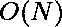

# 最多反转两个元素后的最大子阵列和

> 原文:[https://www . geesforgeks . org/max-subarray-最多两个元素反相后的和/](https://www.geeksforgeeks.org/maximum-subarray-sum-after-inverting-at-most-two-elements/)

给定一个整数元素的数组 **arr[]** ，任务是在改变最多两个元素的符号后，找到最大可能的子数组和。
**例:**

> **输入:** arr[] = {-5，3，2，7，-8，3，7，-9，10，12，-6}
> **输出:** 61
> 我们可以通过
> 改变第 4 个和第 7 个索引即
> -8 和-9 的元素符号，从索引 0 到 10 得到 61。我们可以选择-5 和-6，但这给了我们更小的总和 48。
> **输入:** arr[] = {-5，-3，-18，0，-4}
> **输出:** 22

**方法:**这个问题可以用动态规划来解决。假设数组中有 n 个元素。我们从最小长度到最大长度构建我们的解决方案。
在每一步，我们将长度 I 的解改为 i+1。
每一步我们有三种情况:

1.  (最大子数组和)最多改变 0 个元素的符号。
2.  (最大子数组和)最多改变 1 个元素的符号。
3.  (最大子数组和)最多改变 2 个元素的符号。

这些案例使用彼此以前的值。

*   案例 1:我们有两个选择，要么获取当前元素，要么将当前值添加到同一案例的先前值中。我们存储两个值中较大的一个。
*   案例 2:我们有两个选择
    1.  我们改变当前元素的符号，然后将其添加到 0 或之前的情况 1 值。我们储存较大的。
    2.  我们获取数组的当前元素，并将其添加到前面的案例 2 值中。如果这个值大于我们在(a)情况下得到的值，那么我们就不更新。
*   案例 3:我们又有了两个选择
    1.  我们改变当前元素的符号，并将其添加到先前的案例 2 值中。
    2.  我们将当前元素添加到先前的案例 3 值中。为当前案例存储从(a)和(b)中获得的较大值。

我们更新这三种情况中的最大值，并将其存储在变量中。
对于每一步的每一种情况，如果给定的数组包含 n 个元素，我们取二维数组 dp[n+1][3]。

> 递归关系:**例 1:【DP[I][0]=最大值(DP[I–1][0]+arr[I]，arr[I])【T2]T3】例 2: **dp[i][1] =最大值(0，DP[I–1][0])–arr[I]，DP[I–1][1]+arr[I])****

以下是上述方法的实现:

## C++

```
// C++ implementation of the approach
#include <algorithm>
#include <iostream>
using namespace std;

// Function to return the maximum required sub-array sum
int maxSum(int a[], int n)
{
    int ans = 0;
    int* arr = new int[n + 1];

    // Creating one based indexing
    for (int i = 1; i <= n; i++)
        arr[i] = a[i - 1];

    // 2d array to contain solution for each step
    int** dp = new int*[n + 1];
    for (int i = 0; i <= n; i++)
        dp[i] = new int[3];
    for (int i = 1; i <= n; ++i) {

        // Case 1: Choosing current or (current + previous)
        // whichever is smaller
        dp[i][0] = max(arr[i], dp[i - 1][0] + arr[i]);

        // Case 2:(a) Altering sign and add to previous case 1 or
        // value 0
        dp[i][1] = max(0, dp[i - 1][0]) - arr[i];

        // Case 2:(b) Adding current element with previous case 2
        // and updating the maximum
        if (i >= 2)
            dp[i][1] = max(dp[i][1], dp[i - 1][1] + arr[i]);

        // Case 3:(a) Altering sign and add to previous case 2
        if (i >= 2)
            dp[i][2] = dp[i - 1][1] - arr[i];

        // Case 3:(b) Adding current element with previous case 3
        if (i >= 3)
            dp[i][2] = max(dp[i][2], dp[i - 1][2] + arr[i]);

        // Updating the maximum value of variable ans
        ans = max(ans, dp[i][0]);
        ans = max(ans, dp[i][1]);
        ans = max(ans, dp[i][2]);
    }

    // Return the final solution
    return ans;
}

// Driver code
int main()
{
    int arr[] = { -5, 3, 2, 7, -8, 3, 7, -9, 10, 12, -6 };
    int n = sizeof(arr) / sizeof(arr[0]);
    cout << maxSum(arr, n);

    return 0;
}
```

## Java 语言(一种计算机语言，尤用于创建网站)

```
// Java implementation of the approach

class GFG
{
    // Function to return the maximum required sub-array sum
    static int maxSum(int []a, int n)
    {
        int ans = 0;
        int [] arr = new int[n + 1];

        // Creating one based indexing
        for (int i = 1; i <= n; i++)
            arr[i] = a[i - 1];

        // 2d array to contain solution for each step
        int [][] dp = new int [n + 1][3];
        for (int i = 1; i <= n; ++i)
        {

            // Case 1: Choosing current or (current + previous)
            // whichever is smaller
            dp[i][0] = Math.max(arr[i], dp[i - 1][0] + arr[i]);

            // Case 2:(a) Altering sign and add to previous case 1 or
            // value 0
            dp[i][1] = Math.max(0, dp[i - 1][0]) - arr[i];

            // Case 2:(b) Adding current element with previous case 2
            // and updating the maximum
            if (i >= 2)
                dp[i][1] = Math.max(dp[i][1], dp[i - 1][1] + arr[i]);

            // Case 3:(a) Altering sign and add to previous case 2
            if (i >= 2)
                dp[i][2] = dp[i - 1][1] - arr[i];

            // Case 3:(b) Adding current element with previous case 3
            if (i >= 3)
                dp[i][2] = Math.max(dp[i][2], dp[i - 1][2] + arr[i]);

            // Updating the maximum value of variable ans
            ans = Math.max(ans, dp[i][0]);
            ans = Math.max(ans, dp[i][1]);
            ans = Math.max(ans, dp[i][2]);
        }

        // Return the final solution
        return ans;
    }

    // Driver code
    public static void main (String[] args)
    {
        int arr[] = { -5, 3, 2, 7, -8, 3, 7, -9, 10, 12, -6 };
        int n = arr.length;
        System.out.println(maxSum(arr, n));
    }
}

// This code is contributed by ihritik
```

## 蟒蛇 3

```
# Python3 implementation of the approach

# Function to return the maximum
# required sub-array sum
def maxSum(a, n):

    ans = 0
    arr = [0] * (n + 1)

    # Creating one based indexing
    for i in range(1, n + 1):
        arr[i] = a[i - 1]

    # 2d array to contain solution for each step
    dp = [[0 for i in range(3)]
             for j in range(n + 1)]
    for i in range(0, n + 1):

        # Case 1: Choosing current or
        # (current + previous) whichever is smaller
        dp[i][0] = max(arr[i], dp[i - 1][0] + arr[i])

        # Case 2:(a) Altering sign and add to
        # previous case 1 or value 0
        dp[i][1] = max(0, dp[i - 1][0]) - arr[i]

        # Case 2:(b) Adding current element with
        # previous case 2 and updating the maximum
        if i >= 2:
            dp[i][1] = max(dp[i][1],
                           dp[i - 1][1] + arr[i])

        # Case 3:(a) Altering sign and
        # add to previous case 2
        if i >= 2:
            dp[i][2] = dp[i - 1][1] - arr[i]

        # Case 3:(b) Adding current element
        # with previous case 3
        if i >= 3:
            dp[i][2] = max(dp[i][2],
                           dp[i - 1][2] + arr[i])

        # Updating the maximum value
        # of variable ans
        ans = max(ans, dp[i][0])
        ans = max(ans, dp[i][1])
        ans = max(ans, dp[i][2])

    # Return the final solution
    return ans

# Driver code
if __name__ == "__main__":

    arr = [-5, 3, 2, 7, -8, 3,
            7, -9, 10, 12, -6]
    n = len(arr)
    print(maxSum(arr, n))

# This code is contributed by Rituraj Jain
```

## C#

```
// C# implementation of the approach
using System;

class GFG
{
    // Function to return the maximum required sub-array sum
    static int maxSum(int [] a, int n)
    {
        int ans = 0;
        int [] arr = new int[n + 1];

        // Creating one based indexing
        for (int i = 1; i <= n; i++)
            arr[i] = a[i - 1];

        // 2d array to contain solution for each step
        int [, ] dp = new int [n + 1, 3];
        for (int i = 1; i <= n; ++i)
        {

            // Case 1: Choosing current or (current + previous)
            // whichever is smaller
            dp[i, 0] = Math.Max(arr[i], dp[i - 1, 0] + arr[i]);

            // Case 2:(a) Altering sign and add to previous case 1 or
            // value 0
            dp[i, 1] = Math.Max(0, dp[i - 1, 0]) - arr[i];

            // Case 2:(b) Adding current element with previous case 2
            // and updating the maximum
            if (i >= 2)
                dp[i, 1] = Math.Max(dp[i, 1], dp[i - 1, 1] + arr[i]);

            // Case 3:(a) Altering sign and add to previous case 2
            if (i >= 2)
                dp[i, 2] = dp[i - 1, 1] - arr[i];

            // Case 3:(b) Adding current element with previous case 3
            if (i >= 3)
                dp[i, 2] = Math.Max(dp[i, 2], dp[i - 1, 2] + arr[i]);

            // Updating the maximum value of variable ans
            ans = Math.Max(ans, dp[i, 0]);
            ans = Math.Max(ans, dp[i, 1]);
            ans = Math.Max(ans, dp[i, 2]);
        }

        // Return the final solution
        return ans;
    }

    // Driver code
    public static void Main ()
    {
        int [] arr = { -5, 3, 2, 7, -8, 3, 7, -9, 10, 12, -6 };
        int n = arr.Length;
        Console.WriteLine(maxSum(arr, n));
    }
}

// This code is contributed by ihritik
```

## 服务器端编程语言（Professional Hypertext Preprocessor 的缩写）

```
<?php
// PHP implementation of the approach

// Function to return the maximum
// required sub-array sum
function maxSum($a, $n)
{
    $ans = 0;
    $arr = array();

    // Creating one based indexing
    for ($i = 1; $i <= $n; $i++)
        $arr[$i] = $a[$i - 1];

    // 2d array to contain solution
    // for each step
    $dp = array(array());

    for ($i = 1; $i <= $n; ++$i)
    {

        // Case 1: Choosing current or (current +
        // previous) whichever is smaller
        $dp[$i][0] = max($arr[$i],
                         $dp[$i - 1][0] + $arr[$i]);

        // Case 2:(a) Altering sign and add to
        // previous case 1 or value 0
        $dp[$i][1] = max(0, $dp[$i - 1][0]) - $arr[$i];

        // Case 2:(b) Adding current element with 
        // previous case 2 and updating the maximum
        if ($i >= 2)
            $dp[$i][1] = max($dp[$i][1],
                             $dp[$i - 1][1] + $arr[$i]);

        // Case 3:(a) Altering sign and
        // add to previous case 2
        if ($i >= 2)
            $dp[$i][2] = $dp[$i - 1][1] - $arr[$i];

        // Case 3:(b) Adding current element
        // with previous case 3
        if ($i >= 3)
            $dp[$i][2] = max($dp[$i][2],
                             $dp[$i - 1][2] + $arr[$i]);

        // Updating the maximum value of variable ans
        $ans = max($ans, $dp[$i][0]);
        $ans = max($ans, $dp[$i][1]);
        $ans = max($ans, $dp[$i][2]);
    }

    // Return the final solution
    return $ans;
}

// Driver code
$arr = array( -5, 3, 2, 7, -8, 3,
               7, -9, 10, 12, -6 );
$n = count($arr) ;

echo maxSum($arr, $n);

// This code is contributed by Ryuga
?>
```

## java 描述语言

```
<script>

    // JavaScript implementation of the approach

    // Function to return the maximum required sub-array sum
    function maxSum(a, n)
    {
        let ans = 0;
        let arr = new Array(n + 1);

        // Creating one based indexing
        for (let i = 1; i <= n; i++)
            arr[i] = a[i - 1];

        // 2d array to contain solution for each step
        let dp = new Array(n + 1);
        for (let i = 0; i <= n; ++i)
        {
            dp[i] = new Array(3);
            for (let j = 0; j < 3; ++j)
            {
                dp[i][j] = 0;
            }
        }
        for (let i = 1; i <= n; ++i)
        {

            // Case 1: Choosing current or (current + previous)
            // whichever is smaller
            dp[i][0] = Math.max(arr[i], dp[i - 1][0] + arr[i]);

            // Case 2:(a) Altering sign and add to previous case 1 or
            // value 0
            dp[i][1] = Math.max(0, dp[i - 1][0]) - arr[i];

            // Case 2:(b) Adding current element with previous case 2
            // and updating the maximum
            if (i >= 2)
                dp[i][1] = Math.max(dp[i][1], dp[i - 1][1] + arr[i]);

            // Case 3:(a) Altering sign and add to previous case 2
            if (i >= 2)
                dp[i][2] = dp[i - 1][1] - arr[i];

            // Case 3:(b) Adding current element with previous case 3
            if (i >= 3)
                dp[i][2] = Math.max(dp[i][2], dp[i - 1][2] + arr[i]);

            // Updating the maximum value of variable ans
            ans = Math.max(ans, dp[i][0]);
            ans = Math.max(ans, dp[i][1]);
            ans = Math.max(ans, dp[i][2]);
        }

        // Return the final solution
        return ans;
    }

    let arr = [ -5, 3, 2, 7, -8, 3, 7, -9, 10, 12, -6 ];
    let n = arr.length;
    document.write(maxSum(arr, n));

</script>
```

**Output:** 

```
61
```

**时间复杂度:** 
**空间复杂度:** 