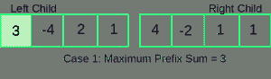
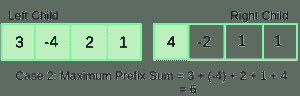
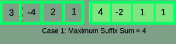
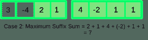
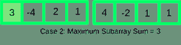
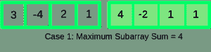
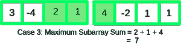

# 给定范围内的最大子阵列和

> 原文:[https://www . geesforgeks . org/maximum-subarray-sum-给定范围/](https://www.geeksforgeeks.org/maximum-subarray-sum-given-range/)

给定 n 个数字的数组，任务是回答以下查询:

```
maximumSubarraySum(start, end) : Find the maximum 
subarray sum in the range from array index 'start' 
to 'end'.
```

**另请参见:** [需要更新的范围查询](https://www.geeksforgeeks.org/range-query-largest-sum-contiguous-subarray/)
示例:

```
Input : arr[] = {1, 3, -4, 5, -2}
        Query 1: start = 0, end = 4
        Query 2: start = 0, end = 2
Output : 5
         4
Explanation:
For Query 1, [1, 3, -4, 5] or ( [5] ) 
represent the maximum sum sub arrays 
with sum = 5.

For Query 2, [1, 3] represents the 
maximum sum subarray in the query range
with sum = 4
```

分段树可以用来解决这个问题。在这里，我们需要保存各种累计金额的信息。在每个节点上，我们存储以下内容:
1)最大前缀和，
2)最大后缀和，
3)总和，
4)最大子阵列和
每个节点存储上述信息的经典段树应该足以回答每个查询。这里唯一的焦点是树的左节点和右节点是如何合并在一起的。现在，我们将讨论如何使用其左右子节点的信息在每个段树节点中构建每个信息。
**利用左右子**
构造最大前缀和一个节点的最大前缀和可以有两种情况:

1.  最大前缀和出现在左子代



```
In this Case,
Maximum Prefix Sum = Maximum Prefix Sum of Left Child
```

1.  最大前缀和包含左子元素的每个数组元素和对右子元素的最大前缀和有贡献的元素，



```
In this Case,
Maximum Prefix Sum = Total Sum of Left Child + 
               Maximum Prefix Sum of Right Child
```

**利用左右子**
构造最大后缀和一个节点的最大后缀和可以有两种情况:

1.  最大后缀和出现在右边的子节点



```
In this Case,
Maximum Suffix Sum = Maximum Suffix Sum of Right Child
```

1.  最大后缀和包含右子元素的每个数组元素和对左子元素的最大后缀和有贡献的元素，



```
In this Case,
Maximum Suffix Sum = Total Sum of Right Child + 
               Maximum Suffix Sum of Left Child
```

**利用左右子**
构造最大子阵和一个节点的最大子阵和可以有三种情况:

1.  最大子数组和出现在左边的子数组



```
In this Case,
Maximum Sub-array Sum = Maximum Subarray Sum of Left Child
```

1.  最大子数组和出现在右边的子数组



```
In this Case,
Maximum Sub-array Sum = Maximum Subarray Sum of Right Child
```

1.  最大子数组和，包含对最大前缀和起作用的右子数组元素和对最大后缀和起作用的左子数组元素



```
In this Case,
Maximum Subarray Sum = Maximum Prefix Sum of Right Child                                           
                                  + 
                       Maximum Suffix Sum of Left Child
```

## 卡片打印处理机（Card Print Processor 的缩写）

```
// C++ Program to Implement Maximum Sub-Array Sum in a range
#include <bits/stdc++.h>
using namespace std;

#define inf 0x3f3f

/* Node of the segment tree consisting of:
1\. Maximum Prefix Sum,
2\. Maximum Suffix Sum,
3\. Total Sum,
4\. Maximum Sub-Array Sum */
struct Node {
    int maxPrefixSum;
    int maxSuffixSum;
    int totalSum;
    int maxSubarraySum;

    Node()
    {
        maxPrefixSum = maxSuffixSum = maxSubarraySum = -inf;
        totalSum = -inf;
    }
};

// Returns Parent Node after merging its left and right child
Node merge(Node leftChild, Node rightChild)
{
    Node parentNode;
    parentNode.maxPrefixSum = max(leftChild.maxPrefixSum,
                                  leftChild.totalSum +
                                  rightChild.maxPrefixSum);

    parentNode.maxSuffixSum = max(rightChild.maxSuffixSum,
                                  rightChild.totalSum +
                                  leftChild.maxSuffixSum);

    parentNode.totalSum = leftChild.totalSum +
                          rightChild.totalSum;

    parentNode.maxSubarraySum = max({leftChild.maxSubarraySum,
                                     rightChild.maxSubarraySum,
                                     leftChild.maxSuffixSum +
                                     rightChild.maxPrefixSum});

    return parentNode;
}

// Builds the Segment tree recursively
void constructTreeUtil(Node* tree, int arr[], int start,
                                    int end, int index)
{

    /* Leaf Node */
    if (start == end) {

        // single element is covered under this range
        tree[index].totalSum = arr[start];
        tree[index].maxSuffixSum = arr[start];
        tree[index].maxPrefixSum = arr[start];
        tree[index].maxSubarraySum = arr[start];
        return;
    }

    // Recursively Build left and right children
    int mid = (start + end) / 2;
    constructTreeUtil(tree, arr, start, mid, 2 * index);
    constructTreeUtil(tree, arr, mid + 1, end, 2 * index + 1);

    // Merge left and right child into the Parent Node
    tree[index] = merge(tree[2 * index], tree[2 * index + 1]);
}

/* Function to construct segment tree from given array.
   This function allocates memory for segment tree and
   calls constructTreeUtil() to fill the allocated
   memory */
Node* constructTree(int arr[], int n)
{
    // Allocate memory for segment tree
    int x = (int)(ceil(log2(n))); // Height of the tree

    // Maximum size of segment tree
    int max_size = 2 * (int)pow(2, x) - 1;
    Node* tree = new Node[max_size];

    // Fill the allocated memory tree
    constructTreeUtil(tree, arr, 0, n - 1, 1);

    // Return the constructed segment tree
    return tree;
}

/* A Recursive function to get the desired
   Maximum Sum Sub-Array,
The following are parameters of the function-

tree     --> Pointer to segment tree
index --> Index of the segment tree Node
ss & se  --> Starting and ending indexes of the
             segment represented by
                 current Node, i.e., tree[index]
qs & qe  --> Starting and ending indexes of query range */
Node queryUtil(Node* tree, int ss, int se, int qs,
                               int qe, int index)
{
    // No overlap
    if (ss > qe || se < qs) {

        // returns a Node for out of bounds condition
        Node nullNode;
        return nullNode;
    }

    // Complete overlap
    if (ss >= qs && se <= qe) {
        return tree[index];
    }

    // Partial Overlap Merge results of Left
    // and Right subtrees
    int mid = (ss + se) / 2;
    Node left = queryUtil(tree, ss, mid, qs, qe,
                                     2 * index);
    Node right = queryUtil(tree, mid + 1, se, qs,
                              qe, 2 * index + 1);

    // merge left and right subtree query results
    Node res = merge(left, right);
    return res;
}

/* Returns the Maximum Subarray Sum between start and end
   It mainly uses queryUtil(). */
int query(Node* tree, int start, int end, int n)
{
    Node res = queryUtil(tree, 0, n - 1, start, end, 1);
    return res.maxSubarraySum;
}

int main()
{
    int arr[] = { 1, 3, -4, 5, -2 };
    int n = sizeof(arr) / sizeof(arr[0]);

    // Construct Segment Tree
    Node* Tree = constructTree(arr, n);
    int start, end, maxSubarraySum;

    // Answering query 1:
    start = 0;
    end = 4;
    maxSubarraySum = query(Tree, start, end, n);
    cout << "Maximum Sub-Array Sum between "
         << start << " and " << end
         << " = " << maxSubarraySum << "\n";

    // Answering query 2:
    start = 0;
    end = 2;
    maxSubarraySum = query(Tree, start, end, n);
    cout << "Maximum Sub-Array Sum between "
         << start << " and " << end
         << " = " << maxSubarraySum << "\n";

    return 0;
}
```

**Output:** 

```
Maximum Sub-Array Sum between 0 and 4 = 5
Maximum Sub-Array Sum between 0 and 2 = 4
```

时间复杂度:每个查询的 O(logn)。