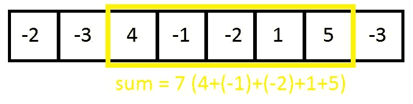

# 使用前缀和的 O(n)中的最大子阵列和

> 原文:[https://www . geesforgeks . org/maximum-subarray-sum-use-prefix-sum/](https://www.geeksforgeeks.org/maximum-subarray-sum-using-prefix-sum/)

给定一个正负整数数组，找出该数组中的最大子数组和。



**例:**

```
Input1 : arr = {-2, -3, 4, -1, -2, 1, 5, -3}
Output1 : 7

Input2 : arr = {4, -8, 9, -4, 1, -8, -1, 6}
Output2 : 9
```

[卡丹算法](https://www.geeksforgeeks.org/largest-sum-contiguous-subarray/)在线性时间内使用动态规划方法解决了这个问题。这是另一种使用动态规划和前缀和在线性时间内找出最大子阵和的方法。
**先决条件:** [前缀和阵](https://www.geeksforgeeks.org/prefix-sum-array-implementation-applications-competitive-programming/)

> 1.首先计算输入数组的前缀和(prefix_sum)。
> 2。从索引 x 到 y 的子阵列之和可以表示为，
> 
> ![$\sum\limits_{ele=x}^{y} arr[ele] = prefix\_sum[y] - prefix\_sum[x-1] $  ](img/c5253bfac49040eb85a21c28fe7c9a23.png "Rendered by QuickLaTeX.com")
> 
> 3.这些子阵列的最大值是，
> 
> ![$max(\sum\limits_{ele=x}^{y} arr[ele]) = max(prefix\_sum[y] - prefix\_sum[x-1]) =$ $max_{1<=y<=n}(prefix\_sum[y] - min_{x<=y}(prefix\_sum[x-1])) $  ](img/1f6f5a6b986835e576af48cf44374451.png "Rendered by QuickLaTeX.com")
> 
> 也就是说，我们跟踪到目前为止 x < = y 的**最小前缀和**以及最大子阵列和。

**执行:**
1。计算输入数组的前缀和。
2。初始化:min_prefix_sum = 0，RES =-无穷大
3。保持 i = 0 到 n 的循环(n 是输入数组的大小)。
a)cand = prefix _ sum[I]–mini
b)如果 **cand** 大于 res(目前为止最大的子阵列和)，则通过 cand 更新 res。
c)如果 prefix_sum[i]小于 min_prefix_sum(迄今为止的最小前缀和)，则通过 prefix_sum[i]更新 min_prefix_sum。
4。参考:[k 个最大和问题的算法和 k 个最大子阵列问题的超大规模集成电路算法](http://ieeexplore.ieee.org/abstract/document/1300488/)

## C++

```
// C++ program to find out maximum subarray
// sum in linear time using prefix sum.
#include <iostream>
#include <limits>
using namespace std;

// Function to compute maximum subarray
// sum in linear time.
int maximumSumSubarray(int arr[], int n)
{
    // Initialize minimum prefix sum to 0.
    int min_prefix_sum = 0;

    // Initialize maximum subarray sum so
    // far to -infinity.
    int res = numeric_limits<int>::min();

    // Initialize and compute the prefix
    // sum array.
    int prefix_sum[n];
    prefix_sum[0] = arr[0];
    for (int i = 1; i < n; i++)
        prefix_sum[i] = prefix_sum[i - 1] + arr[i];       

    // loop through the array, keep track
    // of minimum prefix sum so far and
    // maximum subarray sum.
    for (int i = 0; i < n; i++) {
        res = max(res, prefix_sum[i] -
                       min_prefix_sum);
        min_prefix_sum = min(min_prefix_sum,
                             prefix_sum[i]);
    }

    return res;
}

// Driver Program
int main()
{
    // Test case 1
    int arr1[] = { -2, -3, 4, -1, -2, 1, 5, -3 };
    int n1 = sizeof(arr1) / sizeof(arr1[0]);
    cout << maximumSumSubarray(arr1, n1) << endl;

    // Test case 2
    int arr2[] = { 4, -8, 9, -4, 1, -8, -1, 6 };
    int n2 = sizeof(arr2) / sizeof(arr2[0]);
    cout << maximumSumSubarray(arr2, n2);

    return 0;
}
```

## Java 语言(一种计算机语言，尤用于创建网站)

```
// Java program to find
// out maximum subarray
// sum in linear time
// using prefix sum.

class GFG
{
    // Function to compute maximum
    // subarray sum in linear time.
    static int maximumSumSubarray(int arr[], int n)
    {
        // Initialize minimum
        // prefix sum to 0.
        int min_prefix_sum = 0;

        // Initialize maximum subarray
        // sum so far to -infinity.
        int res = Integer.MIN_VALUE;

        // Initialize and compute
        // the prefix sum array.
        int prefix_sum[] = new int[n];
        prefix_sum[0] = arr[0];
        for (int i = 1; i < n; i++)
            prefix_sum[i] = prefix_sum[i - 1]
                            + arr[i];    

        // loop through the array, keep
        // track of minimum prefix sum so
        // far and maximum subarray sum.
        for (int i = 0; i < n; i++)
        {
            res = Math.max(res, prefix_sum[i] -
                           min_prefix_sum);
            min_prefix_sum = Math.min(min_prefix_sum,
                                     prefix_sum[i]);
        }

        return res;
    }

    // Driver Program
    public static void main (String[] args)
    {
        // Test case 1
        int arr1[] = { -2, -3, 4, -1, -2, 1, 5, -3 };
        int n1 = arr1.length;
        System.out.println(maximumSumSubarray(arr1, n1));

        // Test case 2
        int arr2[] = { 4, -8, 9, -4, 1, -8, -1, 6 };
        int n2 = arr2.length;
        System.out.println(maximumSumSubarray(arr2, n2));
    }
}

// This code is contributed by Ansu Kumari.
```

## 蟒蛇 3

```
# Python3 program to find out
# maximum subarray sum in
# linear time using prefix
# sum.
import math

# Function to compute maximum
# subarray sum in linear time.
def maximumSumSubarray(arr, n):

    # Initialize minimum prefix
    # sum to 0.
    min_prefix_sum = 0

    # Initialize maximum subarray
    # sum so far to -infinity.
    res = -math.inf

    # Initialize and compute the
    # prefix sum array.
    prefix_sum = []
    prefix_sum.append(arr[0])

    for i in range(1, n):
        prefix_sum.append(prefix_sum[i - 1] + arr[i])    

    # loop through the array keep
    # track of minimum prefix sum
    # so far and maximum subarray
    # sum.
    for i in range(n):

        res = max(res, prefix_sum[i] - min_prefix_sum)
        min_prefix_sum = min(min_prefix_sum, prefix_sum[i])

    return res

# Driver Program

# Test case 1
arr1 = [ -2, -3, 4, -1, -2, 1, 5, -3 ]
n1 = len(arr1)
print(maximumSumSubarray(arr1, n1))

# Test case 2
arr2 = [ 4, -8, 9, -4, 1, -8, -1, 6 ]
n2 = len(arr2)
print(maximumSumSubarray(arr2, n2))

# This code is contributed by Ansu Kuamri.
```

## C#

```
// C# program to find
// out maximum subarray
// sum in linear time
// using prefix sum.
using System;

class GFG
{
    // Function to compute maximum
    // subarray sum in linear time.
    static int maximumSumSubarray(int []arr, int n)
    {
        // Initialize minimum
        // prefix sum to 0.
        int min_prefix_sum = 0;

        // Initialize maximum subarray
        // sum so far to -infinity.
        int res = int.MinValue;

        // Initialize and compute
        // the prefix sum array.
        int []prefix_sum = new int[n];
        prefix_sum[0] = arr[0];
        for (int i = 1; i < n; i++)
            prefix_sum[i] = prefix_sum[i - 1]
                            + arr[i];

        // loop through the array, keep
        // track of minimum prefix sum so
        // far and maximum subarray sum.
        for (int i = 0; i < n; i++)
        {
            res = Math.Max(res, prefix_sum[i] -
                        min_prefix_sum);
            min_prefix_sum = Math.Min(min_prefix_sum,
                                    prefix_sum[i]);
        }

        return res;
    }

    // Driver Program
    public static void Main ()
    {
        // Test case 1
        int []arr1 = { -2, -3, 4, -1, -2, 1, 5, -3 };
        int n1 = arr1.Length;
        Console.WriteLine(maximumSumSubarray(arr1, n1));

        // Test case 2
        int []arr2 = { 4, -8, 9, -4, 1, -8, -1, 6 };
        int n2 = arr2.Length;
        Console.WriteLine(maximumSumSubarray(arr2, n2));
    }
}

// This code is contributed by vt_m.
```

## 服务器端编程语言（Professional Hypertext Preprocessor 的缩写）

```
<?php
// PHP program to find out
// maximum subarray sum in
// linear time using prefix sum.

// Function to compute maximum
// subarray sum in linear time.
function maximumSumSubarray($arr, $n)
{
    // Initialize minimum
    // prefix sum to 0.
    $min_prefix_sum = 0;

    // Initialize maximum subarray
    // sum so far to -infinity.
    $res = PHP_INT_MIN;

    // Initialize and compute
    // the prefix sum array.
    $prefix_sum = array();
    $prefix_sum[0] = $arr[0];
    for ($i = 1; $i < $n; $i++)
        $prefix_sum[$i] = $prefix_sum[$i - 1] +
                                      $arr[$i];

    // loop through the array,
    // keep track of minimum
    // prefix sum so far and
    // maximum subarray sum.
    for ($i = 0; $i < $n; $i++)
    {
        $res = max($res, $prefix_sum[$i] -
                         $min_prefix_sum);
        $min_prefix_sum = min($min_prefix_sum,
                              $prefix_sum[$i]);
    }

    return $res;
}

// Driver Code

// Test case 1
$arr1 = array(-2, -3, 4, -1,
              -2, 1, 5, -3);
$n1 = count($arr1);
echo maximumSumSubarray($arr1, $n1), " \n" ;

// Test case 2
$arr2 = array(4, -8, 9, -4,
              1, -8, -1, 6);

$n2 = count($arr2);
echo maximumSumSubarray($arr2, $n2);

// This code is contributed by anuj_67.
?>
```

## java 描述语言

```
<script>

// JavaScript program to find
// out maximum subarray
// sum in linear time
// using prefix sum.

// Function to compute maximum
// subarray sum in linear time.
    function maximumSumSubarray(arr, n)
    {
        // Initialize minimum
        // prefix sum to 0.
        let min_prefix_sum = 0;

        // Initialize maximum subarray
        // sum so far to -infinity.
        let res = Number.MIN_VALUE;

        // Initialize and compute
        // the prefix sum array.
        let prefix_sum = [];
        prefix_sum[0] = arr[0];
        for (let i = 1; i < n; i++)
            prefix_sum[i] = prefix_sum[i - 1]
                            + arr[i];    

        // loop through the array, keep
        // track of minimum prefix sum so
        // far and maximum subarray sum.
        for (let i = 0; i < n; i++)
        {
            res = Math.max(res, prefix_sum[i] -
                           min_prefix_sum);
            min_prefix_sum = Math.min(min_prefix_sum,
                                     prefix_sum[i]);
        }

        return res;
    }

// Driver code

        // Test case 1
        let arr1 = [ -2, -3, 4, -1, -2, 1, 5, -3 ];
        let n1 = arr1.length;
        document.write(maximumSumSubarray(arr1, n1) + "<br/>");

        // Test case 2
        let arr2 = [ 4, -8, 9, -4, 1, -8, -1, 6 ];
        let n2 = arr2.length;
        document.write(maximumSumSubarray(arr2, n2));

</script>
```

**输出:**

```
7
9
```

更简单高效的解决方案
**时间复杂度:O(n)。**计算前缀和需要线性时间，在 for 循环的每次迭代中需要恒定时间。因此整体复杂性是 **O(n)** 。
请注意，上述问题可以使用[卡丹算法](https://www.geeksforgeeks.org/largest-sum-contiguous-subarray/)
在 O(n)时间和 O(1)额外空间内解决