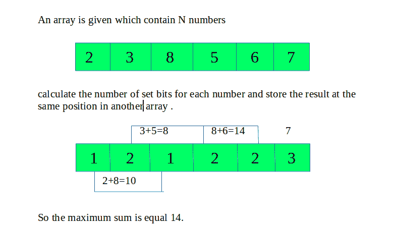

# 设定位数相同的数相加的最大和

> 原文:[https://www . geesforgeks . org/同位数相加的最大和数/](https://www.geeksforgeeks.org/maximum-sum-by-adding-numbers-with-same-number-of-set-bits/)

给定一个由 N 个数字组成的数组，任务是找到通过将具有相同位数的数字相加而得到的最大和。
**例:**

> **输入:**32 3 7 5 27 28
> T3】输出:34
> T6】输入:2 3 8 5 6 7
> T9】输出: 14



**接近** :

*   遍历数组，计算每个元素的设置位数。
*   初始化一个 32 位的数组，假设这个数最多有 32 个设置位。
*   迭代数组并将数组元素添加到指示设置位数的位置。
*   遍历并找到最大和并返回它。

以下是上述方法的实现:

## C++

```
// C++ program to find maximum sum
// by adding numbers with same number of set bits
#include <bits/stdc++.h>
using namespace std;

// count the number of bits
// for each element of array
int bit_count(int n)
{
    int count = 0;

    // Count the number of set bits
    while (n) {
        count++;

        n = n & (n - 1);
    }

    return count;
}

// Function to return the
// the maximum sum
int maxsum(int arr[], int n)
{
    int bits[n];

    // Calculate the
    for (int i = 0; i < n; i++) {
        bits[i] = bit_count(arr[i]);
    }

    // Assuming the number to be
    // a maximum of 32 bits
    int sum[32] = { 0 };

    // Add the number to the
    // number of set bits
    for (int i = 0; i < n; i++) {
        sum[bits[i]] += arr[i];
    }

    int maximum = 0;

    // Find the maximum sum
    for (int i = 0; i < 32; i++) {

        maximum = max(sum[i], maximum);
    }

    return maximum;
}

// Driver code
int main()
{

    int arr[] = { 2, 3, 8, 5, 6, 7 };
    int n = sizeof(arr) / sizeof(arr[0]);
    cout << maxsum(arr, n);

    return 0;
}
```

## Java 语言(一种计算机语言，尤用于创建网站)

```
// Java program to find maximum sum
// by adding numbers with same number of set bits

class GFG
{
// count the number of bits
// for each element of array
static int bit_count(int n)
{
    int count = 0;

    // Count the number of set bits
    while (n>0)
    {
        count++;

        n = n & (n - 1);
    }

    return count;
}

// Function to return the
// the maximum sum
static int maxsum(int[] arr, int n)
{
    int[] bits=new int[n];

    // Calculate the
    for (int i = 0; i < n; i++)
    {
        bits[i] = bit_count(arr[i]);
    }

    // Assuming the number to be
    // a maximum of 32 bits
    int[] sum=new int[32];

    // Add the number to the
    // number of set bits
    for (int i = 0; i < n; i++)
    {
        sum[bits[i]] += arr[i];
    }

    int maximum = 0;

    // Find the maximum sum
    for (int i = 0; i < 32; i++)
    {

        maximum = Math.max(sum[i], maximum);
    }

    return maximum;
}

// Driver code
public static void main (String[] args)
{
    int[] arr = { 2 ,3 , 8, 5, 6, 7 };
    int n = arr.length;
    System.out.println(maxsum(arr, n));

}
}

// This Code is contributed by mits
```

## 蟒蛇 3

```
# Python3 program to find maximum
# sum by adding numbers with
# same number of set bits

# count the number of bits
# for each element of array
def bit_count(n):
    count = 0;

    # Count the number
    # of set bits
    while (n > 0):
        count += 1;

        n = n & (n - 1);

    return count;

# Function to return the
# the maximum sum
def maxsum(arr, n):
    bits = [0] * n;

    # Calculate the
    for i in range(n):
        bits[i] = bit_count(arr[i]);

    # Assuming the number to be
    # a maximum of 32 bits
    sum = [0] * 32;

    # Add the number to the
    # number of set bits
    for i in range(n):
        sum[bits[i]] += arr[i];

    maximum = 0;

    # Find the maximum sum
    for i in range(32):

        maximum = max(sum[i], maximum);

    return maximum;

# Driver code
arr = [ 2, 3, 8, 5, 6, 7 ];
n = len(arr);
print(maxsum(arr, n));

# This code is contributed by mits
```

## C#

```
// C# program to find maximum
// sum by adding numbers with
// same number of set bits
using System;

class GFG
{
// count the number of bits
// for each element of array
static int bit_count(int n)
{
    int count = 0;

    // Count the number
    // of set bits
    while (n > 0)
    {
        count++;

        n = n & (n - 1);
    }

    return count;
}

// Function to return the
// the maximum sum
static int maxsum(int[] arr, int n)
{
    int[] bits = new int[n];

    // Calculate the
    for (int i = 0; i < n; i++)
    {
        bits[i] = bit_count(arr[i]);
    }

    // Assuming the number to be
    // a maximum of 32 bits
    int[] sum = new int[32];

    // Add the number to the
    // number of set bits
    for (int i = 0; i < n; i++)
    {
        sum[bits[i]] += arr[i];
    }

    int maximum = 0;

    // Find the maximum sum
    for (int i = 0; i < 32; i++)
    {
        maximum = Math.Max(sum[i], maximum);
    }

    return maximum;
}

// Driver code
static void Main()
{
    int[] arr = { 2 ,3 , 8, 5, 6, 7 };
    int n = arr.Length;
    Console.WriteLine(maxsum(arr, n));
}
}

// This Code is contributed by mits
```

## 服务器端编程语言（Professional Hypertext Preprocessor 的缩写）

```
<?php
// PHP program to find maximum
// sum by adding numbers with
// same number of set bits

// count the number of bits
// for each element of array
function bit_count($n)
{
    $count = 0;

    // Count the number
    // of set bits
    while ($n)
    {
        $count++;

        $n = $n & ($n - 1);
    }

    return $count;
}

// Function to return the
// the maximum sum
function maxsum($arr, $n)
{
    $bits = array($n);

    // Calculate the
    for ($i = 0; $i < $n; $i++)
    {
        $bits[$i] = bit_count($arr[$i]);
    }

    // Assuming the number to be
    // a maximum of 32 bits
    $sum = array_fill(0, 32, 0);

    // Add the number to the
    // number of set bits
    for ($i = 0; $i < $n; $i++)
    {
        $sum[$bits[$i]] += $arr[$i];
    }

    $maximum = 0;

    // Find the maximum sum
    for ($i = 0; $i < 32; $i++)
    {

        $maximum = max($sum[$i],
                       $maximum);
    }

    return $maximum;
}

// Driver code
$arr = array( 2, 3, 8, 5, 6, 7 );
$n = sizeof($arr);
echo maxsum($arr, $n);

// This code is contributed by mits
?>
```

## java 描述语言

```
<script>

// Javascript program to find maximum sum
// by adding numbers with same number of set bits

// count the number of bits
// for each element of array
function bit_count(n)
{
    var count = 0;

    // Count the number of set bits
    while (n) {
        count++;

        n = n & (n - 1);
    }

    return count;
}

// Function to return the
// the maximum sum
function maxsum(arr, n)
{
    var bits = Array(n);

    // Calculate the
    for (var i = 0; i < n; i++) {
        bits[i] = bit_count(arr[i]);
    }

    // Assuming the number to be
    // a maximum of 32 bits
    var sum = Array(32).fill(0);

    // Add the number to the
    // number of set bits
    for (var i = 0; i < n; i++) {
        sum[bits[i]] += arr[i];
    }

    var maximum = 0;

    // Find the maximum sum
    for (var i = 0; i < 32; i++) {

        maximum = Math.max(sum[i], maximum);
    }

    return maximum;
}

// Driver code
var arr = [2, 3, 8, 5, 6, 7];
var n = arr.length;
document.write( maxsum(arr, n));

// This code is contributed by famously.
</script>
```

**Output:** 

```
14
```

**时间复杂度:**O(N * 32)
T3】辅助空间: O(N)