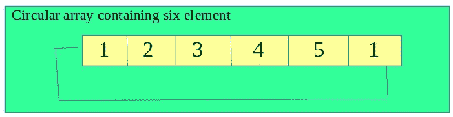
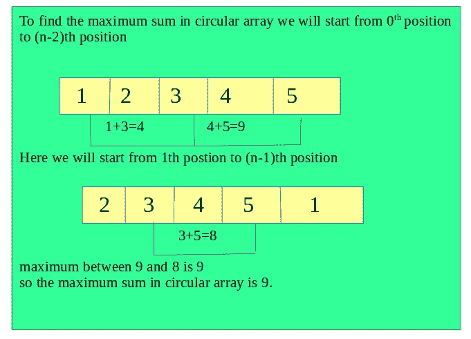

# 圆形数组中没有两个元素相邻的最大和

> 原文:[https://www . geeksforgeeks . org/最大循环和数组-这样-没有两个元素是相邻的/](https://www.geeksforgeeks.org/maximum-sum-in-circular-array-such-that-no-two-elements-are-adjacent/)

给定一个包含正整数值的循环数组。任务是找到一个子序列的最大和，约束是序列中没有 2 个数字在数组中应该是相邻的。
**例:**

```
Input: circular arr = {1, 2, 3, 1}
Output : 4
subsequence will be(1, 3), hence 1 + 3 = 4 

Input: circular arr = {1, 2, 3, 4, 5, 1}
Output: 9
subsequence will be(1, 3, 5), hence 1 + 3 + 5 = 9 
```

**接近**使用 DP 可以解决问题。一个方法已经在[这个](https://www.geeksforgeeks.org/maximum-sum-such-that-no-two-elements-are-adjacent/)帖子里讨论过了，但是它对于一个数组来说。我们可以将圆形子阵列 a 处理为两个阵列，一个从(第 0 到第 n-2)索引，另一个从(第 1 到第 n-1)索引，并使用之前的[帖子](https://www.geeksforgeeks.org/maximum-sum-such-that-no-two-elements-are-adjacent/)中使用的方法。两者返回的最大和将是答案。





下面是上述方法的实现。

## C++

```
// CPP program to find maximum sum in a circular array
// such that no elements are adjacent in the sum.
#include <bits/stdc++.h>
using namespace std;

// Function to calculate the sum
// from 0th position to(n-2)th position
int maxSum1(int arr[], int n)
{
    int dp[n];
    int maxi = 0;

    for (int i = 0; i < n - 1; i++) {

        // copy the element of original array to dp[]
        dp[i] = arr[i];

        // find the maximum element in the array
        if (maxi < arr[i])
            maxi = arr[i];
    }

    // start from 2nd to n-1th pos
    for (int i = 2; i < n - 1; i++) {

        // traverse for all pairs
        // bottom-up approach
        for (int j = 0; j < i - 1; j++) {

            // dp-condition
            if (dp[i] < dp[j] + arr[i]) {
                dp[i] = dp[j] + arr[i];

                // find maximum sum
                if (maxi < dp[i])
                    maxi = dp[i];
            }
        }
    }

    // return the maximum
    return maxi;
}

// Function to find the maximum sum
// from 1st position to n-1-th position
int maxSum2(int arr[], int n)
{
    int dp[n];
    int maxi = 0;

    for (int i = 1; i < n; i++) {
        dp[i] = arr[i];

        if (maxi < arr[i])
            maxi = arr[i];
    }

    // Traverse from third to n-th pos
    for (int i = 3; i < n; i++) {

        // bottom-up approach
        for (int j = 1; j < i - 1; j++) {

            // dp condition
            if (dp[i] < arr[i] + dp[j]) {
                dp[i] = arr[i] + dp[j];

                // find max sum
                if (maxi < dp[i])
                    maxi = dp[i];
            }
        }
    }

    // return max
    return maxi;
}

int findMaxSum(int arr[], int n)
{
   return max(maxSum1(arr, n), maxSum2(arr, n));
}

// Driver Code
int main()
{
    int arr[] = { 1, 2, 3, 1 };
    int n = sizeof(arr)/sizeof(arr[0]);
    cout << findMaxSum(arr, n);
    return 0;
}
```

## Java 语言(一种计算机语言，尤用于创建网站)

```
// Java  program to find maximum sum in a circular array
// such that no elements are adjacent in the sum.

import java.io.*;

class GFG {

// Function to calculate the sum
// from 0th position to(n-2)th position
static int maxSum1(int arr[], int n)
{
    int dp[]=new int[n];
    int maxi = 0;

    for (int i = 0; i < n - 1; i++) {

        // copy the element of original array to dp[]
        dp[i] = arr[i];

        // find the maximum element in the array
        if (maxi < arr[i])
            maxi = arr[i];
    }

    // start from 2nd to n-1th pos
    for (int i = 2; i < n - 1; i++) {

        // traverse for all pairs
        // bottom-up approach
        for (int j = 0; j < i - 1; j++) {

            // dp-condition
            if (dp[i] < dp[j] + arr[i]) {
                dp[i] = dp[j] + arr[i];

                // find maximum sum
                if (maxi < dp[i])
                    maxi = dp[i];
            }
        }
    }

    // return the maximum
    return maxi;
}

// Function to find the maximum sum
// from 1st position to n-1-th position
static int maxSum2(int arr[], int n)
{
    int dp[]=new int[n];
    int maxi = 0;

    for (int i = 1; i < n; i++) {
        dp[i] = arr[i];

        if (maxi < arr[i])
            maxi = arr[i];
    }

    // Traverse from third to n-th pos
    for (int i = 3; i < n; i++) {

        // bottom-up approach
        for (int j = 1; j < i - 1; j++) {

            // dp condition
            if (dp[i] < arr[i] + dp[j]) {
                dp[i] = arr[i] + dp[j];

                // find max sum
                if (maxi < dp[i])
                    maxi = dp[i];
            }
        }
    }

    // return max
    return maxi;
}

static int findMaxSum(int arr[], int n)
{
    int t=Math.max(maxSum1(arr, n), maxSum2(arr, n));
    return  t;
}

// Driver Code
    public static void main (String[] args) {

        int arr[] = { 1, 2, 3, 1 };
        int n = arr.length;
        System.out.println(findMaxSum(arr, n));

    }
}
```

## 蟒蛇 3

```
# Python 3 program to find maximum sum
# in a circular array such that no
# elements are adjacent in the sum.

# Function to calculate the sum from
# 0th position to(n-2)th position
def maxSum1(arr, n):

    dp = [0] * n
    maxi = 0

    for i in range(n - 1):

        # copy the element of original
        # array to dp[]
        dp[i] = arr[i]

        # find the maximum element in the array
        if (maxi < arr[i]):
            maxi = arr[i]

    # start from 2nd to n-1th pos
    for i in range(2, n - 1):

        # traverse for all pairs bottom-up
        # approach
        for j in range(i - 1) :

            # dp-condition
            if (dp[i] < dp[j] + arr[i]):
                dp[i] = dp[j] + arr[i]

                # find maximum sum
                if (maxi < dp[i]):
                    maxi = dp[i]

    # return the maximum
    return maxi

# Function to find the maximum sum
# from 1st position to n-1-th position
def maxSum2(arr, n):

    dp = [0] * n
    maxi = 0

    for i in range(1, n):
        dp[i] = arr[i]

        if (maxi < arr[i]):
            maxi = arr[i]

    # Traverse from third to n-th pos
    for i in range(3, n):

        # bottom-up approach
        for j in range(1, i - 1) :

            # dp condition
            if (dp[i] < arr[i] + dp[j]):
                dp[i] = arr[i] + dp[j]

                # find max sum
                if (maxi < dp[i]):
                    maxi = dp[i]

    # return max
    return maxi

def findMaxSum(arr, n):
    return max(maxSum1(arr, n), maxSum2(arr, n))

# Driver Code
if __name__ == "__main__":

    arr = [ 1, 2, 3, 1 ]
    n = len(arr)
    print(findMaxSum(arr, n))

# This code is contributed by ita_c
```

## C#

```
// C# program to find maximum sum
// in a circular array such that
// no elements are adjacent in the sum.
using System;

class GFG
{
// Function to calculate the sum
// from 0th position to(n-2)th position
static int maxSum1(int []arr, int n)
{
    int []dp = new int[n];
    int maxi = 0;

    for (int i = 0; i < n - 1; i++)
    {

        // copy the element of original
        // array to dp[]
        dp[i] = arr[i];

        // find the maximum element
        // in the array
        if (maxi < arr[i])
            maxi = arr[i];
    }

    // start from 2nd to n-1th pos
    for (int i = 2; i < n - 1; i++)
    {

        // traverse for all pairs
        // bottom-up approach
        for (int j = 0; j < i - 1; j++)
        {

            // dp-condition
            if (dp[i] < dp[j] + arr[i])
            {
                dp[i] = dp[j] + arr[i];

                // find maximum sum
                if (maxi < dp[i])
                    maxi = dp[i];
            }
        }
    }

    // return the maximum
    return maxi;
}

// Function to find the maximum sum
// from 1st position to n-1-th position
static int maxSum2(int []arr, int n)
{
    int []dp = new int[n];
    int maxi = 0;

    for (int i = 1; i < n; i++)
    {
        dp[i] = arr[i];

        if (maxi < arr[i])
            maxi = arr[i];
    }

    // Traverse from third to n-th pos
    for (int i = 3; i < n; i++)
    {

        // bottom-up approach
        for (int j = 1; j < i - 1; j++)
        {

            // dp condition
            if (dp[i] < arr[i] + dp[j])
            {
                dp[i] = arr[i] + dp[j];

                // find max sum
                if (maxi < dp[i])
                    maxi = dp[i];
            }
        }
    }

    // return max
    return maxi;
}

static int findMaxSum(int []arr, int n)
{
    int t = Math.Max(maxSum1(arr, n),
                     maxSum2(arr, n));
    return t;
}

// Driver Code
static public void Main ()
{
    int []arr = { 1, 2, 3, 1 };
    int n = arr.Length;
    Console.WriteLine(findMaxSum(arr, n));
}
}

// This code is contributed
// by Sach_Code
```

## 服务器端编程语言（Professional Hypertext Preprocessor 的缩写）

```
<?php
// PHP program to find maximum sum in
// a circular array such that no
// elements are adjacent in the sum.
// Function to calculate the sum
// from 0th position to(n-2)th position

function maxSum1($arr, $n)
{
    $dp[$n] = array();
    $maxi = 0;

    for ($i = 0; $i < $n - 1; $i++)
    {

        // copy the element of original
        // array to dp[]
        $dp[$i] = $arr[$i];

        // find the maximum element in the array
        if ($maxi < $arr[$i])
            $maxi = $arr[$i];
    }

    // start from 2nd to n-1th pos
    for ($i = 2; $i < $n - 1; $i++)
    {

        // traverse for all pairs
        // bottom-up approach
        for ( $j = 0; $j < $i - 1; $j++)
        {

            // dp-condition
            if ($dp[$i] < $dp[$j] + $arr[$i])
            {
                $dp[$i] = $dp[$j] + $arr[$i];

                // find maximum sum
                if ($maxi < $dp[$i])
                    $maxi = $dp[$i];
            }
        }
    }

    // return the maximum
    return $maxi;
}

// Function to find the maximum sum
// from 1st position to n-1-th position
function maxSum2($arr, $n)
{
    $dp[$n] = array();
    $maxi = 0;

    for ($i = 1; $i < $n; $i++)
    {
        $dp[$i] = $arr[$i];

        if ($maxi < $arr[$i])
            $maxi = $arr[$i];
    }

    // Traverse from third to n-th pos
    for ($i = 3; $i < $n; $i++)
    {

        // bottom-up approach
        for ($j = 1; $j < $i - 1; $j++)
        {

            // dp condition
            if ($dp[$i] < $arr[$i] + $dp[$j])
            {
                $dp[$i] = $arr[$i] + $dp[$j];

                // find max sum
                if ($maxi < $dp[$i])
                    $maxi = $dp[$i];
            }
        }
    }

    // return max
    return $maxi;
}

function findMaxSum($arr, $n)
{
    return max(maxSum1($arr, $n),
               maxSum2($arr, $n));
}

// Driver Code
$arr = array(1, 2, 3, 1 );
$n = sizeof($arr);
echo findMaxSum($arr, $n);

//  This code is contributed
// by Sach_Code
?>
```

## java 描述语言

```
<script>

// JavaScript program to find maximum sum
// in a circular array such that
// no elements are adjacent in the sum.

// Function to calculate the sum
// from 0th position to(n-2)th position
function maxSum1(arr, n)
{
    let dp = new Array(n);
    let maxi = 0;

    for (i = 0; i < n - 1; i++)
    {

        // copy the element of original
        // array to dp[]
        dp[i] = arr[i];

        // find the maximum element
        // in the array
        if (maxi < arr[i])
            maxi = arr[i];
    }

    // start from 2nd to n-1th pos
    for (i = 2; i < n - 1; i++)
    {

        // traverse for all pairs
        // bottom-up approach
        for (j = 0; j < i - 1; j++)
        {

            // dp-condition
            if (dp[i] < dp[j] + arr[i])
            {
                dp[i] = dp[j] + arr[i];

                // find maximum sum
                if (maxi < dp[i])
                    maxi = dp[i];
            }
        }
    }

    // return the maximum
    return maxi;
}

// Function to find the maximum sum
// from 1st position to n-1-th position
function maxSum2(arr, n)
{
    let dp = new Array(n);
    let maxi = 0;

    for (i = 1; i < n; i++)
    {
        dp[i] = arr[i];

        if (maxi < arr[i])
            maxi = arr[i];
    }

    // Traverse from third to n-th pos
    for (i = 3; i < n; i++)
    {

        // bottom-up approach
        for (j = 1; j < i - 1; j++)
        {

            // dp condition
            if (dp[i] < arr[i] + dp[j])
            {
                dp[i] = arr[i] + dp[j];

                // find max sum
                if (maxi < dp[i])
                    maxi = dp[i];
            }
        }
    }

    // return max
    return maxi;
}

function findMaxSum(arr, n)
{
    let t = Math.max(maxSum1(arr, n),
                     maxSum2(arr, n));
    return t;
}

// Driver Code

let arr = [1, 2, 3, 1 ];
let n = arr.length;
document.write(findMaxSum(arr, n));

// This code is contributed by mohit kumar 29.
</script>
```

**Output:** 

```
4
```

**时间复杂度:** O(N^2)