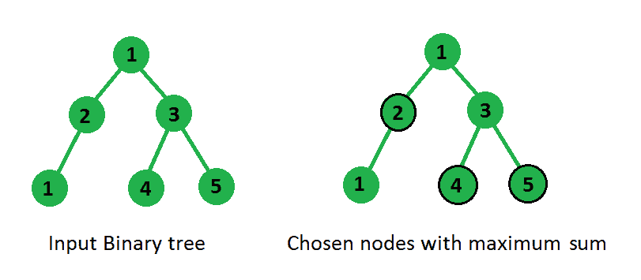

# 二叉树中没有两个相邻节点的最大和

> 原文:[https://www . geesforgeks . org/maximum-sum-nodes-二叉树-no-two-neighbor/](https://www.geeksforgeeks.org/maximum-sum-nodes-binary-tree-no-two-adjacent/)

给定一个与每个节点相关联的值的二叉树，我们需要选择这些节点的一个子集，使得所选节点的和在子集内没有两个所选节点应该直接连接的约束下是最大的，也就是说，如果我们在和中取了一个节点，那么我们不能考虑它的任何子节点，反之亦然。

**示例:**



```
In above binary tree chosen nodes are encircled 
and are not directly connected and their sum is
maximum possible.
```

[<u>推荐:请先在</u> **<u>【练习】</u>** <u>上解决，然后再继续解。</u>](https://practice.geeksforgeeks.org/problems/maximum-sum-of-non-adjacent-nodes/1/)

**方法 1**
我们可以通过考虑这样一个事实来解决这个问题，即节点及其子节点不能同时处于和中，因此当我们将一个节点纳入我们的和中时，我们将递归调用它的子节点，或者如果我们不调用这个节点，那么我们将调用它的所有子节点，最后我们将从两个结果中选择最大值。
很容易看出，上述方法可以导致多次求解同一个子问题，例如在上图中，当节点 1 的值被选择时，节点 1 调用节点 4 和 5，当其值未被选择时，节点 3 也调用它们，因此这些节点被处理了不止一次。通过记住所有节点的结果，我们可以不止一次地停止求解这些节点。
在下面的代码中，映射用于存储结果，该结果存储了以映射中的一个节点为根的完整子树的结果，因此如果再次调用该结果，则不会再次计算该值，而是直接返回来自该映射的存储值。

为了更好的理解，请参见下面的代码。

## C++

```
// C++ program to find maximum sum from a subset of
// nodes of binary tree
#include <bits/stdc++.h>
using namespace std;

/* A binary tree node structure */
struct node
{
    int data;
    struct node *left, *right;
};

/* Utility function to create a new Binary Tree node */
struct node* newNode(int data)
{
    struct node *temp = new struct node;
    temp->data = data;
    temp->left = temp->right = NULL;
    return temp;
}

//  Declaration of methods
int sumOfGrandChildren(node* node);
int getMaxSum(node* node);
int getMaxSumUtil(node* node, map<struct node*, int>& mp);

// method returns maximum sum possible from subtrees rooted
// at grandChildrens of node 'node'
int sumOfGrandChildren(node* node, map<struct node*, int>& mp)
{
    int sum = 0;

    //  call for children of left child only if it is not NULL
    if (node->left)
        sum += getMaxSumUtil(node->left->left, mp) +
               getMaxSumUtil(node->left->right, mp);

    //  call for children of right child only if it is not NULL
    if (node->right)
        sum += getMaxSumUtil(node->right->left, mp) +
               getMaxSumUtil(node->right->right, mp);

    return sum;
}

//  Utility method to return maximum sum rooted at node 'node'
int getMaxSumUtil(node* node, map<struct node*, int>& mp)
{
    if (node == NULL)
        return 0;

    // If node is already processed then return calculated
    // value from map
    if (mp.find(node) != mp.end())
        return mp[node];

    //  take current node value and call for all grand children
    int incl = node->data + sumOfGrandChildren(node, mp);

    //  don't take current node value and call for all children
    int excl = getMaxSumUtil(node->left, mp) +
               getMaxSumUtil(node->right, mp);

    //  choose maximum from both above calls and store that in map
    mp[node] = max(incl, excl);

    return mp[node];
}

// Returns maximum sum from subset of nodes
// of binary tree under given constraints
int getMaxSum(node* node)
{
    if (node == NULL)
        return 0;
    map<struct node*, int> mp;
    return getMaxSumUtil(node, mp);
}

//  Driver code to test above methods
int main()
{
    node* root = newNode(1);
    root->left = newNode(2);
    root->right = newNode(3);
    root->right->left = newNode(4);
    root->right->right = newNode(5);
    root->left->left = newNode(1);

    cout << getMaxSum(root) << endl;
    return 0;
}
```

## Java 语言(一种计算机语言，尤用于创建网站)

```
// Java program to find maximum sum from a subset of 
// nodes of binary tree 
import java.util.HashMap;
public class FindSumOfNotAdjacentNodes {

    // method returns maximum sum possible from subtrees rooted 
    // at grandChildrens of node 'node' 
    public static int sumOfGrandChildren(Node node, HashMap<Node,Integer> mp) 
    { 
        int sum = 0; 
        //  call for children of left child only if it is not NULL 
        if (node.left!=null) 
            sum += getMaxSumUtil(node.left.left, mp) + 
                   getMaxSumUtil(node.left.right, mp); 

        //  call for children of right child only if it is not NULL 
        if (node.right!=null) 
            sum += getMaxSumUtil(node.right.left, mp) + 
                   getMaxSumUtil(node.right.right, mp); 
        return sum; 
    }

    //  Utility method to return maximum sum rooted at node 'node' 
    public static int getMaxSumUtil(Node node, HashMap<Node,Integer> mp) 
    { 
        if (node == null) 
            return 0; 

        // If node is already processed then return calculated 
        // value from map 
        if(mp.containsKey(node))
            return mp.get(node);

        //  take current node value and call for all grand children 
        int incl = node.data + sumOfGrandChildren(node, mp); 

        //  don't take current node value and call for all children 
        int excl = getMaxSumUtil(node.left, mp) + 
                   getMaxSumUtil(node.right, mp); 

        //  choose maximum from both above calls and store that in map 
        mp.put(node,Math.max(incl, excl)); 

        return mp.get(node); 
    } 

    // Returns maximum sum from subset of nodes 
    // of binary tree under given constraints 
    public static int getMaxSum(Node node) 
    { 
        if (node == null) 
            return 0; 
        HashMap<Node,Integer> mp=new HashMap<>();
        return getMaxSumUtil(node, mp); 
    }

    public static void main(String args[]) 
    {
        Node root = new Node(1); 
        root.left = new Node(2); 
        root.right = new Node(3); 
        root.right.left = new Node(4); 
        root.right.right = new Node(5); 
        root.left.left = new Node(1);     
        System.out.print(getMaxSum(root));
    }
}

/* A binary tree node structure */
class Node 
{ 
    int data; 
    Node left, right; 
    Node(int data)
    {
        this.data=data;
        left=right=null;
    }
}; 
//This code is contributed by Gaurav Tiwari
```

## 蟒蛇 3

```
# Python3 program to find 
# maximum sum from a subset 
# of nodes of binary tree

# A binary tree node structure 
class Node:

    def __init__(self, data):

        self.data = data
        self.left = None
        self.right = None

# Utility function to create 
# a new Binary Tree node 
def newNode(data):

    temp = Node(data)
    return temp;

# method returns maximum sum 
# possible from subtrees rooted
# at grandChildrens of node 'node'
def sumOfGrandChildren(node, mp):

    sum = 0;

    # call for children of left 
    # child only if it is not NULL
    if (node.left):
        sum += (getMaxSumUtil(node.left.left, mp) +
                getMaxSumUtil(node.left.right, mp));

    # call for children of right 
    # child only if it is not NULL
    if (node.right):
        sum += (getMaxSumUtil(node.right.left, mp) +
                getMaxSumUtil(node.right.right, mp));

    return sum;

# Utility method to return 
# maximum sum rooted at node 
# 'node'
def getMaxSumUtil(node, mp):

    if (node == None):
        return 0;

    # If node is already processed 
    # then return calculated
    # value from map
    if node in mp:
        return mp[node];

    # take current node value 
    # and call for all grand children
    incl = (node.data +
            sumOfGrandChildren(node, mp));

    # don't take current node 
    # value and call for all children
    excl = (getMaxSumUtil(node.left, mp) +
            getMaxSumUtil(node.right, mp));

    # choose maximum from both 
    # above calls and store that
    # in map
    mp[node] = max(incl, excl);

    return mp[node];

# Returns maximum sum from 
# subset of nodes of binary 
# tree under given constraints
def getMaxSum(node):

    if (node == None):
        return 0;

    mp = dict()
    return getMaxSumUtil(node, mp); 

# Driver code
if __name__=="__main__":

    root = newNode(1);
    root.left = newNode(2);
    root.right = newNode(3);
    root.right.left = newNode(4);
    root.right.right = newNode(5);
    root.left.left = newNode(1);

    print(getMaxSum(root))

# This code is contributed by Rutvik_56
```

## C#

```
// C# program to find maximum sum from a subset of 
// nodes of binary tree
using System;
using System.Collections.Generic; 

public class FindSumOfNotAdjacentNodes
{

    // method returns maximum sum
    // possible from subtrees rooted 
    // at grandChildrens of node 'node' 
    public static int sumOfGrandChildren(Node node, 
                            Dictionary<Node,int> mp) 
    { 
        int sum = 0; 

        // call for children of left 
        // child only if it is not NULL 
        if (node.left != null) 
            sum += getMaxSumUtil(node.left.left, mp) + 
                getMaxSumUtil(node.left.right, mp); 

        // call for children of right 
        // child only if it is not NULL 
        if (node.right != null) 
            sum += getMaxSumUtil(node.right.left, mp) + 
                getMaxSumUtil(node.right.right, mp); 
        return sum; 
    }

    // Utility method to return maximum
    // sum rooted at node 'node' 
    public static int getMaxSumUtil(Node node,
                        Dictionary<Node,int> mp) 
    { 
        if (node == null) 
            return 0; 

        // If node is already processed then 
        // return calculated value from map 
        if(mp.ContainsKey(node))
            return mp[node];

        // take current node value and 
        // call for all grand children 
        int incl = node.data + sumOfGrandChildren(node, mp); 

        // don't take current node value and 
        // call for all children 
        int excl = getMaxSumUtil(node.left, mp) + 
                getMaxSumUtil(node.right, mp); 

        // choose maximum from both above 
        // calls and store that in map 
        mp.Add(node,Math.Max(incl, excl)); 

        return mp[node]; 
    } 

    // Returns maximum sum from subset of nodes 
    // of binary tree under given constraints 
    public static int getMaxSum(Node node) 
    { 
        if (node == null) 
            return 0; 
        Dictionary<Node,int> mp=new Dictionary<Node,int>();
        return getMaxSumUtil(node, mp); 
    }

    // Driver code
    public static void Main(String []args) 
    {
        Node root = new Node(1); 
        root.left = new Node(2); 
        root.right = new Node(3); 
        root.right.left = new Node(4); 
        root.right.right = new Node(5); 
        root.left.left = new Node(1);     
        Console.Write(getMaxSum(root));
    }
}

/* A binary tree node structure */
public class Node 
{ 
    public int data; 
    public Node left, right; 
    public Node(int data)
    {
        this.data=data;
        left=right=null;
    }
}; 

// This code has been contributed by 29AjayKumar
```

## java 描述语言

```
<script>

// Javascript program to find maximum
// sum from a subset of nodes of binary tree
class Node
{
    constructor(data) 
    {
        this.left = null;
        this.right = null;
        this.data = data;
    }
}

// Method returns maximum sum possible 
// from subtrees rooted at grandChildrens
// of node 'node'
function sumOfGrandChildren(node, mp)
{
    let sum = 0;

    // Call for children of left child 
    // only if it is not NULL
    if (node.left!=null)
        sum += getMaxSumUtil(node.left.left, mp) +
               getMaxSumUtil(node.left.right, mp);

    // Call for children of right child
    // only if it is not NULL
    if (node.right!=null)
        sum += getMaxSumUtil(node.right.left, mp) +
               getMaxSumUtil(node.right.right, mp);
    return sum;
}

// Utility method to return maximum 
// sum rooted at node 'node'
function getMaxSumUtil(node, mp)
{
    if (node == null)
        return 0;

    // If node is already processed then return
    // calculated value from map
    if (mp.has(node))
        return mp.get(node);

    // Take current node value and call for
    // all grand children
    let incl = node.data + sumOfGrandChildren(node, mp);

    // Don't take current node value and call 
    // for all children
    let excl = getMaxSumUtil(node.left, mp) +
               getMaxSumUtil(node.right, mp);

    // Choose maximum from both above 
    // calls and store that in map
    mp.set(node,Math.max(incl, excl));

    return mp.get(node);
}

// Returns maximum sum from subset of nodes
// of binary tree under given constraints
function getMaxSum(node)
{
    if (node == null)
        return 0;

    let mp = new Map();
    return getMaxSumUtil(node, mp);
}

// Driver code
let root = new Node(1);
root.left = new Node(2);
root.right = new Node(3);
root.right.left = new Node(4);
root.right.right = new Node(5);
root.left.left = new Node(1);    

document.write(getMaxSum(root));

// This code is contributed by divyeshrabadiya07

</script>
```

**Output**

```
11
```

本文由乌卡什·特里维迪供稿。

**方法 2(使用对)**
为二叉树中的每个节点返回一个对，使得当包含节点的数据时，该对中的第一个指示最大和，而当不包含特定节点的数据时，第二个指示最大和。

## C++

```
// C++ program to find maximum sum in Binary Tree
// such that no two nodes are adjacent.
#include<iostream>
using namespace std;

class Node
{
public:
    int data;
    Node* left, *right;
    Node(int data)
    {
        this->data = data;
        left = NULL;
        right = NULL;
    }
};

pair<int, int> maxSumHelper(Node *root)
{
    if (root==NULL)
    {
        pair<int, int> sum(0, 0);
        return sum;
    }
    pair<int, int> sum1 = maxSumHelper(root->left);
    pair<int, int> sum2 = maxSumHelper(root->right);
    pair<int, int> sum;

    // This node is included (Left and right children
    // are not included)
    sum.first = sum1.second + sum2.second + root->data;

    // This node is excluded (Either left or right
    // child is included)
    sum.second = max(sum1.first, sum1.second) +
                 max(sum2.first, sum2.second);

    return sum;
}

int maxSum(Node *root)
{
    pair<int, int> res = maxSumHelper(root);
    return max(res.first, res.second);
}

// Driver code
int main()
{
    Node *root= new Node(10);
    root->left= new Node(1);
    root->left->left= new Node(2);
    root->left->left->left= new Node(1);
    root->left->right= new Node(3);
    root->left->right->left= new Node(4);
    root->left->right->right= new Node(5);
    cout << maxSum(root);
    return 0;
}
```

## Java 语言(一种计算机语言，尤用于创建网站)

```
// Java program to find maximum sum in Binary Tree 
// such that no two nodes are adjacent. 
public class FindSumOfNotAdjacentNodes {

    public static Pair maxSumHelper(Node root) 
    { 
        if (root==null) 
        { 
            Pair sum=new Pair(0, 0); 
            return sum; 
        } 
        Pair sum1 = maxSumHelper(root.left); 
        Pair sum2 = maxSumHelper(root.right); 
        Pair sum=new Pair(0,0); 

        // This node is included (Left and right children 
        // are not included) 
        sum.first = sum1.second + sum2.second + root.data; 

        // This node is excluded (Either left or right 
        // child is included) 
        sum.second = Math.max(sum1.first, sum1.second) + 
                     Math.max(sum2.first, sum2.second); 

        return sum; 
    } 

    // Returns maximum sum from subset of nodes 
    // of binary tree under given constraints 
    public static int maxSum(Node root)
    {
        Pair res=maxSumHelper(root); 
        return Math.max(res.first, res.second);
    }

    public static void main(String args[]) {
        Node root= new Node(10); 
        root.left= new Node(1); 
        root.left.left= new Node(2); 
        root.left.left.left= new Node(1); 
        root.left.right= new Node(3); 
        root.left.right.left= new Node(4); 
        root.left.right.right= new Node(5); 
        System.out.print(maxSum(root)); 
    }
}

/* A binary tree node structure */
class Node 
{ 
    int data; 
    Node left, right; 
    Node(int data)
    {
        this.data=data;
        left=right=null;
    }
}; 

/* Pair class */
class Pair
{
    int first,second;
    Pair(int first,int second)
    {
        this.first=first;
        this.second=second;
    }
}
//This code is contributed by Gaurav Tiwari
```

## 蟒蛇 3

```
# Python3 program to find maximum sum in Binary 
# Tree such that no two nodes are adjacent.

# Binary Tree Node 

""" utility that allocates a newNode 
with the given key """
class newNode: 

    # Construct to create a newNode 
    def __init__(self, key): 
        self.data = key
        self.left = None
        self.right = None

def maxSumHelper(root) :

    if (root == None): 

        sum = [0, 0] 
        return sum

    sum1 = maxSumHelper(root.left) 
    sum2 = maxSumHelper(root.right) 
    sum = [0, 0]

    # This node is included (Left and right 
    # children are not included) 
    sum[0] = sum1[1] + sum2[1] + root.data 

    # This node is excluded (Either left or 
    # right child is included) 
    sum[1] = (max(sum1[0], sum1[1]) + 
              max(sum2[0], sum2[1])) 

    return sum

def maxSum(root) :

    res = maxSumHelper(root) 
    return max(res[0], res[1]) 

# Driver Code 
if __name__ == '__main__':
    root = newNode(10) 
    root.left = newNode(1) 
    root.left.left = newNode(2) 
    root.left.left.left = newNode(1) 
    root.left.right = newNode(3) 
    root.left.right.left = newNode(4) 
    root.left.right.right = newNode(5)
    print(maxSum(root))

# This code is contributed by
# Shubham Singh(SHUBHAMSINGH10)
```

## C#

```
// C# program to find maximum sum in Binary Tree 
// such that no two nodes are adjacent. 
using System;

public class FindSumOfNotAdjacentNodes 
{ 

    public static Pair maxSumHelper(Node root) 
    { 
        Pair sum;
        if (root == null) 
        { 
            sum=new Pair(0, 0); 
            return sum; 
        } 
        Pair sum1 = maxSumHelper(root.left); 
        Pair sum2 = maxSumHelper(root.right); 
        Pair sum3 = new Pair(0,0); 

        // This node is included (Left and 
        // right children are not included) 
        sum3.first = sum1.second + sum2.second + root.data; 

        // This node is excluded (Either left 
        // or right child is included) 
        sum3.second = Math.Max(sum1.first, sum1.second) + 
                    Math.Max(sum2.first, sum2.second); 

        return sum3; 
    } 

    // Returns maximum sum from subset of nodes 
    // of binary tree under given constraints 
    public static int maxSum(Node root) 
    { 
        Pair res=maxSumHelper(root); 
        return Math.Max(res.first, res.second); 
    } 

    // Driver code
    public static void Main() 
    { 
        Node root = new Node(10); 
        root.left = new Node(1); 
        root.left.left = new Node(2); 
        root.left.left.left = new Node(1); 
        root.left.right = new Node(3); 
        root.left.right.left = new Node(4); 
        root.left.right.right = new Node(5); 
        Console.Write(maxSum(root)); 
    } 
} 

/* A binary tree node structure */
public class Node 
{ 
    public int data; 
    public Node left, right; 
    public Node(int data) 
    { 
        this.data = data; 
        left = right = null; 
    } 
}; 

/* Pair class */
public class Pair 
{ 
    public int first,second; 
    public Pair(int first,int second) 
    { 
        this.first = first; 
        this.second = second; 
    } 
} 

/* This code is contributed PrinciRaj1992 */
```

## java 描述语言

```
<script>

// JavaScript program to find maximum sum in Binary Tree 
// such that no two nodes are adjacent. 

/* A binary tree node structure */
class Node 
{ 
    constructor(data)
    {
        this.data = data;
        this.left = null;
        this.right = null;
    }
}; 

/* Pair class */
class Pair 
{ 
    constructor(first, second)
    {
        this.first = first;
        this.second = second;
    }
} 

function maxSumHelper(root) 
{ 
    var sum;
    if (root == null) 
    { 
        sum=new Pair(0, 0); 
        return sum; 
    } 
    var sum1 = maxSumHelper(root.left); 
    var sum2 = maxSumHelper(root.right); 
    var sum3 = new Pair(0,0); 

    // This node is included (Left and 
    // right children are not included) 
    sum3.first = sum1.second + sum2.second + root.data; 

    // This node is excluded (Either left 
    // or right child is included) 
    sum3.second = Math.max(sum1.first, sum1.second) + 
                Math.max(sum2.first, sum2.second); 

    return sum3; 
} 
// Returns maximum sum from subset of nodes 
// of binary tree under given constraints 
function maxSum(root) 
{ 
    var res=maxSumHelper(root); 
    return Math.max(res.first, res.second); 
} 
// Driver code
var root = new Node(10); 
root.left = new Node(1); 
root.left.left = new Node(2); 
root.left.left.left = new Node(1); 
root.left.right = new Node(3); 
root.left.right.left = new Node(4); 
root.left.right.right = new Node(5); 
document.write(maxSum(root)); 

</script>
```

**Output**

```
21
```

**时间复杂度** : O(n)
感谢 Surbhi Rastogi 提出这个方法。

**方法 3(** 使用动态规划 **)**

通过在 dp 数组或无序映射中包含一个节点或排除该节点来存储最大和。如果包含节点，递归调用节点的子代；如果排除节点，递归调用邻居。

## C++

```
// C++ program to find maximum sum in Binary Tree
// such that no two nodes are adjacent.
#include<iostream>
#include<bits/stdc++.h>
using namespace std;

class Node
{
public:
    int data;
    Node* left, *right;
    Node(int data)
    {
        this->data = data;
        left = NULL;
        right = NULL;
    }
};
//declare map /dp array as global 
unordered_map<Node *, int> umap;
int maxSum(Node * root)
{
    //base case
    if(!root)return 0; 

    //if the max sum from the  node is already in map,return the value
    if(umap[root])return umap[root];

    //if the current node(root) is included in result
    //then find maximum sum
    int inc    =root->data;

    //if left of node exsists, addd their grandchildren
    if(root->left)
    {
        inc+=maxSum(root->left->left) + maxSum(root->left->right);
    }
    //if right of node exsist,add their grandchildren
    if(root->right)
    {
        inc+=maxSum(root->right->left)+maxSum(root->right->right);
    }

    //if the current node(root) is excluded, find the maximum sum
    int ex=maxSum(root->left)+maxSum(root->right);

    //store the maximum of including & excluding the node in map
    umap[root]=max(inc,ex);

}

// Driver code
int main()
{
    Node *root= new Node(10);
    root->left= new Node(1);
    root->left->left= new Node(2);
    root->left->left->left= new Node(1);
    root->left->right= new Node(3);
    root->left->right->left= new Node(4);
    root->left->right->right= new Node(5);
    cout << maxSum(root);
    return 0;
}
```

**Output**

```
21
```

**时间复杂度:**O(n)
T3】辅助 T5】空间: O(n)

本文由 Harsh 供稿。<[https://auth . geekesforgeks . org/user/harshchandekar 10/profile](https://auth.geeksforgeeks.org/user/harshchandekar10/profile)>

如果你喜欢 GeeksforGeeks 并想投稿，你也可以用[write.geeksforgeeks.org](http://www.write.geeksforgeeks.org)写一篇文章或者把你的文章邮寄到 review-team@geeksforgeeks.org。看到你的文章出现在极客博客主页上，帮助其他极客。

如果你发现任何不正确的地方，或者你想分享更多关于上面讨论的话题的信息，请写评论。

**方法 4(简单树遍历)**

对于每个节点，我们发现以下内容:

1.  包括该节点在内的非相邻节点的最大和。
2.  不包括该节点的不相邻节点的最大和。

现在，我们返回递归调用中的两个值。先前计算的节点的父节点获得子节点的最大和(包括&不包括)。因此，父级现在计算最大和(包括&不包括)并返回。这个过程一直持续到根节点。最后，我们返回 max(包括根的和，不包括根的和)。

**时间复杂度:O(n)**

**空间复杂度:O(1)**

## 蟒蛇 3

```
class Node:
    def __init__(self, val):
        self.data = val
        self.left = None
        self.right = None

class Solution:

    def max_sum(self, root):
        if not root:
            return 0, 0

        no_root_l, root_l = self.max_sum(root.left)
        no_root_r, root_r = self.max_sum(root.right)

        root_sum_max = max(root.data, root.data+no_root_l,
                           root.data+no_root_r, root.data+no_root_r+no_root_l)
        no_root_sum_max = max(root_l, root_r, root_l + root_r, no_root_l+no_root_r, 
                              root_l + no_root_r, root_r + no_root_l)

        return no_root_sum_max, root_sum_max

    def getMaxSum(self, root):
        return max(self.max_sum(root))
```

这种方法是由那个孔达·阿迪蒂亚贡献的。