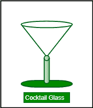

# 2D 矩阵中鸡尾酒杯的最大总和

> 原文:[https://www . geesforgeks . org/最大 2d 矩阵鸡尾酒杯总和/](https://www.geeksforgeeks.org/maximum-sum-of-cocktail-glass-in-a-2d-matrix/)

给定一个 2D 矩阵 **mat[][]** ，任务是找到鸡尾酒杯的最大和。

```
A Cocktail glass is made of 6 cells in the following form:
X   X
  X
X X X 
```



**例:**

```
Input: mat[][] = {
{1, 0, 4, 0, 0},
{0, 3, 0, 0, 0},
{1, 1, 1, 0, 0},
{0, 0, 0, 0, 0},
{0, 0, 0, 0, 0}}
Output: 11
Below is the cocktail glass with
maximum sum:
1   4 
  3
1 1 1

Input: mat[][] = {
{0, 3, 0, 6, 0},
{0, 1, 1, 0, 0},
{1, 1, 1, 0, 0},
{0, 0, 2, 0, 1},
{0, 2, 0, 1, 3}}
Output: 12
```

**做法:**从鸡尾酒杯的定义可以明显看出，行数和列数必须大于等于 3。如果我们计算一个矩阵中鸡尾酒杯的总数，我们可以说这个计数等于鸡尾酒杯中可能的左上角细胞的计数。鸡尾酒杯左上角的细胞数量等于(R–2)*(C–2)。因此，在一个矩阵中鸡尾酒杯的总数是(R–2)*(C–2)

```
For mat[][] = {
{0, 3, 0, 6, 0},
{0, 1, 1, 0, 0},
{1, 1, 1, 0, 0},
{0, 0, 2, 0, 1},
{0, 2, 0, 1, 3}}
Possible cocktail glasses are:
0   0  3   6   0   0
  1      1       0 
1 1 1  1 1 0   1 0 0 

0   1  1   0  1   0
  1      1      0  
0 0 2  0 2 0  2 0 1 

1   1  1   0  1   0
  0      2      0
0 2 0  2 0 1  0 1 3
```

我们逐一考虑鸡尾酒杯的所有左上角单元格。对于每个细胞，我们计算它形成的鸡尾酒杯的总和。最后，我们返回最大和。
以下是上述方法的实现:

## C++

```
// C++ implementation of the approach
#include <bits/stdc++.h>
using namespace std;
const int R = 5;
const int C = 5;

// Function to return the maximum sum
// of a cocktail glass
int findMaxCock(int ar[R][C])
{

    // If no cocktail glass is possible
    if (R < 3 || C < 3)
        return -1;

    // Initialize max_sum with the mini
    int max_sum = INT_MIN;

    // Here loop runs (R-2)*(C-2) times considering
    // different top left cells of cocktail glasses
    for (int i = 0; i < R - 2; i++) {
        for (int j = 0; j < C - 2; j++) {

            // Considering mat[i][j] as the top left
            // cell of the cocktail glass
            int sum = (ar[i][j] + ar[i][j + 2])
                      + (ar[i + 1][j + 1])
                      + (ar[i + 2][j] + ar[i + 2][j + 1]
                         + ar[i + 2][j + 2]);

            // Update the max_sum
            max_sum = max(max_sum, sum);
        }
    }
    return max_sum;
}

// Driver code
int main()
{
    int ar[][C] = { { 0, 3, 0, 6, 0 },
                    { 0, 1, 1, 0, 0 },
                    { 1, 1, 1, 0, 0 },
                    { 0, 0, 2, 0, 1 },
                    { 0, 2, 0, 1, 3 } };

    cout << findMaxCock(ar);

    return 0;
}
```

## Java 语言(一种计算机语言，尤用于创建网站)

```
// Java implementation of the approach
class GFG
{

static int R = 5;
static int C = 5;

// Function to return the maximum sum
// of a cocktail glass
static int findMaxCock(int ar[][])
{

    // If no cocktail glass is possible
    if (R < 3 || C < 3)
        return -1;

    // Initialize max_sum with the mini
    int max_sum = Integer.MIN_VALUE;

    // Here loop runs (R-2)*(C-2) times considering
    // different top left cells of cocktail glasses
    for (int i = 0; i < R - 2; i++)
    {
        for (int j = 0; j < C - 2; j++)
        {

            // Considering mat[i][j] as the top left
            // cell of the cocktail glass
            int sum = (ar[i][j] + ar[i][j + 2])
                    + (ar[i + 1][j + 1])
                    + (ar[i + 2][j] + ar[i + 2][j + 1]
                        + ar[i + 2][j + 2]);

            // Update the max_sum
            max_sum = Math.max(max_sum, sum);
        }
    }
    return max_sum;
}

// Driver code
public static void main (String[] args)
{

    int ar[][] = { { 0, 3, 0, 6, 0 },
                    { 0, 1, 1, 0, 0 },
                    { 1, 1, 1, 0, 0 },
                    { 0, 0, 2, 0, 1 },
                    { 0, 2, 0, 1, 3 } };

    System.out.println(findMaxCock(ar));
}
}

// This code is contributed by mits
```

## 蟒蛇 3

```
# Python 3 implementation of the approach
import sys

R = 5
C = 5

# Function to return the maximum sum
# of a cocktail glass
def findMaxCock(ar):

    # If no cocktail glass is possible
    if (R < 3 or C < 3):
        return -1

    # Initialize max_sum with the mini
    max_sum = -sys.maxsize - 1

    # Here loop runs (R-2)*(C-2) times considering
    # different top left cells of cocktail glasses
    for i in range(R - 2):
        for j in range(C - 2):

            # Considering mat[i][j] as the top left
            # cell of the cocktail glass
            sum = ((ar[i][j] + ar[i][j + 2]) +
                   (ar[i + 1][j + 1]) +
                   (ar[i + 2][j] + ar[i + 2][j + 1] +
                    ar[i + 2][j + 2]))

            # Update the max_sum
            max_sum = max(max_sum, sum)

    return max_sum;

# Driver code
if __name__ == '__main__':
    ar = [[0, 3, 0, 6, 0],
          [0, 1, 1, 0, 0],
          [1, 1, 1, 0, 0],
          [0, 0, 2, 0, 1],
          [0, 2, 0, 1, 3]]

    print(findMaxCock(ar))

# This code is contributed by
# Surendra_Gangwar
```

## C#

```
// C# implementation of the approach
using System;

class GFG
{

    static int R = 5;
    static int C = 5;

    // Function to return the maximum sum
    // of a cocktail glass
    static int findMaxCock(int [,]ar)
    {

        // If no cocktail glass is possible
        if (R < 3 || C < 3)
            return -1;

        // Initialize max_sum with the mini
        int max_sum = int.MinValue;

        // Here loop runs (R-2)*(C-2) times considering
        // different top left cells of cocktail glasses
        for (int i = 0; i < R - 2; i++)
        {
            for (int j = 0; j < C - 2; j++)
            {

                // Considering mat[i][j] as the top left
                // cell of the cocktail glass
                int sum = (ar[i,j] + ar[i,j + 2])
                        + (ar[i + 1,j + 1])
                        + (ar[i + 2,j] + ar[i + 2,j + 1]
                            + ar[i + 2,j + 2]);

                // Update the max_sum
                max_sum = Math.Max(max_sum, sum);
            }
        }
        return max_sum;
    }

    // Driver code
    public static void Main ()
    {

        int [,]ar = { { 0, 3, 0, 6, 0 },
                        { 0, 1, 1, 0, 0 },
                        { 1, 1, 1, 0, 0 },
                        { 0, 0, 2, 0, 1 },
                        { 0, 2, 0, 1, 3 } };

        Console.WriteLine(findMaxCock(ar));
    }
}

// This code is contributed by Ryuga
```

## 服务器端编程语言（Professional Hypertext Preprocessor 的缩写）

```
<?PHP
// PHP implementation of the approach
$R = 5;
$C = 5;

// Function to return the maximum sum
// of a cocktail glass
function findMaxCock($ar)
{
    global $R, $C;

    // If no cocktail glass is possible
    if ($R < 3 || $C < 3)
        return -1;

    // Initialize max_sum with the mini
    $max_sum = PHP_INT_MIN;

    // Here loop runs (R-2)*(C-2) times considering
    // different top left cells of cocktail glasses
    for ($i = 0; $i < $R - 2; $i++)
    {
        for ($j = 0; $j < $C - 2; $j++)
        {

            // Considering mat[i][j] as the top left
            // cell of the cocktail glass
            $sum = ($ar[$i][$j] + $ar[$i][$j + 2]) +
                   ($ar[$i + 1][$j + 1]) +
                   ($ar[$i + 2][$j] + $ar[$i + 2][$j + 1] +
                    $ar[$i + 2][$j + 2]);

            // Update the max_sum
            $max_sum = max($max_sum, $sum);
        }
    }
    return $max_sum;
}

// Driver code
$ar = array(array( 0, 3, 0, 6, 0 ),
            array( 0, 1, 1, 0, 0 ),
            array( 1, 1, 1, 0, 0 ),
            array( 0, 0, 2, 0, 1 ),
            array( 0, 2, 0, 1, 3 ));

echo(findMaxCock($ar));

// This code is contributed by Code_Mech
?>
```

## java 描述语言

```
<script>

// Javascript implementation of the approach
var R = 5;
var C = 5;

// Function to return the maximum sum
// of a cocktail glass
function findMaxCock(ar)
{

    // If no cocktail glass is possible
    if (R < 3 || C < 3)
        return -1;

    // Initialize max_sum with the mini
    var max_sum = -1000000000;

    // Here loop runs (R-2)*(C-2) times considering
    // different top left cells of cocktail glasses
    for (var i = 0; i < R - 2; i++) {
        for (var j = 0; j < C - 2; j++) {

            // Considering mat[i][j] as the top left
            // cell of the cocktail glass
            var sum = (ar[i][j] + ar[i][j + 2])
                    + (ar[i + 1][j + 1])
                    + (ar[i + 2][j] + ar[i + 2][j + 1]
                        + ar[i + 2][j + 2]);

            // Update the max_sum
            max_sum = Math.max(max_sum, sum);
        }
    }
    return max_sum;
}

// Driver code
ar = [ [ 0, 3, 0, 6, 0 ],
       [ 0, 1, 1, 0, 0 ],
       [ 1, 1, 1, 0, 0 ],
       [ 0, 0, 2, 0, 1 ],
       [ 0, 2, 0, 1, 3 ] ];

document.write(findMaxCock(ar));

</script>
```

**Output:** 

```
12
```

**时间复杂度:**O(R * C)
T3】辅助空间: O(1)