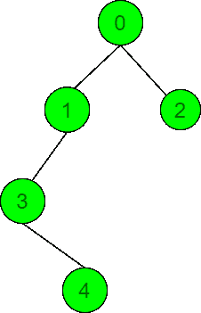
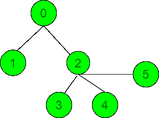

# 一个节点到每隔一个节点的最大距离总和

> 原文:[https://www . geesforgeks . org/一个节点到每隔一个节点的最大距离总和/](https://www.geeksforgeeks.org/maximum-sum-of-distances-of-a-node-to-every-other-node/)

给定一个具有从 **0** 到**N–1**的节点值的[无向连通树](https://www.geeksforgeeks.org/connected-components-in-an-undirected-graph/)和一个表示两个节点之间的边的[数组](https://www.geeksforgeeks.org/array-data-structure/)**【2】**，任务是找到一个节点到树中每隔一个节点的距离的最大和。

**示例:**

> **输入:** N = 5，边= { {0，2}，{1，3}，{0，1}，{3，4} }
> 
> [](https://media.geeksforgeeks.org/wp-content/uploads/20211001125356/UntitledDiagramdrawio.png)
> 
> **输出:** 10
> **说明:**
> 将节点 2 视为源节点，所有其他节点到节点 2 的距离为:1(节点 0)、2(节点 1)、3(节点 3)、4(节点 4)。因此，距离之和为 1 + 2 + 3 + 4 = 10。
> 
> **输入:** N = 6，边[][] = {{0，1}，{0，2}，{2，3}，{2，4}，{2，5}}
> 
> [](https://media.geeksforgeeks.org/wp-content/uploads/20211001125816/UntitledDiagramdrawio1.png)
> 
> **输出:** 12

**天真方法:**解决给定问题的最简单方法是从每个节点执行[深度优先搜索遍历](https://www.geeksforgeeks.org/depth-first-search-or-dfs-for-a-graph/)，并找到每隔一个节点到当前源节点的距离总和。在从作为源节点的所有节点检查之后，打印所有获得的值的总和中的最大总和。

下面是上述方法的实现:

## C++

```
// C++ program for the above approach

#include <bits/stdc++.h>
using namespace std;

// Function to perform DFS and find the
// distance from a node to every other
// node
void dfs(int s, vector<vector<int> > g,
         int p, int d, int& ans)
{
    for (int i : g[s]) {

        // If i is not equal to
        // parent p
        if (i != p) {
            ans += d;
            dfs(i, g, s, d + 1, ans);
        }
    }
}

// Function to find the maximum sum of
// distance from a node to every other
// node
void maxPotentialDistance(
    int N, vector<vector<int> >& edges)
{
    int ans = 0;

    // Construct the graph
    vector<vector<int> > g(N, vector<int>());

    for (auto& it : edges) {
        g[it[0]].push_back(it[1]);
        g[it[1]].push_back(it[0]);
    }

    // Find the sum of distances from
    // every node
    for (int i = 0; i < N; i++) {

        // Stores the maximum sum of
        // distance considering the
        // current node as source node
        int a = 0;

        // Perform DFS Traversal to
        // find the sum of distances
        dfs(i, g, -1, 1, a);

        // Update the maximum sum
        ans = max(ans, a);
    }

    // Print the maximum sum
    cout << ans;
}

// Driver Code
int main()
{
    int N = 6;
    vector<vector<int> > edges = {
        { 0, 1 }, { 0, 2 }, { 2, 3 }, { 2, 4 }, { 2, 5 }
    };

    maxPotentialDistance(N, edges);

    return 0;
}
```

## 蟒蛇 3

```
# python program for the above approach

pd_0 = 0

# Function to perform DFS and find the
# distance from a node to every other
# node

def dfs(s, g, p, d, count):
    global pd_0
    for i in g[s]:

                # If i is not equal to
                # parent p
        if (i != p):
            pd_0 += d

            # Perform the DFS Traversal
            dfs(i, g, s, d + 1, count)

            # Update the count of
            # nodes
            count[s] = count[s] + count[i]

# Function to find the distances from
# every other node using distance from
# node 0
def dfs2(s, g, p, pd_all, n, count):

    for i in g[s]:

                # If i is not equal to the
                # parent p
        if (i != p):
            pd_all[i] = pd_all[s] - count[i] + n - count[i]
            dfs2(i, g, s, pd_all, n, count)

# Function to find the maximum sum of
# distance from a node to every other
# node
def maxPotentialDistance(N, edges):
    global pd_0
    ans = 0

    # Construct the graph
    g = [[] for _ in range(N)]

    for it in edges:
        g[it[0]].append(it[1])
        g[it[1]].append(it[0])

        # Stores the number of nodes in
        # each subtree

    count = [1 for _ in range(N)]

    # Find the sum of distances from
    # node 0 and count the number of
    # nodes in each subtree

    dfs(0, g, -1, 1, count)

    # Stores distances from each node
    pd_all = [0 for _ in range(N)]
    pd_all[0] = pd_0

    # Find the distances from each
    # node using distance from node 0

    dfs2(0, g, -1, pd_all, N, count)

    # Find the result

    for i in pd_all:
        ans = max(ans, i)

        # Print the result
    print(ans)

# Driver Code
if __name__ == "__main__":

    N = 6
    edges = [
            [0, 1], [0, 2], [2, 3], [2, 4], [2, 5]
    ]
    maxPotentialDistance(N, edges)

    # This code is contributed by rakeshsahni
```

**Output:** 

```
12
```

***时间复杂度:**O(N<sup>2</sup>)*
***辅助空间:** O(N)*

**高效方法:**上述方法也可以通过观察节点到每隔一个节点的距离之和之间的关系来优化。我们以节点 **x** 为例。如果 **y** 是其子系，则观察到 **y** 和 **x** 的距离之和为:

> y 的距离=距离 x–子树 y 中的节点数+不在子树 y 中的节点数

所有节点所需的距离可以通过计算距一个节点的距离之和并知道每个子树中的节点数来计算。按照以下步骤解决问题:

*   定义一个[函数](https://www.geeksforgeeks.org/functions-in-c/) **dfs(int s，vector < vector < int > >图，int p，int d，int & ans，vector<int>&count)**并执行以下步骤:
    *   [使用变量 **i** 迭代范围](https://www.geeksforgeeks.org/range-based-loop-c/)**【0，图 s】**，如果 **i** 不等于 **p，**则将 **ans** 的值增加 **d** 并调用函数 **dfs(i，图 s，d + 1，ans，count)** 来探索其他节点并设置**count【s】的值**
*   定义函数 **dfs2(int s，vector<vector<int>T5】graph，int p，vector<int>T8】PD _ all，int N，vector<int>&count)**并执行以下步骤:
    *   [使用变量 **i** 迭代范围](https://www.geeksforgeeks.org/range-based-loop-c/)**【0，图[s]】**，如果 **i** 不等于 **p，**则将 **pd_all[i]** 的值设置为**(pd_all[s]–count[I]+N–count[I])**并调用函数 **dfs(i，图，s，PD _ all，N，N**
*   初始化变量，说**和存储结果的**。
*   [从给定的边[][]](https://www.geeksforgeeks.org/convert-adjacency-matrix-to-adjacency-list-representation-of-graph/) 构建邻接表、**图[]** 。
*   [初始化大小为 **N** 的向量](https://www.geeksforgeeks.org/2d-vector-in-cpp-with-user-defined-size/) **count[]** ，以跟踪给定节点的子树中的节点数。
*   将变量 **pd_0** 初始化为 **0** ，以存储从节点 **0** 到树中每隔一个节点的距离总和。
*   调用函数 **dfs(s，graph，p，d，ans，count)** 找到从节点 **0** 到每隔一个节点所需的距离，并将节点数的计数存储在一个子树中。
*   初始化大小为 **N** 的向量 **pd_all[]** ，以存储每隔一个节点的距离。
*   将 **pd_all[0]** 的值设置为 **pd_0** 。
*   调用函数 **dfs2(s，graph，p，pd_all，N，count)** 找到每隔一个节点所需的距离。
*   [使用变量 **i** 迭代范围](https://www.geeksforgeeks.org/range-based-loop-c/)**【0，N】**，并将 **ans** 的值更新为 **ans** 或**PD _ all【I】**的最大值。
*   执行上述步骤后，打印**和**的值作为答案。

下面是上述方法的实现:

## C++

```
// C++ program for the above approach
#include <bits/stdc++.h>
using namespace std;

// Function to perform DFS and find the
// distance from a node to every other
// node
void dfs(int s, vector<vector<int> > g,
         int p, int d, int& ans,
         vector<int>& count)
{
    for (int i : g[s]) {

        // If i is not equal to
        // parent p
        if (i != p) {
            ans += d;

            // Perform the DFS Traversal
            dfs(i, g, s, d + 1,
                ans, count);

            // Update the count of
            // nodes
            count[s] = count[s] + count[i];
        }
    }
}

// Function to find the distances from
// every other node using distance from
// node 0
void dfs2(int s, vector<vector<int> > g,
          int p, vector<int>& pd_all,
          int n, vector<int> count)
{
    for (int i : g[s]) {

        // If i is not equal to the
        // parent p
        if (i != p) {
            pd_all[i] = pd_all[s]
                        - count[i]
                        + n - count[i];
            dfs2(i, g, s, pd_all,
                 n, count);
        }
    }
}

// Function to find the maximum sum of
// distance from a node to every other
// node
void maxPotentialDistance(
    int N, vector<vector<int> >& edges)
{
    int ans = 0;

    // Construct the graph
    vector<vector<int> > g(N, vector<int>());

    for (auto& it : edges) {
        g[it[0]].push_back(it[1]);
        g[it[1]].push_back(it[0]);
    }

    // Stores the number of nodes in
    // each subtree
    vector<int> count(N, 1);
    int pd_0 = 0;

    // Find the sum of distances from
    // node 0 and count the number of
    // nodes in each subtree
    dfs(0, g, -1, 1, pd_0, count);

    // Stores distances from each node
    vector<int> pd_all(N, 0);
    pd_all[0] = pd_0;

    // Find the distances from each
    // node using distance from node 0
    dfs2(0, g, -1, pd_all, N, count);

    // Find the result
    for (int i : pd_all)
        ans = max(ans, i);

    // Print the result
    cout << ans;
}

// Driver Code
int main()
{
    int N = 6;
    vector<vector<int> > edges = {
        { 0, 1 }, { 0, 2 }, { 2, 3 }, { 2, 4 }, { 2, 5 }
    };
    maxPotentialDistance(N, edges);

    return 0;
}
```

**Output:** 

```
12
```

***时间复杂度:**O(N)*
T5**辅助空间:** O(N)