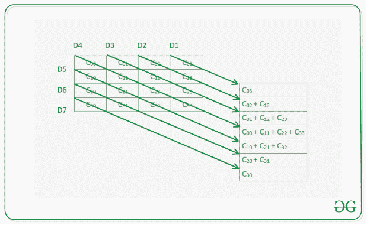

# 平行于给定矩阵主对角线的对角线上元素的最大和

> 原文:[https://www . geesforgeks . org/给定矩阵的最大对角线元素和/给定矩阵的主对角线元素和/](https://www.geeksforgeeks.org/maximum-sum-of-elements-in-a-diagonal-parallel-to-the-main-diagonal-of-a-given-matrix/)

给出一个维度为 **N * N** 的正方形矩阵 **mat[][]** ，任务是沿着与主对角线平行的对角线找到给定矩阵中元素的最大和。下面是同样的图像。

[](https://media.geeksforgeeks.org/wp-content/uploads/20201021145719/2d.png)

**示例:**

> **输入:** mat[][] = {{1，2，5，7}，{2，6，7，3}，{12，3，2，4}，{3，6，9，4}}
> ***输出:** 18*
> ***解释:***
> *在具有(2，0)和(3，1)的对角线中存在的元素之和是 12 + 6 = 18，这是其中最大的*
> 
> **输入:** mat[][] = {{5，2，5，7}，{2，5，7，3}，{12，3，5，4}，{3，6，9，5}}
> ***输出:** 18*
> ***解释:***
> *存在于主对角线上具有单元(0，0)、(1，1)、(2，2)和(3，3)的元素之和为 5+1*

**方法:**想法是遍历平行于主对角线的每个对角线的单元格，并观察到对于从单元格 **(x，y)** 开始的主对角线之上的任何对角线，主对角线之下的对应对角线将从单元格 **(y，x)** 开始。对于每个对角线，从单元格 **(x，y)** 开始，其所有元素将位于单元格 **(x + k，y + k)** 上，其中 **0 < = x + k，y + k < N** 。按照以下步骤解决问题:

*   用 **0** 初始化一个变量**最大和**，它将存储最大对角线和。
*   [在**【0，N–1】**范围内，从 **i** 穿过 **0 <sup>第</sup>T5】行的**](https://www.geeksforgeeks.org/row-wise-vs-column-wise-traversal-matrix/)列。
*   初始化变量 **sum1** 和 **sum2** ，分别存储从单元格**(行，列)**和单元格**(列，行)**开始的对角线和，其中 **r 为 0，c 为列**。
*   将**行**和 **c** 增加 **1** 。将**垫【行】【栏】**加到 **sum1** 上，**垫【栏】【行】**加到 **sum2** 上，而**行**和**栏**比 **N** 小。最后更新 **maxSum** 存储 **maxSum、sum1、sum2** 的最大值。
*   遍历给定矩阵后，打印值 **maxSum** 作为最大和。

下面是上述方法的实现:

## C++

```
// C++ program for the above approach

#include <bits/stdc++.h>
using namespace std;

// Function to return maximum diagonal
// sum that are parallel to main diagonal
int maxDiagonalSum(vector<vector<int> > arr, int N)
{
    // Initialize maxSum
    int maxSum = 0;

    // Traverse through the columns
    for (int i = 0; i < N; i++) {

        // Initialize r and c
        int row = 0, col = i;

        // Diagonal sums
        int sum1 = 0, sum2 = 0;
        while (col < N && row < N) {
            sum1 += arr[row][col];
            sum2 += arr[col][row];
            row++;
            col++;
        }

        // Update maxSum with
        // the maximum sum
        maxSum = max({ sum1, maxSum, sum2 });
    }

    // Return the maxSum
    return maxSum;
}

// Driver Code
int main()
{
    // Given matrix mat[][]
    vector<vector<int> > mat
        = { { 1, 2, 5, 7 },
            { 2, 6, 7, 3 },
            { 12, 3, 2, 4 },
            { 3, 6, 9, 4 } };
    int N = mat.size();

    // Function Call
    cout << maxDiagonalSum(mat, N);

    return 0;
}
```

## Java 语言(一种计算机语言，尤用于创建网站)

```
// Java program for the above approach
import java.io.*;

class GFG{

// Function to return maximum diagonal
// sum that are parallel to main diagonal
static int maxDiagonalSum(int arr[][], int N)
{

    // Initialize maxSum
    int maxSum = 0;

    // Traverse through the columns
    for(int i = 0; i < N; i++)
    {

        // Initialize r and c
        int row = 0, col = i;

        // Diagonal sums
        int sum1 = 0, sum2 = 0;
        while (col < N && row < N)
        {
            sum1 += arr[row][col];
            sum2 += arr[col][row];
            row++;
            col++;
        }

        // Update maxSum with
        // the maximum sum
        maxSum = Math.max(maxSum,
                          Math.max(sum1,
                                   sum2));
    }

    // Return the maxSum
    return maxSum;
}

// Driver code
public static void main (String[] args)
{

    // Given matrix mat[][]
    int mat[][] = { { 1, 2, 5, 7 },
                    { 2, 6, 7, 3 },
                    { 12, 3, 2, 4 },
                    { 3, 6, 9, 4 } };
    int N = mat.length;

    // Function Call
    System.out.println(maxDiagonalSum(mat, N));
}
}

// This code is contributed by math_lover
```

## 蟒蛇 3

```
# Python3 program for the above approach

# Function to return maximum diagonal
# sum that are parallel to main diagonal
def maxDiagonalSum(arr, N):

    # Initialize maxSum
    maxSum = 0

    # Traverse through the columns
    for i in range(N):

        # Initialize r and c
        row = 0
        col = i

        # Diagonal sums
        sum1 = 0
        sum2 = 0

        while col < N and row < N:
            sum1 += arr[row][col]
            sum2 += arr[col][row]
            row += 1
            col += 1

        # Update maxSum with
        # the maximum sum
        maxSum = max([ sum1, maxSum, sum2])

    # Return the maxSum
    return maxSum

# Driver Code
if __name__ == '__main__':

    # Given matrix mat[][]
    mat = [ [ 1, 2, 5, 7 ],
            [ 2, 6, 7, 3 ],
            [ 12, 3, 2, 4 ],
            [ 3, 6, 9, 4 ] ]

    N = len(mat)

    # Function Call
    print(maxDiagonalSum(mat, N))

# This code is contributed by mohit kumar 29
```

## C#

```
// C# program for the
// above approach
using System;
class GFG{

// Function to return maximum
// diagonal sum that are parallel
// to main diagonal
static int maxDiagonalSum(int [,]arr,
                          int N)
{   
  // Initialize maxSum
  int maxSum = 0;

  // Traverse through the
  // columns
  for(int i = 0; i < N; i++)
  {
    // Initialize r and c
    int row = 0, col = i;

    // Diagonal sums
    int sum1 = 0, sum2 = 0;
    while (col < N && row < N)
    {
      sum1 += arr[row,col];
      sum2 += arr[col,row];
      row++;
      col++;
    }

    // Update maxSum with
    // the maximum sum
    maxSum = Math.Max(maxSum,
             Math.Max(sum1,
                      sum2));
  }

  // Return the maxSum
  return maxSum;
}

// Driver code
public static void Main(String[] args)
{   
  // Given matrix [,]mat
  int [,]mat = {{1, 2, 5, 7},
                {2, 6, 7, 3},
                {12, 3, 2, 4},
                {3, 6, 9, 4}};
  int N = mat.GetLength(0);

  // Function Call
  Console.WriteLine(maxDiagonalSum(mat, N));
}
}

// This code is contributed by gauravrajput1
```

## java 描述语言

```
<script>
// javascript program for the above approach

// Function to return maximum diagonal
// sum that are parallel to main diagonal
function maxDiagonalSum( arr,  N)
{
    // Initialize maxSum
    let maxSum = 0;

    // Traverse through the columns
    for (let i = 0; i < N; i++) {

        // Initialize r and c
        let row = 0, col = i;

        // Diagonal sums
        let sum1 = 0, sum2 = 0;
        while (col < N && row < N) {
            sum1 += arr[row][col];
            sum2 += arr[col][row];
            row++;
            col++;
        }

        // Update maxSum with
        // the maximum sum
        maxSum = Math.max(Math.max(sum1, maxSum), sum2 );
    }

    // Return the maxSum
    return maxSum;
}

// Driver Code

    // Given matrix mat[][]
    let mat
        = [[ 1, 2, 5, 7 ],
            [ 2, 6, 7, 3 ],
            [ 12, 3, 2, 4 ],
            [ 3, 6, 9, 4 ]];
    let N = mat[0].length;

    // Function Call
     document.write(maxDiagonalSum(mat, N));

// This code is contributed by todaysgaurav
</script>
```

**Output**

```
18
```

***时间复杂度:**O(N<sup>2</sup>)*
***辅助空间:** O(N <sup>2</sup> )*