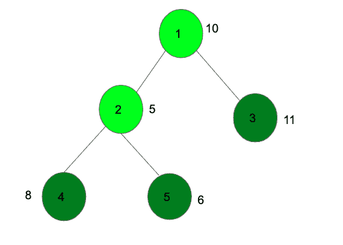

# 二叉树中没有两个相邻节点的最大和|动态规划

> 原文:[https://www . geeksforgeeks . org/二叉树中节点的最大和，这样就不会有两个相邻的动态编程/](https://www.geeksforgeeks.org/maximum-sum-of-nodes-in-binary-tree-such-that-no-two-are-adjacent-dynamic-programming/)

给定一个 N 元树，其值与每个节点相关联，任务是选择这些节点的子集，使得所选节点的和在子集内的两个所选节点不应直接连接的约束下最大，也就是说，如果我们在和中取了一个节点，那么我们不能考虑它的任何子节点，反之亦然。
**例:**



上图选择深绿色的节点，得到最大值 25。

在之前的[帖子](https://www.geeksforgeeks.org/maximum-sum-nodes-binary-tree-no-two-adjacent/)中已经讨论过使用[递归](https://www.geeksforgeeks.org/recursion/)解决这个问题的方法。
在这篇文章中，我们将讨论一种在树上使用[动态编程的方法。
在解决问题的同时，出现了两种情况:](https://www.geeksforgeeks.org/dynamic-programming-trees-set-1/)

1.  对于一个特定的节点，最大和可以通过包含节点本身及其子树中的节点来计算。
2.  或者，通过排除当前节点并仅包括其子树中的节点来计算最大总和。

**让我们假设**:

*   **通过从该节点的子树中选择节点并且还包括该节点，将 dp1[节点]** 设定为最大可能和。
*   并且， **dp2【节点】**是通过从节点的子树中选择节点并且不包括节点本身而得到的最大可能和。

在第一种情况下，如果我们包括当前节点，那么它的值被相加，然后我们不能包括它的任何直接子节点，因此所有子节点的 dp2[]的总和将被考虑到计算 dp1[节点]的计数中。也就是

> **dp1[节点]** =树[节点] +和(dp2[children1]，dp2[children2]，…)

在第二种情况下，如果我们不包括当前节点，那么它的值不会被添加，但是子节点可以被取或不能被取，因此所有子节点的两者的最大值之和将被计算在内以计算 dp2[node]。也就是

> **dp2[node]**= tree[node]+sum(max(dp1[children 1]，dp2[children1])，…

最终，最终的答案将是 dp1[root]和 dp2[root]的最大值。
以下是上述方法的实现:

## C++

```
// C++ program to find maximum sum
// of a subset of nodes that are not adjacent

#include <bits/stdc++.h>
using namespace std;

// Function to find the diameter of the tree
// using Dynamic Programming
void dfs(int node, int parent, int dp1[], int dp2[],
                            list<int>* adj, int tree[])
{

    int sum1 = 0, sum2 = 0;

    // Traverse for all children of node
    for (auto i = adj[node].begin(); i != adj[node].end(); ++i) {
        if (*i == parent)
            continue;

        // Call DFS function again
        dfs(*i, node, dp1, dp2, adj, tree);

        // Include the current node
        // then donot include the children
        sum1 += dp2[*i];

        // Donot include current node,
        // then include children or not include them
        sum2 += max(dp1[*i], dp2[*i]);
    }

    // Recurrence value
    dp1[node] = tree[node] + sum1;
    dp2[node] = sum2;
}

/* Driver program to test above functions */
int main()
{
    int n = 5;

    /* Constructed tree is
        1
        / \
        2 3
       / \
       4 5 */
    list<int>* adj = new list<int>[n + 1];

    /* create undirected edges */
    adj[1].push_back(2);
    adj[2].push_back(1);
    adj[1].push_back(3);
    adj[3].push_back(1);
    adj[2].push_back(4);
    adj[4].push_back(2);
    adj[2].push_back(5);
    adj[5].push_back(2);

    // Numbers to node
    int tree[n + 1];
    tree[1] = 10;
    tree[2] = 5;
    tree[3] = 11;
    tree[4] = 6;
    tree[5] = 8;

    int dp1[n + 1], dp2[n + 1];
    memset(dp1, 0, sizeof dp1);
    memset(dp2, 0, sizeof dp2);

    dfs(1, 1, dp1, dp2, adj, tree);

    // Find maximum sum by calling function
    cout << "Maximum sum: "
         << max(dp1[1], dp2[1]) << endl;
    return 0;
}
```

## 蟒蛇 3

```
# Python3 program to find
# maximum sum of a subset
# of nodes that are not
# adjacent

# Function to find the diameter
# of the tree using Dynamic
# Programming
def dfs(node, parent, dp1,
        dp2, adj, tree):

    sum1 = 0
    sum2 = 0

    # Traverse for all
    # children of node
    for i in adj[node]:   
        if (i == parent):
            continue;

        # Call DFS function
        # again
        dfs(i, node, dp1,
            dp2, adj, tree);

        # Include the current
        # node then donot include
        # the children
        sum1 += dp2[i];

        # Donot include current node,
        # then include children or not
        # include them
        sum2 += max(dp1[i],
                    dp2[i]);   

    # Recurrence value
    dp1[node] = tree[node] + sum1;
    dp2[node] = sum2;

# Driver code
if __name__=="__main__":

    n = 5;

    ''' Constructed tree is
        1
        / \
        2 3
       / \
       4 5 '''

    adj = [[] for i in range(n + 1)]

    # create undirected edges
    adj[1].append(2);
    adj[2].append(1);
    adj[1].append(3);
    adj[3].append(1);
    adj[2].append(4);
    adj[4].append(2);
    adj[2].append(5);
    adj[5].append(2);

    # Numbers to node
    tree = [0 for i in range(n + 1)];
    tree[1] = 10;
    tree[2] = 5;
    tree[3] = 11;
    tree[4] = 6;
    tree[5] = 8;

    dp1 = [0 for i in range(n + 1)];
    dp2 = [0 for i in range(n + 1)];

    dfs(1, 1, dp1, dp2, adj, tree);

    # Find maximum sum by calling
    # function
    print("Maximum sum:",
          max(dp1[1], dp2[1]))

# This code is contributed by Rutvik_56
```

## C#

```
// C# program to find maximum sum
// of a subset of nodes that are not adjacent
using System;
using System.Collections;

class GFG
{

// Function to find the diameter of the tree
// using Dynamic Programming
public static void dfs(int node, int parent, int []dp1, int []dp2,
                            ArrayList []adj, int []tree)
{

    int sum1 = 0, sum2 = 0;

    // Traverse for all children of node
    foreach(int i in adj[node])
    {
        if (i == parent)
            continue;

        // Call DFS function again
        dfs(i, node, dp1, dp2, adj, tree);

        // Include the current node
        // then donot include the children
        sum1 += dp2[i];

        // Donot include current node,
        // then include children or not include them
        sum2 += Math.Max(dp1[i], dp2[i]);
    }

    // Recurrence value
    dp1[node] = tree[node] + sum1;
    dp2[node] = sum2;
}

/* Driver program to test above functions */
public static void Main(string []arg)
{
    int n = 5;

    /* Constructed tree is
        1
        / \
        2 3
       / \
       4 5 */
    ArrayList []adj = new ArrayList[n + 1];

    for(int i = 0; i < n + 1; i++)
    {
        adj[i] = new ArrayList();
    }

    /* create undirected edges */
    adj[1].Add(2);
    adj[2].Add(1);
    adj[1].Add(3);
    adj[3].Add(1);
    adj[2].Add(4);
    adj[4].Add(2);
    adj[2].Add(5);
    adj[5].Add(2);

    // Numbers to node
    int []tree = new int[n + 1];
    tree[1] = 10;
    tree[2] = 5;
    tree[3] = 11;
    tree[4] = 6;
    tree[5] = 8;

    int []dp1 = new int[n + 1];
    int []dp2 = new int[n + 1];
    Array.Fill(dp1, 0);
    Array.Fill(dp2, 0);

    dfs(1, 1, dp1, dp2, adj, tree);

    // Find maximum sum by calling function
    Console.Write("Maximum sum: "+ Math.Max(dp1[1], dp2[1]));
}
}

// This code is contributed by pratham76
```

**Output:** 

```
Maximum sum: 25
```