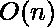

# 通过切换相邻位得到的两个数组乘积的最大和

> 原文:[https://www . geeksforgeeks . org/两个相邻位触发阵列的最大乘积和/](https://www.geeksforgeeks.org/maximum-sum-of-products-of-two-arrays-by-toggling-adjacent-bits/)

给定一个相同大小的整数数组 **arr1** 和二进制数组 **arr2** ，任务是找出这些数组乘积的最大可能和，即**(arr 1[0]* arr 2[0])+(arr 1[1]* arr 2[1])+…..(arr1[N-1] * arr2[N-1])** 通过切换阵列中任意 2 个相邻位获得 **arr2** 。这种切换可以进行无数次。
阵列中 2 个相邻位的切换 **arr2** 如下进行:

*   00 切换到 11
*   01 切换到 10
*   10 切换到 01
*   11 切换到 00

**例:**

```
Input: arr1 = {2, 3, 1}, arr2 = {0, 0, 1}
Output: 6
Explanation:
if we put 1 corresponding to a positive integer
then arr2 will be {1, 1, 1}
No. of 1's initially and now are odd
It means parity is same 
so this arrangement is fine
Hence sum will be 2 + 3 + 1 = 6.

Input: arr1 = {2, -4, 5, 3}, arr2 = {0, 1, 0, 1}
Output: 8
```

**进场:**

*   每次操作后，奇偶校验保持不变，即 1 的数量最初为偶数时为偶数，最初为奇数时为奇数。
*   第二个观察是，第 I 位和第 j 位的切换可以通过从第 I 位切换来完成，如(I，i+1)，(i+1，i+2) …。(j-1，j)这里，除了 I 和 j 之外，每个位都切换两次(如果位切换两次，则它到达初始值)，然后最终第 I 位和第 j 位切换。
*   从这两个观察结果可以看出，我们可以对 arr2 中的 1 和 0 进行任何排列。我们唯一需要注意的是 1 和 0 的奇偶性。最终奇偶校验必须与初始奇偶校验相同。
*   要得到最大和，在 arr2 的第 I 个位置放 1，如果 arr1 中第 I 个位置的元素为正，则放 0。

以下是上述方法的实现:

## C++

```
// C++ program to find the maximum SoP of two arrays
// by toggling adjacent bits in the second array

#include <bits/stdc++.h>
using namespace std;

// Function to return Max Sum
int maxSum(int arr1[], int arr2[], int n)
{
    // intialParity and finalParity are 0
    // if total no. of 1's is even else 1
    int initialParity = 0, finalParity = 0;

    // minPositive and maxNegative will store
    // smallest positive and smallest negative
    // integer respectively.
    int sum = 0,
        minPositive = INT_MAX,
        maxNegative = INT_MIN;

    for (int i = 0; i < n; i++) {

        // Count of Initial Parity
        initialParity += arr2[i];

        // if arr1[i] is positive then add 1
        // in finalParity to get 1 at arr2[i]
        if (arr1[i] >= 0) {

            finalParity += 1;
            sum += arr1[i];
            minPositive = min(minPositive, arr1[i]);
        }
        else {
            maxNegative = max(maxNegative, arr1[i]);
        }
    }

    // if both parity are odd or even
    // then return sum
    if (initialParity % 2 == finalParity % 2) {
        return sum;
    }

    // else add one more 1 or remove 1
    else {

        // if minPositive > maxNegative,
        // put 1 at maxNegative
        // and add it to our sum
        if (minPositive + maxNegative >= 0) {

            return sum + maxNegative;
        }

        // else remove minPositive no.
        else {

            return sum - minPositive;
        }
    }
}

// Driver code
int main()
{
    int arr1[] = { 2, -4, 5, 3 };
    int arr2[] = { 0, 1, 0, 1 };

    int n = sizeof(arr1) / sizeof(arr1[0]);
    cout << maxSum(arr1, arr2, n) << endl;

    return 0;
}
```

## Java 语言(一种计算机语言，尤用于创建网站)

```
// Java program to find the maximum SoP
// of two arrays by toggling adjacent bits
// in the second array
class GFG
{

// Function to return Max Sum
static int maxSum(int arr1[],
                  int arr2[], int n)
{
    // intialParity and finalParity are 0
    // if total no. of 1's is even else 1
    int initialParity = 0, finalParity = 0;

    // minPositive and maxNegative will store
    // smallest positive and smallest negative
    // integer respectively.
    int sum = 0,
        minPositive = Integer.MAX_VALUE,
        maxNegative = Integer.MIN_VALUE;

    for (int i = 0; i < n; i++)
    {

        // Count of Initial Parity
        initialParity += arr2[i];

        // if arr1[i] is positive then add 1
        // in finalParity to get 1 at arr2[i]
        if (arr1[i] >= 0)
        {

            finalParity += 1;
            sum += arr1[i];
            minPositive = Math.min(minPositive,
                                      arr1[i]);
        }
        else
        {
            maxNegative = Math.max(maxNegative,
                                      arr1[i]);
        }
    }

    // if both parity are odd or even
    // then return sum
    if (initialParity % 2 == finalParity % 2)
    {
        return sum;
    }

    // else add one more 1 or remove 1
    else
    {

        // if minPositive > maxNegative,
        // put 1 at maxNegative
        // and add it to our sum
        if (minPositive + maxNegative >= 0)
        {
            return sum + maxNegative;
        }

        // else remove minPositive no.
        else
        {
            return sum - minPositive;
        }
    }
}

// Driver code
public static void main(String []args)
{
    int arr1[] = { 2, -4, 5, 3 };
    int arr2[] = { 0, 1, 0, 1 };

    int n = arr1.length;
    System.out.println(maxSum(arr1, arr2, n));
}
}

// This code is contributed by 29AjayKumar
```

## 蟒蛇 3

```
# Python3 program to find the
# maximum SoP of two arrays by
# toggling adjacent bits#
# in the second array
import sys

# Function to return Max Sum
def maxSum(arr1, arr2, n) :

    # intialParity and finalParity are 0
    # if total no. of 1's is even else 1
    initialParity, finalParity = 0, 0

    # minPositive and maxNegative will store
    # smallest positive and smallest negative
    # integer respectively.
    sum = 0
    minPositive = sys.maxsize
    maxNegative = -sys.maxsize - 1

    for i in range(n) :

        # Count of Initial Parity
        initialParity += arr2[i];

        # if arr1[i] is positive then add 1
        # in finalParity to get 1 at arr2[i]
        if (arr1[i] >= 0) :

            finalParity += 1
            sum += arr1[i]
            minPositive = min(minPositive, arr1[i])

        else :
            maxNegative = max(maxNegative, arr1[i])

    # if both parity are odd or even
    # then return sum
    if (initialParity % 2 == finalParity % 2) :
        return sum

    # else add one more 1 or remove 1
    else :

        # if minPositive > maxNegative,
        # put 1 at maxNegative
        # and add it to our sum
        if (minPositive + maxNegative >= 0) :

            return sum + maxNegative

        # else remove minPositive no.
        else :

            return sum - minPositive

# Driver code
arr1 = [ 2, -4, 5, 3 ]
arr2 = [ 0, 1, 0, 1 ]

n = len(arr1)
print(maxSum(arr1, arr2, n))

# This code is contributed by divyamohan123
```

## C#

```
// C# program to find the maximum SoP
// of two arrays by toggling adjacent bits
// in the second array
using System;

class GFG
{

// Function to return Max Sum
static int maxSum(int []arr1,
                  int []arr2, int n)
{
    // intialParity and finalParity are 0
    // if total no. of 1's is even else 1
    int initialParity = 0, finalParity = 0;

    // minPositive and maxNegative will store
    // smallest positive and smallest negative
    // integer respectively.
    int sum = 0,
        minPositive = int.MaxValue,
        maxNegative = int.MinValue;

    for (int i = 0; i < n; i++)
    {

        // Count of Initial Parity
        initialParity += arr2[i];

        // if arr1[i] is positive then add 1
        // in finalParity to get 1 at arr2[i]
        if (arr1[i] >= 0)
        {

            finalParity += 1;
            sum += arr1[i];
            minPositive = Math.Min(minPositive,
                                      arr1[i]);
        }
        else
        {
            maxNegative = Math.Max(maxNegative,
                                      arr1[i]);
        }
    }

    // if both parity are odd or even
    // then return sum
    if (initialParity % 2 == finalParity % 2)
    {
        return sum;
    }

    // else add one more 1 or remove 1
    else
    {

        // if minPositive > maxNegative,
        // put 1 at maxNegative
        // and add it to our sum
        if (minPositive + maxNegative >= 0)
        {
            return sum + maxNegative;
        }

        // else remove minPositive no.
        else
        {
            return sum - minPositive;
        }
    }
}

// Driver code
public static void Main(String []args)
{
    int []arr1 = { 2, -4, 5, 3 };
    int []arr2 = { 0, 1, 0, 1 };

    int n = arr1.Length;
    Console.WriteLine(maxSum(arr1, arr2, n));
}
}

// This code is contributed by 29AjayKumar
```

## java 描述语言

```
<script>

// JavaScript program to find the maximum SoP
// of two arrays by toggling adjacent bits
// in the second array

// Function to return Max Sum
function maxSum(arr1, arr2, n) {
    // intialParity and finalParity are 0
    // if total no. of 1's is even else 1
    let initialParity = 0, finalParity = 0;

    // minPositive and maxNegative will store
    // smallest positive and smallest negative
    // integer respectively.
    let sum = 0,
        minPositive = Number.MAX_SAFE_INTEGER,
        maxNegative = Number.MIN_SAFE_INTEGER;

    for (let i = 0; i < n; i++) {

        // Count of Initial Parity
        initialParity += arr2[i];

        // if arr1[i] is positive then add 1
        // in finalParity to get 1 at arr2[i]
        if (arr1[i] >= 0) {

            finalParity += 1;
            sum += arr1[i];
            minPositive = Math.min(minPositive,
                arr1[i]);
        }
        else {
            maxNegative = Math.max(maxNegative,
                arr1[i]);
        }
    }

    // if both parity are odd or even
    // then return sum
    if (initialParity % 2 == finalParity % 2) {
        return sum;
    }

    // else add one more 1 or remove 1
    else {

        // if minPositive > maxNegative,
        // put 1 at maxNegative
        // and add it to our sum
        if (minPositive + maxNegative >= 0) {
            return sum + maxNegative;
        }

        // else remove minPositive no.
        else {
            return sum - minPositive;
        }
    }
}

// Driver code

let arr1 = [2, -4, 5, 3];
let arr2 = [0, 1, 0, 1];

let n = arr1.length;
document.write(maxSum(arr1, arr2, n));

// This code is contributed by _saurabh_jaiswal

</script>
```

**Output:** 

```
8
```

**时间复杂度:** ，其中 n 是数组的大小。

**辅助空间:** O(1)