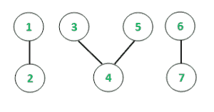
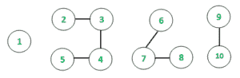

# 无向图所有连通分支中节点值的最大和

> 原文:[https://www . geeksforgeeks . org/无向图所有连接组件中节点的最大值和/](https://www.geeksforgeeks.org/maximum-sum-of-values-of-nodes-among-all-connected-components-of-an-undirected-graph/)

给定一个有 **V** 顶点和 **E** 边的无向图。每个节点都被分配了一个给定值。任务是在图中的所有连通分支中找到具有最大值和的连通链。
**例:**

> **输入:** V = 7，E = 4
> 值= {10，25，5，15，5，20，0}
> 
> 
> 
> **输出:**最大和值= 35
> **说明:**
> 分量{1，2 }–值{10，25}: sumValue = 10 + 25 = 35
> 分量{3，4，5 }–值{5，15，5}: sumValue = 5 + 15 + 5 = 25
> 分量{6，7 }–值{20，0}: sumValue = 20 + 0 = 20
> 最大和值链为{1
> **输入:** V = 10，E = 6
> 值= {5，10，15，20，25，30，35，40，45，50}
> 
> 
> 
> **输出:**最大和值= 105

**方法:**想法是使用[深度优先搜索遍历](https://www.geeksforgeeks.org/connected-components-in-an-undirected-graph/)方法来跟踪所有连接的组件。临时变量用于汇总连接链的各个值的所有值。在连接组件的每次遍历中，最大值会与当前值进行比较并相应更新。遍历完所有连接的组件后，答案将是所有组件中的最大值。
以下是上述办法的实施情况:

## C++

```
// C++ program to find Maximum sum of values
// of nodes among all connected
// components of an undirected graph
#include <bits/stdc++.h>
using namespace std;

// Function to implement DFS
void depthFirst(int v, vector<int> graph[],
                vector<bool>& visited,
                int& sum,
                vector<int> values)
{
    // Marking the visited vertex as true
    visited[v] = true;

    // Updating the value of connection
    sum += values[v - 1];

    // Traverse for all adjacent nodes
    for (auto i : graph[v]) {

        if (visited[i] == false) {

            // Recursive call to the DFS algorithm
            depthFirst(i, graph, visited,
                       sum, values);
        }
    }
}

void maximumSumOfValues(vector<int> graph[],
                        int vertices, vector<int> values)
{
    // Initializing boolean array to mark visited vertices
    vector<bool> visited(values.size() + 1, false);

    // maxChain stores the maximum chain size
    int maxValueSum = INT_MIN;

    // Following loop invokes DFS algorithm
    for (int i = 1; i <= vertices; i++) {
        if (visited[i] == false) {

            // Variable to hold temporary values
            int sum = 0;

            // DFS algorithm
            depthFirst(i, graph, visited,
                       sum, values);

            // Conditional to update max value
            if (sum > maxValueSum) {
                maxValueSum = sum;
            }
        }
    }

    // Printing the heaviest chain value
    cout << "Max Sum value = ";
    cout << maxValueSum << "\n";
}

// Driver function to test above function
int main()
{

    // Defining the number of edges and vertices
    int E = 4, V = 7;

      // Initializing graph in the form of adjacency list
    vector<int> graph[V+1];

    // Assigning the values for each
    // vertex of the undirected graph
    vector<int> values;
    values.push_back(10);
    values.push_back(25);
    values.push_back(5);
    values.push_back(15);
    values.push_back(5);
    values.push_back(20);
    values.push_back(0);

    // Constructing the undirected graph
    graph[1].push_back(2);
    graph[2].push_back(1);
    graph[3].push_back(4);
    graph[4].push_back(3);
    graph[3].push_back(5);
    graph[5].push_back(3);
    graph[6].push_back(7);
    graph[7].push_back(6);

    maximumSumOfValues(graph, V, values);
    return 0;
}
```

## Java 语言(一种计算机语言，尤用于创建网站)

```
// Java program to find Maximum sum of
// values of nodes among all connected
// components of an undirected graph
import java.util.*;

class GFG{

static int sum;

// Function to implement DFS
static void depthFirst(int v,
                       Vector<Integer> graph[],
                       boolean []visited,
                       Vector<Integer> values)
{

    // Marking the visited vertex as true
    visited[v] = true;

    // Updating the value of connection
    sum += values.get(v - 1);

    // Traverse for all adjacent nodes
    for(int i : graph[v])
    {
        if (visited[i] == false)
        {

            // Recursive call to the DFS algorithm
            depthFirst(i, graph, visited, values);
        }
    }
}

static void maximumSumOfValues(Vector<Integer> graph[],
                               int vertices,
                               Vector<Integer> values)
{

    // Initializing boolean array to
    // mark visited vertices
    boolean []visited = new boolean[values.size() + 1];

    // maxChain stores the maximum chain size
    int maxValueSum = Integer.MIN_VALUE;

    // Following loop invokes DFS algorithm
    for(int i = 1; i <= vertices; i++)
    {
        if (visited[i] == false)
        {

            // Variable to hold temporary values
            sum = 0;

            // DFS algorithm
            depthFirst(i, graph, visited, values);

            // Conditional to update max value
            if (sum > maxValueSum)
            {
                maxValueSum = sum;
            }
        }
    }

    // Printing the heaviest chain value
    System.out.print("Max Sum value = ");
    System.out.print(maxValueSum + "\n");
}

// Driver code
public static void main(String[] args)
{

    // Initializing graph in the form
    // of adjacency list
    @SuppressWarnings("unchecked")
    Vector<Integer> []graph = new Vector[1001];

    for(int i = 0; i < graph.length; i++)
        graph[i] = new Vector<Integer>();

    // Defining the number of edges and vertices
    int E = 4, V = 7;

    // Assigning the values for each
    // vertex of the undirected graph
    Vector<Integer> values = new Vector<Integer>();
    values.add(10);
    values.add(25);
    values.add(5);
    values.add(15);
    values.add(5);
    values.add(20);
    values.add(0);

    // Constructing the undirected graph
    graph[1].add(2);
    graph[2].add(1);
    graph[3].add(4);
    graph[4].add(3);
    graph[3].add(5);
    graph[5].add(3);
    graph[6].add(7);
    graph[7].add(6);

    maximumSumOfValues(graph, V, values);
}
}

// This code is contributed by Rajput-Ji
```

## 蟒蛇 3

```
# Python3 program to find Maximum sum
# of values of nodes among all connected
# components of an undirected graph
import sys

graph = [[] for i in range(1001)]
visited = [False] * (1001 + 1)
sum = 0

# Function to implement DFS
def depthFirst(v, values):

    global sum

    # Marking the visited vertex as true
    visited[v] = True

    # Updating the value of connection
    sum += values[v - 1]

    # Traverse for all adjacent nodes
    for i in graph[v]:
        if (visited[i] == False):

            # Recursive call to the
            # DFS algorithm
            depthFirst(i, values)

def maximumSumOfValues(vertices,values):

    global sum

    # Initializing boolean array to
    # mark visited vertices

    # maxChain stores the maximum chain size
    maxValueSum = -sys.maxsize - 1

    # Following loop invokes DFS algorithm
    for i in range(1, vertices + 1):
        if (visited[i] == False):

            # Variable to hold temporary values
            # sum = 0

            # DFS algorithm
            depthFirst(i, values)

            # Conditional to update max value
            if (sum > maxValueSum):
                maxValueSum = sum

            sum = 0

    # Printing the heaviest chain value
    print("Max Sum value = ", end = "")
    print(maxValueSum)

# Driver code
if __name__ == '__main__':

    # Initializing graph in the
    # form of adjacency list

    # Defining the number of
    # edges and vertices
    E = 4
    V = 7

    # Assigning the values for each
    # vertex of the undirected graph
    values = []
    values.append(10)
    values.append(25)
    values.append(5)
    values.append(15)
    values.append(5)
    values.append(20)
    values.append(0)

    # Constructing the undirected graph
    graph[1].append(2)
    graph[2].append(1)
    graph[3].append(4)
    graph[4].append(3)
    graph[3].append(5)
    graph[5].append(3)
    graph[6].append(7)
    graph[7].append(6)

    maximumSumOfValues(V, values)

# This code is contributed by mohit kumar 29
```

## C#

```
// C# program to find Maximum sum of
// values of nodes among all connected
// components of an undirected graph
using System;
using System.Collections.Generic;

class GFG{

static int sum;

// Function to implement DFS
static void depthFirst(int v,
                       List<int> []graph,
                       bool []visited,
                       List<int> values)
{

    // Marking the visited vertex as true
    visited[v] = true;

    // Updating the value of connection
    sum += values[v - 1];

    // Traverse for all adjacent nodes
    foreach(int i in graph[v])
    {
        if (visited[i] == false)
        {

            // Recursive call to the DFS algorithm
            depthFirst(i, graph, visited, values);
        }
    }
}

static void maximumSumOfValues(List<int> []graph,
                               int vertices,
                               List<int> values)
{

    // Initializing bool array to
    // mark visited vertices
    bool []visited = new bool[values.Count + 1];

    // maxChain stores the maximum chain size
    int maxValueSum = int.MinValue;

    // Following loop invokes DFS algorithm
    for(int i = 1; i <= vertices; i++)
    {
        if (visited[i] == false)
        {

            // Variable to hold temporary values
            sum = 0;

            // DFS algorithm
            depthFirst(i, graph, visited, values);

            // Conditional to update max value
            if (sum > maxValueSum)
            {
                maxValueSum = sum;
            }
        }
    }

    // Printing the heaviest chain value
    Console.Write("Max Sum value = ");
    Console.Write(maxValueSum + "\n");
}

// Driver code
public static void Main(String[] args)
{

    // Initializing graph in the form
    // of adjacency list
    List<int> []graph = new List<int>[1001];

    for(int i = 0; i < graph.Length; i++)
        graph[i] = new List<int>();

    // Defining the number of edges and vertices
    int V = 7;

    // Assigning the values for each
    // vertex of the undirected graph
    List<int> values = new List<int>();

    values.Add(10);
    values.Add(25);
    values.Add(5);
    values.Add(15);
    values.Add(5);
    values.Add(20);
    values.Add(0);

    // Constructing the undirected graph
    graph[1].Add(2);
    graph[2].Add(1);
    graph[3].Add(4);
    graph[4].Add(3);
    graph[3].Add(5);
    graph[5].Add(3);
    graph[6].Add(7);
    graph[7].Add(6);

    maximumSumOfValues(graph, V, values);
}
}

// This code is contributed by Amit Katiyar
```

**Output:** 

```
Max Sum value = 35
```

**时间复杂度**:O(E+V)
T3】辅助空间: O(E + V)