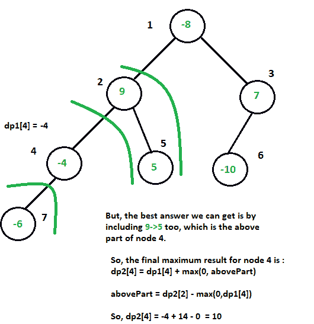

# 每个节点的最大可能和，包括在 N 元树的一段中

> 原文:[https://www . geeksforgeeks . org/每一个节点的最大可能和，方法是将其包含在 n 元树的段中/](https://www.geeksforgeeks.org/maximum-sum-possible-for-every-node-by-including-it-in-a-segment-of-n-ary-tree/)

给定一个包含 **N 个**节点的 [**N 元**](https://www.geeksforgeeks.org/tag/n-ary-tree/) 树和一个表示节点**权重**的数组**权重**，该权重可以是**正**或**负**，每个节点的任务是打印包括当前节点在内的一系列节点可能的**最大和**。

**示例:**

```
Input: N = 7
weight[] = [-8, 9, 7, -4, 5, -10, -6]
N-Ary tree:
                -8
               /   \
              9      7
            /  \    / 
          -4    5 -10
          /
        -6
Output: 13 14 13 10 14 3 4

Explanations:
Node -8: [-8 + 9 + 7 + 5] = 13
Node 9: [9 + 5] = 14
Node 3: [7 + (-8) + 9 + 5] = 13
Node 4: [-4 + 9 + 5] = 10
Node: [5 + 9] = 14
Node 6: [-10 + 7 + (-8) + 9 + 5] = 3
Node 7: [-6 + (-4) + 9 + 5] = 4

Input: N = 6
weight[] = [2, -7, -5, 8, 4, -10]
N-Ary tree:
                 2
               /   \
             -7    -5
             / \     \
            8   4    -10
Output: 7 7 2 8 7 -8
```

**方法:**这个问题可以通过应用两个 [DFS](https://www.geeksforgeeks.org/depth-first-traversal-for-a-graph/) 使用[树上 Dp](https://www.geeksforgeeks.org/dynamic-programming-trees-set-1/)技术来解决。

*   应用第一个 [DFS](https://www.geeksforgeeks.org/depth-first-search-or-dfs-for-a-graph/) 来存储每个节点的最大可能和，方法是将它们与各自的**后继节点**包含在一个序列中。将最大可能金额存储在 **dp1[]中。**阵。
*   第一个 DFS 中每个节点的最大可能值可以通过以下方式获得:

> dp1[节点] +=最大值(0，dp1[child1]，dp1[child2]，…)

*   执行第二次 **Dfs** 更新**dp1【】**中每个节点的最大和，方法是将它们也包含在其**祖先**的序列中。每个节点存储在**dp2【】**中的最大值是所需答案。
*   第二个 DFS 中每个节点的最大可能值可以通过以下方式获得:

> **dp2[node] = dp1[node] +最大值(0，maxsumanceers)**
> 包含或排除其祖先的最大可能和
> 可以得到最佳答案，其中**maxsumanceers = dp2[parent]–最大值(0，dp1[node])** ，即包含或排除 dp1[]
> 中存储的当前节点的最大和的贡献

请参考图示说明，以便更好地理解:



下面是上述方法的实现:

## C++

```
// C++ program to calculate the maximum
// sum possible for every node by including
// it in a segment of the N-Ary Tree
#include <bits/stdc++.h>
using namespace std;

// Stores the maximum
// sum possible for every node
// by including them in a segment
// with their successors
int dp1[100005];

// Stores the maximum
// sum possible for every node
// by including them in a segment
// with their ancestors
int dp2[100005];

// Store the maximum sum
// for every node by
// including it in a
// segment with its successors
void dfs1(int u, int par,
          vector<int> g[],
          int weight[])
{

    dp1[u] = weight[u];
    for (auto c: g[u]) {
        if (c != par) {
            dfs1(c, u, g, weight);
            dp1[u] += max(0, dp1);
        }
    }
}

// Update the maximum sums
// for each node by including
// them in a sequence with
// their ancestors
void dfs2(int u, int par,
          vector<int> g[],
          int weight[])
{
    // Condition to check,
    // if current node is not root
    if (par != 0) {
        int maxSumAncestors = dp2[par]
                              - max(0, dp1[u]);
        dp2[u] = dp1[u] + max(0,
                              maxSumAncestors);
    }
    for (auto c: g[u]) {
        if (c != par) {
            dfs2(c, u, g, weight);
        }
    }
}

// Add edges
void addEdge(int u, int v, vector<int> g[])
{
    g[u].push_back(v);
    g[v].push_back(u);
}

// Function to find the maximum
// answer for each node
void maxSumSegments(vector<int> g[],
                    int weight[],
                    int n)
{

    // Compute the maximum sums
    // with successors
    dfs1(1, 0, g, weight);

    // Store the computed maximums
    for (int i = 1; i <= n; i++) {
        dp2[i] = dp1[i];
    }

    // Update the maximum sums
    // by including their
    // ancestors
    dfs2(1, 0, g, weight);
}

// Print the desired result
void printAns(int n)
{
    for (int i = 1; i <= n; i++) {
        cout << dp2[i] << " ";
    }
}

// Driver Program
int main()
{

    // Number of nodes
    int n = 6;
    int u, v;

    // graph
    vector<int> g[100005];

    // Add edges
    addEdge(1, 2, g);
    addEdge(1, 3, g);
    addEdge(2, 4, g);
    addEdge(2, 5, g);
    addEdge(3, 6, g);
    addEdge(4, 7, g);

    // Weight of each node
    int weight[n + 1];
    weight[1] = -8;
    weight[2] = 9;
    weight[3] = 7;
    weight[4] = -4;
    weight[5] = 5;
    weight[6] = -10;
    weight[7] = -6;

    // Compute the max sum
    // of segments for each
    // node
    maxSumSegments(g, weight, n);

    // Print the answer
    // for every node
    printAns(n);

    return 0;
}
```

## Java 语言(一种计算机语言，尤用于创建网站)

```
// Java program to calculate the maximum
// sum possible for every node by including
// it in a segment of the N-Ary Tree
import java.util.*;
public class Main
{
    // Stores the maximum
    // sum possible for every node
    // by including them in a segment
    // with their successors
    static int[] dp1 = new int[100005];

    // Stores the maximum
    // sum possible for every node
    // by including them in a segment
    // with their ancestors
    static int[] dp2 = new int[100005];

    // Store the maximum sum for every
    // node by including it in a
    // segment with its successors
    static void dfs1(int u, int par,
                     Vector<Vector<Integer>> g,
                     int[] weight)
    {
        dp1[u] = weight[u];

        for(int c = 0; c < g.get(u).size(); c++)
        {
            if (g.get(u).get(c) != par)
            {
                dfs1(g.get(u).get(c), u, g, weight);
                dp1[u] += Math.max(0, dp1[g.get(u).get(c)]);
            }
        }
    }

    // Update the maximum sums
    // for each node by including
    // them in a sequence with
    // their ancestors
    static void dfs2(int u, int par,
                     Vector<Vector<Integer>> g,
                     int[] weight)
    {

        // Condition to check,
        // if current node is not root
        if (par != 0)
        {
            int maxSumAncestors = dp2[par] - Math.max(0, dp1[u]);
            dp2[u] = dp1[u] + Math.max(0, maxSumAncestors);
        }

        for(int c = 0; c < g.get(u).size(); c++)
        {
            if (g.get(u).get(c) != par)
            {
                dfs2(g.get(u).get(c), u, g, weight);
            }
        }
    }

    // Add edges
    static void addEdge(int u, int v, Vector<Vector<Integer>> g)
    {
        g.get(u).add(v);
        g.get(v).add(u);
    }

    // Function to find the maximum
    // answer for each node
    static void maxSumSegments(Vector<Vector<Integer>> g, int[] weight, int n)
    {

        // Compute the maximum sums
        // with successors
        dfs1(1, 0, g, weight);

        // Store the computed maximums
        for(int i = 1; i < n + 1; i++)
            dp2[i] = dp1[i];

        // Update the maximum sums
        // by including their
        // ancestors
        dfs2(1, 0, g, weight);
    }

    // Print the desired result
    static void printAns(int n)
    {
        for(int i = 1; i < n; i++)
            System.out.print(dp2[i] + " ");
    }

    public static void main(String[] args)
    {

        // Number of nodes
        int n = 7;

        // Graph
        Vector<Vector<Integer>> g = new Vector<Vector<Integer>>();
        for(int i = 0; i < 100005; i++)
        {
            g.add(new Vector<Integer>());
        }

        // Add edges
        addEdge(1, 2, g);
        addEdge(1, 3, g);
        addEdge(2, 4, g);
        addEdge(2, 5, g);
        addEdge(3, 6, g);
        addEdge(4, 7, g);

        // Weight of each node
        int[] weight = new int[n + 1];
        weight[1] = -8;
        weight[2] = 9;
        weight[3] = 7;
        weight[4] = -4;
        weight[5] = 5;
        weight[6] = -10;
        weight[7] = -6;

        // Compute the max sum
        // of segments for each
        // node
        maxSumSegments(g, weight, n);

        // Print the answer
        // for every node
        printAns(n);
    }
}

// This code is contributed by divyeshrabadiya07.
```

## 蟒蛇 3

```
# Python3 program to calculate the maximum
# sum possible for every node by including
# it in a segment of the N-Ary Tree

# Stores the maximum
# sum possible for every node
# by including them in a segment
# with their successors
dp1 = [0 for i in range(100005)]

# Stores the maximum sum possible
# for every node by including them
# in a segment with their ancestors
dp2 = [0 for i in range(100005)]

# Store the maximum sum for every
# node by including it in a
# segment with its successors
def dfs1(u, par, g, weight):

    dp1[u] = weight[u]

    for c in g[u]:
        if (c != par):
            dfs1(c, u, g, weight)
            dp1[u] += max(0, dp1)

# Update the maximum sums
# for each node by including
# them in a sequence with
# their ancestors
def dfs2(u, par, g, weight):

    # Condition to check,
    # if current node is not root
    if (par != 0):
        maxSumAncestors = dp2[par] - max(0, dp1[u])
        dp2[u] = dp1[u] + max(0, maxSumAncestors)

    for c in g[u]:
        if (c != par):
            dfs2(c, u, g, weight)

# Add edges
def addEdge(u, v, g):

    g[u].append(v)
    g[v].append(u)

# Function to find the maximum
# answer for each node
def maxSumSegments(g, weight, n):

    # Compute the maximum sums
    # with successors
    dfs1(1, 0, g, weight)

    # Store the computed maximums
    for i in range(1, n + 1):
        dp2[i] = dp1[i]

    # Update the maximum sums
    # by including their
    # ancestors
    dfs2(1, 0, g, weight)

# Print the desired result
def printAns(n):

    for i in range(1, n):
        print(dp2[i], end = ' ')

# Driver code
if __name__=='__main__':

    # Number of nodes
    n = 7
    u = 0
    v = 0

    # Graph
    g = [[] for i in range(100005)]

    # Add edges
    addEdge(1, 2, g)
    addEdge(1, 3, g)
    addEdge(2, 4, g)
    addEdge(2, 5, g)
    addEdge(3, 6, g)
    addEdge(4, 7, g)

    # Weight of each node
    weight=[0 for i in range(n + 1)]
    weight[1] = -8
    weight[2] = 9
    weight[3] = 7
    weight[4] = -4
    weight[5] = 5
    weight[6] = -10
    weight[7] = -6

    # Compute the max sum
    # of segments for each
    # node
    maxSumSegments(g, weight, n)

    # Print the answer
    # for every node
    printAns(n)

# This code is contributed by pratham76
```

## C#

```
// C# program to calculate the maximum
// sum possible for every node by including
// it in a segment of the N-Ary Tree
using System;
using System.Collections.Generic;
class GFG {

    // Stores the maximum
    // sum possible for every node
    // by including them in a segment
    // with their successors
    static int[] dp1 = new int[100005];

    // Stores the maximum
    // sum possible for every node
    // by including them in a segment
    // with their ancestors
    static int[] dp2 = new int[100005];

    // Store the maximum sum for every
    // node by including it in a
    // segment with its successors
    static void dfs1(int u, int par, List<List<int>> g, int[] weight)
    {
        dp1[u] = weight[u];

        for(int c = 0; c < g[u].Count; c++)
        {
            if (g[u] != par)
            {
                dfs1(g[u], u, g, weight);
                dp1[u] += Math.Max(0, dp1[g[u]]);
            }
        }
    }

    // Update the maximum sums
    // for each node by including
    // them in a sequence with
    // their ancestors
    static void dfs2(int u, int par, List<List<int>> g, int[] weight)
    {
        // Condition to check,
        // if current node is not root
        if (par != 0)
        {
            int maxSumAncestors = dp2[par] - Math.Max(0, dp1[u]);
            dp2[u] = dp1[u] + Math.Max(0, maxSumAncestors);
        }

        for(int c = 0; c < g[u].Count; c++)
        {
            if (g[u] != par)
            {
                dfs2(g[u], u, g, weight);
            }
        }
    }

    // Add edges
    static void addEdge(int u, int v, List<List<int>> g)
    {
        g[u].Add(v);
        g[v].Add(u);
    }

    // Function to find the maximum
    // answer for each node
    static void maxSumSegments(List<List<int>> g, int[] weight, int n)
    {

        // Compute the maximum sums
        // with successors
        dfs1(1, 0, g, weight);

        // Store the computed maximums
        for(int i = 1; i < n + 1; i++)
            dp2[i] = dp1[i];

        // Update the maximum sums
        // by including their
        // ancestors
        dfs2(1, 0, g, weight);
    }

    // Print the desired result
    static void printAns(int n)
    {
        for(int i = 1; i < n; i++)
            Console.Write(dp2[i] + " ");
    }

  static void Main() {
    // Number of nodes
    int n = 7;

    // Graph
    List<List<int>> g = new List<List<int>>();
    for(int i = 0; i < 100005; i++)
    {
        g.Add(new List<int>());
    }

    // Add edges
    addEdge(1, 2, g);
    addEdge(1, 3, g);
    addEdge(2, 4, g);
    addEdge(2, 5, g);
    addEdge(3, 6, g);
    addEdge(4, 7, g);

    // Weight of each node
    int[] weight = new int[n + 1];
    weight[1] = -8;
    weight[2] = 9;
    weight[3] = 7;
    weight[4] = -4;
    weight[5] = 5;
    weight[6] = -10;
    weight[7] = -6;

    // Compute the max sum
    // of segments for each
    // node
    maxSumSegments(g, weight, n);

    // Print the answer
    // for every node
    printAns(n);
  }
}

// This code is contributed by divyesh072019.
```

## java 描述语言

```
<script>
    // Javascript program to calculate the maximum
    // sum possible for every node by including
    // it in a segment of the N-Ary Tree

    // Stores the maximum
    // sum possible for every node
    // by including them in a segment
    // with their successors
    let dp1 = [];

    // Stores the maximum
    // sum possible for every node
    // by including them in a segment
    // with their ancestors
    let dp2 = [];

    for(let i = 0; i < 100005; i++)
    {
        dp1.push(0);
        dp2.push(0);
    }

    // Store the maximum sum for every
    // node by including it in a
    // segment with its successors
    function dfs1(u, par, g, weight)
    {
        dp1[u] = weight[u];

        for(let c = 0; c < g[u].length; c++)
        {
            if (g[u] != par)
            {
                dfs1(g[u], u, g, weight);
                dp1[u] += Math.max(0, dp1[g[u]]);
            }
        }
    }

    // Update the maximum sums
    // for each node by including
    // them in a sequence with
    // their ancestors
    function dfs2(u, par, g, weight)
    {
        // Condition to check,
        // if current node is not root
        if (par != 0)
        {
            maxSumAncestors = dp2[par] - Math.max(0, dp1[u]);
            dp2[u] = dp1[u] + Math.max(0, maxSumAncestors);
        }

        for(let c = 0; c < g[u].length; c++)
        {
            if (g[u] != par)
            {
                dfs2(g[u], u, g, weight);
            }
        }
    }

    // Add edges
    function addEdge(u, v, g)
    {
        g[u].push(v);
        g[v].push(u);
    }

    // Function to find the maximum
    // answer for each node
    function maxSumSegments(g, weight, n)
    {
        // Compute the maximum sums
        // with successors
        dfs1(1, 0, g, weight);

        // Store the computed maximums
        for(let i = 1; i < n + 1; i++)
            dp2[i] = dp1[i];

        // Update the maximum sums
        // by including their
        // ancestors
        dfs2(1, 0, g, weight);
    }

    // Print the desired result
    function printAns(n)
    {
        for(let i = 1; i < n; i++)
            document.write(dp2[i] + " ");
    }

    // Number of nodes
    let n = 7, u = 0, v = 0;

    // Graph
    let g = [];
    for(let i = 0; i < 100005; i++)
    {
        g.push([]);
    }

    // Add edges
    addEdge(1, 2, g);
    addEdge(1, 3, g);
    addEdge(2, 4, g);
    addEdge(2, 5, g);
    addEdge(3, 6, g);
    addEdge(4, 7, g);

    // Weight of each node
    let weight = new Array(n + 1);
    weight.fill(0);
    weight[1] = -8;
    weight[2] = 9;
    weight[3] = 7;
    weight[4] = -4;
    weight[5] = 5;
    weight[6] = -10;
    weight[7] = -6;

    // Compute the max sum
    // of segments for each
    // node
    maxSumSegments(g, weight, n);

    // Print the answer
    // for every node
    printAns(n);

// This code is contributed by suresh07.
</script>
```

**Output:**

```
13 14 13 10 14 3
```