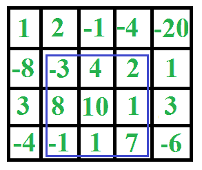

# 2D 矩阵中的最大和矩形| DP-27

> 原文:[https://www . geesforgeks . org/maximum-sum-a-2d-matrix-DP-27/](https://www.geeksforgeeks.org/maximum-sum-rectangle-in-a-2d-matrix-dp-27/)

给定一个 2D 阵列，求其中的最大和子阵列。例如，在下面的 2D 阵列中，最大和子阵列用蓝色矩形突出显示，该子阵列的和为 29。



这个问题主要是[1D 阵列最大和邻接子阵](https://www.geeksforgeeks.org/largest-sum-contiguous-subarray/)的扩展。

这个问题的**天真解决方案**是检查给定 2D 数组中的每个可能的矩形。该解决方案需要 6 个嵌套循环–

*   4 为 2 轴 O(n <sup>4</sup> )的开始和结束坐标
*   子矩阵 0(n<sup>2</sup>之和为 2。

该解决方案的总时间复杂度为 0(n<sup>6</sup>)。

**高效的方法–**
卡丹的一维阵列算法可以用来降低 O(n^3).算法的时间复杂度其思想是逐个固定左列和右列，并为每个左列和右列对找到最大的连续行总和。我们基本上为每个固定的左右列对找到顶部和底部的行号(它们有最大和)。要查找上下行号，请从左到右计算每行中元素的总和，并将这些总和存储在一个数组中，比如 temp[]。所以 temp[i]表示第 I 行从左到右的元素之和，如果我们对 temp[]应用卡丹 1D 算法，得到 temp 的最大和子阵，这个最大和就是以左右为界列的最大可能和。为了得到总的最大和，我们将这个和与目前为止的最大和进行比较。

## C++

```
// Program to find maximum sum subarray
// in a given 2D array
#include <bits/stdc++.h>
using namespace std;

#define ROW 4
#define COL 5

// Implementation of Kadane's algorithm for
// 1D array. The function returns the maximum
// sum and stores starting and ending indexes
// of the maximum sum subarray at addresses
// pointed by start and finish pointers
// respectively.
int kadane(int* arr, int* start, int* finish, int n)
{
    // initialize sum, maxSum and
    int sum = 0, maxSum = INT_MIN, i;

    // Just some initial value to check
    // for all negative values case
    *finish = -1;

    // local variable
    int local_start = 0;

    for (i = 0; i < n; ++i)
    {
        sum += arr[i];
        if (sum < 0)
        {
            sum = 0;
            local_start = i + 1;
        }
        else if (sum > maxSum)
        {
            maxSum = sum;
            *start = local_start;
            *finish = i;
        }
    }

    // There is at-least one
    // non-negative number
    if (*finish != -1)
        return maxSum;

    // Special Case: When all numbers
    // in arr[] are negative
    maxSum = arr[0];
    *start = *finish = 0;

    // Find the maximum element in array
    for (i = 1; i < n; i++)
    {
        if (arr[i] > maxSum)
        {
            maxSum = arr[i];
            *start = *finish = i;
        }
    }
    return maxSum;
}

// The main function that finds
// maximum sum rectangle in M[][]
void findMaxSum(int M[][COL])
{
    // Variables to store the final output
    int maxSum = INT_MIN,
                 finalLeft,
                 finalRight,
                 finalTop,
                 finalBottom;

    int left, right, i;
    int temp[ROW], sum, start, finish;

    // Set the left column
    for (left = 0; left < COL; ++left) {
        // Initialize all elements of temp as 0
        memset(temp, 0, sizeof(temp));

        // Set the right column for the left
        // column set by outer loop
        for (right = left; right < COL; ++right) {

            // Calculate sum between current left
            // and right for every row 'i'
            for (i = 0; i < ROW; ++i)
                temp[i] += M[i][right];

            // Find the maximum sum subarray in temp[].
            // The kadane() function also sets values
            // of start and finish. So 'sum' is sum of
            // rectangle between (start, left) and
            // (finish, right) which is the maximum sum
            // with boundary columns strictly as left
            // and right.
            sum = kadane(temp, &start, &finish, ROW);

            // Compare sum with maximum sum so far.
            // If sum is more, then update maxSum and
            // other output values
            if (sum > maxSum) {
                maxSum = sum;
                finalLeft = left;
                finalRight = right;
                finalTop = start;
                finalBottom = finish;
            }
        }
    }

    // Print final values
    cout << "(Top, Left) ("
         << finalTop << ", "
         << finalLeft
         << ")" << endl;
    cout << "(Bottom, Right) ("
         << finalBottom << ", "
         << finalRight << ")" << endl;
    cout << "Max sum is: " << maxSum << endl;
}

// Driver Code
int main()
{
    int M[ROW][COL] = { { 1, 2, -1, -4, -20 },
                        { -8, -3, 4, 2, 1 },
                        { 3, 8, 10, 1, 3 },
                        { -4, -1, 1, 7, -6 } };

    // Function call
    findMaxSum(M);

    return 0;
}

// This code is contributed by
// rathbhupendra
```

## C

```
// Program to find maximum sum subarray
// in a given 2D array
#include <limits.h>
#include <stdio.h>
#include <string.h>
#define ROW 4
#define COL 5

// Implementation of Kadane's algorithm
// for 1D array. The function returns the
// maximum sum and stores starting and
// ending indexes of the maximum sum subarray
// at addresses pointed by start and finish
// pointers respectively.
int kadane(int* arr, int* start,
           int* finish, int n)
{
    // initialize sum, maxSum and
    int sum = 0, maxSum = INT_MIN, i;

    // Just some initial value to check for all negative
    // values case
    *finish = -1;

    // local variable
    int local_start = 0;

    for (i = 0; i < n; ++i)
    {
        sum += arr[i];
        if (sum < 0) {
            sum = 0;
            local_start = i + 1;
        }
        else if (sum > maxSum)
        {
            maxSum = sum;
            *start = local_start;
            *finish = i;
        }
    }

    // There is at-least one non-negative number
    if (*finish != -1)
        return maxSum;

    // Special Case: When all numbers in arr[]
    // are negative
    maxSum = arr[0];
    *start = *finish = 0;

    // Find the maximum element in array
    for (i = 1; i < n; i++)
    {
        if (arr[i] > maxSum)
        {
            maxSum = arr[i];
            *start = *finish = i;
        }
    }
    return maxSum;
}

// The main function that finds maximum
// sum rectangle in
// M[][]
void findMaxSum(int M[][COL])
{
    // Variables to store the final output
    int maxSum = INT_MIN,
                 finalLeft,
                 finalRight,
                 finalTop,
                 finalBottom;

    int left, right, i;
    int temp[ROW], sum, start, finish;

    // Set the left column
    for (left = 0; left < COL; ++left)
    {
        // Initialize all elements of temp as 0
        memset(temp, 0, sizeof(temp));

        // Set the right column for the left column set by
        // outer loop
        for (right = left; right < COL; ++right) {
            // Calculate sum between current left and right
            // for every row 'i'
            for (i = 0; i < ROW; ++i)
                temp[i] += M[i][right];

            // Find the maximum sum subarray in temp[].
            // The kadane() function also sets values of
            // start and finish.  So 'sum' is sum of
            // rectangle between (start, left) and (finish,
            //  right) which is the maximum sum with boundary
            //  columns strictly as left and right.
            sum = kadane(temp, &start, &finish, ROW);

            // Compare sum with maximum sum so far. If sum
            // is more, then update maxSum and other output
            // values
            if (sum > maxSum)
            {
                maxSum = sum;
                finalLeft = left;
                finalRight = right;
                finalTop = start;
                finalBottom = finish;
            }
        }
    }

    // Print final values
    printf("(Top, Left) (%d, %d)\n", finalTop, finalLeft);
    printf("(Bottom, Right) (%d, %d)\n", finalBottom,
           finalRight);
    printf("Max sum is: %d\n", maxSum);
}

// Driver Code
int main()
{
    int M[ROW][COL] = { { 1, 2, -1, -4, -20 },
                        { -8, -3, 4, 2, 1 },
                        { 3, 8, 10, 1, 3 },
                        { -4, -1, 1, 7, -6 } };

    // Function call
    findMaxSum(M);

    return 0;
}
```

## Java 语言(一种计算机语言，尤用于创建网站)

```
// Java Program to find max sum rectangular submatrix

import java.util.*;
import java.lang.*;
import java.io.*;

class MaximumSumRectangle
{

    // Function to find maximum sum rectangular
    // submatrix
    private static int maxSumRectangle(int[][] mat)
    {
        int m = mat.length;
        int n = mat[0].length;
        int preSum[][] = new int[m + 1][n];

        for (int i = 0; i < m; i++)
        {
            for (int j = 0; j < n; j++)
            {
                preSum[i + 1][j] =
                   preSum[i][j] + mat[i][j];
            }
        }

        int maxSum = -1;
        int minSum = Integer.MIN_VALUE;
        int negRow = 0, negCol = 0;
        int rStart = 0, rEnd = 0, cStart = 0, cEnd = 0;
        for (int rowStart = 0;
             rowStart < m;
             rowStart++)
        {
            for (int row = rowStart; row < m; row++)
            {
                int sum = 0;
                int curColStart = 0;
                for (int col = 0; col < n; col++)
                {
                    sum += preSum[row + 1][col]
                           - preSum[rowStart][col];
                    if (sum < 0) {
                        if (minSum < sum) {
                            minSum = sum;
                            negRow = row;
                            negCol = col;
                        }
                        sum = 0;
                        curColStart = col + 1;
                    }
                    else if (maxSum < sum)
                    {
                        maxSum = sum;
                        rStart = rowStart;
                        rEnd = row;
                        cStart = curColStart;
                        cEnd = col;
                    }
                }
            }
        }

        // Printing final values
        if (maxSum == -1) {
            System.out.println("from row - " + negRow
                               + " to row - " + negRow);
            System.out.println("from col - " + negCol
                               + " to col - " + negCol);
        }
        else {
            System.out.println("from row - " + rStart
                               + " to row - " + rEnd);
            System.out.println("from col - " + cStart
                               + " to col - " + cEnd);
        }
        return maxSum == -1 ? minSum : maxSum;
    }

    // Driver Code
    public static void main(String[] args)
    {
        int arr[][] = new int[][] { { 1, 2, -1, -4, -20 },
                                    { -8, -3, 4, 2, 1 },
                                    { 3, 8, 10, 1, 3 },
                                    { -4, -1, 1, 7, -6 } };

        // Function call
        System.out.println(maxSumRectangle(arr));
    }
}

// This code is contributed by Nayanava De
```

## 蟒蛇 3

```
# Python3 program to find maximum sum
# subarray in a given 2D array

# Implementation of Kadane's algorithm
# for 1D array. The function returns the
# maximum sum and stores starting and
# ending indexes of the maximum sum subarray
# at addresses pointed by start and finish
# pointers respectively.

def kadane(arr, start, finish, n):

    # initialize sum, maxSum and
    Sum = 0
    maxSum = -999999999999
    i = None

    # Just some initial value to check
    # for all negative values case
    finish[0] = -1

    # local variable
    local_start = 0

    for i in range(n):
        Sum += arr[i]
        if Sum < 0:
            Sum = 0
            local_start = i + 1
        elif Sum > maxSum:
            maxSum = Sum
            start[0] = local_start
            finish[0] = i

    # There is at-least one
    # non-negative number
    if finish[0] != -1:
        return maxSum

    # Special Case: When all numbers
    # in arr[] are negative
    maxSum = arr[0]
    start[0] = finish[0] = 0

    # Find the maximum element in array
    for i in range(1, n):
        if arr[i] > maxSum:
            maxSum = arr[i]
            start[0] = finish[0] = i
    return maxSum

# The main function that finds maximum
# sum rectangle in M[][]

def findMaxSum(M):
    global ROW, COL

    # Variables to store the final output
    maxSum, finalLeft = -999999999999, None
    finalRight, finalTop, finalBottom = None, None, None
    left, right, i = None, None, None

    temp = [None] * ROW
    Sum = 0
    start = [0]
    finish = [0]

    # Set the left column
    for left in range(COL):

        # Initialize all elements of temp as 0
        temp = [0] * ROW

        # Set the right column for the left
        # column set by outer loop
        for right in range(left, COL):

            # Calculate sum between current left
            # and right for every row 'i'
            for i in range(ROW):
                temp[i] += M[i][right]

            # Find the maximum sum subarray in
            # temp[]. The kadane() function also
            # sets values of start and finish.
            # So 'sum' is sum of rectangle between
            # (start, left) and (finish, right) which
            # is the maximum sum with boundary columns
            # strictly as left and right.
            Sum = kadane(temp, start, finish, ROW)

            # Compare sum with maximum sum so far.
            # If sum is more, then update maxSum
            # and other output values
            if Sum > maxSum:
                maxSum = Sum
                finalLeft = left
                finalRight = right
                finalTop = start[0]
                finalBottom = finish[0]

    # Prfinal values
    print("(Top, Left)", "(", finalTop,
          finalLeft, ")")
    print("(Bottom, Right)", "(", finalBottom,
          finalRight, ")")
    print("Max sum is:", maxSum)

# Driver Code
ROW = 4
COL = 5
M = [[1, 2, -1, -4, -20],
     [-8, -3, 4, 2, 1],
     [3, 8, 10, 1, 3],
     [-4, -1, 1, 7, -6]]

# Function call
findMaxSum(M)

# This code is contributed by PranchalK
```

## C#

```
// C# Given a 2D array, find the
// maximum sum subarray in it
using System;

class GFG {

    /**
     * To find maxSum in 1d array
     *
     * return {maxSum, left, right}
     */
    public static int[] kadane(int[] a)
    {
        int[] result = new int[] { int.MinValue, 0, -1 };
        int currentSum = 0;
        int localStart = 0;

        for (int i = 0; i < a.Length; i++)
        {
            currentSum += a[i];
            if (currentSum < 0)
            {
                currentSum = 0;
                localStart = i + 1;
            }
            else if (currentSum > result[0])
            {
                result[0] = currentSum;
                result[1] = localStart;
                result[2] = i;
            }
        }

        // all numbers in a are negative
        if (result[2] == -1)
        {
            result[0] = 0;
            for (int i = 0; i < a.Length; i++)
            {
                if (a[i] > result[0]) {
                    result[0] = a[i];
                    result[1] = i;
                    result[2] = i;
                }
            }
        }
        return result;
    }

    /**
    * To find and print maxSum,
     (left, top),(right, bottom)
    */
    public static void findMaxSubMatrix(int[, ] a)
    {
        int cols = a.GetLength(1);
        int rows = a.GetLength(0);
        int[] currentResult;
        int maxSum = int.MinValue;
        int left = 0;
        int top = 0;
        int right = 0;
        int bottom = 0;

        for (int leftCol = 0; leftCol < cols; leftCol++)
        {
            int[] tmp = new int[rows];

            for (int rightCol = leftCol; rightCol < cols;
                 rightCol++)
            {

                for (int i = 0; i < rows; i++)
                {
                    tmp[i] += a[i, rightCol];

                }
                currentResult = kadane(tmp);
                if (currentResult[0] > maxSum)
                {
                    maxSum = currentResult[0];
                    left = leftCol;
                    top = currentResult[1];
                    right = rightCol;
                    bottom = currentResult[2];
                }
            }
        }

        Console.Write("MaxSum: " + maxSum + ", range: [("
                      + left + ", " + top + ")(" + right
                      + ", " + bottom + ")]");
    }

    // Driver Code
    public static void Main()
    {
        int[, ] arr = { { 1, 2, -1, -4, -20 },
                        { -8, -3, 4, 2, 1 },
                        { 3, 8, 10, 1, 3 },
                        { -4, -1, 1, 7, -6 } };

        // Function call
        findMaxSubMatrix(arr);
    }
}

// This code is contributed
// by PrinciRaj1992
```

## java 描述语言

```
<script>

// Program to find maximum sum subarray
// in a given 2D array

var ROW = 4
var COL = 5
var start = 0
var finish = 0

// Implementation of Kadane's algorithm for
// 1D array. The function returns the maximum
// sum and stores starting and ending indexes
// of the maximum sum subarray at addresses
// pointed by start and finish pointers
// respectively.
function kadane(arr, n)
{
    // initialize sum, maxSum and
    var sum = 0, maxSum = -1000000000, i;

    // Just some initial value to check
    // for all negative values case
    finish = -1;

    // local variable
    var local_start = 0;

    for (i = 0; i < n; ++i)
    {
        sum += arr[i];
        if (sum < 0)
        {
            sum = 0;
            local_start = i + 1;
        }
        else if (sum > maxSum)
        {
            maxSum = sum;
            start = local_start;
            finish = i;
        }
    }

    // There is at-least one
    // non-negative number
    if (finish != -1)
        return maxSum;

    // Special Case: When all numbers
    // in arr[] are negative
    maxSum = arr[0];
    start = finish = 0;

    // Find the maximum element in array
    for (i = 1; i < n; i++)
    {
        if (arr[i] > maxSum)
        {
            maxSum = arr[i];
            start = finish = i;
        }
    }
    return maxSum;
}

// The main function that finds
// maximum sum rectangle in M[][]
function findMaxSum(M)
{
    // Variables to store the final output
    var maxSum = -1000000000,
                 finalLeft=0,
                 finalRight=0,
                 finalTop=0,
                 finalBottom=0;

    var left, right, i;
    var temp = Array(ROW);
    var sum;

    // Set the left column
    for (left = 0; left < COL; ++left) {
        // Initialize all elements of temp as 0
        temp = Array(ROW).fill(0);

        // Set the right column for the left
        // column set by outer loop
        for (right = left; right < COL; ++right) {

            // Calculate sum between current left
            // and right for every row 'i'
            for (i = 0; i < ROW; ++i)
                temp[i] += M[i][right];

            // Find the maximum sum subarray in temp[].
            // The kadane() function also sets values
            // of start and finish. So 'sum' is sum of
            // rectangle between (start, left) and
            // (finish, right) which is the maximum sum
            // with boundary columns strictly as left
            // and right.
            sum = kadane(temp, ROW);

            // Compare sum with maximum sum so far.
            // If sum is more, then update maxSum and
            // other output values
            if (sum > maxSum) {
                maxSum = sum;
                finalLeft = left;
                finalRight = right;
                finalTop = start;
                finalBottom = finish;
            }
        }
    }

    // Print final values
    document.write("(Top, Left) ("
         + finalTop + ", "
         + finalLeft
         + ")" + "<br>");
    document.write("(Bottom, Right) ("
         + finalBottom + ", "
         + finalRight + ")" + "<br>");
    document.write("Max sum is: " + maxSum + "<br>");
}

// Driver Code
var M = [ [ 1, 2, -1, -4, -20 ],
                    [ -8, -3, 4, 2, 1 ],
                    [ 3, 8, 10, 1, 3 ],
                    [ -4, -1, 1, 7, -6 ] ];
// Function call
findMaxSum(M);

// This code is contributed by rutvik_56.
</script>
```

**Output**

```
(Top, Left) (1, 1)
(Bottom, Right) (3, 3)
Max sum is: 29
```

**时间复杂度:** O(n <sup>3</sup>

本文由[aashis Barnwal](https://www.facebook.com/barnwal.aashish?fref=ts)编辑。如果你发现任何不正确的地方，或者你想分享更多关于上面讨论的话题的信息，请写评论。