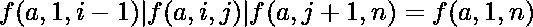
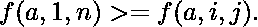
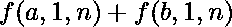

# 两个不同阵列的子阵列的最大或和

> 原文:[https://www . geesforgeks . org/maximum-sum-sub-arrays-two-different-arrays/](https://www.geeksforgeeks.org/maximum-sum-sub-arrays-two-different-arrays/)

给定两个正整数数组。从每个阵列中选择两个大小相等的子阵列，并计算两个子阵列的最大可能或和。
**注:**让 f(x，l，r)为数组 x 中[l，r]范围内所有元素的 OR 和。
**例:**

```
Input : A[] = {1, 2, 4, 3, 2}
        B[] = {2, 3, 3, 12, 1}
Output : 22
Explanation: Here, one way to get maximum
sum is to select sub-array [l = 2, r = 4]
f(A, 2, 4) = 2|4|3 = 7
f(B, 2, 4) = 3|3|12 = 15
So, f(A, 2, 4) + f(B, 2, 4) = 7 + 15 = 22.
This sum can be achieved in many other ways.

Input : A[] = {1, 2, 2}
        B[] = {2, 1, 3}
Output : 6
```

观察按位或运算符的运算。如果我们取两个整数 X 和 Y，那么(X|Y >= X)。举几个例子就可以证明。让我们用上面的公式推导出一个公式。

和同样
从上面两个方程中，
那么，我们在取整个数组的 OR 时得到最大和——>
下面是上面方法的实现:

## C++

```
// CPP program to find maximum OR sum
#include <bits/stdc++.h>
using namespace std;

// function to find maximum OR sum
void MaximumSum(int a[], int b[], int n)
{
    int sum1 = 0, sum2 = 0;

    // OR sum of all the elements
    // in both arrays
    for (int i = 0; i < n; i++) {
        sum1 |= a[i];
        sum2 |= b[i];
    }
    cout << sum1 + sum2 << endl;
}

// Driver Code
int main()
{
    int A[] = { 1, 2, 4, 3, 2 };
    int B[] = { 2, 3, 3, 12, 1 };
    int n = sizeof(A) / sizeof(A[0]);
    MaximumSum(A, B, n);
    return 0;
}
```

## Java 语言(一种计算机语言，尤用于创建网站)

```
// Java program to find maximum OR sum

class GFG {

// function to find maximum OR sum
static void MaximumSum(int a[], int b[], int n)
{
    int sum1 = 0, sum2 = 0;

    // OR sum of all the elements
    // in both arrays
    for (int i = 0; i < n; i++) {
    sum1 |= a[i];
    sum2 |= b[i];
    }
    System.out.println(sum1 + sum2);
}

// Driver code
public static void main(String arg[])
{
    int A[] = {1, 2, 4, 3, 2};
    int B[] = {2, 3, 3, 12, 1};
    int n = A.length;
    MaximumSum(A, B, n);
}
}

// This code is contributed by Anant Agarwal.
```

## 蟒蛇 3

```
# Python 3 program to
# find maximum OR sum

# function to find
# maximum OR sum
def MaximumSum(a, b, n):

    sum1 = 0
    sum2 = 0

    # OR sum of all the
    # elements in both arrays
    for i in range(0, n):
        sum1 |= a[i]
        sum2 |= b[i]

    print(sum1 + sum2)

# Driver Code
A = [ 1, 2, 4, 3, 2 ]
B = [ 2, 3, 3, 12, 1 ]
n = len(A)

MaximumSum(A, B, n)

# This code is contributed by Smitha Dinesh Semwal
```

## C#

```
// C# program to find maximum OR sum
using System;

class GFG {

    // function to find maximum OR sum
    static void MaximumSum(int []a, int []b, int n)
    {
        int sum1 = 0, sum2 = 0;

        // OR sum of all the elements
        // in both arrays
        for (int i = 0; i < n; i++)
        {
            sum1 |= a[i];
            sum2 |= b[i];
        }
        Console.WriteLine(sum1 + sum2);
    }

    // Driver code
    public static void Main()
    {
        int []A = {1, 2, 4, 3, 2};
        int []B = {2, 3, 3, 12, 1};
        int n = A.Length;
        MaximumSum(A, B, n);
    }
}

// This code is contributed by Vt_m.
```

## 服务器端编程语言（Professional Hypertext Preprocessor 的缩写）

```
<?php
// PHP program to find maximum OR sum

// function to find maximum OR sum
function MaximumSum($a, $b, $n)
{
    $sum1 = 0;
    $sum2 = 0;

    // OR sum of all the elements
    // in both arrays
    for ($i = 0; $i < $n; $i++)
    {
        $sum1 |= $a[$i];
        $sum2 |= $b[$i];
    }
    echo ($sum1 + $sum2)."\n";
}

// Driver Code
$A = array(1, 2, 4, 3, 2 );
$B = array(2, 3, 3, 12, 1 );
$n = sizeof($A) / sizeof($A[0]);
MaximumSum($A, $B, $n);

// This code is contributed by mits

?>
```

## java 描述语言

```
<script>

// JavaScript program to find maximum OR sum

// function to find maximum OR sum
function MaximumSum(a, b, n)
{
    let sum1 = 0, sum2 = 0;

    // OR sum of all the elements
    // in both arrays
    for (let i = 0; i < n; i++) {
    sum1 |= a[i];
    sum2 |= b[i];
    }
    document.write(sum1 + sum2);
}

// Driver code

    let A = [1, 2, 4, 3, 2];
    let B = [2, 3, 3, 12, 1];
    let n = A.length;
    MaximumSum(A, B, n);

</script>
```

**输出:**

```
 22
```

**时间复杂度:** O(n)

**辅助空间:** O(1)