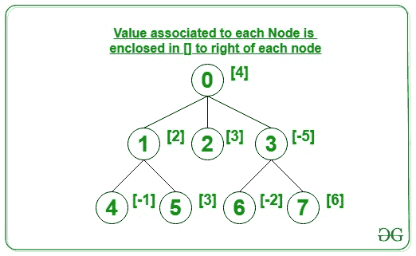
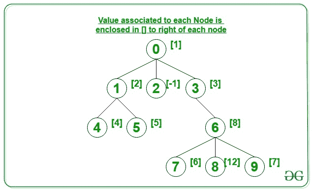

# N 元树中每一级的最大值

> 原文:[https://www . geesforgeks . org/每层最大值树/](https://www.geeksforgeeks.org/maximum-value-at-each-level-in-an-n-ary-tree/)

给定由范围**【0，N–1】**中的节点组成的 [N 元树](https://www.geeksforgeeks.org/generic-treesn-array-trees/)和数组 **arr[]** ，其中每个节点 **i** 与值 **arr[i]** 相关联，任务是打印与给定 **N 元树**的每个级别的任何节点相关联的最大值。

**示例:**

> **输入:** N = 8，边[][] = {{0，1}，{0，2}，{0，3}，{1，4}，{1，5}，{3，6}，{6，7}}，
> arr[] = {4，2，3，-5，-1，3，-2，6}
> **输出:** 4 3 6
> **解释:**
> 下面是给定的 N 元树:
> 
> 
> 
> 第 0<sup>级所有节点的最大值为 4。
> 1<sup>圣</sup>级所有节点的最大值为 3。
> 2<sup>和</sup>级所有节点的最大值为 6。</sup>
> 
> **输入:** N = 10，Edges[][] = {{0，1}，{0，2}，{0，3}，{1，4}，{1，5}，{3，6}，{6，7}，{6，8}，{6，9}，
> arr[] = {1，2，-1，3，4，5，8，6，12，7}
> **输出:** 1 3 8 12
> **解释:【T8**
> 
> 
> 
> 第 0<sup>级所有节点的最大值为 1。
> 1<sup>圣</sup>级所有节点的最大值为 3。
> 2<sup>和</sup>级所有节点的最大值为 8。
> 3<sup>rd</sup>级所有节点的最大值为 12。</sup>

**方法:**这个问题可以通过执行给定树的[级顺序遍历来解决。遍历树时，分别处理每个级别的节点。对于正在处理的每个级别，计算该级别中所有节点的最大值。请遵循以下步骤:](https://www.geeksforgeeks.org/level-order-tree-traversal/)

1.  将当前级别的所有子节点存储在[队列](https://www.geeksforgeeks.org/queue-data-structure/)中，并逐个弹出当前级别的节点。
2.  找出当前级别所有弹出节点的最大值。
3.  打印在上述步骤中获得的最大值。
4.  对给定树的每个级别按照上述步骤操作，并分别打印每个级别的最大值。

下面是上述方法的实现:

## C++

```
// C++ program for the above approach

#include <bits/stdc++.h>
using namespace std;

// Function to find the maximum value
// at each level of N-ary tree
int maxAtLevel(int N, int M,
               vector<int> Value,
               int Edges[][2])
{
    // Stores the adjacency list
    vector<int> adj[N];

    // Create the adjacency list
    for (int i = 0; i < M; i++) {
        int u = Edges[i][0];
        int v = Edges[i][1];
        adj[u].push_back(v);
    }

    // Perform level order traversal
    // of nodes at each level
    queue<int> q;

    // Push the root node
    q.push(0);

    // Iterate until queue is empty
    while (!q.empty()) {

        // Get the size of queue
        int count = q.size();

        int maxVal = 0;

        // Iterate for all the nodes
        // in the queue currently
        while (count--) {

            // Dequeue an node from queue
            int temp = q.front();
            q.pop();

            maxVal = max(maxVal,
                         Value[temp]);

            // Enqueue the children of
            // dequeued node
            for (int i = 0;
                 i < adj[temp].size();
                 i++) {
                q.push(adj[temp][i]);
            }
        }

        // Print the result
        cout << maxVal << " ";
    }
}

// Driver Code
int main()
{
    // Number of nodes
    int N = 10;

    // Edges of the N-ary tree
    int Edges[][2] = { { 0, 1 }, { 0, 2 },
                       { 0, 3 }, { 1, 4 },
                       { 1, 5 }, { 3, 6 },
                       { 6, 7 }, { 6, 8 },
                       { 6, 9 } };

    // Given cost
    vector<int> Value = { 1, 2, -1, 3, 4,
                          5, 8, 6, 12, 7 };

    // Function Call
    maxAtLevel(N, N - 1, Value, Edges);

    return 0;
}
```

## Java 语言(一种计算机语言，尤用于创建网站)

```
// Java program for
// the above approach
import java.util.*;
class GFG{

// Function to find the maximum value
// at each level of N-ary tree
static void maxAtLevel(int N, int M,
                       int []Value,
                       int Edges[][])
{
  // Stores the adjacency list
  Vector<Integer> []adj = new Vector[N];

  for (int i = 0; i < adj.length; i++)
    adj[i] = new Vector<Integer>();

  // Create the adjacency list
  for (int i = 0; i < M; i++)
  {
    int u = Edges[i][0];
    int v = Edges[i][1];
    adj[u].add(v);
  }

  // Perform level order traversal
  // of nodes at each level
  Queue<Integer> q = new LinkedList<>();

  // Push the root node
  q.add(0);

  // Iterate until queue is empty
  while (!q.isEmpty())
  {
    // Get the size of queue
    int count = q.size();

    int maxVal = 0;

    // Iterate for all the nodes
    // in the queue currently
    while (count-- > 0)
    {
      // Dequeue an node from queue
      int temp = q.peek();
      q.remove();

      maxVal = Math.max(maxVal, Value[temp]);

      // Enqueue the children of
      // dequeued node
      for (int i = 0;
               i < adj[temp].size(); i++)
      {
        q.add(adj[temp].get(i));
      }
    }

    // Print the result
    System.out.print(maxVal + " ");
  }
}

// Driver Code
public static void main(String[] args)
{
  // Number of nodes
  int N = 10;

  // Edges of the N-ary tree
  int Edges[][] = {{0, 1}, {0, 2},
                   {0, 3}, {1, 4},
                   {1, 5}, {3, 6},
                   {6, 7}, {6, 8},
                   {6, 9}};

  // Given cost
  int []Value = {1, 2, -1, 3, 4,
                 5, 8, 6, 12, 7};

  // Function Call
  maxAtLevel(N, N - 1, Value, Edges);
}
}

// This code is contributed by 29AjayKumar
```

## 蟒蛇 3

```
# Python3 program for the above approach

# Function to find the maximum value
# at each level of N-ary tree
def maxAtLevel(N, M, Value, Edges):

    # Stores the adjacency list
    adj = [[] for i in range(N)]

    # Create the adjacency list
    for i in range(M):
        u = Edges[i][0]
        v = Edges[i][1]
        adj[u].append(v)

    # Perform level order traversal
    # of nodes at each level
    q = []

    # Push the root node
    q.append(0)

    # Iterate until queue is empty
    while (len(q)):

        # Get the size of queue
        count = len(q)

        maxVal = 0

        # Iterate for: all the nodes
        # in the queue currently
        while (count):

            # Dequeue an node from queue
            temp = q[0]
            q.remove(q[0])

            maxVal = max(maxVal, Value[temp])

            # Enqueue the children of
            # dequeued node
            for i in range(len(adj[temp])):
                q.append(adj[temp][i])

            count -= 1

        # Print the result
        print(maxVal, end = " ")

# Driver Code
if __name__ == '__main__':

    # Number of nodes
    N = 10

    # Edges of the N-ary tree
    Edges = [ [ 0, 1 ], [ 0, 2 ],
              [ 0, 3 ], [ 1, 4 ],
              [ 1, 5 ], [ 3, 6 ],
              [ 6, 7 ], [ 6, 8 ],
              [ 6, 9 ] ]

    # Given cost
    Value = [ 1, 2, -1, 3, 4,
              5, 8, 6, 12, 7 ]

    # Function Call
    maxAtLevel(N, N - 1, Value, Edges)

# This code is contributed by ipg2016107
```

## C#

```
// C# program for
// the above approach
using System;
using System.Collections.Generic;
class GFG{

// Function to find the
// maximum value at each
// level of N-ary tree
static void maxAtLevel(int N, int M,
                       int []Value,
                       int [,]Edges)
{
  // Stores the adjacency list
  List<int> []adj = new List<int>[N];

  for (int i = 0; i < adj.Length; i++)
    adj[i] = new List<int>();

  // Create the adjacency list
  for (int i = 0; i < M; i++)
  {
    int u = Edges[i, 0];
    int v = Edges[i, 1];
    adj[u].Add(v);
  }

  // Perform level order traversal
  // of nodes at each level
  Queue<int> q = new Queue<int>();

  // Push the root node
  q.Enqueue(0);

  // Iterate until queue is empty
  while (q.Count != 0)
  {
    // Get the size of queue
    int count = q.Count;

    int maxVal = 0;

    // Iterate for all the nodes
    // in the queue currently
    while (count-- > 0)
    {
      // Dequeue an node from queue
      int temp = q.Peek();
      q.Dequeue();

      maxVal = Math.Max(maxVal,
                        Value[temp]);

      // Enqueue the children of
      // dequeued node
      for (int i = 0;
               i < adj[temp].Count; i++)
      {
        q.Enqueue(adj[temp][i]);
      }
    }

    // Print the result
    Console.Write(maxVal + " ");
  }
}

// Driver Code
public static void Main(String[] args)
{
  // Number of nodes
  int N = 10;

  // Edges of the N-ary tree
  int [,]Edges = {{0, 1}, {0, 2},
                  {0, 3}, {1, 4},
                  {1, 5}, {3, 6},
                  {6, 7}, {6, 8},
                  {6, 9}};

  // Given cost
  int []Value = {1, 2, -1, 3, 4,
                 5, 8, 6, 12, 7};

  // Function Call
  maxAtLevel(N, N - 1, Value, Edges);
}
}

// This code is contributed by 29AjayKumar
```

## java 描述语言

```
<script>

// Javascript program for the above approach

// Function to find the maximum value
// at each level of N-ary tree
function maxAtLevel(N, M, Value, Edges)
{

    // Stores the adjacency list
    let adj = new Array(N);

    for(let i = 0; i < adj.length; i++)
        adj[i] = [];

    // Create the adjacency list
    for(let i = 0; i < M; i++)
    {
        let u = Edges[i][0];
        let v = Edges[i][1];
        adj[u].push(v);
    }

    // Perform level order traversal
    // of nodes at each level
    let q = [];

    // Push the root node
    q.push(0);

    // Iterate until queue is empty
    while (q.length > 0)
    {

        // Get the size of queue
        let count = q.length;

        let maxVal = 0;

        // Iterate for all the nodes
        // in the queue currently
        while (count-- > 0)
        {

            // Dequeue an node from queue
            let temp = q[0];
            q.shift();

            maxVal = Math.max(maxVal, Value[temp]);

            // Enqueue the children of
            // dequeued node
            for(let i = 0; i < adj[temp].length; i++)
            {
                q.push(adj[temp][i]);
            }
        }

        // Print the result
        document.write(maxVal + " ");
    }
}

// Driver code

// Number of nodes
let N = 10;

// Edges of the N-ary tree
let Edges = [ [ 0, 1 ], [ 0, 2 ],
              [ 0, 3 ], [ 1, 4 ],
              [ 1, 5 ], [ 3, 6 ],
              [ 6, 7 ], [ 6, 8 ],
              [ 6, 9 ] ];

// Given cost
let Value = [ 1, 2, -1, 3, 4,
              5, 8, 6, 12, 7 ];

// Function Call
maxAtLevel(N, N - 1, Value, Edges);

// This code is contributed by suresh07

</script>
```

**Output:** 

```
1 3 8 12
```

***时间复杂度:**O(N)*
T5**辅助空间:** O(N)