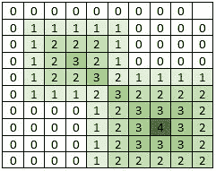

# 包含相交同心子矩阵的矩阵中的最大值

> 原文:[https://www . geesforgeks . org/矩阵中最大值-包含-相交-同心-子矩阵/](https://www.geeksforgeeks.org/maximum-value-in-a-matrix-which-contain-intersecting-concentric-submatrix/)

假设一个大小为 **N X N** 的矩阵，其中包含以 **(x <sub>i</sub> 、y <sub>i</sub> )** 为中心的同心正方形子矩阵，其中 x <sub>i</sub> 为同心正方形矩阵的中心行数，y <sub>i</sub> 为同心正方形矩阵的中心列数。同心方形矩阵的形式为:

```
0 0 0 0 0 0 0 0 0
0 1 1 1 1 1 1 1 0
0 1 . . . . . 1 0 
0 1 . b b b . 1 0
0 1 . b a b . 1 0
0 1 . b b b . 1 0
0 1 . . . . . 1 0
0 1 1 1 1 1 1 1 0
0 0 0 0 0 0 0 0 0
```

其中 a 是中心，b 是 a–1，该值将随着行或列的增加而减小。
由于存在多个这样的子矩阵，因此存在作为多个这样的子矩阵的一部分的单元。这些单元格的值等于相交子矩阵的值之和。给定 **N、m、(x <sub>i</sub> 、y <sub>i</sub> 、a <sub>i</sub> )** 的值，其中 1 < = i < = m，a <sub>i</sub> 是同心子矩阵中心的值。任务是在包含子矩阵的矩阵中找到最大值。
所以，在
**之后的例子:**

```
Input : N = 10, m = 2
        (x1, y1, a1) = (3, 3, 3)
        (x2, y2, a2) = (7, 7, 4)
Output : 4
Maxtrix that will be form:
```



```
Input : N = 10, m = 1
        (x1, y1, a1) = (4, 5, 6)
Output : 6
```

其思想是制作一个 2D 矩阵**mat【】【】【】**求每个像元的值，包括有多个同心子矩阵交集的像元。现在，每个单元格的观察值可以通过 max(0，a–max(p–x<sub>I</sub>，q–y<sub>I</sub>)找到，其中 a 是第 I 个同心子矩阵中心的值，p 是单元格的行号，q 是单元格的列号，而(x <sub>i</sub> ，y <sub>i</sub> 是第 I 个同心子矩阵中心的中心位置。所以，在找到矩阵 mat[][]之后，我们将遍历矩阵以找到矩阵中的最大值。
下面是这种方法的 C++实现:

## C++

```
//C++ Program to find the maximum value in a matrix
//which contain intersecting concentric submatrix
#include <bits/stdc++.h>
using namespace std;
#define MAXN 100

// Return the maximum value in intersecting
// concentric submatrix.
int maxValue(int n, int m, int x[], int y[], int a[])
{
    int c[MAXN][MAXN] = { 0 };

    // For each center of concentric sub-matrix.
    for (int i = 0; i < m; ++i) {

        // for each row
        for (int p = 0; p < n; ++p) {

            // for each column
            for (int q = 0; q < n; ++q) {

                // finding x distance.
                int dx = abs(p - x[i]);

                // finding y distance.
                int dy = abs(q - y[i]);

                // maximum of x distance and y distance
                int d = max(dx, dy);

                // assigning the value.
                c[p][q] += max(0, a[i] - d);
            }
        }
    }

    // Finding the maximum value in the formed matrix.
    int res = 0;
    for (int i = 0; i < n; ++i) {
        for (int j = 0; j < n; ++j) {
            res = max(res, c[i][j]);
        }
    }
    return res;
}

// Driven Program
int main()
{
    int n = 10;
    int m = 2;
    int x[] = { 3, 7 };
    int y[] = { 3, 7 };
    int a[] = { 4, 3 };

    cout << maxValue(n, m, x, y, a) << endl;
    return 0;
}
```

## Java 语言(一种计算机语言，尤用于创建网站)

```
// Java Program to find the
// maximum value in a matrix
// which contain intersecting
// concentric submatrix
import java.io.*;

class GFG
{
static int MAXN = 100;

// Return the maximum value
// in intersecting
// concentric submatrix.
static int maxValue(int n, int m,
                    int x[], int y[],
                    int a[])
{
    int c[][] = new int[MAXN][MAXN];

    // For each center of
    // concentric sub-matrix.
    for (int i = 0; i < m; ++i)
    {

        // for each row
        for (int p = 0; p < n; ++p)
        {

            // for each column
            for (int q = 0; q < n; ++q)
            {

                // finding x distance.
                int dx = Math.abs(p - x[i]);

                // finding y distance.
                int dy = Math.abs(q - y[i]);

                // maximum of x distance
                // and y distance
                int d = Math.max(dx, dy);

                // assigning the value.
                c[p][q] += Math.max(0, a[i] - d);
            }
        }
    }

    // Finding the maximum
    // value in the formed matrix.
    int res = 0;
    for (int i = 0; i < n; ++i)
    {
        for (int j = 0; j < n; ++j)
        {
            res = Math.max(res, c[i][j]);
        }
    }
    return res;
}

// Driven Code
public static void main (String[] args)
{
    int n = 10;
    int m = 2;
    int x[] = { 3, 7 };
    int y[] = { 3, 7 };
    int a[] = { 4, 3 };

    System.out.println(maxValue(n, m, x,
                                 y, a));
}
}

// This code is contributed by anuj_67.
```

## 蟒蛇 3

```
# Python 3 Program to find the maximum
# value in a matrix which contain
# intersecting concentric submatrix
MAXN = 100

# Return the maximum value in intersecting
# concentric submatrix.
def maxValue( n, m, x, y, a):

    c = [[0 for x in range(MAXN)]
            for y in range(MAXN)]

    # For each center of concentric sub-matrix.
    for i in range( m):

        # for each row
        for p in range(n) :

            # for each column
            for q in range( n) :

                # finding x distance.
                dx = abs(p - x[i])

                # finding y distance.
                dy = abs(q - y[i])

                # maximum of x distance and y distance
                d = max(dx, dy)

                # assigning the value.
                c[p][q] += max(0, a[i] - d)

    # Finding the maximum value in
    # the formed matrix.
    res = 0
    for i in range(n) :
        for j in range(n) :
            res = max(res, c[i][j])
    return res

# Driver Code
if __name__ == "__main__":

    n = 10
    m = 2
    x = [ 3, 7 ]
    y = [ 3, 7 ]
    a = [ 4, 3 ]

    print(maxValue(n, m, x, y, a))

# This code is contributed by ita_c
```

## C#

```
// C# Program to find the maximum
// value in a matrix which contain
// intersecting concentric submatrix
using System;

class GFG
{
static int MAXN = 100;

// Return the maximum value in intersecting
// concentric submatrix.
static int maxValue(int n, int m,
                    int[] x, int[] y,
                    int[] a)
{
    int[,] c = new int[MAXN, MAXN];

    // For each center of
    // concentric sub-matrix.
    for (int i = 0; i < m; ++i)
    {

        // for each row
        for (int p = 0; p < n; ++p)
        {

            // for each column
            for (int q = 0; q < n; ++q)
            {

                // finding x distance.
                int dx = Math.Abs(p - x[i]);

                // finding y distance.
                int dy = Math.Abs(q - y[i]);

                // maximum of x distance
                // and y distance
                int d = Math.Max(dx, dy);

                // assigning the value.
                c[p,q] += Math.Max(0, a[i] - d);
            }
        }
    }

    // Finding the maximum
    // value in the formed matrix.
    int res = 0;
    for (int i = 0; i < n; ++i)
    {
        for (int j = 0; j < n; ++j)
        {
            res = Math.Max(res, c[i, j]);
        }
    }
    return res;
}

// Driver Code
public static void Main ()
{
    int n = 10;
    int m = 2;
    int[] x = { 3, 7 };
    int[] y = { 3, 7 };
    int[] a = { 4, 3 };

    Console.Write(maxValue(n, m, x, y, a));
}
}
```

## java 描述语言

```
<script>

// Javascript Program to find the
// maximum value in a matrix
// which contain intersecting
// concentric submatrix
var maxN = 100;

// Return the maximum value in intersecting
// concentric submatrix.
function maxValue(n, m, x, y, a)
{
    var c = Array.from(Array(maxN), () =>
    Array(maxN).fill(0));

    // For each center of concentric sub-matrix.
    for (var i = 0; i < m; ++i) {

        // for each row
        for (var p = 0; p < n; ++p) {

            // for each column
            for (var q = 0; q < n; ++q) {

                // finding x distance.
                var dx = Math.abs(p - x[i]);

                // finding y distance.
                var dy = Math.abs(q - y[i]);

                // maximum of x distance
                // and y distance
                var d = Math.max(dx, dy);

                // assigning the value.
                c[p][q] += Math.max(0, a[i] - d);
            }
        }
    }

    // Finding the Math.maximum value in
    // the formed matrix.
    var res = 0;
    for (var i = 0; i < n; ++i) {
        for (var j = 0; j < n; ++j) {
            res = Math.max(res, c[i][j]);
        }
    }
    return res;
}

// Driven Program
var n = 10;
var m = 2;
var x = [ 3, 7 ];
var y = [ 3, 7 ];
var a = [ 4, 3 ];
document.write(maxValue(n, m, x, y, a));

</script>
```

**输出:**

```
4
```