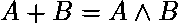

# b 的最大值小于 a，使得 A ^ B = A + B

> 原文:[https://www . geesforgeks . org/B-小于 a-a-b-a-b 的最大值/](https://www.geeksforgeeks.org/maximum-value-of-b-less-than-a-such-that-a-b-a-b/)

给定一个整数 **A** ，任务是找到小于 a 的最大可能值( **B** ，使得这两个数 a 和 b 的 xor 等于它们的和，即 **A ^ B = A + B** 。

**示例:**

> **输入:** A = 4
> **输出:** 3
> **解释:**
> 这样的整数有很多，比如 A ^ B = A + B
> 其中一些整数是–
> 4 ^ 3 = 4+3 = 7
> 4 ^ 2 = 4+2 = 6
> 4 ^ 1 = 4+1 = 5
> 4 ^ 0 = 4+0 = 4
> 这些值的最大值是 3
> 
> **输入:** 7
> **输出:** 0
> 除了 0 之外没有任何整数使得 A + B = A ^ B

**方法:**想法是利用这样一个事实

要得到的值，(A & B)的值必须等于 0。

```
=> A & B = 0
=> B = ~A
```

**例如:**

```
A = 4 (1 0 0)  
B = ~ A = (0 1 1) = 3 
```

下面是上述方法的实现:

## C++

```
// C++ implementation to find
// maximum value of B such that
// A ^ B = A + B
#include <bits/stdc++.h>
using namespace std;

// Function to find the maximum
// value of B such that A^B = A+B
void maxValue(int a)
{

    // Binary Representation of A
    string c = bitset<3>(a).to_string();
    string b = "";

    // Loop to find the negation
    // of the integer A
    for(int i = 0; i < c.length(); i++)
    {
        if ((c[i] - '0') == 1)
            b += '0';
        else
            b += '1';
    }

    // Output
    cout << bitset<3>(b).to_ulong();
}

// Driver code
int main()
{
    int a = 4;

    // Function Call
    maxValue(a);

    return 0;
}

// This code is contributed by divyeshrabadiya07
```

## Java 语言(一种计算机语言，尤用于创建网站)

```
// Java implementation to find
// maximum value of B such that
// A ^ B = A + B

// Function to find the maximum
// value of B such that A^B = A+B
class GFG
{

static void maxValue(int a)
{

    // Binary Representation of A
    String c = Integer.toBinaryString(a);

    String b = "";

    // Loop to find the negation
    // of the integer A
    for (int i = 0; i < c.length(); i++)
    {
        if((c.charAt(i)-'0')==1)
            b +='0';
        else
            b+='1';
    }

    // output
    System.out.print(Integer.parseInt(b, 2));

}

// Driver Code
public static void main(String []args)
{
    int a = 4;

    // Function Call
    maxValue(a);
}
}

// This code is contributed by chitranayal
```

## 蟒蛇 3

```
# Python3 implementation to find
# maximum value of B such that
# A ^ B = A + B

# Function to find the maximum
# value of B such that A^B = A+B
def maxValue(a):

    # Binary Representation of A
    a = bin(a)[2:]

    b = ''

    # Loop to find the negation
    # of the integer A
    for i in list(a):
        b += str(int(not int(i)))

    # output
    print(int(b, 2))
    return int(b, 2)

# Driver Code
if __name__ == '__main__':
    a = 4

    # Function Call
    maxValue(a)
```

## C#

```
// C# implementation to find
// maximum value of B such that
// A ^ B = A + B

// Function to find the maximum
// value of B such that A^B = A+B
using System;
using System.Collections.Generic;

class GFG
{

static void maxValue(int a)
{

    // Binary Representation of A
    String c = Convert.ToString(a, 2);

    String b = "";

    // Loop to find the negation
    // of the integer A
    for (int i = 0; i < c.Length; i++)
    {
        if((c[i] - '0') == 1)
            b += '0';
        else
            b += '1';
    }

    // output
    Console.Write(Convert.ToInt32(b, 2));

}

// Driver Code
public static void Main(String []args)
{
    int a = 4;

    // Function Call
    maxValue(a);
}
}

// This code is contributed by 29AjayKumar
```

## java 描述语言

```
<script>

// Javascript implementation to find
// maximum value of B such that
// A ^ B = A + B

// Function to find the maximum
// value of B such that A^B = A+B
function maxValue(a)
{

    // Binary Representation of A
    var c = a.toString(2);
    var b = "";

    // Loop to find the negation
    // of the integer A
    for(var i = 0; i < c.length; i++)
    {
        if ((c[i] - '0') == 1)
            b += '0';
        else
            b += '1';
    }

    // Output
    document.write(parseInt(b,2));
}

// Driver code
var a = 4;

// Function Call
maxValue(a);
</script>
```

**Output:** 

```
3
```

**性能分析:**

*   **时间复杂度:**在上面给出的方法中，存在从十进制到二进制的转换，在最坏的情况下需要 O(logN)时间。因此，这种方法的时间复杂度将是 **O(logN)** 。
*   **辅助空间复杂度:**在上面给出的方法中，没有使用额外的空间。因此，上述方法的辅助空间复杂度为 **O(1)**