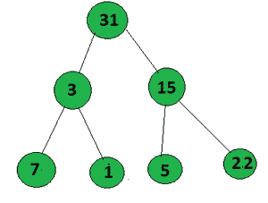

# 二叉树中从根到叶的按位“与”的最大值

> 原文:[https://www . geeksforgeeks . org/二叉树从根到叶的按位最大值/](https://www.geeksforgeeks.org/maximum-value-of-bitwise-and-from-root-to-leaf-in-a-binary-tree/)

给定一棵[二叉树](https://www.geeksforgeeks.org/binary-tree-data-structure/)，任务是从根节点到叶节点的任意[路径中找到](https://www.geeksforgeeks.org/given-a-binary-tree-print-all-root-to-leaf-paths/)[位与](https://www.geeksforgeeks.org/bitwise-operators-in-c-cpp/)的最大值。

**示例:**

> **输入:**下面是给定的图表:
> 
> 
> 
> **输出:**7
> T3】解释:T5】路径 1:15->3->5 =(15&3&5)= 1
> 路径 2:15->3->1 =(15&3&1)= 1
> 路径 3:15->7->31 =(15&7&
> 
> **输入:**下面是给定的图表:
> 
> 
> 
> **输出:**6
> T3】解释:T5】路径 1:31->3->7 =(31&3&7)= 3
> 路径 2:31->3->1 =(31&3&1)= 1
> 路径 3:31->15->5 =(31&15【T20

**方法:**想法是遍历从根节点到叶节点的所有路径，并计算该路径中发生的所有节点的按位“与”。保留一个全局变量来更新所有路径的最大按位“与”值。

下面是上述方法的实现:

## C++

```
// C++ program for the above approach

#include <bits/stdc++.h>
using namespace std;

// Initialise to update the maximum
// AND value from all the path
int maxm = 0;

// Node structure
struct Node {
    int val;

    // Left & right child of the node
    Node *left, *right;

    // Initialize constructor
    Node(int x)
    {
        val = x;
        left = NULL;
        right = NULL;
    }
};

// Function to find the maximum value
// of Bitwise AND from root to leaf
// in a Binary tree
void maxm_Anding(Node* root, int ans)
{
    // Check if root is not null
    if (!root)
        return;

    if (root->left == NULL
        and root->right == NULL) {
        ans &= root->val;

        // Find the maximum AND value and
        // store in global maxm variable
        maxm = max(ans, maxm);

        return;
    }

    // Traverse left of binary tree
    maxm_Anding(root->left,
                ans & root->val);

    // Traverse right of the binary tree
    maxm_Anding(root->right,
                ans & root->val);
}

// Driver Code
int main()
{
    // Given Tree
    Node* root = new Node(15);
    root->left = new Node(3);
    root->right = new Node(7);
    root->left->left = new Node(5);
    root->left->right = new Node(1);
    root->right->left = new Node(31);
    root->right->right = new Node(9);

    // Function Call
    maxm_Anding(root, root->val);

    // Print the maximum AND value
    cout << maxm << endl;

    return 0;
}
```

## Java 语言(一种计算机语言，尤用于创建网站)

```
// Java program for the above approach
class GFG{

// Initialise to update the maximum
// AND value from all the path
static int maxm = 0;

// Node structure
static class Node
{
    int val;

    // Left & right child of the node
    Node left, right;

    // Initialize constructor
    Node(int x)
    {
        val = x;
        left = null;
        right = null;
    }
};

// Function to find the maximum value
// of Bitwise AND from root to leaf
// in a Binary tree
static void maxm_Anding(Node root, int ans)
{
    // Check if root is not null
    if (root == null)
        return;

    if (root.left == null && root.right == null)
    {
        ans &= root.val;

        // Find the maximum AND value and
        // store in global maxm variable
        maxm = Math.max(ans, maxm);

        return;
    }

    // Traverse left of binary tree
    maxm_Anding(root.left,
                ans & root.val);

    // Traverse right of the binary tree
    maxm_Anding(root.right,
                ans & root.val);
}

// Driver Code
public static void main(String[] args)
{
    // Given Tree
    Node root = new Node(15);
    root.left = new Node(3);
    root.right = new Node(7);
    root.left.left = new Node(5);
    root.left.right = new Node(1);
    root.right.left = new Node(31);
    root.right.right = new Node(9);

    // Function Call
    maxm_Anding(root, root.val);

    // Print the maximum AND value
    System.out.print(maxm + "\n");
}
}

// This code is contributed by sapnasingh4991
```

## 蟒蛇 3

```
# Python3 program for the above approach

# Initialise to update the maximum
# AND value from all the path
maxm = 0

# Node structure
class Node:

    def __init__(self, x):

        self.val = x

        # Left & right child of the node
        self.left = None
        self.right = None

# Function to find the maximum value
# of Bitwise AND from root to leaf
# in a Binary tree
def maxm_Anding(root: Node, ans: int) -> None:

    global maxm

    # Check if root is not null
    if not root:
        return

    if (root.left is None and
        root.right is None):
        ans &= root.val

        # Find the maximum AND value and
        # store in global maxm variable
        maxm = max(ans, maxm)

        return

    # Traverse left of binary tree
    maxm_Anding(root.left, ans & root.val)

    # Traverse right of the binary tree
    maxm_Anding(root.right, ans & root.val)

# Driver Code
if __name__ == "__main__":

    # Given Tree
    root = Node(15)
    root.left = Node(3)
    root.right = Node(7)
    root.left.left = Node(5)
    root.left.right = Node(1)
    root.right.left = Node(31)
    root.right.right = Node(9)

    # Function Call
    maxm_Anding(root, root.val)

    # Print the maximum AND value
    print(maxm)

# This code is contributed by sanjeev2552
```

## C#

```
// C# program for the above approach
using System;
class GFG{

// Initialise to update the maximum
// AND value from all the path
static int maxm = 0;

// Node structure
class Node
{
    public int val;

    // Left & right child of the node
    public Node left, right;

    // Initialize constructor
    public Node(int x)
    {
        val = x;
        left = null;
        right = null;
    }
};

// Function to find the maximum value
// of Bitwise AND from root to leaf
// in a Binary tree
static void maxm_Anding(Node root, int ans)
{
    // Check if root is not null
    if (root == null)
        return;

    if (root.left == null && root.right == null)
    {
        ans &= root.val;

        // Find the maximum AND value and
        // store in global maxm variable
        maxm = Math.Max(ans, maxm);

        return;
    }

    // Traverse left of binary tree
    maxm_Anding(root.left,
                ans & root.val);

    // Traverse right of the binary tree
    maxm_Anding(root.right,
                ans & root.val);
}

// Driver Code
public static void Main(String[] args)
{
    // Given Tree
    Node root = new Node(15);
    root.left = new Node(3);
    root.right = new Node(7);
    root.left.left = new Node(5);
    root.left.right = new Node(1);
    root.right.left = new Node(31);
    root.right.right = new Node(9);

    // Function Call
    maxm_Anding(root, root.val);

    // Print the maximum AND value
    Console.Write(maxm + "\n");
}
}

// This code is contributed by sapnasingh4991
```

## java 描述语言

```
<script>

// JavaScript program for the above approach
let maxm = 0;

// Node structure
class Node
{

    // Initialize constructor
    constructor(x)
    {
        this.val = x;
        this.left = null;
        this.right = null;
    }
}

var root;

// Function to find the maximum value
// of Bitwise AND from root to leaf
// in a Binary tree
function maxm_Anding(root, ans)
{

    // Check if root is not null
    if (!root)
        return;

    if (root.left == null &&
       root.right == null)
    {
        ans &= root.val;

        // Find the maximum AND value and
        // store in global maxm variable
        maxm = Math.max(ans, maxm);

        return;
    }

    // Traverse left of binary tree
    maxm_Anding(root.left,
                ans & root.val);

    // Traverse right of the binary tree
    maxm_Anding(root.right,
                ans & root.val);
}

// Driver Code
root = new Node(15);
root.left = new Node(3);
root.right = new Node(7);
root.left.left = new Node(5);
root.left.right = new Node(1);
root.right.left = new Node(31);
root.right.right = new Node(9);

// Function Call
maxm_Anding(root, root.val);

document.write(maxm);

// This code is contributed by Dharanendra L V.

</script>
```

**Output:** 

```
7
```

**时间复杂度:***O(N<sup>2</sup>)*
T7】辅助空间: *O(1)*