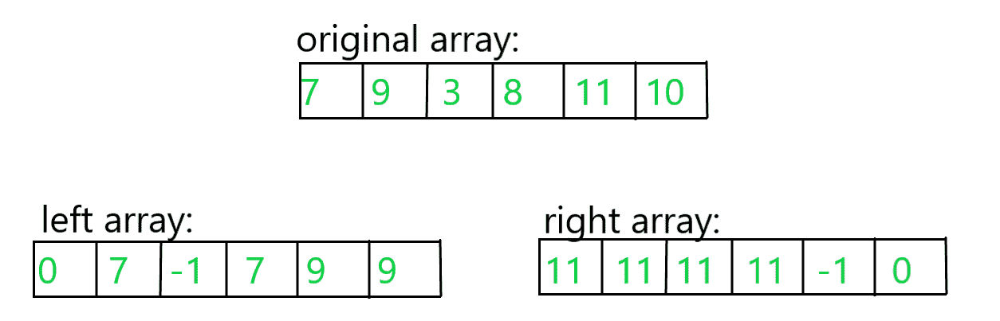

# 由有效三元组

形成的表达式的最大值(arr[i] + arr[j] * arr[k])

> 原文:[https://www . geesforgeks . org/表达式的最大值-arri-arrj-arrk-formed-from-a-valid-triple/](https://www.geeksforgeeks.org/maximum-value-of-expression-arri-arrj-arrk-formed-from-a-valid-triplet/)

给定一个由 **N** 个整数组成的[数组](https://www.geeksforgeeks.org/introduction-to-arrays/) **arr[]** 。任务是在每个三元组 **(i，j，k)** 中找到 **(arr[i] + arr[j] * arr[k])** 的最大值，使得**arr[I]<arr[j]<arr[k]**和 **i < j < k** 。如果不存在这样的三胞胎，则打印**-1”**。

**示例:**

> ***输入:** arr[]={7，9，3，8，11，10}*
> ***输出:** 106*
> ***解释:***
> *有效的三元组为:*
> *1) (7，9，11)*(arr[I]+arr[j]* arr[k])的值为 106。
> *2) (7，9，10)*(arr[I]+arr[j]* arr[k])的值为 97。
> *3) (7，8，10)*(arr[I]+arr[j]* arr[k])的值为 87。
> *4) (7，8，11)*(arr[I]+arr[j]* arr[k])的值为 105。
> *5) (3，8，10)*(arr[I]+arr[j]* arr[k])的值为 83。
> *6) (3，8，11)*(arr[I]+arr[j]* arr[k])的值为 91。
> *因此，数值中最大值为 106*
> 
> ***输入:** arr[]={1，2，3}*
> ***输出:** 7*

**天真方法:**想法是生成所有可能的有效三元组 **(i，j，k)** 并打印所有三元组中 **arr[i] + arr[j]*arr[k]** 的最大值。以下是步骤:

1.  使用三个嵌套循环迭代数组。
2.  对于每个有效的三元组，检查是否**arr【I】<arr【j】<arr【k】**。如果是这样，那么三元组是有效的。
3.  如果上述条件成立，则为所有这样的三元组找到 **arr[i] + arr[j]*arr[k]** 的值，并将其存储在名为**值**的变量中。
4.  在所有可能的三元组中，保持将上述表达式的值更新为最大值。
5.  如果没有找到有效的三元组，打印 **-1** 否则打印最大值。

下面是上述方法的实现:

## C++

```
// C++ program for the above approach
#include <bits/stdc++.h>
using namespace std;

// Function that generate all valid
// triplets and calculate the value
// of the valid triplets
void max_valid_triplet(int A[], int n)
{
    int ans = -1;

    // Generate all triplets
    for(int i = 0; i < n - 2; i++)
    {
        for(int j = i + 1; j < n - 1; j++)
        {
            for(int k = j + 1; k < n; k++)
            {

                // Check whether the triplet
                // is valid or not
                if (A[i] < A[j] && A[j] < A[k])
                {
                    int value = A[i] + A[j] * A[k];

                    // Update the value
                    if (value > ans)
                    {
                        ans = value;
                    }
                }
            }
        }
    }

    // Print the maximum value
    cout << (ans);
}

// Driver Code
int main()
{

    // Given array arr[]
    int arr[] = { 7, 9, 3, 8, 11, 10 };

    int n = sizeof(arr) / sizeof(arr[0]);

    // Function call
    max_valid_triplet(arr, n);
    return 0;
}

// This code is contributed by chitranayal
```

## Java 语言(一种计算机语言，尤用于创建网站)

```
// Java program for the above approach
import java.util.Scanner;

class GFG {

    // Function that generate all valid
    // triplets and calculate the value
    // of the valid triplets
    static void
    max_valid_triplet(int A[], int n)
    {

        int ans = -1;

        // Generate all triplets
        for (int i = 0; i < n - 2; i++) {

            for (int j = i + 1; j < n - 1; j++) {

                for (int k = j + 1; k < n; k++) {

                    // Check whether the triplet
                    // is valid or not
                    if (A[i] < A[j] && A[j] < A[k]) {

                        int value = A[i] + A[j] * A[k];

                        // Update the value
                        if (value > ans) {
                            ans = value;
                        }
                    }
                }
            }
        }

        // Print the maximum value
        System.out.println(ans);
    }

    // Driver Code
    public static void main(String args[])
    {
        // Given array arr[]
        int[] arr = new int[] { 7, 9, 3, 8, 11, 10 };

        int n = arr.length;

        // Function Call
        max_valid_triplet(arr, n);
    }
}
```

## 蟒蛇 3

```
# Python3 program for the above approach

# Function that generate all valid
# triplets and calculate the value
# of the valid triplets
def max_valid_triplet(A, n):

    ans = -1;

    # Generate all triplets
    for i in range(0, n - 2):
        for j in range(i + 1, n - 1):
            for k in range(j + 1, n):

                # Check whether the triplet
                # is valid or not
                if (A[i] < A[j] and A[j] < A[k]):
                    value = A[i] + A[j] * A[k];

                    # Update the value
                    if (value > ans):
                        ans = value;

    # Print the maximum value
    print(ans);

# Driver Code
if __name__ == '__main__':

    # Given array arr
    arr = [ 7, 9, 3, 8, 11, 10 ];

    n = len(arr);

    # Function call
    max_valid_triplet(arr, n);

# This code is contributed by Amit Katiyar 
```

## C#

```
// C# program for the above approach
using System;
class GFG{

  // Function that generate all valid
  // triplets and calculate the value
  // of the valid triplets
  static void max_valid_triplet(int[] A, int n)
  {
    int ans = -1;

    // Generate all triplets
    for (int i = 0; i < n - 2; i++)
    {
      for (int j = i + 1; j < n - 1; j++)
      {
        for (int k = j + 1; k < n; k++)
        {

          // Check whether the triplet
          // is valid or not
          if (A[i] < A[j] && A[j] < A[k])
          {
            int value = A[i] + A[j] * A[k];

            // Update the value
            if (value > ans)
            {
              ans = value;
            }
          }
        }
      }
    }

    // Print the maximum value
    Console.WriteLine(ans);
  }

  // Driver Code
  public static void Main(String[] args)
  {
    // Given array []arr
    int[] arr = new int[] { 7, 9, 3, 8, 11, 10 };

    int n = arr.Length;

    // Function Call
    max_valid_triplet(arr, n);
  }
}

// This code is contributed by gauravrajput1
```

## java 描述语言

```
<script>
// JavaScript program for the above approach

// Function that generate all valid
// triplets and calculate the value
// of the valid triplets
function max_valid_triplet(A, n)
{
    let ans = -1;

    // Generate all triplets
    for(let i = 0; i < n - 2; i++)
    {
        for(let j = i + 1; j < n - 1; j++)
        {
            for(let k = j + 1; k < n; k++)
            {

                // Check whether the triplet
                // is valid or not
                if (A[i] < A[j] && A[j] < A[k])
                {
                    let value = A[i] + A[j] * A[k];

                    // Update the value
                    if (value > ans)
                    {
                        ans = value;
                    }
                }
            }
        }
    }

    // Print the maximum value
    document.write(ans);
}

// Driver Code

    // Given array arr[]
    let arr = [ 7, 9, 3, 8, 11, 10 ];
    let n = arr.length;

    // Function call
    max_valid_triplet(arr, n);

// This code is contributed by Surbhi Tyagi.
</script>
```

**Output:** 

```
106
```

***时间复杂度:**O(N<sup>3</sup>)*
***辅助空间:** O(1)*

**高效的方法:**以上方法可以通过 [**在**](https://www.geeksforgeeks.org/treeset-in-java-with-examples/) **[Java](https://www.geeksforgeeks.org/java/) 中使用** 进行优化。以下是步骤:

*   创建两个数组。一个数组**(左)**存储左侧的最大元素，该元素严格小于原始数组中的当前元素，另一个数组**(右)**存储原始数组中当前元素的右侧最大值，如下图所示:数组 **arr[] = {7，9，3，8，11，10}** :



*   对于左数组的构造，我们在 Java 中使用 [TreeSet](https://www.geeksforgeeks.org/treeset-in-java-with-examples/) ，将元素插入到 TreeSet 中，在 TreeSet 中使用 [lower()](https://www.geeksforgeeks.org/treeset-lower-method-in-java/) 方法，该方法将返回该集合中最大的元素，该元素严格小于给定的元素。如果这个树集合中不存在这样的元素，那么这个方法返回一个空值。
*   左数组中的元素将是有效三元组的 **arr[i]** ，右数组中的元素将是有效三元组的 **arr[k]** 。
*   现在，从 **1 到 N–1**遍历原始数组，为有效三元组选择**arr【j】**。
*   如果**离开【我】！=-1&T3【右【我】！=-1** 那么就有机会形成三联体。
*   为所有这样的有效三元组找到值**arr[I]+arr[j]* arr[k]【T1]，并根据最大值更新 ans。**
*   如果存在，打印最大值，否则打印**-1”**。

下面是上述方法的实现:

## Java 语言(一种计算机语言，尤用于创建网站)

```
// Java program for the above approach
import java.util.*;

class GFG {

    // Function that finds the maximum
    // valid triplets
    static int max_valid_triplet(int A[], int n)
    {
        int ans = -1;

        // Declare the left[] and
        // right[] array
        int left[] = new int[n];
        int right[] = new int[n];

        // Consider last element as maximum
        int max = A[n - 1];

        // Iterate array from the last
        for (int i = n - 2; i >= 0; i--) {

            // If present is less the maximum
            // update the right[i] with
            // previous maximum
            if (max > A[i])
                right[i] = max;

            // Else store -1
            else
                right[i] = -1;

            // Find the maximum for
            // the next iteration
            if (max < A[i])
                max = A[i];
        }

        TreeSet<Integer> set = new TreeSet<Integer>();
        for (int i = 1; i < n; i++) {

            // Insert previous element
            // to the set
            set.add(A[i - 1]);

            Integer result = set.lower(A[i]);

            // Search for maximum element
            // which is < present element

            // If result is null there is
            // no such element exists
            // so store -1 at left[i]
            if (result == null)
                left[i] = -1;

            // Else store the result
            else
                left[i] = result;
        }

        // Traverse the original array
        for (int i = 1; i < n - 1; i++) {

            // Condition for valid triplet
            if (left[i] != -1
                && right[i] != -1)

                // Find the value and update
                // the maximum value
                ans = Math.max(ans,
                               left[i] + A[i] * right[i]);
        }

        // Return the ans
        return ans;
    }

    // Driver Code
    public static void main(String args[])
    {
        // Given array arr[]
        int[] A = new int[] { 7, 9, 3, 8, 11, 10 };
        int n = A.length;

        // Function Call
        System.out.println(max_valid_triplet(A, n));
    }
}
```

## C#

```
// C# program for the above approach
using System;
using System.Collections.Generic;

class GFG{

// Function that finds the maximum
// valid triplets
static int max_valid_triplet(int []A, int n)
{
    int ans = -1;

    // Declare the []left and
    // []right array
    int []left = new int[n];
    int []right = new int[n];

    // Consider last element as maximum
    int max = A[n - 1];

    // Iterate array from the last
    for(int i = n - 2; i >= 0; i--)
    {

        // If present is less the maximum
        // update the right[i] with
        // previous maximum
        if (max > A[i])
            right[i] = max;

        // Else store -1
        else
            right[i] = -1;

        // Find the maximum for
        // the next iteration
        if (max < A[i])
            max = A[i];
    }

    SortedSet<int> set = new SortedSet<int>();
    for(int i = 1; i < n; i++)
    {

        // Insert previous element
        // to the set
        set.Add(A[i - 1]);

        int result = set.Min;

        // Search for maximum element
        // which is < present element

        // If result is null there is
        // no such element exists
        // so store -1 at left[i]
        if (result == 0)
            left[i] = -1;

        // Else store the result
        else
            left[i] = result;
    }

    // Traverse the original array
    for(int i = 1; i < n - 1; i++)
    {

        // Condition for valid triplet
        if (left[i] != -1 &&
           right[i] != -1)

            // Find the value and update
            // the maximum value
            ans = Math.Max(ans,
                           left[i] +
                              A[i] *
                          right[i]);
    }

    // Return the ans
    return ans;
}

// Driver Code
public static void Main(String []args)
{

    // Given array []arr
    int[] A = new int[]{ 7, 9, 3, 8, 11, 10 };
    int n = A.Length;

    // Function call
    Console.WriteLine(max_valid_triplet(A, n));
}
}

// This code is contributed by Amit Katiyar
```

## java 描述语言

```
<script>

// Javascript program for the above approach

// Function that finds the maximum
// valid triplets
function max_valid_triplet(A, n)
{
    let ans = -1;

    // Declare the []left and
    // []right array
    let left = new Array(n);
       let right = new Array(n);

     for(let i = 0; i < n; i++)
    {
        left[i] = 0;
        right[i] = 0;
    }

    // Consider last element as maximum
    let max = A[n - 1];

    // Iterate array from the last
    for(let i = n - 2; i >= 0; i--)
    {

        // If present is less the maximum
        // update the right[i] with
        // previous maximum
        if (max > A[i])
            right[i] = max;

        // Else store -1
        else
            right[i] = -1;

        // Find the maximum for
        // the next iteration
        if (max < A[i])
            max = A[i];
    }

    let set = new Set();
    for(let i = 1; i < n; i++)
    {

        // Insert previous element
        // to the set
        set.add(A[i - 1]);

        let result = Math.min(...Array.from(set));

        // Search for maximum element
        // which is < present element

        // If result is null there is
        // no such element exists
        // so store -1 at left[i]
        if (result == 0)
            left[i] = -1;

        // Else store the result
        else
            left[i] = result;
    }

    // Traverse the original array
    for(let i = 1; i < n - 1; i++)
    {

        // Condition for valid triplet
        if (left[i] != -1 &&
           right[i] != -1)

            // Find the value and update
            // the maximum value
            ans = Math.max(ans, left[i] +
                           A[i] * right[i]);
    }

    // Return the ans
    return ans;
}

// Driver Code
let A = [ 7, 9, 3, 8, 11, 10 ];
let n = A.length;

document.write(max_valid_triplet(A, n));

// This code is contributed by avanitrachhadiya2155

</script>
```

**Output:** 

```
106
```

***时间复杂度:** O(N)*
***辅助空间:** O(N)*