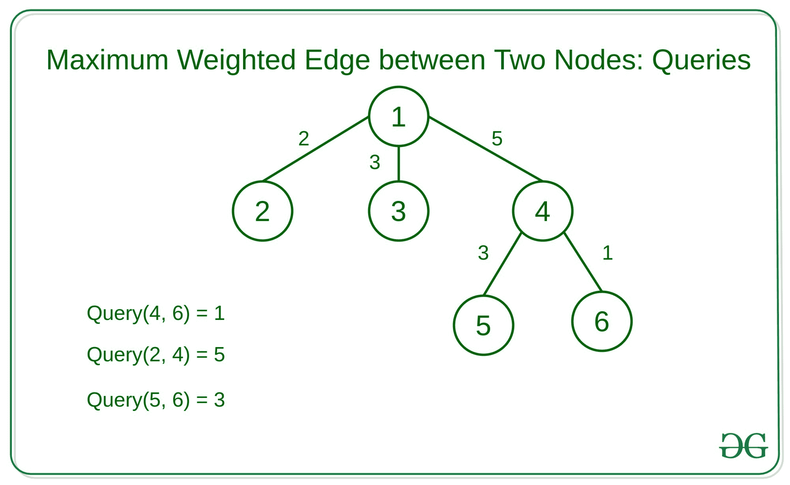
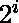

# 使用二进制提升的 N 叉树中两个节点之间路径的最大加权边

> 原文:[https://www . geeksforgeeks . org/使用二进制提升的 n 叉树中两个节点之间路径中最大加权边数/](https://www.geeksforgeeks.org/maximum-weighted-edge-in-path-between-two-nodes-in-an-n-ary-tree-using-binary-lifting/)

给定一个带有加权边的 [N 元树](https://www.geeksforgeeks.org/depth-n-ary-tree/)和 **Q** 查询，其中每个查询包含树的两个节点。任务是在这两个节点之间的简单路径中找到最大加权边。
**例:**



**天真方法:**一个简单的解决方案是为每个查询遍历整个树，并找到两个节点之间的路径。
**高效方法:**想法是使用[二进制提升](https://www.geeksforgeeks.org/lca-in-a-tree-using-binary-lifting-technique/)来预先计算从每个节点到某个距离的每个其他节点的最大加权边



。我们将存储最大加权边，直到


水平。

> ![dp[i][j] = dp[i - 1][dp[i - 1][j]]             ](img/3919934794fac07eaeb9c093a11c80eb.png "Rendered by QuickLaTeX.com")
> 
> 和
> 
> ![mx[i][j] = max(mx[i - 1][j], mx[i - 1][dp[i - 1][j]])  ](img/8f58bdbc4e933c713c9c9f30605b3d31.png "Rendered by QuickLaTeX.com")

在哪里

*   j 是节点，并且
*   我是…的距离


*   dp[i][j]将 j 的父级存储在


*   如果存在距离，它将存储 0
*   mx[i][j]将从节点 j 到该节点父节点的最大边存储在


*   距离。

我们将进行[深度优先搜索](https://www.geeksforgeeks.org/depth-first-search-or-dfs-for-a-graph/)来找到所有的父母


距离和它们的权重，然后预计算每


距离。
以下是上述方法的实现:

## C++

```
// C++ implementation to find the
// maximum weighted edge in the simple
// path between two nodes in N-ary Tree

#include <bits/stdc++.h>

using namespace std;

const int N = 100005;

// Depths of Nodes
vector<int> level(N);
const int LG = 20;

// Parent at every 2^i level
vector<vector<int> > dp(LG, vector<int>(N));

// Maximum node at every 2^i level
vector<vector<int> > mx(LG, vector<int>(N));

// Graph that stores destinations
// and its weight
vector<vector<pair<int, int> > > v(N);
int n;

// Function to traverse the nodes
// using the Depth-First Search Traversal
void dfs_lca(int a, int par, int lev)
{
    dp[0][a] = par;
    level[a] = lev;
    for (auto i : v[a]) {

        // Condition to check if its
        // equal to its parent then skip
        if (i.first == par)
            continue;
        mx[0][i.first] = i.second;

        // DFS Recursive Call
        dfs_lca(i.first, a, lev + 1);
    }
}

// Function to find the ansector
void find_ancestor()
{

    // Loop to set every 2^i distance
    for (int i = 1; i < LG; i++) {
        // Loop to calculate for
        // each node in the N-ary tree
        for (int j = 1; j <= n; j++) {
            dp[i][j]
                = dp[i - 1][dp[i - 1][j]];

            // Storing maximum edge
            mx[i][j]
                = max(mx[i - 1][j],
                      mx[i - 1][dp[i - 1][j]]);
        }
    }
}

int getMax(int a, int b)
{
    // Swaping if node a is at more depth
    // than node b because we will
    // always take at more depth
    if (level[b] < level[a])
        swap(a, b);

    int ans = 0;

    // Difference between the depth of
    // the two given nodes
    int diff = level[b] - level[a];
    while (diff > 0) {
        int log = log2(diff);
        ans = max(ans, mx[log][b]);

        // Changing Node B to its
        // parent at 2 ^ i distance
        b = dp[log][b];

        // Subtracting distance by 2^i
        diff -= (1 << log);
    }

    // Take both a, b to its
    // lca and find maximum
    while (a != b) {
        int i = log2(level[a]);

        // Loop to find the 2^ith
        // parent that is different
        // for both a and b i.e below the lca
        while (i > 0
               && dp[i][a] == dp[i][b])
            i--;

        // Updating ans
        ans = max(ans, mx[i][a]);
        ans = max(ans, mx[i][b]);

        // Changing value to its parent
        a = dp[i][a];
        b = dp[i][b];
    }
    return ans;
}

// Function to compute the Least
// common Ansector
void compute_lca()
{
    dfs_lca(1, 0, 0);
    find_ancestor();
}

// Driver Code
int main()
{
    // Undirected tree
    n = 5;
    v[1].push_back(make_pair(2, 2));
    v[2].push_back(make_pair(1, 2));
    v[1].push_back(make_pair(3, 5));
    v[3].push_back(make_pair(1, 5));
    v[3].push_back(make_pair(4, 3));
    v[4].push_back(make_pair(3, 4));
    v[3].push_back(make_pair(5, 1));
    v[5].push_back(make_pair(3, 1));

    // Computing LCA
    compute_lca();

    int queries[][2]
        = { { 3, 5 },
            { 2, 3 },
            { 2, 4 } };
    int q = 3;

    for (int i = 0; i < q; i++) {
        int max_edge = getMax(queries[i][0],
                              queries[i][1]);
        cout << max_edge << endl;
    }
    return 0;
}
```

## Java 语言(一种计算机语言，尤用于创建网站)

```
// Java implementation to find the
// maximum weighted edge in the simple
// path between two nodes in N-ary Tree
import java.util.*;
import java.awt.Point;
public class Main
{
    static int N = 100005;

    // Depths of Nodes
    static int[] level = new int[N];
    static int LG = 20;

    // Parent at every 2^i level
    static int[][] dp = new int[LG][N];

    // Maximum node at every 2^i level
    static int[][] mx = new int[LG][N];

    // Graph that stores destinations
    // and its weight
    static Vector<Vector<Point>> v = new Vector<Vector<Point>>();

    static int n = 0;

    // Function to traverse the
    // nodes using the Depth-First
    // Search Traversal
    static void dfs_lca(int a, int par, int lev)
    {
        dp[0][a] = par;
        level[a] = lev;
        for(int i = 0; i < v.get(a).size(); i++)
        {
            // Condition to check
            // if its equal to its
            // parent then skip
            if (v.get(a).get(i).x == par)
                continue;
            mx[0][v.get(a).get(i).x] = v.get(a).get(i).y;

            // DFS Recursive Call
            dfs_lca(v.get(a).get(i).x, a, lev + 1);
        }
    }

    // Function to find the ansector
    static void find_ancestor()
    {
        // Loop to set every 2^i distance
        for(int i = 1; i < 16; i++)
        {
            // Loop to calculate for
            // each node in the N-ary tree
            for(int j = 1; j < n + 1; j++)
            {
                dp[i][j] = dp[i - 1][dp[i - 1][j]];

                // Storing maximum edge
                mx[i][j] = Math.max(mx[i - 1][j], mx[i - 1][dp[i - 1][j]]);
            }
        }
    }

    static int getMax(int a, int b)
    {
        // Swaping if node a is at more depth
        // than node b because we will
        // always take at more depth
        if (level[b] < level[a])
        {
            int temp = a;
            a = b;
            b = temp;
        }

        int ans = 0;

        // Difference between the
        // depth of the two given
        // nodes
        int diff = level[b] - level[a];

        while (diff > 0)
        {
            int log = (int)(Math.log(diff) / Math.log(2));
            ans = Math.max(ans, mx[log][b]);

            // Changing Node B to its
            // parent at 2 ^ i distance
            b = dp[log][b];

            // Subtracting distance by 2^i
            diff -= (1 << log);
        }

        // Take both a, b to its
        // lca and find maximum
        while (a != b)
        {
            int i = (int)(Math.log(level[a]) / Math.log(2));

            // Loop to find the maximum 2^ith
            // parent the is different
            // for both a and b
            while (i > 0 && dp[i][a] == dp[i][b])
            {
                i-=1;
            }

            // Updating ans
            ans = Math.max(ans, mx[i][a]);
            ans = Math.max(ans, mx[i][b]);

            // Changing value to
            // its parent
            a = dp[i][a];
            b = dp[i][b];
        }

        return ans;
    }

    // Function to compute the Least
    // common Ansector
    static void compute_lca()
    {
        dfs_lca(1, 0, 0);
        find_ancestor();
    }

    public static void main(String[] args) {
        for(int i = 0; i < LG; i++)
        {
            for(int j = 0; j < N; j++)
            {
                dp[i][j] = 0;
                mx[i][j] = 0;
            }
        }

        for(int i = 0; i < N; i++)
        {
            v.add(new Vector<Point>());
        }

        // Undirected tree
        v.get(1).add(new Point(2, 2));
        v.get(2).add(new Point(1, 2));
        v.get(1).add(new Point(3, 5));
        v.get(3).add(new Point(1, 5));
        v.get(3).add(new Point(4, 3));
        v.get(4).add(new Point(3, 4));
        v.get(3).add(new Point(5, 1));
        v.get(5).add(new Point(3, 1));

        // Computing LCA
        compute_lca();

        int[][] queries
            = { { 3, 5 },
                { 2, 3 },
                { 2, 4 } };
        int q = 3;

        for (int i = 0; i < q; i++) {
            int max_edge = getMax(queries[i][0],
                                  queries[i][1]);
            System.out.println(max_edge);
        }
    }
}

// This code is contributed by decode2207.
```

## 蟒蛇 3

```
# Python3 implementation to
# find the maximum weighted
# edge in the simple path
# between two nodes in N-ary Tree
import math
N = 100005;

# Depths of Nodes
level = [0 for i in range(N)]
LG = 20;

# Parent at every 2^i level
dp = [[0 for j in range(N)]
         for i in range(LG)]

# Maximum node at every 2^i level
mx = [[0 for j in range(N)]
         for i in range(LG)]

# Graph that stores destinations
# and its weight
v = [[] for i in range(N)]
n = 0

# Function to traverse the
# nodes using the Depth-First
# Search Traversal
def dfs_lca(a, par, lev):

    dp[0][a] = par;
    level[a] = lev;

    for i in v[a]:

        # Condition to check
        # if its equal to its
        # parent then skip
        if (i[0] == par):
            continue;
        mx[0][i[0]] = i[1];

        # DFS Recursive Call
        dfs_lca(i[0], a, lev + 1);

# Function to find the ansector
def find_ancestor():

    # Loop to set every 2^i distance
    for i in range(1, 16):

        # Loop to calculate for
        # each node in the N-ary tree
        for j in range(1, n + 1):

            dp[i][j] = dp[i - 1][dp[i - 1][j]];

            # Storing maximum edge
            mx[i][j] = max(mx[i - 1][j],
                           mx[i - 1][dp[i - 1][j]]);

def getMax(a, b):

    # Swaping if node a is at more depth
    # than node b because we will
    # always take at more depth
    if (level[b] < level[a]):
        a, b = b, a

    ans = 0;

    # Difference between the
    # depth of the two given
    # nodes
    diff = level[b] - level[a];

    while (diff > 0):
        log = int(math.log2(diff));
        ans = max(ans, mx[log][b]);

        # Changing Node B to its
        # parent at 2 ^ i distance
        b = dp[log][b];

        # Subtracting distance by 2^i
        diff -= (1 << log);

    # Take both a, b to its
    # lca and find maximum
    while (a != b):
        i = int(math.log2(level[a]));

        # Loop to find the maximum 2^ith
        # parent the is different
        # for both a and b
        while (i > 0 and
               dp[i][a] == dp[i][b]):
            i-=1

        # Updating ans
        ans = max(ans, mx[i][a]);
        ans = max(ans, mx[i][b]);

        # Changing value to
        # its parent
        a = dp[i][a];
        b = dp[i][b];

    return ans;

# Function to compute the Least
# common Ansector
def compute_lca():

    dfs_lca(1, 0, 0);
    find_ancestor();

# Driver code
if __name__=="__main__":

    # Undirected tree
    n = 5;
    v[1].append([2, 2]);
    v[2].append([1, 2]);
    v[1].append([3, 5]);
    v[3].append([1, 5]);
    v[3].append([4, 3]);
    v[4].append([3, 4]);
    v[3].append([5, 1]);
    v[5].append([3, 1]);

    # Computing LCA
    compute_lca();

    queries= [[3, 5], [2, 3], [2,4]]
    q = 3;

    for i in range(q):
        max_edge = getMax(queries[i][0],
                          queries[i][1]);
        print(max_edge)

# This code is contributed by Rutvik_56
```

## C#

```
// C# implementation to find the
// maximum weighted edge in the simple
// path between two nodes in N-ary Tree
using System;
using System.Collections.Generic;
class GFG {

    static int N = 100005;

    // Depths of Nodes
    static int[] level = new int[N];
    static int LG = 20;

    // Parent at every 2^i level
    static int[,] dp = new int[LG, N];

    // Maximum node at every 2^i level
    static int[,] mx = new int[LG, N];

    // Graph that stores destinations
    // and its weight
    static List<List<Tuple<int,int>>> v = new List<List<Tuple<int,int>>>();

    static int n = 0;

    // Function to traverse the
    // nodes using the Depth-First
    // Search Traversal
    static void dfs_lca(int a, int par, int lev)
    {
        dp[0,a] = par;
        level[a] = lev;
        for(int i = 0; i < v[a].Count; i++)
        {
            // Condition to check
            // if its equal to its
            // parent then skip
            if (v[a][i].Item1 == par)
                continue;
            mx[0,v[a][i].Item1] = v[a][i].Item2;

            // DFS Recursive Call
            dfs_lca(v[a][i].Item1, a, lev + 1);
        }
    }

    // Function to find the ansector
    static void find_ancestor()
    {
        // Loop to set every 2^i distance
        for(int i = 1; i < 16; i++)
        {
            // Loop to calculate for
            // each node in the N-ary tree
            for(int j = 1; j < n + 1; j++)
            {
                dp[i,j] = dp[i - 1,dp[i - 1,j]];

                // Storing maximum edge
                mx[i,j] = Math.Max(mx[i - 1,j], mx[i - 1,dp[i - 1,j]]);
            }
        }
    }

    static int getMax(int a, int b)
    {
        // Swaping if node a is at more depth
        // than node b because we will
        // always take at more depth
        if (level[b] < level[a])
        {
            int temp = a;
            a = b;
            b = temp;
        }

        int ans = 0;

        // Difference between the
        // depth of the two given
        // nodes
        int diff = level[b] - level[a];

        while (diff > 0)
        {
            int log = (int)(Math.Log(diff) / Math.Log(2));
            ans = Math.Max(ans, mx[log,b]);

            // Changing Node B to its
            // parent at 2 ^ i distance
            b = dp[log,b];

            // Subtracting distance by 2^i
            diff -= (1 << log);
        }

        // Take both a, b to its
        // lca and find maximum
        while (a != b)
        {
            int i = (int)(Math.Log(level[a]) / Math.Log(2));

            // Loop to find the maximum 2^ith
            // parent the is different
            // for both a and b
            while (i > 0 && dp[i,a] == dp[i,b])
            {
                i-=1;
            }

            // Updating ans
            ans = Math.Max(ans, mx[i,a]);
            ans = Math.Max(ans, mx[i,b]);

            // Changing value to
            // its parent
            a = dp[i,a];
            b = dp[i,b];
        }

        return ans;
    }

    // Function to compute the Least
    // common Ansector
    static void compute_lca()
    {
        dfs_lca(1, 0, 0);
        find_ancestor();
    }

  static void Main() {

    for(int i = 0; i < LG; i++)
    {
        for(int j = 0; j < N; j++)
        {
            dp[i,j] = 0;
            mx[i,j] = 0;
        }
    }

    for(int i = 0; i < N; i++)
    {
        v.Add(new List<Tuple<int,int>>());
    }

    // Undirected tree
    v[1].Add(new Tuple<int,int>(2, 2));
    v[2].Add(new Tuple<int,int>(1, 2));
    v[1].Add(new Tuple<int,int>(3, 5));
    v[3].Add(new Tuple<int,int>(1, 5));
    v[3].Add(new Tuple<int,int>(4, 3));
    v[4].Add(new Tuple<int,int>(3, 4));
    v[3].Add(new Tuple<int,int>(5, 1));
    v[5].Add(new Tuple<int,int>(3, 1));

    // Computing LCA
    compute_lca();

    int[,] queries
        = { { 3, 5 },
            { 2, 3 },
            { 2, 4 } };
    int q = 3;

    for (int i = 0; i < q; i++) {
        int max_edge = getMax(queries[i,0],
                              queries[i,1]);
        Console.WriteLine(max_edge);
    }
  }
}

// This code is contributed by divyesh072019.
```

## java 描述语言

```
<script>
    // Javascript implementation to find the
    // maximum weighted edge in the simple
    // path between two nodes in N-ary Tree

    let N = 100005;

    // Depths of Nodes
    let level = new Array(N);
    level.fill(0);
    let LG = 20;

    // Parent at every 2^i level
    let dp = new Array(LG);
    for(let i = 0; i < LG; i++)
    {
        dp[i] = new Array(N);
        for(let j = 0; j < N; j++)
        {
            dp[i][j] = 0;
        }
    }

    // Maximum node at every 2^i level
    let mx = new Array(LG);
    for(let i = 0; i < LG; i++)
    {
        mx[i] = new Array(N);
        for(let j = 0; j < N; j++)
        {
            mx[i][j] = 0;
        }
    }

    // Graph that stores destinations
    // and its weight
    let v = [];
    for(let i = 0; i < N; i++)
    {
        v.push([]);
    }
    let n = 0;

    // Function to traverse the
    // nodes using the Depth-First
    // Search Traversal
    function dfs_lca(a, par, lev)
    {
        dp[0][a] = par;
        level[a] = lev;
        for(let i = 0; i < 2; i++)
        {
            // Condition to check
            // if its equal to its
            // parent then skip
            if (v[a][0] == par)
                continue;
            mx[0][v[a][0]] = v[a][1];

            // DFS Recursive Call
            dfs_lca(v[a][0], a, lev + 1);
        }
    }

    // Function to find the ansector
    function find_ancestor()
    {
        // Loop to set every 2^i distance
        for(let i = 1; i < 16; i++)
        {
            // Loop to calculate for
            // each node in the N-ary tree
            for(let j = 1; j < n + 1; j++)
            {
                dp[i][j] = dp[i - 1][dp[i - 1][j]];

                // Storing maximum edge
                mx[i][j] = Math.max(mx[i - 1][j], mx[i - 1][dp[i - 1][j]]);
            }
        }
    }

    function getMax(a, b)
    {
        // Swaping if node a is at more depth
        // than node b because we will
        // always take at more depth
        if (level[b] < level[a])
        {
            let temp = a;
            a = b;
            b = temp;
        }

        let ans = 0;

        // Difference between the
        // depth of the two given
        // nodes
        let diff = level[b] - level[a];

        while (diff > 0)
        {
            let log = parseInt(Math.log(diff) / Math.log(2), 10);
            ans = Math.max(ans, mx[log][b]);

            // Changing Node B to its
            // parent at 2 ^ i distance
            b = dp[log][b];

            // Subtracting distance by 2^i
            diff -= (1 << log);
        }

        // Take both a, b to its
        // lca and find maximum
        while (a == b)
        {
            i = parseInt(Math.log(level[a]) / Math.log(2), 10);

            // Loop to find the maximum 2^ith
            // parent the is different
            // for both a and b
            while (i > 0 && dp[i][a] == dp[i][b])
            {
                i-=1;
            }

            // Updating ans
            ans = Math.max(ans, mx[i][a]);
            ans = Math.max(ans, mx[i][b]);

            // Changing value to
            // its parent
            a = dp[i][a];
            b = dp[i][b];
        }

        return ans*2 + 1;
    }

    // Function to compute the Least
    // common Ansector
    function compute_lca()
    {
        dfs_lca(1, 0, 0);
        find_ancestor();
    }

    // Undirected tree
    n = 5;
    v[1].push(2);
    v[1].push(2);
    v[2].push(1);
    v[2].push(2);
    v[1].push(3);
    v[1].push(5);
    v[3].push(1);
    v[3].push(5);
    v[3].push(4);
    v[3].push(3);
    v[4].push(3);
    v[4].push(4);
    v[3].push(5);
    v[3].push(1);
    v[5].push(3);
    v[5].push(1);

    // Computing LCA
    compute_lca();

    let queries= [[3, 5], [2, 3], [2,4]];
    let q = 3;

    for(let i = 0; i <q; i++)
    {
        let max_edge = getMax(queries[i][0],
                          queries[i][1]);
        document.write(max_edge + "</br>");
    }

// This code is contributed by suresh07.
</script>
```

**Output:** 

```
1
5
5
```

**时间复杂度:** O(N*logN)。
**辅助空间:** O(N*logN)。