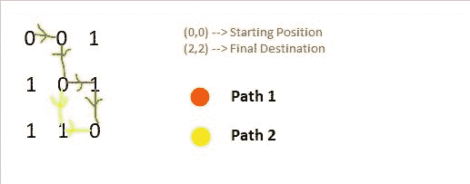

# N 门 1 键迷宫

> 原文:[https://www.geeksforgeeks.org/maze-with-n-doors-and-1-key/](https://www.geeksforgeeks.org/maze-with-n-doors-and-1-key/)

给定一个 **N * N** 二进制迷宫，其中一个 **0** 表示该位置可以被访问，一个 **1** 表示该位置在没有键的情况下不能被访问，任务是找出是否有可能从左上角的单元格一路只用一个键访问右下角的单元格。如果可能，则打印**“是”**，否则打印**“否”**。

**示例:**

> **输入:**迷宫[][] = {
> {0，0，1}，
> {1，0，1}，
> {1，1，0}}
> **输出:**是
> 
> 

**方法:**这个问题可以使用[递归](https://www.geeksforgeeks.org/recursion/)来解决，对于每一个可能的移动，如果当前单元格是 **0** ，那么在不改变按键状态的情况下检查它是否是目的地否则继续前进。如果当前单元格是 **1** ，则必须使用该键，现在对于进一步的移动，该键将被设置为**假**，即它将永远不会在同一路径上再次使用。如果任何路径到达目的地，则打印**是**否则打印**否**。

下面是上述方法的实现:

## C++

```
// C++ implementation of the approach
#include <bits/stdc++.h>
using namespace std;

// Recursive function to check whether there is 
// a path from the top left cell to the 
// bottom right cell of the maze
bool findPath(vector<vector<int>> maze,
              int xpos, int ypos, bool key)
{

    // Check whether the current cell is
    // within the maze
    if (xpos < 0 || xpos >= maze.size() ||
        ypos < 0 || ypos >= maze.size())
        return false;

    // If key is required to move further
    if (maze[xpos][ypos] == '1')
    {

        // If the key hasn't been used before
        if (key == true)

            // If current cell is the destination
            if (xpos == maze.size() - 1 &&
                ypos == maze.size() - 1)
                return true;

        // Either go down or right
        return findPath(maze, xpos + 1,
                        ypos, false) ||
               findPath(maze, xpos,
                        ypos + 1, false);

        // Key has been used before
        return false;
    }

    // If current cell is the destination
    if (xpos == maze.size() - 1 &&
        ypos == maze.size() - 1)
        return true;

    // Either go down or right
    return findPath(maze, xpos + 1,
                    ypos, key) ||
           findPath(maze, xpos,
                    ypos + 1, key);
}

bool mazeProb(vector<vector<int>> maze,
              int xpos, int ypos)
{
    bool key = true;
    if (findPath(maze, xpos, ypos, key))
        return true;

    return false;
}

// Driver code
int main()
{
    vector<vector<int>> maze = { { '0', '0', '1' },
                                 { '1', '0', '1' },
                                 { '1', '1', '0' } };
    int n = maze.size();

    // If there is a path from the cell (0, 0)
    if (mazeProb(maze, 0, 0))
        cout << "Yes";
    else
        cout << "No";
}

// This code is contributed by grand_master
```

## Java 语言(一种计算机语言，尤用于创建网站)

```
// Java implementation of the approach
import java.io.*;
import java.util.ArrayList;

class GFG{

// Recursive function to check whether there
// is a path from the top left cell to the
// bottom right cell of the maze
static boolean findPath(
    ArrayList<ArrayList<Integer>> maze,
    int xpos, int ypos, boolean key)
{

    // Check whether the current cell is
    // within the maze
    if (xpos < 0 || xpos >= maze.size() ||
        ypos < 0 || ypos >= maze.size())
        return false;

    // If key is required to move further
    if (maze.get(xpos).get(ypos) == '1')
    {

        // If the key hasn't been used before
        if (key == true)

            // If current cell is the destination
            if (xpos == maze.size() - 1 &&
                ypos == maze.size() - 1)
                return true;

        // Either go down or right
        return findPath(maze, xpos + 1, ypos, false) ||
               findPath(maze, xpos, ypos + 1, false);
    }

    // If current cell is the destination
    if (xpos == maze.size() - 1 &&
        ypos == maze.size() - 1)
        return true;

    // Either go down or right
    return findPath(maze, xpos + 1, ypos, key) ||
           findPath(maze, xpos, ypos + 1, key);
}

static boolean mazeProb(
    ArrayList<ArrayList<Integer>> maze,
    int xpos, int ypos)
{
    boolean key = true;

    if (findPath(maze, xpos, ypos, key))
        return true;

    return false;
}

// Driver code
public static void main(String[] args)
{
    int size = 3;
    ArrayList<ArrayList<Integer>> maze =
    new ArrayList<ArrayList<Integer>>(size);

    for(int i = 0; i < size; i++)
    {
        maze.add(new ArrayList<Integer>());
    }

    // We are making these
    //{ { '0', '0', '1' },
    //  { '1', '0', '1' },
    //  { '1', '1', '0' } };
    maze.get(0).add(0);
    maze.get(0).add(0);
    maze.get(0).add(1);
    maze.get(1).add(1);
    maze.get(1).add(0);
    maze.get(1).add(1);
    maze.get(2).add(1);
    maze.get(2).add(1);
    maze.get(2).add(0);

    // If there is a path from the cell (0, 0)
    if (mazeProb(maze, 0, 0))
        System.out.print("Yes");
    else
        System.out.print("No");
}
}

// This code is contributed by sujitmeshram
```

## 蟒蛇 3

```
# Python3 implementation of the approach

# Recursive function to check whether there is
# a path from the top left cell to the
# bottom right cell of the maze
def findPath(maze, xpos, ypos, key):

    # Check whether the current cell is
    # within the maze
    if xpos < 0 or xpos >= len(maze) or ypos < 0 \
                            or ypos >= len(maze):
        return False

    # If key is required to move further
    if maze[xpos][ypos] == '1':

        # If the key hasn't been used before
        if key == True:

            # If current cell is the destination
            if xpos == len(maze)-1 and ypos == len(maze)-1:
                return True

            # Either go down or right
            return findPath(maze, xpos + 1, ypos, False) or \
            findPath(maze, xpos, ypos + 1, False)

        # Key has been used before
        return False

    # If current cell is the destination
    if xpos == len(maze)-1 and ypos == len(maze)-1:
        return True

    # Either go down or right
    return findPath(maze, xpos + 1, ypos, key) or \
           findPath(maze, xpos, ypos + 1, key)

def mazeProb(maze, xpos, ypos):
    key = True
    if findPath(maze, xpos, ypos, key):
        return True
    return False

# Driver code
if __name__ == "__main__":

    maze = [['0', '0', '1'],
            ['1', '0', '1'],
            ['1', '1', '0']]
    n = len(maze)

    # If there is a path from the cell (0, 0)
    if mazeProb(maze, 0, 0):
        print("Yes")
    else:
        print("No")
```

## C#

```
// C# implementation of the approach
using System;
using System.Collections.Generic;

class GFG{

// Recursive function to check whether there
// is a path from the top left cell to the
// bottom right cell of the maze
static bool findPath(List<List<int>> maze,
                     int xpos, int ypos, bool key)
{

    // Check whether the current cell is
    // within the maze
    if (xpos < 0 || xpos >= maze.Count ||
        ypos < 0 || ypos >= maze.Count)
        return false;

    // If key is required to move further
    if (maze[xpos][ypos] == '1')
    {

        // If the key hasn't been used before
        if (key == true)

            // If current cell is the destination
            if (xpos == maze.Count - 1 &&
                ypos == maze.Count - 1)
                return true;

        // Either go down or right
        return findPath(maze, xpos + 1, ypos, false) ||
               findPath(maze, xpos, ypos + 1, false);
    }

    // If current cell is the destination
    if (xpos == maze.Count - 1 &&
        ypos == maze.Count - 1)
        return true;

    // Either go down or right
    return findPath(maze, xpos + 1, ypos, key) ||
           findPath(maze, xpos, ypos + 1, key);
}

static bool mazeProb(List<List<int>> maze,
                     int xpos, int ypos)
{
    bool key = true;

    if (findPath(maze, xpos, ypos, key))
        return true;

    return false;
}

// Driver code
public static void Main(String[] args)
{
    int size = 3;
    List<List<int>> maze =
    new List<List<int>>(size);

    for(int i = 0; i < size; i++)
    {
        maze.Add(new List<int>());
    }

    // We are making these
    //{ { '0', '0', '1' },
    //  { '1', '0', '1' },
    //  { '1', '1', '0' } };
    maze[0].Add(0);
    maze[0].Add(0);
    maze[0].Add(1);
    maze[1].Add(1);
    maze[1].Add(0);
    maze[1].Add(1);
    maze[2].Add(1);
    maze[2].Add(1);
    maze[2].Add(0);

    // If there is a path from the cell (0, 0)
    if (mazeProb(maze, 0, 0))
        Console.Write("Yes");
    else
        Console.Write("No");
}
}

// This code is contributed by gauravrajput1
```

## java 描述语言

```
<script>

// JavaScript implementation of the approach

// Recursive function to check whether there is 
// a path from the top left cell to the 
// bottom right cell of the maze
function findPath(maze, xpos, ypos, key)
{

    // Check whether the current cell is
    // within the maze
    if (xpos < 0 || xpos >= maze.length ||
        ypos < 0 || ypos >= maze.length)
        return false;

    // If key is required to move further
    if (maze[xpos][ypos] == '1')
    {

        // If the key hasn't been used before
        if (key == true)

            // If current cell is the destination
            if (xpos == maze.length - 1 &&
                ypos == maze.length - 1)
                return true;

        // Either go down or right
        return findPath(maze, xpos + 1,
                        ypos, false) ||
               findPath(maze, xpos,
                        ypos + 1, false);

        // Key has been used before
        return false;
    }

    // If current cell is the destination
    if (xpos == maze.length - 1 &&
        ypos == maze.length - 1)
        return true;

    // Either go down or right
    return findPath(maze, xpos + 1,
                    ypos, key) ||
           findPath(maze, xpos,
                    ypos + 1, key);
}

function mazeProb(maze, xpos, ypos)
{
    let key = true;
    if (findPath(maze, xpos, ypos, key))
        return true;

    return false;
}

// Driver code
    let maze = [ [ '0', '0', '1' ],
                 [ '1', '0', '1' ],
                 [ '1', '1', '0' ] ];
    let n = maze.length;

    // If there is a path from the cell (0, 0)
    if (mazeProb(maze, 0, 0))
        document.write("Yes");
    else
        document.write("No");

</script>
```

**Output:** 

```
Yes
```

**时间复杂度:** O(2 <sup>N</sup> )