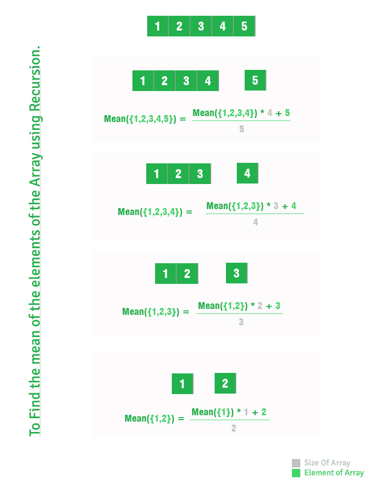

# 使用递归的数组平均值

> 原文:[https://www . geeksforgeeks . org/使用递归的数组平均值/](https://www.geeksforgeeks.org/mean-of-array-using-recursion/)

求数组元素的平均值。

```
Mean = (Sum of elements of the Array) /
       (Total no of elements in Array)
```

**例:**

```
Input : 1 2 3 4 5
Output : 3

Input : 1 2 3
Output : 2
```

要用递归求平均值，假设 N-1 的问题已经解决了，也就是说你必须找到 n

```
Sum of first N-1 elements = 
                 (Mean of N-1 elements)*(N-1)

Mean of N elements = (Sum of first N-1 elements + 
                      N-th elements) / (N)
```

注意:由于数组索引从 0 开始，我们使用 A[N-1]访问第 N 个元素。



## C++

```
// Recursive C++ program to find mean of array
#include <iostream>
using namespace std;

// Function Definition of findMean function
float findMean(int A[], int N)
{
    if (N == 1)
        return (float)A[N-1];
    else
        return ((float)(findMean(A, N-1)*(N-1) +
                                    A[N-1]) / N);
}

// Main Calling Function
int main()
{
    float Mean = 0;
    int A[] = {1, 2, 3, 4, 5};
    int N = sizeof(A)/sizeof(A[0]);
    cout << " "<< findMean(A, N);
    return 0;
}

// this code is contributed by shivanisinghss2110
```

## C

```
// Recursive C program to find mean of array
#include<stdio.h>

// Function Definition of findMean function
float findMean(int A[], int N)
{
    if (N == 1)
        return (float)A[N-1];
    else
        return ((float)(findMean(A, N-1)*(N-1) +
                                    A[N-1]) / N);
}

// Main Calling Function
int main()
{
    float Mean = 0;
    int A[] = {1, 2, 3, 4, 5};
    int N = sizeof(A)/sizeof(A[0]);
    printf("%.2f\n", findMean(A, N));
    return 0;
}
```

## Java 语言(一种计算机语言，尤用于创建网站)

```
// Recursive Java program to find mean of array
class CalcMean
{
    // Function Definition of findMean function
    static float findMean(int A[], int N)
    {
        if (N == 1)
            return (float)A[N-1];
        else
            return ((float)(findMean(A, N-1)*(N-1) +
                                        A[N-1]) / N);
    }

    // main Function
    public static void main (String[] args)
    {
        float Mean = 0;
        int A[] = {1, 2, 3, 4, 5};
        int N = A.length;
        System.out.println(findMean(A, N));
    }
}
```

## 蟒蛇 3

```
# Recursive Python3 program to
# find mean of array

# Function Definition of findMean function
def findMean(A, N):

    if (N == 1):
        return A[N - 1]
    else:
        return ((findMean(A, N - 1) *
                (N - 1) + A[N - 1]) / N)

# Driver Code
Mean = 0
A = [1, 2, 3, 4, 5]
N = len(A)
print(findMean(A, N))

# This code is contributed by Anant Agarwal.
```

## C#

```
// Recursive C# program to find mean of array
using System;

class CalcMean
{
    // Function Definition of findMean function
    static float findMean(int []A, int N)
    {
        if (N == 1)
            return (float)A[N - 1];
        else
            return ((float)(findMean(A, N - 1) *
                           (N - 1) + A[N - 1]) / N);
    }

    // Driver code
    public static void Main()
    {
        //float Mean = 0;
        int []A = {1, 2, 3, 4, 5};
        int N = A.Length;
        Console.WriteLine(findMean(A, N));
    }
}

// This code is contributed by Anant Agarwal.
```

## 服务器端编程语言（Professional Hypertext Preprocessor 的缩写）

```
<?php
// Recursive PHP program to find mean of array

// Function Definition of findMean function
function findMean($A, $N)
{
    if ($N == 1)
        return $A[$N - 1];
    else
        return ((findMean($A, $N - 1) * ($N - 1) +
                          $A[$N - 1]) / $N);
}

// Driver Code
$Mean = 0;
$A = array(1, 2, 3, 4, 5);
$N = sizeof($A);
echo findMean($A, $N);

// This code is contributed by ajit.
?>
```

## java 描述语言

```
<script>
    // Recursive Javascript program to find mean of array

    // Function Definition of findMean function
    function findMean(A, N)
    {
        if (N == 1)
            return A[N - 1];
        else
            return ((findMean(A, N - 1) * (N - 1) + A[N - 1]) / N);
    }

    // float Mean = 0;
    let A = [1, 2, 3, 4, 5];
    let N = A.length;
    document.write(findMean(A, N));

    // This code is contributed by rameshtravel07.
</script>
```

**输出:**

```
3
```

本文由 [**普拉哈尔·阿格沃尔**](http://prakhar.info) 供稿。如果你喜欢 GeeksforGeeks 并想投稿，你也可以使用[write.geeksforgeeks.org](https://write.geeksforgeeks.org)写一篇文章或者把你的文章邮寄到 review-team@geeksforgeeks.org。看到你的文章出现在极客博客主页上，帮助其他极客。
如果发现有不正确的地方，或者想分享更多关于上述话题的信息，请写评论。