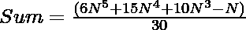
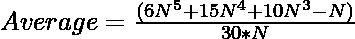
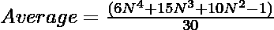

# 前 N 个自然数的四次幂的平均值

> 原文:[https://www . geesforgeks . org/一阶 n 次方平均数自然数/](https://www.geeksforgeeks.org/mean-of-fourth-powers-of-first-n-natural-numbers/)

给定一个正整数 **N** ，任务是求第一个 **N** [自然数](https://www.geeksforgeeks.org/natural-numbers/)的四次幂的平均值。

**示例:**

> **输入:** N = 3
> **输出:** 32.6667
> **说明:**
> 前 N 个自然数的四次幂之和= 1<sup>4</sup>+2<sup>4</sup>+3<sup>4</sup>= 1+16+81 = 98。
> 因此，平均值= 98 / 3 = 32.6667。
> 
> **输入:**N = 5
> T3】输出: 12

**天真法:**解决给定问题最简单的方法是求[前 N 个自然数](https://www.geeksforgeeks.org/sum-fourth-powers-first-n-natural-numbers/)的四次幂之和，除以 **N** 后打印其值。

下面是上述方法的实现:

## C++

```
// C++ program for the above approach

#include <bits/stdc++.h>
using namespace std;

// Function to find the average of the
// fourth power of first N natural numbers
double findAverage(int N)
{
    // Stores the sum of the fourth
    // powers of first N natural numbers
    double S = 0;

    // Calculate the sum of fourth power
    for (int i = 1; i <= N; i++) {
        S += i * i * i * i;
    }

    // Return the average
    return S / N;
}

// Driver Code
int main()
{
    int N = 3;
    cout << findAverage(N);

    return 0;
}
```

## Java 语言(一种计算机语言，尤用于创建网站)

```
// Java program for the above approach
class GFG{

// Function to find the average of the
// fourth power of first N natural numbers
static double findAverage(int N)
{

    // Stores the sum of the fourth
    // powers of first N natural numbers
    double S = 0;

    // Calculate the sum of fourth power
    for(int i = 1; i <= N; i++)
    {
        S += i * i * i * i;
    }

    // Return the average
    return S / N;
}

// Driver code
public static void main(String[] args)
{
    int N = 3;

    System.out.println(findAverage(N));
}
}

// This code is contributed by abhinavjain194
```

## 蟒蛇 3

```
# Python3 program for the above approach

# Function to find the average of the
# fourth power of first N natural numbers
def findAverage(N):

    # Stores the sum of the fourth
    # powers of first N natural numbers
    S = 0

    # Calculate the sum of fourth power
    for i in range(1, N + 1):
        S += i * i * i * i

    # Return the average
    return round(S / N, 4)

# Driver Code
if __name__ == '__main__':

    N = 3
    print(findAverage(N))

# This code is contributed by mohit kumar 29
```

## C#

```
// C# program for the above approach
using System;

class GFG{

// Function to find the average of the
// fourth power of first N natural numbers
static double findAverage(int N)
{

    // Stores the sum of the fourth
    // powers of first N natural numbers
    double S = 0;

    // Calculate the sum of fourth power
    for(int i = 1; i <= N; i++)
    {
        S += i * i * i * i;
    }

    // Return the average
    return S / N;
}

// Driver Code
public static void Main()
{
    int N = 3;

    Console.WriteLine(findAverage(N));
}
}

// This code is contriobuted by sanjoy_62
```

## java 描述语言

```
<script>

// javascript program for the above approach

// Function to find the average of the
// fourth power of first N natural numbers
function findAverage(N)
{
    // Stores the sum of the fourth
    // powers of first N natural numbers
    var S = 0;

    var i;
    // Calculate the sum of fourth power
    for (i = 1; i <= N; i++) {
        S += i * i * i * i;
    }

    // Return the average
    return S / N;
}

// Driver Code
    var N = 3;
    document.write(findAverage(N));

</script>
```

**Output:** 

```
32.6667
```

***时间复杂度:**O(N)*
T5**辅助空间:** O(1)

**高效法:**上述方法也可以通过下面给出的数学公式求出第一个 **N 个**自然数的四次幂的[和，然后在除以 **N** 时打印其值来优化。](https://www.geeksforgeeks.org/sum-fourth-powers-first-n-natural-numbers/)

数学公式如下:

> => 
> 
> => 
> 
> => 

下面是上述方法的实现:

## C++

```
// C++ program for the above approach

#include <bits/stdc++.h>
using namespace std;

// Function to find the average of the
// fourth power of first N natural numbers
double findAverage(int N)
{
    // Store the resultant average
    // calculated using formula
    double avg = ((6 * N * N * N * N)
                  + (15 * N * N * N)
                  + (10 * N * N) - 1)
                 / 30.0;

    // Return the average
    return avg;
}

// Driver Code
int main()
{
    int N = 3;
    cout << findAverage(N);

    return 0;
}
```

## Java 语言(一种计算机语言，尤用于创建网站)

```
// Java program for the above approach
import java.util.*;

class GFG{

// Function to find the average of the
// fourth power of first N natural numbers
static double findAverage(int N)
{

    // Store the resultant average
    // calculated using formula
    double avg = ((6 * N * N * N * N) +
                 (15 * N * N * N) +
                 (10 * N * N) - 1) / 30.0;

    // Return the average
    return avg;
}

// Driver Code
public static void main(String args[])
{
    int N = 3;

    System.out.print(findAverage(N));
}
}

// This code is contributed by shivanisinghss2110
```

## 蟒蛇 3

```
# Python program for the above approach

# Function to find the average of the
# fourth power of first N natural numbers
def findAverage(N):

      # Store the resultant average
    # calculated using formula
    avg = ((6 * N * N * N * N) + (15 * N * N * N) + (10 * N * N) - 1) / 30

    # Return the average
    return avg

N = 3
print(round(findAverage(N),4))

# This code is contributed by avanitrachhadiya2155
```

## C#

```
// C# program for the above approach
using System;

class GFG{

// Function to find the average of the
// fourth power of first N natural numbers
static double findAverage(int N)
{

    // Store the resultant average
    // calculated using formula
    double avg = ((6 * N * N * N * N) +
                 (15 * N * N * N) +
                 (10 * N * N) - 1) / 30.0;

    // Return the average
    return avg;
}

// Driver Code
public static void Main()
{
    int N = 3;
    Console.WriteLine(findAverage(N));
}
}

// This code is contributed by ukasp
```

## java 描述语言

```
<script>

    // JavaScript program for the above approach

// Function to find the average of the
// fourth power of first N natural numbers
function findAverage( N)
{
    // Store the resultant average
    // calculated using formula
    let avg = ((6 * N * N * N * N)
                + (15 * N * N * N)
                + (10 * N * N) - 1)
                / 30.0;

    // Return the average
    return avg;
}

// Driver Code

    let N = 3;
    document.write( findAverage(N).toFixed(4));

// This code is contributed by G.Sravan Kumar (171FA07058)

</script>
```

**Output:** 

```
32.6667
```

***时间复杂度:**O(1)*
T5**辅助空间:** O(1)