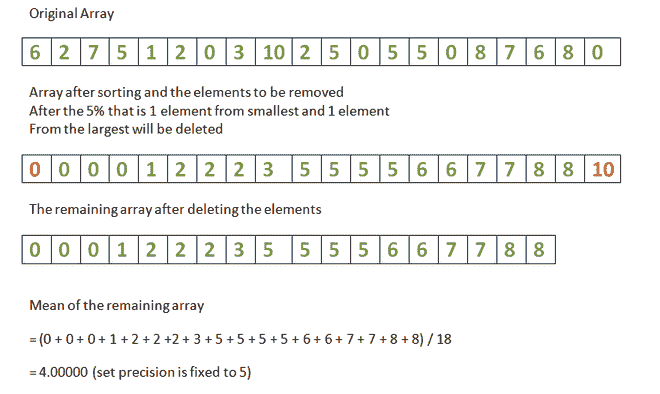

# 去除最小和最大数组元素的 K %后给定数组的平均值

> 原文:[https://www . geesforgeks . org/给定数组移除最小和最大数组元素百分比后的平均值/](https://www.geeksforgeeks.org/mean-of-given-array-after-removal-of-k-percent-of-smallest-and-largest-array-elements/)

给定一个[数组](https://www.geeksforgeeks.org/array-data-structure/)**arr【】**和一个整数 **K** ，任务是从**最小的**和**最大的**数组元素中移除 **K %** 百分比数组元素，并计算剩余数组的**平均值**。

**示例:**

> **输入:** arr[] = {6，2，7，5，1，2，0，3，10，2，5，0，5，5，0，8，7，6，8，0}，K = 5
> **输出:** 4.00000
> **说明:**
> 数组中有 **20 个**元素。因此，20 的 **5%** 为 **1** 。因此**最小的**元素中的 1 个(即 0)被移除，而**最大的**元素中的 1 个(即 0)被移除**。所以**的意思是剩余阵的**是 **18** 。**
> 
> ****
> 
>  ****输入:** arr[] = {6，0，7，0，7，5，7，8，3，4，0，7，8，1，6，8，1，1，2，4}，K = 10
> **输出:** 4.31250**

****进场:****

1.  **[排序数组](https://www.geeksforgeeks.org/c-program-to-sort-an-array-in-ascending-order/) **arr[]** 。**
2.  **[找到数组的大小](https://www.geeksforgeeks.org/how-to-find-size-of-array-in-cc-without-using-sizeof-operator/)。**
3.  **计算数组大小的第**K**-第**个百分比**。**
4.  **现在，将指数 **K%** 中的元素添加到**(N–1)–K %**中。**
5.  **最后，找出这些元素的含义。**

**下面是上述方法的实现:**

## **C++14**

```
// C++ program for the above approach
#include <bits/stdc++.h>
using namespace std;

// Function to calculate the mean
// of a given array after removal
// of Kth percent of smallest and
// largest array elements
void meanOfRemainingElements(int arr[],
                             int N, int K)
{
    // Sort the array
    sort(arr, arr + N);

    // Find the K-th percent
    // of the array size
    int kthPercent = (N * K) / 100;
    float sum = 0;

    // Traverse the array
    for (int i = 0; i < N; i++)

        // Skip the first K-th
        // percent & last K-th
        // percent array elements
        if (i >= kthPercent && i < (N - kthPercent))
            sum += arr[i];

    // Mean of the rest of elements
    float mean = sum
                 / (N - 2 * kthPercent);

    // Print mean upto 5 decimal places
    cout << fixed << setprecision(5) << mean << endl;
}

// Driver Code
int main()
{

    int arr[] = { 6, 2, 7, 5, 1, 2, 0, 3, 10, 2,
                  5, 0, 5, 5, 0, 8, 7, 6, 8, 0 };
    int arr_size = sizeof(arr) / sizeof(arr[0]);
    int K = 5;

    meanOfRemainingElements(arr, arr_size, K);

    return 0;
}
```

## **Java 语言(一种计算机语言，尤用于创建网站)**

```
// Java program for the above approach
import java.util.*;
public class GFG
{

  // Function to calculate the mean
  // of a given array after removal
  // of Kth percent of smallest and
  // largest array elements
  static void meanOfRemainingElements(int[] arr, int N,
                                      int K)
  {

    // Sort the array
    Arrays.sort(arr);

    // Find the K-th percent
    // of the array size
    int kthPercent = (N * K) / 100;
    float sum = 0f;

    // Traverse the array
    for (int i = 0; i < N; i++)

      // Skip the first K-th
      // percent & last K-th
      // percent array elements
      if (i >= kthPercent && i < (N - kthPercent))
        sum += arr[i];

    // Mean of the rest of elements
    float mean = (sum / (N - 2 * kthPercent));

    // Print mean upto 5 decimal places
    System.out.format("%.5f", mean);
  }

  // Driver Code
  public static void main(String args[])
  {
    int[] arr = { 6, 2, 7, 5, 1, 2, 0, 3, 10, 2,
                 5, 0, 5, 5, 0, 8, 7, 6, 8,  0 };
    int arr_size = arr.length;
    int K = 5;

    meanOfRemainingElements(arr, arr_size, K);
  }
}

// This code is contributed by jana_sayantan.
```

## **蟒蛇 3**

```
# Python program for the above approach

# Function to calculate the mean
# of a given array after removal
# of Kth percent of smallest and
# largest array elements
def meanOfRemainingElements(arr, N, K):

    # Sort the array
    arr.sort()

    # Find the K-th percent
    # of the array size
    kthPercent = (N * K) / 100
    sum = 0

    # Traverse the array
    for i in range(N):

        # Skip the first K-th
        # percent & last K-th
        # percent array elements
        if (i >= kthPercent and i < (N - kthPercent)):
            sum += arr[i]

    # Mean of the rest of elements
    mean = sum/ (N - 2 * kthPercent)

    # Print mean upto 5 decimal places
    print( '%.5f'%mean)

# Driver Code
arr = [ 6, 2, 7, 5, 1, 2, 0, 3, 10, 2, 5, 0, 5, 5, 0, 8, 7, 6, 8, 0 ]
arr_size = len(arr)
K = 5

meanOfRemainingElements(arr, arr_size, K)

# This code is contributed by rohitsingh07052.
```

## **C#**

```
// C# program for the above approach
using System;

class GFG {

    // Function to calculate the mean
    // of a given array after removal
    // of Kth percent of smallest and
    // largest array elements
    static void meanOfRemainingElements(int[] arr, int N,
                                        int K)
    {

        // Sort the array
        Array.Sort(arr);

        // Find the K-th percent
        // of the array size
        int kthPercent = (N * K) / 100;
        float sum = 0f;

        // Traverse the array
        for (int i = 0; i < N; i++)

            // Skip the first K-th
            // percent & last K-th
            // percent array elements
            if (i >= kthPercent && i < (N - kthPercent))
                sum += arr[i];

        // Mean of the rest of elements
        float mean = (sum / (N - 2 * kthPercent));

        // Print mean upto 5 decimal places
        Console.WriteLine(Math.Round(mean,5));
    }

    // Driver Code
    public static void Main()
    {
        int[] arr = { 6, 2, 7, 5, 1, 2, 0, 3, 10, 2,
                      5, 0, 5, 5, 0, 8, 7, 6, 8,  0 };
        int arr_size = arr.Length;
        int K = 5;

        meanOfRemainingElements(arr, arr_size, K);
    }
}

// This code is contributed by chitranayal.
```

## **java 描述语言**

```
<script>

// Javascript program for the above approach

// Function to calculate the mean
// of a given array after removal
// of Kth percent of smallest and
// largest array elements
function meanOfRemainingElements( arr, N, K)
{

    // Sort the array
    arr.sort(function(a, b){return a-b});

    // Find the K-th percent
    // of the array size
    let kthPercent = Math.floor((N * K) / 100);
    let sum = 0;

    // Traverse the array
    for (let i = 0; i < N; i++)

        // Skip the first K-th
        // percent & last K-th
        // percent array elements
        if (i >= kthPercent && i < (N - kthPercent))
            sum += arr[i];

    // Mean of the rest of elements
    let mean = sum
                / (N - 2 * kthPercent);

    // Print mean upto 5 decimal places
    document.write(mean.toFixed(5));
}

// Driver Code

let arr = [ 6, 2, 7, 5, 1, 2, 0, 3, 10, 2,
                5, 0, 5, 5, 0, 8, 7, 6, 8, 0 ];
let arr_size = arr.length;
let K = 5;

meanOfRemainingElements(arr, arr_size, K);

</script>
```

****Output:** 

```
4.00000
```** 

*****时间复杂度:**T3】O(N * logN)
T5】T6】辅助空间:T8】O(N)***