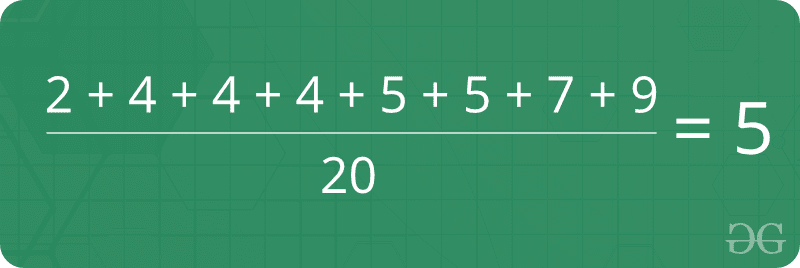
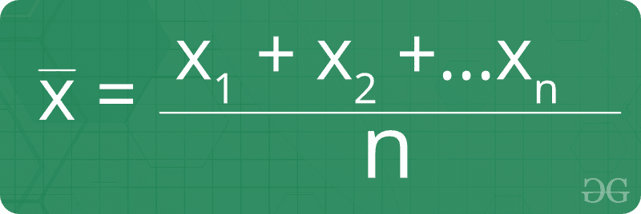
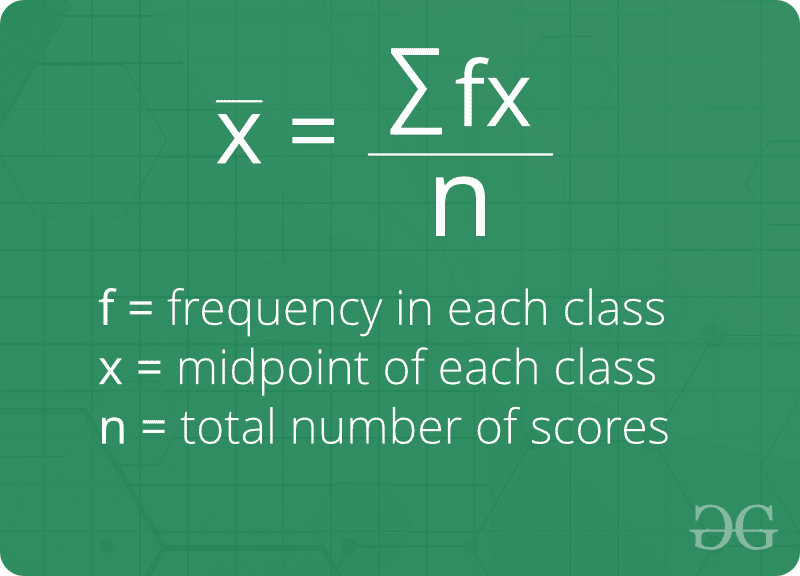

# 表示

> 原文:[https://www.geeksforgeeks.org/mean/](https://www.geeksforgeeks.org/mean/)

平均值是给定数据集的平均值。让我们考虑下面的例子 2，4，4，4，5，5，7，9 给定数据集的平均值是 5



**关于平均值的事实:**

1.  均值(或平均值)是最受欢迎和最广为人知的衡量中心趋势的方法。
2.  它既可以用于离散数据，也可以用于连续数据，尽管它最常用于连续数据。
3.  还有其他类型的手段。几何平均、调和平均和算术平均。
4.  平均值是中心趋势的唯一度量，其中每个值与平均值的偏差之和总是零。

**分组数据均值公式:**

**分组数据均值公式:**


**如何找到 Mean？**
赐 *n* 大小未排序阵，寻其均值。

> **数组的平均值=** (所有元素之和)/(元素个数)
> 
> 由于这里没有对数组进行排序，我们先对数组进行排序，然后应用上面的公式。

**示例:**

```
Input  : {1, 3, 4, 2, 6, 5, 8, 7}
Output : Mean = 4.5

Sum of the elements is 1 + 3 + 4 + 2 + 6 + 
5 + 8 + 7 = 36
Mean = 36/8 = 4.5

Input  : {4, 4, 4, 4, 4}
Output : Mean = 4
```

下面是代码实现:

## C++

```
// CPP program to find mean
#include <bits/stdc++.h>
using namespace std;

// Function for calculating mean
double findMean(int a[], int n)
{
    int sum = 0;
    for (int i = 0; i < n; i++)
        sum += a[i];

    return (double)sum / (double)n;
}

// Driver program
int main()
{
    int a[] = { 1, 3, 4, 2, 7, 5, 8, 6 };
    int n = sizeof(a) / sizeof(a[0]);
    cout << "Mean = " << findMean(a, n) << endl;
    return 0;
}
```

## Java 语言(一种计算机语言，尤用于创建网站)

```
// Java program to find mean
import java.util.*;

class GFG {

    // Function for calculating mean
    public static double findMean(int a[], int n)
    {
        int sum = 0;
        for (int i = 0; i < n; i++)
            sum += a[i];

        return (double)sum / (double)n;
    }

    // Driver program
    public static void main(String args[])
    {
        int a[] = { 1, 3, 4, 2, 7, 5, 8, 6 };
        int n = a.length;
        System.out.println("Mean = " + findMean(a, n));
    }
}
```

## 蟒蛇 3

```
# Python3 program to find mean 

# Function for calculating mean
def findMean(a, n):

    sum = 0
    for i in range( 0, n):
        sum += a[i]

    return float(sum / n)

# Driver program
a = [ 1, 3, 4, 2, 7, 5, 8, 6 ]
n = len(a)
print("Mean =", findMean(a, n))
```

## C#

```
// C# program to find mean
using System;

class GFG {
    // Function for
    // calculating mean
    public static double findMean(int[] a, int n)
    {
        int sum = 0;
        for (int i = 0; i < n; i++)
            sum += a[i];

        return (double)sum / (double)n;
    }

    // Driver Code
    public static void Main()
    {
        int[] a = { 1, 3, 4, 2,
                    7, 5, 8, 6 };
        int n = a.Length;
        Console.Write("Mean = " + findMean(a, n) + "\n");
    }
}
```

## 服务器端编程语言（Professional Hypertext Preprocessor 的缩写）

```
<?php 
// PHP program to find mean 

// Function for calculating mean
function findMean(&$a, $n)
{
    $sum = 0;
    for ($i = 0; $i < $n; $i++) 
        $sum += $a[$i];

    return (double)$sum / 
           (double)$n;
}

// Driver Code
$a = array(1, 3, 4, 2, 
           7, 5, 8, 6);
$n = sizeof($a);
echo "Mean = " . 
      findMean($a, $n)."\n"; 
?>
```

**Output:**

```
Mean = 4.5
```

求平均值的时间复杂度= 0(n)

**与均值相关的基本程序**

*   [求给定阵列中子阵列平均值](https://www.geeksforgeeks.org/find-mean-subarray-means-given-array/)
*   [使用递归的数组平均值](https://www.geeksforgeeks.org/mean-of-array-using-recursion/)
*   [求矩阵的均值向量](https://www.geeksforgeeks.org/find-mean-vector-matrix/)
*   [数组中范围的平均值](https://www.geeksforgeeks.org/mean-range-array/)
*   [矩阵的平均值和中值](https://www.geeksforgeeks.org/mean-median-matrix/)

**[近期中庸文章！](https://www.geeksforgeeks.org/tag/maths-mean/)T3】**