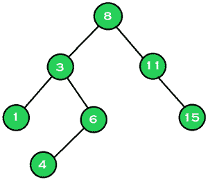

# 二叉查找树(BST)中给定范围内所有节点的中值

> 原文:[https://www . geesforgeks . org/二进制搜索树中给定范围内所有节点的中位数-bst/](https://www.geeksforgeeks.org/median-of-all-nodes-from-a-given-range-in-a-binary-search-tree-bst/)

给定一个由 **N** 节点和两个节点 **A** 和 **B** 组成的[二叉查找树(BST)](https://www.geeksforgeeks.org/binary-search-tree-data-structure/) ，任务是找到给定 BST 中所有节点的[中值，其值在**【A，B】**范围内。](https://www.geeksforgeeks.org/find-median-bst-time-o1-space/)

**示例:**

> **输入:** A = 3，B = 11
> 
> 
> 
> **输出:** 6
> **说明:**
> 位于范围【3，11】内的节点为{3，4，6，8，11}。给定节点的中位数是 6。
> 
> **输入:** A = 6，B = 15
> 
> 
> 
> **输出:** 9.5

**方法:**给定的问题可以通过在给定的树上执行[任意树遍历来解决，并且存储所有位于范围**【A，B】**上的节点，并且找到所有存储元素的中间值。按照以下步骤解决问题:](https://www.geeksforgeeks.org/tree-traversals-inorder-preorder-and-postorder/)

*   初始化一个[向量](https://www.geeksforgeeks.org/vector-in-cpp-stl/)，比如说 **V** ，它存储了位于范围**【A，B】**内的树的所有值。
*   [执行给定树的有序遍历](https://www.geeksforgeeks.org/tree-traversals-inorder-preorder-and-postorder/)，如果任何节点的值位于范围**【A，B】**内，则将该值插入向量 **V** 中。
*   完成以上步骤后，打印矢量 **V** 中存储的所有元素的[中值作为结果。](https://www.geeksforgeeks.org/program-for-mean-and-median-of-an-unsorted-array/)

下面是上述方法的实现:

## C++

```
// C++ program for the above approach

#include <bits/stdc++.h>
using namespace std;

// Tree Node structure
struct Node {
    struct Node *left, *right;
    int key;
};

// Function to create a new BST node
Node* newNode(int key)
{
    Node* temp = new Node;
    temp->key = key;
    temp->left = temp->right = NULL;
    return temp;
}

// Function to insert a new node with
// given key in BST
Node* insertNode(Node* node, int key)
{
    // If the tree is empty,
    // return a new node
    if (node == NULL)
        return newNode(key);

    // Otherwise, recur down the tree
    if (key < node->key)
        node->left = insertNode(
            node->left, key);

    else if (key > node->key)
        node->right = insertNode(
            node->right, key);

    // Return the node pointer
    return node;
}

// Function to find all the nodes that
// lies over the range [node1, node2]
void getIntermediateNodes(
    Node* root, vector<int>& interNodes,
    int node1, int node2)
{
    // If the tree is empty, return
    if (root == NULL)
        return;

    // Traverse for the left subtree
    getIntermediateNodes(root->left,
                         interNodes,
                         node1, node2);

    // If a second node is found,
    // then update the flag as false
    if (root->key <= node2
        and root->key >= node1) {
        interNodes.push_back(root->key);
    }

    // Traverse the right subtree
    getIntermediateNodes(root->right,
                         interNodes,
                         node1, node2);
}

// Function to find the median of all
// the values in the given BST that
// lies over the range [node1, node2]
float findMedian(Node* root, int node1,
                 int node2)
{
    // Stores all the nodes in
    // the range [node1, node2]
    vector<int> interNodes;

    getIntermediateNodes(root, interNodes,
                         node1, node2);

    // Store the size of the array
    int nSize = interNodes.size();

    // Print the median of array
    // based on the size of array
    return (nSize % 2 == 1)
               ? (float)interNodes[nSize / 2]
               : (float)(interNodes[(nSize - 1) / 2]
                         + interNodes[nSize / 2])
                     / 2;
}

// Driver Code
int main()
{
    // Given BST
    struct Node* root = NULL;
    root = insertNode(root, 8);
    insertNode(root, 3);
    insertNode(root, 1);
    insertNode(root, 6);
    insertNode(root, 4);
    insertNode(root, 11);
    insertNode(root, 15);

    cout << findMedian(root, 3, 11);

    return 0;
}
```

## Java 语言(一种计算机语言，尤用于创建网站)

```
// Java program for the above approach
import java.util.*;

class GFG{

// Tree Node structure
static class Node
{
    Node left, right;
    int key;
};

static Vector<Integer> interNodes = new Vector<Integer>();

// Function to create a new BST node
static Node newNode(int key)
{
    Node temp = new Node();
    temp.key = key;
    temp.left = temp.right = null;
    return temp;
}

// Function to insert a new node with
// given key in BST
static Node insertNode(Node node, int key)
{

    // If the tree is empty,
    // return a new node
    if (node == null)
        return newNode(key);

    // Otherwise, recur down the tree
    if (key < node.key)
        node.left = insertNode(
            node.left, key);

    else if (key > node.key)
        node.right = insertNode(
            node.right, key);

    // Return the node pointer
    return node;
}

// Function to find all the nodes that
// lies over the range [node1, node2]
static void getIntermediateNodes(Node root,
                                 int node1,
                                 int node2)
{

    // If the tree is empty, return
    if (root == null)
        return;

    // Traverse for the left subtree
    getIntermediateNodes(root.left,
                         node1, node2);

    // If a second node is found,
    // then update the flag as false
    if (root.key <= node2 &&
        root.key >= node1)
    {
        interNodes.add(root.key);
    }

    // Traverse the right subtree
    getIntermediateNodes(root.right,
                         node1, node2);
}

// Function to find the median of all
// the values in the given BST that
// lies over the range [node1, node2]
static float findMedian(Node root, int node1,
                                   int node2)
{

    // Stores all the nodes in
    // the range [node1, node2]
    getIntermediateNodes(root,
                         node1, node2);

    // Store the size of the array
    int nSize = interNodes.size();

    // Print the median of array
    // based on the size of array
    return (nSize % 2 == 1) ?
           (float)interNodes.get(nSize / 2) :
           (float)(interNodes.get((nSize - 1) / 2) +
                    interNodes.get(nSize / 2)) / 2;
}

// Driver Code
public static void main(String[] args)
{

    // Given BST
    Node root = null;
    root = insertNode(root, 8);
    insertNode(root, 3);
    insertNode(root, 1);
    insertNode(root, 6);
    insertNode(root, 4);
    insertNode(root, 11);
    insertNode(root, 15);

    System.out.print(findMedian(root, 3, 11));
}
}

// This code is contributed by shikhasingrajput
```

## 蟒蛇 3

```
# Python3 program for the above approach

# Tree Node structure
class Node:
    def __init__(self, key):
        self.key = key
        self.left = None
        self.right = None

interNodes = []

# Function to create a new BST node
def newNode(key):
    temp = Node(key)
    return temp

# Function to insert a new node with
# given key in BST
def insertNode(node, key):
    # If the tree is empty,
    # return a new node
    if (node == None):
        return newNode(key)

    # Otherwise, recur down the tree
    if (key < node.key):
        node.left = insertNode(node.left, key)
    elif (key > node.key):
        node.right = insertNode(node.right, key)

    # Return the node pointer
    return node

# Function to find all the nodes that
# lies over the range [node1, node2]
def getIntermediateNodes(root, node1, node2):
    # If the tree is empty, return
    if (root == None):
        return

    # Traverse for the left subtree
    getIntermediateNodes(root.left, node1, node2)

    # If a second node is found,
    # then update the flag as false
    if (root.key <= node2 and root.key >= node1):
        interNodes.append(root.key)

    # Traverse the right subtree
    getIntermediateNodes(root.right, node1, node2)

# Function to find the median of all
# the values in the given BST that
# lies over the range [node1, node2]
def findMedian(root, node1, node2):
    # Stores all the nodes in
    # the range [node1, node2]
    getIntermediateNodes(root, node1, node2)

    # Store the size of the array
    nSize = len(interNodes)

    # Print the median of array
    # based on the size of array
    if nSize % 2 == 1:
        return interNodes[int(nSize / 2)]
    else:
        return (interNodes[int((nSize - 1) / 2)] + interNodes[nSize / 2]) / 2

# Given BST
root = None
root = insertNode(root, 8)
insertNode(root, 3)
insertNode(root, 1)
insertNode(root, 6)
insertNode(root, 4)
insertNode(root, 11)
insertNode(root, 15)

print(findMedian(root, 3, 11))

# This code is contributed by decode2207.
```

## C#

```
// C# program for the above approach
using System;
using System.Collections.Generic;

public class GFG{

// Tree Node structure
class Node
{
    public Node left, right;
    public int key;
};

static List<int> interNodes = new List<int>();

// Function to create a new BST node
static Node newNode(int key)
{
    Node temp = new Node();
    temp.key = key;
    temp.left = temp.right = null;
    return temp;
}

// Function to insert a new node with
// given key in BST
static Node insertNode(Node node, int key)
{

    // If the tree is empty,
    // return a new node
    if (node == null)
        return newNode(key);

    // Otherwise, recur down the tree
    if (key < node.key)
        node.left = insertNode(
            node.left, key);

    else if (key > node.key)
        node.right = insertNode(
            node.right, key);

    // Return the node pointer
    return node;
}

// Function to find all the nodes that
// lies over the range [node1, node2]
static void getIntermediateNodes(Node root,
                                 int node1,
                                 int node2)
{

    // If the tree is empty, return
    if (root == null)
        return;

    // Traverse for the left subtree
    getIntermediateNodes(root.left,
                         node1, node2);

    // If a second node is found,
    // then update the flag as false
    if (root.key <= node2 &&
        root.key >= node1)
    {
        interNodes.Add(root.key);
    }

    // Traverse the right subtree
    getIntermediateNodes(root.right,
                         node1, node2);
}

// Function to find the median of all
// the values in the given BST that
// lies over the range [node1, node2]
static float findMedian(Node root, int node1,
                                   int node2)
{

    // Stores all the nodes in
    // the range [node1, node2]
    getIntermediateNodes(root,
                         node1, node2);

    // Store the size of the array
    int nSize = interNodes.Count;

    // Print the median of array
    // based on the size of array
    return (nSize % 2 == 1) ?
           (float)interNodes[nSize / 2] :
           (float)(interNodes[(nSize - 1) / 2] +
                    interNodes[nSize / 2]) / 2;
}

// Driver Code
public static void Main(String[] args)
{

    // Given BST
    Node root = null;
    root = insertNode(root, 8);
    insertNode(root, 3);
    insertNode(root, 1);
    insertNode(root, 6);
    insertNode(root, 4);
    insertNode(root, 11);
    insertNode(root, 15);

    Console.Write(findMedian(root, 3, 11));
}
}

// This code is contributed by shikhasingrajput
```

## java 描述语言

```
<script>
    // Javascript program for the above approach

    // Tree Node structure
    class Node
    {
        constructor(key) {
           this.left = null;
           this.right = null;
           this.key = key;
        }
    }

    let interNodes = [];

    // Function to create a new BST node
    function newNode(key)
    {
        let temp = new Node(key);
        return temp;
    }

    // Function to insert a new node with
    // given key in BST
    function insertNode(node, key)
    {

        // If the tree is empty,
        // return a new node
        if (node == null)
            return newNode(key);

        // Otherwise, recur down the tree
        if (key < node.key)
            node.left = insertNode(
                node.left, key);

        else if (key > node.key)
            node.right = insertNode(
                node.right, key);

        // Return the node pointer
        return node;
    }

    // Function to find all the nodes that
    // lies over the range [node1, node2]
    function getIntermediateNodes(root, node1, node2)
    {

        // If the tree is empty, return
        if (root == null)
            return;

        // Traverse for the left subtree
        getIntermediateNodes(root.left,
                             node1, node2);

        // If a second node is found,
        // then update the flag as false
        if (root.key <= node2 &&
            root.key >= node1)
        {
            interNodes.push(root.key);
        }

        // Traverse the right subtree
        getIntermediateNodes(root.right,
                             node1, node2);
    }

    // Function to find the median of all
    // the values in the given BST that
    // lies over the range [node1, node2]
    function findMedian(root, node1, node2)
    {

        // Stores all the nodes in
        // the range [node1, node2]
        getIntermediateNodes(root, node1, node2);

        // Store the size of the array
        let nSize = interNodes.length;

        // Print the median of array
        // based on the size of array
        return (nSize % 2 == 1) ?
               interNodes[parseInt(nSize / 2, 10)] :
               (interNodes[parseInt((nSize - 1) / 2, 10)] +
                        interNodes[nSize / 2]) / 2;
    }

    // Given BST
    let root = null;
    root = insertNode(root, 8);
    insertNode(root, 3);
    insertNode(root, 1);
    insertNode(root, 6);
    insertNode(root, 4);
    insertNode(root, 11);
    insertNode(root, 15);

    document.write(findMedian(root, 3, 11));

// This code is contributed by suresh07.
</script>
```

**Output:** 

```
6
```

***时间复杂度:**O(N)*
T5**辅助空间:** O(N)