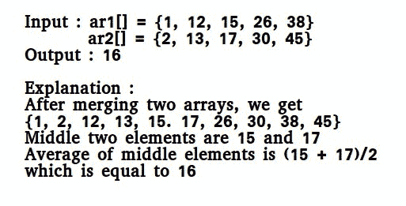

# 两个相同大小的排序数组的中间值

> 原文:[https://www.geeksforgeeks.org/median-of-two-sorted-arrays/](https://www.geeksforgeeks.org/median-of-two-sorted-arrays/)

有 2 个大小为 n 的排序数组 A 和 B。写一个算法，求上面两个数组合并后得到的数组的中值(即长度为 2n 的数组)。复杂度应该是 O(log(n))。



**注:**由于我们要找的中位数的集合的大小是偶数(2n)，所以需要取中间两个数的平均值，并返回平均值的下限。
**方法 1(合并时简单计数)**
使用合并排序的合并程序。比较两个数组的元素时跟踪计数。如果计数变成 n(对于 2n 个元素)，我们就达到了中值。取合并数组中索引 n-1 和 n 处元素的平均值。参见下面的实现。

## C

```
// A Simple Merge based O(n) solution to find median of
// two sorted arrays
#include <stdio.h>

/* This function returns median of ar1[] and ar2[].
   Assumptions in this function:
   Both ar1[] and ar2[] are sorted arrays
   Both have n elements */
int getMedian(int ar1[], int ar2[], int n)
{
    int i = 0;  /* Current index of i/p array ar1[] */
    int j = 0; /* Current index of i/p array ar2[] */
    int count;
    int m1 = -1, m2 = -1;

    /* Since there are 2n elements, median will be average
     of elements at index n-1 and n in the array obtained after
     merging ar1 and ar2 */
    for (count = 0; count <= n; count++)
    {
        /*Below is to handle case where all elements of ar1[] are
          smaller than smallest(or first) element of ar2[]*/
        if (i == n)
        {
            m1 = m2;
            m2 = ar2[0];
            break;
        }

        /*Below is to handle case where all elements of ar2[] are
          smaller than smallest(or first) element of ar1[]*/
        else if (j == n)
        {
            m1 = m2;
            m2 = ar1[0];
            break;
        }
         /* equals sign because if two
            arrays have some common elements */
        if (ar1[i] <= ar2[j])
        {
            m1 = m2;  /* Store the prev median */
            m2 = ar1[i];
            i++;
        }
        else
        {
            m1 = m2;  /* Store the prev median */
            m2 = ar2[j];
            j++;
        }
    }

    return (m1 + m2)/2;
}

/* Driver program to test above function */
int main()
{
    int ar1[] = {1, 12, 15, 26, 38};
    int ar2[] = {2, 13, 17, 30, 45};

    int n1 = sizeof(ar1)/sizeof(ar1[0]);
    int n2 = sizeof(ar2)/sizeof(ar2[0]);
    if (n1 == n2)
        printf("Median is %d", getMedian(ar1, ar2, n1));
    else
        printf("Doesn't work for arrays of unequal size");
    getchar();
    return 0;
}
```

## C++

```
// A Simple Merge based O(n)
// solution to find median of
// two sorted arrays
#include <bits/stdc++.h>
using namespace std;

/* This function returns
median of ar1[] and ar2[].
Assumptions in this function:
Both ar1[] and ar2[]
are sorted arrays
Both have n elements */
int getMedian(int ar1[],
              int ar2[], int n)
{
    int i = 0; /* Current index of
                  i/p array ar1[] */
    int j = 0; /* Current index of
                  i/p array ar2[] */
    int count;
    int m1 = -1, m2 = -1;

    /* Since there are 2n elements,
    median will be average of elements
    at index n-1 and n in the array
    obtained after merging ar1 and ar2 */
    for (count = 0; count <= n; count++)
    {
        /* Below is to handle case where
           all elements of ar1[] are
           smaller than smallest(or first)
           element of ar2[]*/
        if (i == n)
        {
            m1 = m2;
            m2 = ar2[0];
            break;
        }

        /*Below is to handle case where
          all elements of ar2[] are
          smaller than smallest(or first)
          element of ar1[]*/
        else if (j == n)
        {
            m1 = m2;
            m2 = ar1[0];
            break;
        }
        /* equals sign because if two
           arrays have some common elements */
        if (ar1[i] <= ar2[j])
        {
            /* Store the prev median */
            m1 = m2;
            m2 = ar1[i];
            i++;
        }
        else
        {
            /* Store the prev median */
            m1 = m2;
            m2 = ar2[j];
            j++;
        }
    }

    return (m1 + m2)/2;
}

// Driver Code
int main()
{
    int ar1[] = {1, 12, 15, 26, 38};
    int ar2[] = {2, 13, 17, 30, 45};

    int n1 = sizeof(ar1) / sizeof(ar1[0]);
    int n2 = sizeof(ar2) / sizeof(ar2[0]);
    if (n1 == n2)
        cout << "Median is "
             << getMedian(ar1, ar2, n1) ;
    else
        cout << "Doesn't work for arrays"
             << " of unequal size" ;
    getchar();
    return 0;
}

// This code is contributed
// by Shivi_Aggarwal
```

## Java 语言(一种计算机语言，尤用于创建网站)

```
// A Simple Merge based O(n) solution
// to find median of two sorted arrays

class Main
{
    // function to calculate median
    static int getMedian(int ar1[], int ar2[], int n)
    {  
        int i = 0; 
        int j = 0;
        int count;
        int m1 = -1, m2 = -1;

        /* Since there are 2n elements, median will
           be average of elements at index n-1 and
           n in the array obtained after merging ar1
           and ar2 */
        for (count = 0; count <= n; count++)
        {
            /* Below is to handle case where all
              elements of ar1[] are smaller than
              smallest(or first) element of ar2[] */
            if (i == n)
            {
                m1 = m2;
                m2 = ar2[0];
                break;
            }

            /* Below is to handle case where all
               elements of ar2[] are smaller than
               smallest(or first) element of ar1[] */
            else if (j == n)
            {
                m1 = m2;
                m2 = ar1[0];
                break;
            }
            /* equals sign because if two
               arrays have some common elements */
            if (ar1[i] <= ar2[j])
            {  
                /* Store the prev median */
                m1 = m2; 
                m2 = ar1[i];
                i++;
            }
            else
            {
                /* Store the prev median */
                m1 = m2; 
                m2 = ar2[j];
                j++;
            }
        }

        return (m1 + m2)/2;
    }

    /* Driver program to test above function */
    public static void main (String[] args)
    {
        int ar1[] = {1, 12, 15, 26, 38};
        int ar2[] = {2, 13, 17, 30, 45};

        int n1 = ar1.length;
        int n2 = ar2.length;
        if (n1 == n2)
            System.out.println("Median is " +
                        getMedian(ar1, ar2, n1));
        else
            System.out.println("arrays are of unequal size");
    }   
}
```

## 蟒蛇 3

```
# A Simple Merge based O(n) Python 3 solution
# to find median of two sorted lists

# This function returns median of ar1[] and ar2[].
# Assumptions in this function:
# Both ar1[] and ar2[] are sorted arrays
# Both have n elements
def getMedian( ar1, ar2 , n):
    i = 0 # Current index of i/p list ar1[]

    j = 0 # Current index of i/p list ar2[]

    m1 = -1
    m2 = -1

    # Since there are 2n elements, median
    # will be average of elements at index
    # n-1 and n in the array obtained after
    # merging ar1 and ar2
    count = 0
    while count < n + 1:
        count += 1

        # Below is to handle case where all
        # elements of ar1[] are smaller than
        # smallest(or first) element of ar2[]
        if i == n:
            m1 = m2
            m2 = ar2[0]
            break

        # Below is to handle case where all
        # elements of ar2[] are smaller than
        # smallest(or first) element of ar1[]
        elif j == n:
            m1 = m2
            m2 = ar1[0]
            break
        # equals sign because if two
        # arrays have some common elements
        if ar1[i] <= ar2[j]:
            m1 = m2 # Store the prev median
            m2 = ar1[i]
            i += 1
        else:
            m1 = m2 # Store the prev median
            m2 = ar2[j]
            j += 1
    return (m1 + m2)/2

# Driver code to test above function
ar1 = [1, 12, 15, 26, 38]
ar2 = [2, 13, 17, 30, 45]
n1 = len(ar1)
n2 = len(ar2)
if n1 == n2:
    print("Median is ", getMedian(ar1, ar2, n1))
else:
    print("Doesn't work for arrays of unequal size")

# This code is contributed by "Sharad_Bhardwaj".
```

## C#

```
// A Simple Merge based O(n) solution
// to find median of two sorted arrays
using System;
class GFG
{
    // function to calculate median
    static int getMedian(int []ar1,
                         int []ar2,
                         int n)
    {
        int i = 0;
        int j = 0;
        int count;
        int m1 = -1, m2 = -1;

        // Since there are 2n elements,
        // median will be average of
        // elements at index n-1 and n in
        // the array obtained after
        // merging ar1 and ar2
        for (count = 0; count <= n; count++)
        {
            // Below is to handle case
            // where all elements of ar1[] 
            // are smaller than smallest
            // (or first) element of ar2[]
            if (i == n)
            {
                m1 = m2;
                m2 = ar2[0];
                break;
            }

            /* Below is to handle case where all
            elements of ar2[] are smaller than
            smallest(or first) element of ar1[] */
            else if (j == n)
            {
                m1 = m2;
                m2 = ar1[0];
                break;
            }
            /* equals sign because if two
            arrays have some common elements */
            if (ar1[i] <= ar2[j])
            {
                // Store the prev median
                m1 = m2;
                m2 = ar1[i];
                i++;
            }
            else
            {
                // Store the prev median
                m1 = m2;
                m2 = ar2[j];
                j++;
            }
        }

        return (m1 + m2)/2;
    }

    // Driver Code
    public static void Main ()
    {
        int []ar1 = {1, 12, 15, 26, 38};
        int []ar2 = {2, 13, 17, 30, 45};

        int n1 = ar1.Length;
        int n2 = ar2.Length;
        if (n1 == n2)
            Console.Write("Median is " +
                        getMedian(ar1, ar2, n1));
        else
            Console.Write("arrays are of unequal size");
    }
}
```

## 服务器端编程语言（Professional Hypertext Preprocessor 的缩写）

```
<?php
// A Simple Merge based O(n) solution
// to find median of two sorted arrays

// This function returns median of
// ar1[] and ar2[]. Assumptions in
// this function: Both ar1[] and ar2[]
// are sorted arrays Both have n elements
function getMedian($ar1, $ar2, $n)
{
    // Current index of i/p array ar1[]
    $i = 0;

    // Current index of i/p array ar2[]
    $j = 0;
    $count;
    $m1 = -1; $m2 = -1;

    // Since there are 2n elements,
    // median will be average of elements
    // at index n-1 and n in the array
    // obtained after merging ar1 and ar2
    for ($count = 0; $count <= $n; $count++)
    {
        // Below is to handle case where
        // all elements of ar1[] are smaller
        // than smallest(or first) element of ar2[]
        if ($i == $n)
        {
            $m1 = $m2;
            $m2 = $ar2[0];
            break;
        }

        // Below is to handle case where all
        // elements of ar2[] are smaller than
        // smallest(or first) element of ar1[]
        else if ($j == $n)
        {
            $m1 = $m2;
            $m2 = $ar1[0];
            break;
        }
        // equals sign because if two
        // arrays have some common elements
        if ($ar1[$i] <= $ar2[$j])
        {
            // Store the prev median
            $m1 = $m2;
            $m2 = $ar1[$i];
            $i++;
        }
        else
        {
            // Store the prev median
            $m1 = $m2;
            $m2 = $ar2[$j];
            $j++;
        }
    }

    return ($m1 + $m2) / 2;
}

// Driver Code
$ar1 = array(1, 12, 15, 26, 38);
$ar2 = array(2, 13, 17, 30, 45);

$n1 = sizeof($ar1);
$n2 = sizeof($ar2);
if ($n1 == $n2)
    echo("Median is " .
          getMedian($ar1, $ar2, $n1));
else
    echo("Doesn't work for arrays".
         "of unequal size");

// This code is contributed by Ajit.
?>
```

## java 描述语言

```
<script>

// A Simple Merge based O(n) solution to find median of
// two sorted arrays

/* This function returns median of ar1[] and ar2[].
Assumptions in this function:
Both ar1[] and ar2[] are sorted arrays
Both have n elements */
function getMedian(ar1, ar2, n)
{
    var i = 0; /* Current index of i/p array ar1[] */
    var j = 0; /* Current index of i/p array ar2[] */
    var count;
    var m1 = -1, m2 = -1;

    /* Since there are 2n elements, median will be average
    of elements at index n-1 and n in the array obtained after
    merging ar1 and ar2 */
    for (count = 0; count <= n; count++)
    {
        /*Below is to handle case where all elements of ar1[] are
        smaller than smallest(or first) element of ar2[]*/
        if (i == n)
        {
            m1 = m2;
            m2 = ar2[0];
            break;
        }

        /*Below is to handle case where all elements of ar2[] are
        smaller than smallest(or first) element of ar1[]*/
        else if (j == n)
        {
            m1 = m2;
            m2 = ar1[0];
            break;
        }
        /* equals sign because if two
            arrays have some common elements */
        if (ar1[i] <= ar2[j])
        {
            m1 = m2; /* Store the prev median */
            m2 = ar1[i];
            i++;
        }
        else
        {
            m1 = m2; /* Store the prev median */
            m2 = ar2[j];
            j++;
        }
    }

    return (m1 + m2)/2;
}

/* Driver program to test above function */
var ar1 = [1, 12, 15, 26, 38];
var ar2 = [2, 13, 17, 30, 45];
var n1 = ar1.length;
var n2 = ar2.length;
if (n1 == n2)
    document.write("Median is "+ getMedian(ar1, ar2, n1));
else
    document.write("Doesn't work for arrays of unequal size");

</script>
```

**输出:**

```
Median is 16
```

**时间复杂度:** O(n)

**辅助空间:** O(1)
**方法 2(通过比较两个数组的中值)**
该方法首先获取两个排序数组的中值，然后进行比较。
设 ar1 和 ar2 为输入阵列。
**算法:**

```
1) Calculate the medians m1 and m2 of the input arrays ar1[] 
   and ar2[] respectively.
2) If m1 and m2 both are equal then we are done.
     return m1 (or m2)
3) If m1 is greater than m2, then median is present in one 
   of the below two subarrays.
    a)  From first element of ar1 to m1 (ar1[0...|_n/2_|])
    b)  From m2 to last element of ar2  (ar2[|_n/2_|...n-1])
4) If m2 is greater than m1, then median is present in one    
   of the below two subarrays.
   a)  From m1 to last element of ar1  (ar1[|_n/2_|...n-1])
   b)  From first element of ar2 to m2 (ar2[0...|_n/2_|])
5) Repeat the above process until size of both the subarrays 
   becomes 2.
6) If size of the two arrays is 2 then use below formula to get 
  the median.
    Median = (max(ar1[0], ar2[0]) + min(ar1[1], ar2[1]))/2
```

**示例:**

```
   ar1[] = {1, 12, 15, 26, 38}
   ar2[] = {2, 13, 17, 30, 45}
```

对于上面两个数组 m1 = 15 和 m2 = 17
对于上面的 ar1[]和 ar2[]，m1 小于 m2。所以中值出现在下面两个子阵之一。

```
   [15, 26, 38] and [2, 13, 17]
```

让我们对以上两个子阵列重复这个过程:

```
    m1 = 26 m2 = 13.
```

m1 大于 m2。所以子阵列变成了

```
  [15, 26] and [13, 17]
Now size is 2, so median = (max(ar1[0], ar2[0]) + min(ar1[1], ar2[1]))/2
                       = (max(15, 13) + min(26, 17))/2 
                       = (15 + 17)/2
                       = 16
```

**实施:**

## C

```
// A divide and conquer based efficient solution to find median
// of two sorted arrays of same size.
#include<bits/stdc++.h>
using namespace std;

int median(int [], int); /* to get median of a sorted array */

/* This function returns median of ar1[] and ar2[].
   Assumptions in this function:
   Both ar1[] and ar2[] are sorted arrays
   Both have n elements */
int getMedian(int ar1[], int ar2[], int n)
{
    /* return -1  for invalid input */
    if (n <= 0)
        return -1;
    if (n == 1)
        return (ar1[0] + ar2[0])/2;
    if (n == 2)
        return (max(ar1[0], ar2[0]) + min(ar1[1], ar2[1])) / 2;

    int m1 = median(ar1, n); /* get the median of the first array */
    int m2 = median(ar2, n); /* get the median of the second array */

    /* If medians are equal then return either m1 or m2 */
    if (m1 == m2)
        return m1;

    /* if m1 < m2 then median must exist in ar1[m1....] and
        ar2[....m2] */
    if (m1 < m2)
    {
        if (n % 2 == 0)
            return getMedian(ar1 + n/2 - 1, ar2, n - n/2 +1);
        return getMedian(ar1 + n/2, ar2, n - n/2);
    }

    /* if m1 > m2 then median must exist in ar1[....m1] and
        ar2[m2...] */
    if (n % 2 == 0)
        return getMedian(ar2 + n/2 - 1, ar1, n - n/2 + 1);
    return getMedian(ar2 + n/2, ar1, n - n/2);
}

/* Function to get median of a sorted array */
int median(int arr[], int n)
{
    if (n%2 == 0)
        return (arr[n/2] + arr[n/2-1])/2;
    else
        return arr[n/2];
}

/* Driver program to test above function */
int main()
{
    int ar1[] = {1, 2, 3, 6};
    int ar2[] = {4, 6, 8, 10};
    int n1 = sizeof(ar1)/sizeof(ar1[0]);
    int n2 = sizeof(ar2)/sizeof(ar2[0]);
    if (n1 == n2)
        printf("Median is %d", getMedian(ar1, ar2, n1));
    else
        printf("Doesn't work for arrays of unequal size");
    return 0;
}
```

## C++

```
// A divide and conquer based
// efficient solution to find
// median of two sorted arrays
// of same size.
#include<bits/stdc++.h>
using namespace std;

/* to get median of a
   sorted array */
int median(int [], int);

/* This function returns median
   of ar1[] and ar2[].
Assumptions in this function:
    Both ar1[] and ar2[] are
    sorted arrays
    Both have n elements */
int getMedian(int ar1[],
              int ar2[], int n)
{
    /* return -1 for
       invalid input */
    if (n <= 0)
        return -1;
    if (n == 1)
        return (ar1[0] +
                ar2[0]) / 2;
    if (n == 2)
        return (max(ar1[0], ar2[0]) +
                min(ar1[1], ar2[1])) / 2;

    /* get the median of
       the first array */
    int m1 = median(ar1, n);

    /* get the median of
       the second array */
    int m2 = median(ar2, n);

    /* If medians are equal then
       return either m1 or m2 */
    if (m1 == m2)
        return m1;

    /* if m1 < m2 then median must
       exist in ar1[m1....] and
                ar2[....m2] */
    if (m1 < m2)
    {
        if (n % 2 == 0)
            return getMedian(ar1 + n / 2 - 1,
                             ar2, n - n / 2 + 1);
        return getMedian(ar1 + n / 2,
                         ar2, n - n / 2);
    }

    /* if m1 > m2 then median must
       exist in ar1[....m1] and
                ar2[m2...] */
    if (n % 2 == 0)
        return getMedian(ar2 + n / 2 - 1,
                         ar1, n - n / 2 + 1);
    return getMedian(ar2 + n / 2,
                     ar1, n - n / 2);
}

/* Function to get median
   of a sorted array */
int median(int arr[], int n)
{
    if (n % 2 == 0)
        return (arr[n / 2] +
                arr[n / 2 - 1]) / 2;
    else
        return arr[n / 2];
}

// Driver code
int main()
{
    int ar1[] = {1, 2, 3, 6};
    int ar2[] = {4, 6, 8, 10};
    int n1 = sizeof(ar1) /
             sizeof(ar1[0]);
    int n2 = sizeof(ar2) /
             sizeof(ar2[0]);
    if (n1 == n2)
        cout << "Median is "
             << getMedian(ar1, ar2, n1);
    else
        cout << "Doesn't work for arrays "
             << "of unequal size";
    return 0;
}

// This code is contributed
// by Shivi_Aggarwal
```

## Java 语言(一种计算机语言，尤用于创建网站)

```
// A Java program to divide and conquer based
// efficient solution to find
// median of two sorted arrays
// of same size.
import java.util.*;
class GfG {

    /* This function returns median
    of ar1[] and ar2[].
    Assumptions in this function:
        Both ar1[] and ar2[] are
        sorted arrays
        Both have n elements */

    static int getMedian(
        int[] a, int[] b, int startA,
        int startB, int endA, int endB)
    {
        if (endA - startA == 1) {
            return (
                       Math.max(a[startA],
                                b[startB])
                       + Math.min(a[endA], b[endB]))
                / 2;
        }
        /* get the median of
    the first array */
        int m1 = median(a, startA, endA);

        /* get the median of
    the second array */
        int m2 = median(b, startB, endB);

        /* If medians are equal then
    return either m1 or m2 */
        if (m1 == m2) {
            return m1;
        }

        /* if m1 < m2 then median must
    exist in ar1[m1....] and
                ar2[....m2] */
        else if (m1 < m2) {
            return getMedian(
                a, b, (endA + startA + 1) / 2,
                startB, endA,
                (endB + startB + 1) / 2);
        }

        /* if m1 > m2 then median must
    exist in ar1[....m1] and
    ar2[m2...] */
        else {
            return getMedian(
                a, b, startA,
                (endB + startB + 1) / 2,
                (endA + startA + 1) / 2, endB);
        }
    }

    /* Function to get median
    of a sorted array */
    static int median(
        int[] arr, int start, int end)
    {
        int n = end - start + 1;
        if (n % 2 == 0) {
            return (
                       arr[start + (n / 2)]
                       + arr[start + (n / 2 - 1)])
                / 2;
        }
        else {
            return arr[start + n / 2];
        }
    }

    // Driver code
    public static void main(String[] args)
    {
        int ar1[] = { 1, 2, 3, 6 };
        int ar2[] = { 4, 6, 8, 10 };
        int n1 = ar1.length;
        int n2 = ar2.length;
        if (n1 != n2) {
            System.out.println(
                "Doesn't work for arrays "
                + "of unequal size");
        }
        else if (n1 == 0) {
            System.out.println("Arrays are empty.");
        }
        else if (n1 == 1) {
            System.out.println((ar1[0] + ar2[0]) / 2);
        }
        else {
            System.out.println(
                "Median is "
                + getMedian(
                      ar1, ar2, 0, 0,
                      ar1.length - 1, ar2.length - 1));
        }
    }
}
```

## 计算机编程语言

```
# using divide and conquer we divide
# the 2 arrays accordingly recursively
# till we get two elements in each
# array, hence then we calculate median

#condition len(arr1)=len(arr2)=n
def getMedian(arr1, arr2, n):

    # there is no element in any array
    if n == 0:
        return -1

    # 1 element in each => median of
    # sorted arr made of two arrays will   
    elif n == 1:
        # be sum of both elements by 2
        return (arr1[0]+arr2[0])/2

    # Eg. [1,4] , [6,10] => [1, 4, 6, 10]
    # median = (6+4)/2   
    elif n == 2:
        # which implies median = (max(arr1[0],
        # arr2[0])+min(arr1[1],arr2[1]))/2
        return (max(arr1[0], arr2[0]) +
                min(arr1[1], arr2[1])) / 2

    else:
        #calculating medians    
        m1 = median(arr1, n)
        m2 = median(arr2, n)

        # then the elements at median
        # position must be between the
        # greater median and the first
        # element of respective array and
        # between the other median and
        # the last element in its respective array.
        if m1 > m2:

            if n % 2 == 0:
                return getMedian(arr1[:int(n / 2) + 1],
                        arr2[int(n / 2) - 1:], int(n / 2) + 1)
            else:
                return getMedian(arr1[:int(n / 2) + 1],
                        arr2[int(n / 2):], int(n / 2) + 1)

        else:
            if n % 2 == 0:
                return getMedian(arr1[int(n / 2 - 1):],
                        arr2[:int(n / 2 + 1)], int(n / 2) + 1)
            else:
                return getMedian(arr1[int(n / 2):],
                        arr2[0:int(n / 2) + 1], int(n / 2) + 1)

 # function to find median of array
def median(arr, n):
    if n % 2 == 0:
        return (arr[int(n / 2)] +
                arr[int(n / 2) - 1]) / 2
    else:
        return arr[int(n/2)]

# Driver code
arr1 = [1, 2, 3, 6]
arr2 = [4, 6, 8, 10]
n = len(arr1)
print(int(getMedian(arr1,arr2,n)))

# This code is contributed by
# baby_gog9800
```

## C#

```
// A C# program to divide and conquer based
// efficient solution to find
// median of two sorted arrays
// of same size.
using System;
class GfG{

/* This function returns median
of ar1[] and ar2[].
Assumptions in this function:
Both ar1[] and ar2[] are
sorted arrays
Both have n elements */

static int getMedian(int[] a, int[] b,
                     int startA, int startB,
                     int endA, int endB)
{
  if (endA - startA == 1)
  {
    return (Math.Max(a[startA],
                     b[startB]) +
            Math.Min(a[endA], b[endB])) / 2;
  }

  /* get the median of
    the first array */
  int m1 = median(a, startA, endA);

  /* get the median of
    the second array */
  int m2 = median(b, startB, endB);

  /* If medians are equal then
    return either m1 or m2 */
  if (m1 == m2)
  {
    return m1;
  }

  /*if m1 < m2 then median must
    exist in ar1[m1....] and
    ar2[....m2] */
  else if (m1 < m2)
  {
    return getMedian(a, b,
                    (endA + startA + 1) / 2,
                     startB, endA,
                    (endB + startB + 1) / 2);
  }

  /*if m1 > m2 then median must
    exist in ar1[....m1] and
    ar2[m2...] */
  else
  {
    return getMedian(a, b, startA,
                    (endB + startB + 1) / 2,
                    (endA + startA + 1) / 2, endB);
  }
}

/* Function to get median
of a sorted array */
static int median(int[] arr,
                  int start, int end)
{
  int n = end - start + 1;
  if (n % 2 == 0)
  {
    return (arr[start + (n / 2)] +
            arr[start + (n / 2 - 1)]) / 2;
  }
  else
  {
    return arr[start + n / 2];
  }
}

// Driver code
public static void Main(String[] args)
{
  int []ar1 = {1, 2, 3, 6};
  int []ar2 = {4, 6, 8, 10};
  int n1 = ar1.Length;
  int n2 = ar2.Length;
  if (n1 != n2)
  {
    Console.WriteLine("Doesn't work for arrays " +
                      "of unequal size");
  }
  else if (n1 == 0)
  {
    Console.WriteLine("Arrays are empty.");
  }
  else if (n1 == 1)
  {
    Console.WriteLine((ar1[0] + ar2[0]) / 2);
  }
  else
  {
    Console.WriteLine("Median is " +
                       getMedian(ar1, ar2, 0, 0,
                                 ar1.Length - 1,
                                 ar2.Length - 1));
  }
}
}

// This code is contributed by gauravrajput1
```

## java 描述语言

```
<script>
// A Javascript program to divide and conquer based
// efficient solution to find
// median of two sorted arrays
// of same size.

 /* This function returns median
    of ar1[] and ar2[].
    Assumptions in this function:
        Both ar1[] and ar2[] are
        sorted arrays
        Both have n elements */
function getMedian(a,b,startA,startB,endA,endB)
{
    if (endA - startA == 1) {
            return (
                       Math.max(a[startA],
                                b[startB])
                       + Math.min(a[endA], b[endB]))
                / 2;
        }
        /* get the median of
    the first array */
        let m1 = median(a, startA, endA);

        /* get the median of
    the second array */
        let m2 = median(b, startB, endB);

        /* If medians are equal then
    return either m1 or m2 */
        if (m1 == m2) {
            return m1;
        }

        /* if m1 < m2 then median must
    exist in ar1[m1....] and
                ar2[....m2] */
        else if (m1 < m2) {
            return getMedian(
                a, b, (endA + startA + 1) / 2,
                startB, endA,
                (endB + startB + 1) / 2);
        }

        /* if m1 > m2 then median must
    exist in ar1[....m1] and
    ar2[m2...] */
        else {
            return getMedian(
                a, b, startA,
                (endB + startB + 1) / 2,
                (endA + startA + 1) / 2, endB);
        }
}

/* Function to get median
    of a sorted array */
function median(arr,start,end)
{
    let n = end - start + 1;
        if (n % 2 == 0) {
            return (
                       arr[start + (n / 2)]
                       + arr[start + (n / 2 - 1)])
                / 2;
        }
        else {
            return arr[start + n / 2];
        }
}

// Driver code
let ar1 = [ 1, 2, 3, 6 ];
        let ar2 = [ 4, 6, 8, 10 ];
        let n1 = ar1.length;
        let n2 = ar2.length;
        if (n1 != n2) {
            document.write(
                "Doesn't work for arrays "
                + "of unequal size<br>");
        }
        else if (n1 == 0) {
            document.write("Arrays are empty.<br>");
        }
        else if (n1 == 1) {
            document.write((ar1[0] + ar2[0]) / 2+"<br>");
        }
        else {
            document.write(
                "Median is "
                + getMedian(
                      ar1, ar2, 0, 0,
                      ar1.length - 1, ar2.length - 1)+"<br>");
        }

// This code is contributed by avanitrachhadiya2155
</script>
```

**输出:**

```
Median is 5
```

**时间复杂度:** O(logn)

**辅助空间:** O(1)
算法范式:分而治之

**方法 3(通过带额外空间的并集)**

这个方法的工作原理是在没有额外空间的情况下取两个数组的并集，然后对它们进行排序。

**算法:**

```
1) Take the union of the input arrays ar1[] and ar2[].
2) Sort ar1[] and ar2[] respectively.
3) The median will be the last element of ar1[] + the first
   element of ar2[] divided by 2\. [(ar1[n-1] + ar2[0])/2].
```

**实施:**

## C++

```
// CPP program for the above approach
#include <bits/stdc++.h>
using namespace std;

/* This function returns
median of ar1[] and ar2[].
Assumptions in this function:
Both ar1[] and ar2[]
are sorted arrays
Both have n elements */
int getMedian(int ar1[], int ar2[], int n)
{
    int j = 0;
    int i = n - 1;
    while (ar1[i] > ar2[j] && j < n && i > -1)
        swap(ar1[i--], ar2[j++]);
    sort(ar1, ar1 + n);
    sort(ar2, ar2 + n);
    return (ar1[n - 1] + ar2[0]) / 2;
}

// Driver Code
int main()
{
    int ar1[] = { 1, 12, 15, 26, 38 };
    int ar2[] = { 2, 13, 17, 30, 45 };

    int n1 = sizeof(ar1) / sizeof(ar1[0]);
    int n2 = sizeof(ar2) / sizeof(ar2[0]);
    if (n1 == n2)
        cout << "Median is " << getMedian(ar1, ar2, n1);
    else
        cout << "Doesn't work for arrays"
             << " of unequal size";
    getchar();
    return 0;
}

// This code is contributed
// by Lakshay
```

## Java 语言(一种计算机语言，尤用于创建网站)

```
/*package whatever //do not write package name here */
import java.io.*;
import java.util.*;
class GFG
{

  /* This function returns
    median of ar1[] and ar2[].
    Assumptions in this function:
    Both ar1[] and ar2[]
    are sorted arrays
    Both have n elements */
  public static int getMedian(int ar1[],
                              int ar2[], int n)
  {
    int j = 0;
    int i = n - 1;
    while (ar1[i] > ar2[j] && j < n && i > -1)
    {
      int temp = ar1[i];
      ar1[i] = ar2[j];
      ar2[j] = temp;
      i--; j++;
    }
    Arrays.sort(ar1);
    Arrays.sort(ar2);
    return (ar1[n - 1] + ar2[0]) / 2;
  }

  // Driver code
  public static void main (String[] args)
  {
    int ar1[] = { 1, 12, 15, 26, 38 };
    int ar2[] = { 2, 13, 17, 30, 45 };

    int n1 = 5;
    int n2 = 5;
    if (n1 == n2)
      System.out.println("Median is "+ getMedian(ar1, ar2, n1));
    else
      System.out.println("Doesn't work for arrays of unequal size");
  }
}

// This code is contributed by Manu Pathria
```

## 蟒蛇 3

```
# Python program for above approach

# function to return median of the arrays
# both are sorted & of same size
def getMedian(ar1, ar2, n):
    i, j = n - 1, 0

    # while loop to swap all smaller numbers to arr1
    while(ar1[i] > ar2[j] and i > -1 and j < n):
        ar1[i], ar2[j] = ar2[j], ar1[i]
        i -= 1
        j += 1

    ar1.sort()
    ar2.sort()

    return (ar1[-1] + ar2[0]) >> 1

# Driver program
if __name__ == '__main__':
    ar1 = [1, 12, 15, 26, 38]
    ar2 = [2, 13, 17, 30, 45]

    n1, n2 = len(ar1), len(ar2)

    if(n1 == n2):
        print('Median is', getMedian(ar1, ar2, n1))
    else:
        print("Doesn't work for arrays of unequal size")

# This code is contributed by saitejagampala
```

## C#

```
/*package whatever //do not write package name here */
using System;
public class GFG
{

  /* This function returns
    median of ar1[] and ar2[].
    Assumptions in this function:
    Both ar1[] and ar2[]
    are sorted arrays
    Both have n elements */
  public static int getMedian(int []ar1,
                              int []ar2, int n)
  {
    int j = 0;
    int i = n - 1;
    while (ar1[i] > ar2[j] && j < n && i > -1)
    {
      int temp = ar1[i];
      ar1[i] = ar2[j];
      ar2[j] = temp;
      i--; j++;
    }
    Array.Sort(ar1);
    Array.Sort(ar2);
    return (ar1[n - 1] + ar2[0]) / 2;
  }

  // Driver code
  public static void Main(String[] args)
  {
    int []ar1 = { 1, 12, 15, 26, 38 };
    int []ar2 = { 2, 13, 17, 30, 45 };

    int n1 = 5;
    int n2 = 5;
    if (n1 == n2)
      Console.WriteLine("Median is "+ getMedian(ar1, ar2, n1));
    else
      Console.WriteLine("Doesn't work for arrays of unequal size");
  }
}

// This code is contributed by aashish1995
```

## java 描述语言

```
<script>

    /* This function returns
    median of ar1[] and ar2[].
    Assumptions in this function:
    Both ar1[] and ar2[]
    are sorted arrays
    Both have n elements */
    function getMedian(ar1, ar2, n)
    {
      let j = 0;
      let i = n - 1;
      while (ar1[i] > ar2[j] && j < n && i > -1)
      {
        let temp = ar1[i];
        ar1[i] = ar2[j];
        ar2[j] = temp;
        i--; j++;
      }
      ar1.sort(function(a, b){return a - b});
      ar2.sort(function(a, b){return a - b});
      return parseInt((ar1[n - 1] + ar2[0]) / 2, 10);
    }

    let ar1 = [ 1, 12, 15, 26, 38 ];
    let ar2 = [ 2, 13, 17, 30, 45 ];

    let n1 = 5;
    let n2 = 5;
    if (n1 == n2)
      document.write("Median is "+ getMedian(ar1, ar2, n1));
    else
      document.write("Doesn't work for arrays of unequal size");

</script>
```

**Output**

```
Median is 16
```

**时间复杂度:** O(nlogn)

***辅助空间:** O(1)*

[**两个不同大小排序数组的中值**](https://www.geeksforgeeks.org/median-of-two-sorted-arrays-of-different-sizes/)
**参考文献:**
[http://en.wikipedia.org/wiki/Median](http://en.wikipedia.org/wiki/Median)
[http://OCW . alfasal . edu/NR/rdonlyres/electric-Engineering-and-Computer-Science/6-046 jfall-2005/30c 68118-E436-4fe 3-8c 79-6 bafbb 07d 935/0/ps9 sol . pdf DSF](http://ocw.alfaisal.edu/NR/rdonlyres/Electrical-Engineering-and-Computer-Science/6-046JFall-2005/30C68118-E436-4FE3-8C79-6BAFBB07D935/0/ps9sol.pdf)