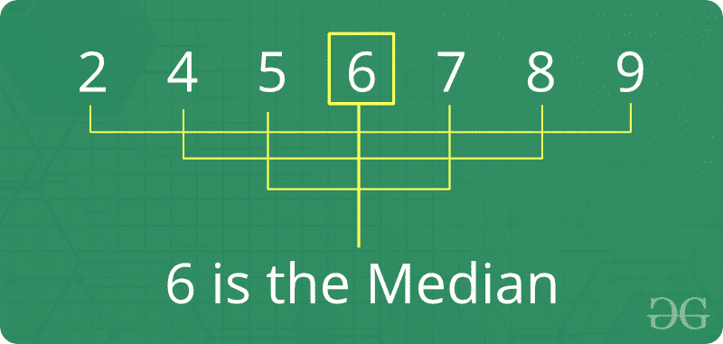
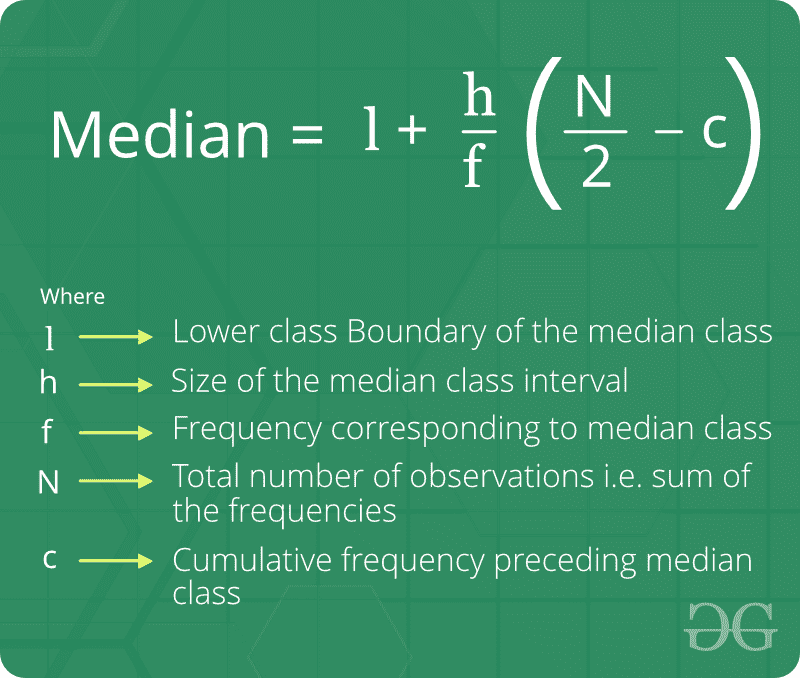

# 中位数

> 原文:[https://www.geeksforgeeks.org/median/](https://www.geeksforgeeks.org/median/)

中位数是一组数据的中间值。要确定数字序列中的中间值，必须首先按升序排列数字。

*   如果数字数量为奇数，则中间的数字为中间值，上下的数字数量相同。
*   如果列表中的数字数量为偶数，则中间值为两个中间值的平均值。



**关于中位数的事实:**

1.  中间值由平均值和模式连接，形成一个称为中心趋势度量的分组。
2.  中位数是失真数据的一个重要衡量标准(与平均值相比)，因为中位数不那么容易失真。例如，{1，2，2，5，100 }的中值为 2，平均值为 22。
3.  如果用户给每个值加上一个常数，则平均值和中值会增加相同的常数。
4.  如果用户将每个值乘以一个常数，则平均值和中值也将乘以该常数。

**未分组数据中位数公式:**


**分组数据中位数公式:**



**如何求未排序数组的中值？**
**天真解:**
给定 *n* 大小未排序阵，求其中位数。

> **大小为 n 的排序数组的中值定义如下:**
> n 为奇数时为中间元素，n 为偶数时为中间两个元素的平均值。由于这里没有对数组进行排序，我们先对数组进行排序，然后应用上面的公式。

**例:**

```
Input  : {1, 3, 4, 2, 6, 5, 8, 7}
Output : Median = 4.5

Since number of elements are even, median
is average of 4th and 5th largest elements.
which means (4 + 5)/2 = 4.5

Input  : {4, 4, 4, 4, 4}
Output : Median = 4         
```

下面是代码实现:

## C++

```
// CPP program to find median
#include <bits/stdc++.h>
using namespace std;

// Function for calculating median
double findMedian(int a[], int n)
{
    // First we sort the array
    sort(a, a + n);

    // check for even case
    if (n % 2 != 0)
        return (double)a[n / 2];

    return (double)(a[(n - 1) / 2] + a[n / 2]) / 2.0;
}

// Driver program
int main()
{
    int a[] = { 1, 3, 4, 2, 7, 5, 8, 6 };
    int n = sizeof(a) / sizeof(a[0]);
    cout << "Median = " << findMedian(a, n) << endl;
    return 0;
}
```

## Java 语言(一种计算机语言，尤用于创建网站)

```
// Java program to find median
import java.util.*;

class GFG {

    // Function for calculating median
    public static double findMedian(int a[], int n)
    {
        // First we sort the array
        Arrays.sort(a);

        // check for even case
        if (n % 2 != 0)
            return (double)a[n / 2];

        return (double)(a[(n - 1) / 2] + a[n / 2]) / 2.0;
    }

    // Driver program
    public static void main(String args[])
    {
        int a[] = { 1, 3, 4, 2, 7, 5, 8, 6 };
        int n = a.length;
        System.out.println("Median = " + findMedian(a, n));
    }
}
```

## 蟒蛇 3

```
# Python3 program to find median

# Function for calculating median
def findMedian(a, n):

    # First we sort the array
    sorted(a)

    # check for even case
    if n % 2 != 0:
        return float(a[n // 2])

    return float((a[int((n-1)/2)] +
                  a[int(n / 2)])/2.0)

# Driver program
a = [ 1, 3, 4, 2, 7, 5, 8, 6 ]
n = len(a)
print("Median =", findMedian(a, n))
```

## C#

```
// C# program to find median
using System;

class GFG {

    // Function for
    // calculating median
    public static double findMedian(int[] a, int n)
    {
        // First we sort
        // the array
        Array.Sort(a);

        // check for
        // even case
        if (n % 2 != 0)
            return (double)a[n / 2];

        return (double)(a[(n - 1) / 2] + a[n / 2]) / 2.0;
    }

    // Driver Code
    public static void Main()
    {
        int[] a = { 1, 3, 4, 2,
                    7, 5, 8, 6 };
        int n = a.Length;
        Console.Write("Median = " + findMedian(a, n) + "\n");
    }
}
```

## 服务器端编程语言（Professional Hypertext Preprocessor 的缩写）

```
<?php
// PHP program to find median

// Function for
// calculating median
function findMedian(&$a, $n)
{
    // First we sort the array
    sort($a);

    // check for even case
    if ($n % 2 != 0)
    return (double)$a[$n / 2];

    return (double)($a[($n - 1) / 2] +
                    $a[$n / 2]) / 2.0;
}

// Driver Code
$a = array(1, 3, 4, 2,
           7, 5, 8, 6);
$n = sizeof($a);
echo "Median = " .
      findMedian($a, $n);
?>
```

## java 描述语言

```
<script>

// JavaScript program to find median

// Function for calculating median
function findMedian(a, n)
{
    // First we sort the array
    a.sort();

    // check for even case
    if (n % 2 != 0)
        return a[parseInt(n / 2)];

    return (a[parseInt((n - 1) / 2)] + a[parseInt(n / 2)]) / 2.0;
}

// Driver program
    let a = [ 1, 3, 4, 2, 7, 5, 8, 6 ];
    let n = a.length;
    document.write("Median = " + findMedian(a, n));

</script>
```

**输出:**

```
Median = 4.5
```

因为我们需要首先对数组进行排序，所以找到中位数= 0(n Log n)的时间复杂度。请注意，我们可以使用这里讨论的和这里讨论的的方法找到 O(n)时间的中位数。
**与中位数相关的基本程序:**

*   [最大化数组的中值](https://www.geeksforgeeks.org/maximize-the-median-of-an-array/)
*   [使数组元素相等的最小增量/减量](https://www.geeksforgeeks.org/minimum-increment-decrement-to-make-array-elements-equal/)
*   [数组中某个元素的最小差值总和](https://www.geeksforgeeks.org/minimum-sum-of-differences-with-an-element-in-an-array/)
*   [两个不同大小的排序数组的中值|集合 1(线性)](https://www.geeksforgeeks.org/median-of-two-sorted-arrays-of-different-sizes-set-1-linear/)
*   [O(log(min(n，m))中两个不同大小的排序数组的中值)](https://www.geeksforgeeks.org/median-two-sorted-arrays-different-sizes-ologminn-m/)

**更多与中位数相关的问题:**

*   [使用计数排序的中值和模式](https://www.geeksforgeeks.org/median-and-mode-using-counting-sort/)
*   [使中位数等于 x 的最小元素数](https://www.geeksforgeeks.org/minimum-number-elements-add-make-median-equals-x/)
*   [将中间字符串解码为原始字符串](https://www.geeksforgeeks.org/decode-median-string-original-string/)
*   [K 个附加整数后的中位数](https://www.geeksforgeeks.org/median-k-additional-integers/)
*   [在行排序矩阵中找到中间值](https://www.geeksforgeeks.org/find-median-row-wise-sorted-matrix/)
*   [求 BST 在 O(n)时间和 O(1)空间的中位数](https://www.geeksforgeeks.org/find-median-bst-time-o1-space/)
*   [整数流(运行整数)中的中间值](https://www.geeksforgeeks.org/median-of-stream-of-integers-running-integers/)

[**最近关于中位数的文章！**](https://www.geeksforgeeks.org/tag/median-finding/)