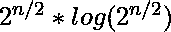

# 中间相遇

> 原文:[https://www.geeksforgeeks.org/meet-in-the-middle/](https://www.geeksforgeeks.org/meet-in-the-middle/)

给定一组 n 个整数，其中 n <= 40\. Each of them is at most 10 <sup>12</sup> ，确定和小于或等于 S 的最大和子集，其中 S < = 10 <sup>18</sup> 。

**示例:**

```
Input  : set[] = {45, 34, 4, 12, 5, 2} and S = 42
Output : 41
Maximum possible subset sum is 41 which can be 
obtained by summing 34, 5 and 2.

Input  : Set[] = {3, 34, 4, 12, 5, 2} and S = 10
Output : 10
Maximum possible subset sum is 10 which can be 
obtained by summing 2, 3 and 5.
```

解决这个问题的一种强力方法是找到 N 个整数的所有可能的子集和，检查它是否小于或等于 S，并用最大和跟踪这样的子集。使用这种方法的时间复杂度为 0(2<sup>n</sup>)，n 最多为 40。2 <sup>40</sup> 将相当大，因此我们需要找到更好的方法。

**在中间相遇**是一种搜索技术，当输入很小但没有蛮力可以使用的那么小时使用。像分治法一样，它将问题分成两部分，分别解决，然后合并。但是我们不能像分治法那样在中间应用相遇，因为我们没有与原问题相同的结构。

*   将整数集分成两个子集，比如 A 和 B。A 有前 n/2 个整数，B 有剩余。
*   找到集合 A 中整数的所有可能子集和，并存储在数组 X 中。类似地，计算集合 B 中整数的所有可能子集和，并存储在数组 Y 中。因此，数组 X 和 Y 中每一个的大小最多为 2 <sup>n/2</sup> 。
*   现在合并这两个子问题。从数组 X 和 Y 中查找组合，使它们的和小于或等于 s。
    *   一种方法是简单地针对数组 X 的每个元素迭代数组 Y 的所有元素，以检查这种组合的存在性。这需要 O( (2 <sup>n/2</sup> ) <sup>2</sup> )相当于 O(2 <sup>n</sup> )。
    *   为了使它不那么复杂，首先对数组 Y 进行排序，然后迭代 X 的每个元素，对于 X 中的每个元素 X，使用二分搜索法在 Y 中找到最大元素 Y，使得 x + y <= S。
    *   这里的二分搜索法有助于将复杂性从 2 <sup>n</sup> 降低到 2 <sup>n/2</sup> log(2 <sup>n/2</sup> )，相当于 2 <sup>n/2</sup> n。
    *   因此，我们的最终运行时间是 O(2 <sup>n/2</sup> n)。

## C++

```
// C++ program to demonstrate working of Meet in the
// Middle algorithm for maximum subset sum problem.
#include <bits/stdc++.h>
using namespace std;
typedef long long int ll;
ll X[2000005],Y[2000005];

// Find all possible sum of elements of a[] and store
// in x[]
void calcsubarray(ll a[], ll x[], int n, int c)
{
    for (int i=0; i<(1<<n); i++)
    {
        ll s = 0;
        for (int j=0; j<n; j++)
            if (i & (1<<j))
                s += a[j+c];
        x[i] = s;
    }
}

// Returns the maximum possible sum less or equal to S
ll solveSubsetSum(ll a[], int n, ll S)
{
    // Compute all subset sums of first and second
    // halves
    calcsubarray(a, X, n/2, 0);
    calcsubarray(a, Y, n-n/2, n/2);

    int size_X = 1<<(n/2);
    int size_Y = 1<<(n-n/2);

    // Sort Y (we need to do doing binary search in it)
    sort(Y, Y+size_Y);

    // To keep track of the maximum sum of a subset
    // such that the maximum sum is less than S
    ll max = 0;

    // Traverse all elements of X and do Binary Search
    // for a pair in Y with maximum sum less than S.
    for (int i=0; i<size_X; i++)
    {
        if (X[i] <= S)
        {
            // lower_bound() returns the first address
            // which has value greater than or equal to
            // S-X[i].
            int p = lower_bound(Y, Y+size_Y, S-X[i]) - Y;

            // If S-X[i] was not in array Y then decrease
            // p by 1
            if (p == size_Y || Y[p] != (S-X[i]))
                p--;

            if ((Y[p]+X[i]) > max)
                max = Y[p]+X[i];
        }
    }
    return max;
}

// Driver code
int main()
{
    ll a[] = {3, 34, 4, 12, 5, 2};
    int n=sizeof(a)/sizeof(a[0]);
    ll S = 10;
    printf("Largest value smaller than or equal to given "
           "sum is %lld\n", solveSubsetSum(a,n,S));
    return 0;
}
```

## Java 语言(一种计算机语言，尤用于创建网站)

```
// Java program to demonstrate working of
// Meet in the Middle algorithm for
// maximum subset sum problem
import java.util.*;
import java.lang.*;
import java.io.*;

class GFG{

static long X[] = new long[2000005];
static long Y[] = new long[2000005];

// Find all possible sum of elements of a[]
// and store in x[]
static void calcsubarray(long a[],long x[],
                         int n, int c)
{
    for(int i = 0; i < (1 << n); i++)
    {
        long s = 0;
        for(int j = 0; j < n; j++)
            if ((i & (1 << j)) == 1)
                s += a[j + c];

        x[i] = s;
    }
}

// Returns the maximum possible sum
// less or equal to S 
static long solveSubsetSum(long a[], int n, long S)
{

    // Compute all subset sums of first and second
    // halves
    calcsubarray(a, X, n / 2, 0);
    calcsubarray(a, Y, n - n / 2, n / 2);

    int size_X = 1 << (n / 2);
    int size_Y = 1 << (n - n / 2);

    // Sort Y (we need to do doing
    // binary search in it)
    Arrays.sort(Y);

    // To keep track of the maximum sum
    // of a subset such that the maximum
    // sum is less than S
    long max = 0;

    // Traverse all elements of X and do
    // Binary Search for a pair in Y with
    // maximum sum less than S.
    for(int i = 0; i < size_X; i++)
    {
        if (X[i] <= S)
        {

            // lower_bound() returns the first address
            // which has value greater than or equal to
            // S-X[i].
            int p = lower_bound(Y, S - X[i]);

            // If S-X[i] was not in array Y then
            // decrease p by 1
            if (p == size_Y || Y[p] != (S - X[i]))
                p--;

            if ((Y[p] + X[i]) > max)
                max = Y[p] + X[i];
        }
    }
    return max;
}

static int lower_bound(long a[], long x)
{

    // x is the target value or key
    int l = -1, r = a.length;
    while (l + 1 < r)
    {
        int m = (l + r) >>> 1;
        if (a[m] >= x)
            r = m;
        else
            l = m;
    }
    return r;
}

// Driver code
public static void main (String[] args)
{
    long a[] = { 3, 34, 4, 12, 5, 2 };
    int n = a.length;
    long S = 10;
    System.out.println("Largest value smaller " +
                       "than or equal to given " +
                       "sum is " +
                       solveSubsetSum(a, n, S));
}
}

// This code is contributed by jyoti369
```

## 蟒蛇 3

```
# Python program to demonstrate working of Meet in the
# Middle algorithm for maximum subset sum problem.
from typing import List
import bisect
X = [0] * 2000005
Y = [0] * 2000005

# Find all possible sum of elements of a[] and store
# in x[]
def calcsubarray(a: List[int], x: List[int], n: int, c: int) -> None:
    for i in range((1 << n)):
        s = 0
        for j in range(n):
            if (i & (1 << j)):
                s += a[j + c]
        x[i] = s

# Returns the maximum possible sum less or equal to S
def solveSubsetSum(a: List[int], n: int, S: int) -> int:
    global Y

    # Compute all subset sums of first and second
    # halves
    calcsubarray(a, X, n // 2, 0)
    calcsubarray(a, Y, n - n // 2, n // 2)
    size_X = 1 << (n // 2)
    size_Y = 1 << (n - n // 2)

    # Sort Y (we need to do doing binary search in it)
    YY = Y[:size_Y]
    YY.sort()
    Y = YY

    # To keep track of the maximum sum of a subset
    # such that the maximum sum is less than S
    maxx = 0

    # Traverse all elements of X and do Binary Search
    # for a pair in Y with maximum sum less than S.
    for i in range(size_X):

        if (X[i] <= S):

            # lower_bound() returns the first address
            # which has value greater than or equal to
            # S-X[i].
            p = bisect.bisect_left(Y, S - X[i])

            # If S-X[i] was not in array Y then decrease
            # p by 1
            if (p == size_Y or (p < size_Y and Y[p] != (S - X[i]))):
                p -= 1
            if ((Y[p] + X[i]) > maxx):
                maxx = Y[p] + X[i]
    return maxx

# Driver code
if __name__ == "__main__":

    a = [3, 34, 4, 12, 5, 2]
    n = len(a)
    S = 10
    print("Largest value smaller than or equal to given sum is {}".format(
        solveSubsetSum(a, n, S)))

# This code is contributed by sanjeev2552
```

## C#

```
// C# program to demonstrate working of
// Meet in the Middle algorithm for
// maximum subset sum problem
using System;
public class GFG
{

  static long[] X = new long[2000005];
  static long[] Y = new long[2000005];

  // Find all possible sum of elements of a[]
  // and store in x[]
  static void calcsubarray(long[] a,long[] x,
                           int n, int c)
  {
    for(int i = 0; i < (1 << n); i++)
    {
      long s = 0;
      for(int j = 0; j < n; j++)
        if ((i & (1 << j)) == 1)
          s += a[j + c];         
      x[i] = s;
    }
  }

  // Returns the maximum possible sum
  // less or equal to S 
  static long solveSubsetSum(long[] a, int n, long S)
  {

    // Compute all subset sums of first and second
    // halves
    calcsubarray(a, X, n / 2, 0);
    calcsubarray(a, Y, n - n / 2, n / 2);
    int size_X = 1 << (n / 2);
    int size_Y = 1 << (n - n / 2);

    // Sort Y (we need to do doing
    // binary search in it)
    Array.Sort(Y);

    // To keep track of the maximum sum
    // of a subset such that the maximum
    // sum is less than S
    long max = 0;

    // Traverse all elements of X and do
    // Binary Search for a pair in Y with
    // maximum sum less than S.
    for(int i = 0; i < size_X; i++)
    {
      if (X[i] <= S)
      {

        // lower_bound() returns the first address
        // which has value greater than or equal to
        // S-X[i].
        int p = lower_bound(Y, S - X[i]);

        // If S-X[i] was not in array Y then
        // decrease p by 1
        if (p == size_Y || Y[p] != (S - X[i]))
          p--;
        if ((Y[p] + X[i]) > max)
          max = Y[p] + X[i];
      }
    }
    return max;
  }

  static int lower_bound(long[] a, long x)
  {

    // x is the target value or key
    int l = -1, r = a.Length;
    while (l + 1 < r)
    {
      int m = (l + r) >> 1;
      if (a[m] >= x)
        r = m;
      else
        l = m;
    }
    return r;
  }

  // Driver code
  static public void Main ()
  {
    long[] a = { 3, 34, 4, 12, 5, 2 };
    int n = a.Length;
    long S = 10;
    Console.WriteLine("Largest value smaller " +
                      "than or equal to given " +
                      "sum is " +
                      solveSubsetSum(a, n, S));
  }
}

// This code is contributed by Dharanendra L V.
```

## java 描述语言

```
<script>
// Javascript program to demonstrate working of
// Meet in the Middle algorithm for
// maximum subset sum problem
let X = new Array(2000005);
let Y = new Array(2000005);
for(let i = 0; i < 2000005; i++)
{
    X[i] = 0;
    Y[i] = 0;
}

// Find all possible sum of elements of a[]
// and store in x[]
function calcsubarray(a, x, n, c)
{
    for(let i = 0; i < (1 << n); i++)
    {
        let s = 0;
        for(let j = 0; j < n; j++)
            if ((i & (1 << j)) == 1)
                s += a[j + c];

        x[i] = s;
    }
}

// Returns the maximum possible sum
// less or equal to S
function solveSubsetSum(a,n,S)
{
    // Compute all subset sums of first and second
    // halves
    calcsubarray(a, X, Math.floor(n / 2), 0);
    calcsubarray(a, Y, n - Math.floor(n / 2), Math.floor(n / 2));

    let size_X = 1 << Math.floor(n / 2);
    let size_Y = 1 << (n - Math.floor(n / 2));

    // Sort Y (we need to do doing
    // binary search in it)
    Y.sort(function(a,b){return a-b;});

    // To keep track of the maximum sum
    // of a subset such that the maximum
    // sum is less than S
    let max = 0;

    // Traverse all elements of X and do
    // Binary Search for a pair in Y with
    // maximum sum less than S.
    for(let i = 0; i < size_X; i++)
    {
        if (X[i] <= S)
        {

            // lower_bound() returns the first address
            // which has value greater than or equal to
            // S-X[i].
            let p = lower_bound(Y, S - X[i]);

            // If S-X[i] was not in array Y then
            // decrease p by 1
            if (p == size_Y || Y[p] != (S - X[i]))
                p--;

            if ((Y[p] + X[i]) > max)
                max = Y[p] + X[i];
        }
    }
    return max;
}

function lower_bound(a,x)
{
    // x is the target value or key
    let l = -1, r = a.length;
    while (l + 1 < r)
    {
        let m = (l + r) >>> 1;
        if (a[m] >= x)
            r = m;
        else
            l = m;
    }
    return r;
}

// Driver code
let a=[3, 34, 4, 12, 5, 2 ];
let  n = a.length;
let S = 10;
document.write("Largest value smaller " +
                   "than or equal to given " +
                   "sum is " +
                   solveSubsetSum(a, n, S)+"<br>");

// This code is contributed by avanitrachhadiya2155
</script>
```

**输出:**

```
Largest value smaller than or equal to given sum is 10
```

**参考:**

*   [https://www . quora . com/什么是中间相遇算法-w-r-t-竞争编程](https://www.quora.com/What-is-meet-in-the-middle-algorithm-w-r-t-competitive-programming)

**时间复杂度:** O(  )
**辅助空间:** O(  )
本文由 **Madhur Modi** 供稿。如果你喜欢极客博客并想投稿，你也可以写一篇文章并把你的文章邮寄到 review-team@geeksforgeeks.org。看到你的文章出现在极客博客主页上，帮助其他极客。
如果发现有不正确的地方，请写评论，或者想分享更多关于以上讨论话题的信息