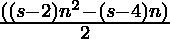

# 兆元数

> 原文:[https://www.geeksforgeeks.org/megagon-number/](https://www.geeksforgeeks.org/megagon-number/)

给定一个数字 **N** ，任务是找到 **N <sup>第</sup>T5【兆刚】号。** 

> Megagon 数是一类图形数。它有一个 1000000 边的多边形，叫做 Megagon。第 N 个 Megagon 数是 1000000 个点，所有其他点都被一个公共的共享角包围并形成一个图案。前几个 Megagonol 号码是 **1，1000000，2999997，59999992，9999985，14999976，…**

**例:**

> **输入:** N = 2
> **输出:** 1000000
> **说明:**
> 第二个淋病号是 1000000。
> **输入:** N = 3
> **输出:** 2999997

**方法:**第 N 个 Megagon 数由公式给出:

*   s 边多边形的第 n 项= 

*   因此 1000000 边多边形的第 n 项为

> 

以下是上述方法的实现:

## C++

```
// C++ implementation for the
// above approach
#include <bits/stdc++.h>
using namespace std;

// Function to find the
// nth Megagon Number
int MegagonNum(int n)
{
    return (999998 * n * n - 999996 * n) / 2;
}

// Driver Code
int main()
{
    int n = 3;
    cout << MegagonNum(n);

    return 0;
}
```

## Java 语言(一种计算机语言，尤用于创建网站)

```
// Java program for the above approach
class GFG{

// Function to find the
// nth Megagon Number
static int MegagonNum(int n)
{
    return (999998 * n * n - 999996 * n) / 2;
}

// Driver code
public static void main(String[] args)
{
    int n = 3;

    System.out.print(MegagonNum(n));
}
}

// This code is contributed by shubham
```

## 蟒蛇 3

```
# Python3 implementation for the
# above approach

# Function to find the
# nth Megagon Number
def MegagonNum(n):

    return (999998 * n * n - 999996 * n) // 2;

# Driver Code
n = 3;
print(MegagonNum(n));

# This code is contributed by Code_Mech
```

## C#

```
// C# program for the above approach
using System;
class GFG{

// Function to find the
// nth Megagon Number
static int MegagonNum(int n)
{
    return (999998 * n * n - 999996 * n) / 2;
}

// Driver code
public static void Main(String[] args)
{
    int n = 3;

    Console.Write(MegagonNum(n));
}
}

// This code is contributed by sapnasingh4991
```

## java 描述语言

```
<script>

// Javascript implementation for the
// above approach

// Function to find the
// nth Megagon Number
function MegagonNum(n)
{
    return (999998 * n * n - 999996 * n) / 2;
}

// Driver Code
var n = 3;
document.write(MegagonNum(n));

</script>
```

**Output:** 

```
2999997
```

**参考资料:**[https://en . Wikipedia . org/wiki/mega gon](https://en.wikipedia.org/wiki/Megagon)