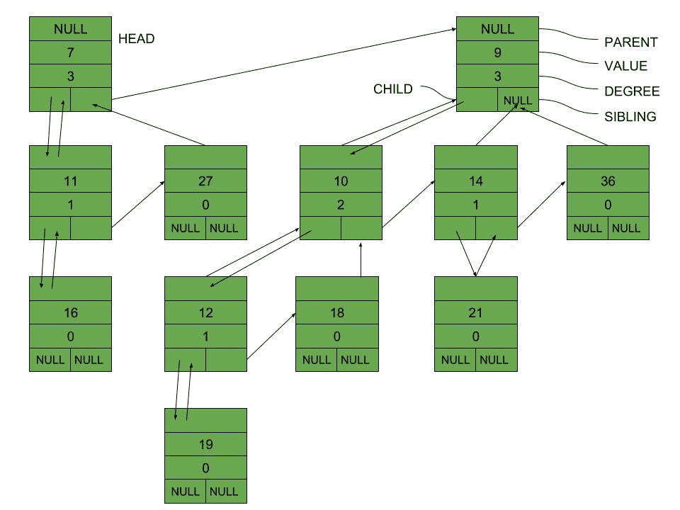

# 二项式堆的内存表示

> 原文:[https://www . geesforgeks . org/memory-presentation-of-binomial-heap/](https://www.geeksforgeeks.org/memory-representation-of-binomial-heap/)

**先决条件:** [二项式堆](https://www.geeksforgeeks.org/binomial-heap-2/)

**二叉树**是典型地存储在**左子、右兄弟**表示中的多向树，并且每个节点存储其度数。二项式堆是以大小升序存储的二项式树的集合。堆中的根列表是二项式堆的根的链接列表。根的节点度随着遍历根列表而增加。

二项式堆中二项式树的**数量可以通过二项式堆中节点数量的二进制值来找到。本文重点介绍二项式堆的**记忆表征**。**

### 二项式堆节点:

*   **Fields in each node:**

    二项式堆中的每个节点都有 5 个字段:

    1.  指向父级的指针
    2.  钥匙
    3.  程度
    4.  指向子级(最左边的子级)的指针
    5.  指向紧邻其右侧的同级的指针

    

*   **Pointers in each node:**

    每个节点都有以下指针:

    1.  指向节点的直接父节点的父指针
    2.  指向节点第一个子节点的左指针
    3.  指向节点下一个同级的右指针。

    ### 节点的类型及其表示:

    *   Single node in the Heap:

        

    *   Parent – Child relationship between nodes:

        

    *   Sibling relationship between nodes:

        

### 全二项式堆的表示:

**上面给出的二项式堆的每个节点的内存表示可以用下图来说明:**

