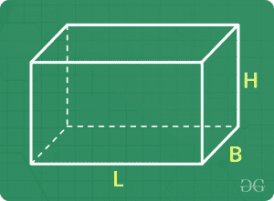
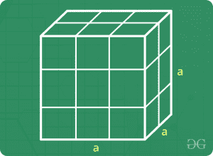
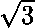
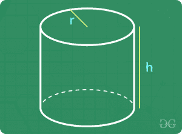
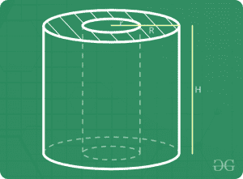
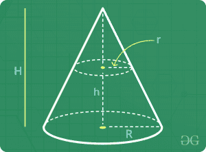
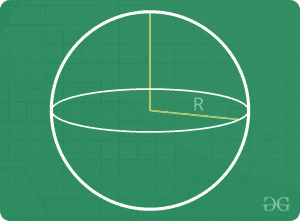
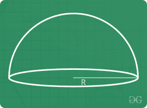

# 测定 3D

> 原文:[https://www.geeksforgeeks.org/mensuration-3d/](https://www.geeksforgeeks.org/mensuration-3d/)

三维测量处理立方体、长方体、球体等形状。问题通常基于体积和表面积。

### 长方体

让长方体的长、宽、高分别为‘L’、‘B’、‘H’。

*   体积=长×短×高
*   曲面面积= 2 H (L + B)
*   总表面积= 2 (L B + B H + H L)
*   对角线长度=(L2+B2+H2)1/2

### 立方

让立方体的一边是‘a’

*   体积= a 3
*   曲面面积= 4 a 2
*   总表面积= 6 a 2
*   对角线长度=  a

### 圆柱体(右圆柱体)

设右圆柱体的底部半径和高度分别为“R”和“H”。

*   卷= π R 2 H
*   曲面面积= 2 π R H
*   总表面积= 2 π R H + 2 π R 2

### 空心圆柱体(空心右圆柱体)

设空心右圆柱的基座内半径、基座外半径和高度分别为“R”、“R”和“H”。

*   卷=πh(r2–r2
*   曲面面积= 2 π R H + 2 π r H = 2 π H (R + r)
*   总表面积= 2πH(R+R)+2π(R2–R2

### 圆锥体

设底座半径、斜面高度和圆锥体高度分别为“R”、“L”和“H”。

*   l2= R2+H2
*   体积= π R 2 H / 3
*   曲面面积= π R L
*   总表面积= π R L + π R 2

### 范围

让球体的半径为‘R’

*   体积= (4 / 3) π R 3
*   表面积= 4 π R 2

### 半球

让半球的半径为‘R’

*   体积=(2/3)πr3
*   曲面面积= 2 π R 2
*   总表面积= 3 π R 2

请注意，每当提到寻找“表面积”，我们计算总表面积。

### 样本问题

**问题 1 :** 求在尺寸为 10×15×6m 的长方体房间里能保存的最大的杆的长度
**解:**最大的杆会沿着对角线。
= >最大棒长=房间对角线长=(L2+B2+H2)1/2
=>最大棒长=(102+152+62)1/2= 1/2
= >最大杆长= 19 m

**问题 2 :** 找出制作一堵长 24 m、高 8 m、厚 60 cm 的墙所需的砖的数量，每块砖的尺寸为 24x 12×8cm。
**解答:**1 砖体积= 24×12×8 = 2304cm3
墙体体积= 2400×800×60 = 115200000cm3T40】因此，所需砖数= 115200000/2304 = 50000

T43】问题 3 : 一个长方形求形成的圆柱体的体积。
**解法:**让圆柱体的半径为‘R’。
板材沿较长的一侧轧制。
=>2πR = 22
=>R = 3.5cm
同样，高度= 7 cm
因此，圆柱体的体积=πR2H =π(3.5)27 = 269.5cm3

T61】问题 4 : 如果一个立方体的每个边
**解:**让原边长为‘a’
=>原卷= a 3
现在，新边长= 1.1 a
= >新卷=(1.1a)3= 1.331 a3
=>增加 百分比增加 int eh volume =(0.331 a3/a3)x 100 = 33.1%

**问题 5 :** 三个边长分别为 3 cm、4 cm、5 cm 的金属立方体被熔化形成单个立方体。 求这种立方体的边长。
**解:**新立方体体积=熔化立方体时产生的金属体积=三个立方体体积之和
= >新立方体体积= 33+43+53= 216
=>新立方体边长= (216) 1/3 = 6 厘米

**问题 6 :** 找出制造半径为 7 m、高度为 24 m 的圆锥形机器所需的 1.25 m 宽金属板的长度。
**解决方案:**该金属板将被成形为圆锥形。
= >板材面积=圆锥机面积
= > 1.25 x 长度= π x R x L
= > 1.25 x 长度=πx R x(72+242)1/2
=>1.25 x 长度= π x 7

**问题 7 :** 从一个底部半径为 7 厘米、高度为 6 厘米的圆柱形容器中，将水倒入每个半径为 3.5 厘米的半球形小碗中。找到清空圆柱形容器所需的最小碗数。
**解决方案:**圆柱形容器容积=πR2H =π(72)6 = 924cm3
每个碗的容积=(2/3)πR3=(2/3)π3.53= 269.5/3

### [测定 3D | Set-2 的问题](https://www.geeksforgeeks.org/mensuration-3d-set-2/)

本文由 **Nishant Arora**

供稿，如对上述讨论的话题有任何疑问，或在任何问题上遇到困难，或想讨论上述问题以外的问题，请写评论。

如果发现有不正确的地方，或者想分享更多关于上述话题的信息，请写评论