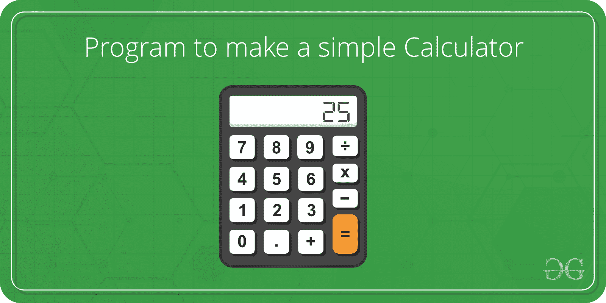

# 用于简单计算器的菜单驱动 C++程序

> 原文:[https://www . geesforgeks . org/menu-driven-c-program-for-a-simple-calculator/](https://www.geeksforgeeks.org/menu-driven-c-program-for-a-simple-calculator/)

**问题陈述:**
用 Switch 用例编写一个菜单驱动的程序，计算如下:

1.  两个数相加
2.  两个数之差
3.  两个数的乘积
4.  两个数的除法
5.  两个数的 HCF
6.  两个数的 LCM

[](https://media.geeksforgeeks.org/wp-content/cdn-uploads/program-to-make-a-simple-calculator.png)

**示例:**

```
Input: num1 = 5, num2 = 7, choice = 1
Output: Sum is 12

Input: num1 = 5, num2 = 7, choice = 5
Output: GCD is 1

```

**实施:**

```
// C++ program to illustrate
// Menu-Driven program using Switch-case

#include <bits/stdc++.h>
using namespace std;

// Function to display the menu
void menu()
{
    cout << "Press 1 to calculate Sum of Numbers\n";
    cout << "Press 2 to calculate Difference of Numbers\n";
    cout << "Press 3 to calculate Product of numbers\n";
    cout << "Press 4 to calculate Division of numbers\n";
    cout << "Press 5 to calculate HCF of numbers\n";
    cout << "Press 6 to calculate LCM of numbers\n";
    cout << "Press 7 to exit\n";
}

// Function to calculate and display the result
void result(int choice, int a, int b)
{

    // Display the result
    switch (choice) {
    case 1: {
        cout << "Sum is " << (a + b) << "\n";
        break;
    }
    case 2: {
        cout << "Difference is " << (a - b) << "\n";
        break;
    }
    case 3: {
        cout << "Product is " << (a * b) << "\n";
        break;
    }
    case 4: {
        cout << "Division is " << (a / b) << "\n";
        break;
    }
    case 5: {
        cout << "GCD is " << __gcd(a, b) << "\n";
        break;
    }
    case 6: {
        cout << "LCM is "
             << ((a * b) / __gcd(a, b))
             << "\n";
        break;
    }
    case 7: {
        cout << "Thank you\n";
        break;
    }
    default:
        printf("Wrong Input\n");
    }
}

int main()
{

    // Get the two numbers
    int a = 5, b = 7;

    int choice, res;

    // Display the menu
    menu();

    // Enter the choice
    cout << "Enter your choice:\n";
    choice = 1;
    cout << "Choice is " << choice << endl;

    // Display the result
    // according to the choice
    result(choice, a, b);

    return 0;
}
```

**Output:**

```
Press 1 to calculate Sum of Numbers
Press 2 to calculate Difference of Numbers
Press 3 to calculate Product of numbers
Press 4 to calculate Division of numbers
Press 5 to calculate HCF of numbers
Press 6 to calculate LCM of numbers
Press 7 to exit
Enter your choice:
Choice is 1
Sum is 12

```

**时间复杂度:** O(n)。