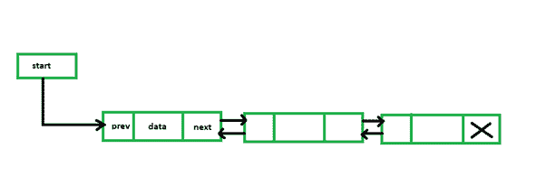
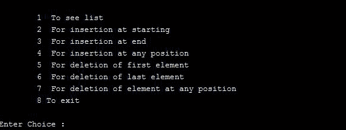
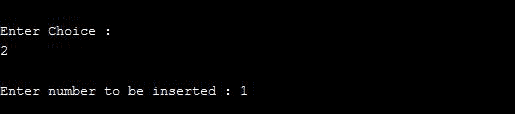
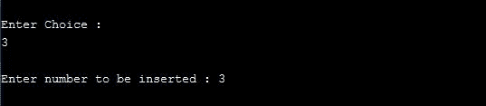
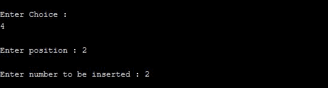
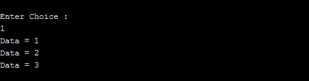
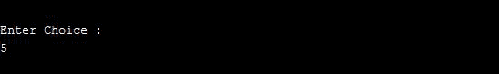
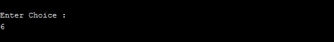
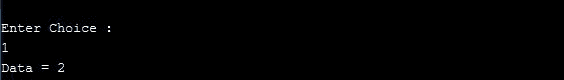

# 菜单驱动程序，用于 C

中双链表的所有操作

> 原文:[https://www . geesforgeks . org/menu-driven-program-for-all-operations-on-double-link-list-in-c/](https://www.geeksforgeeks.org/menu-driven-program-for-all-operations-on-doubly-linked-list-in-c/)

A [链表](https://www.geeksforgeeks.org/data-structures/linked-list/)是一个线性的[数据结构](https://www.geeksforgeeks.org/data-structures/)，由两部分组成:一部分是数据部分，另一部分是地址部分。中的[双链表](https://www.geeksforgeeks.org/doubly-linked-list/)包含三个部分:一个是数据部分，另外两个是列表中下一个和上一个节点的地址。本文在一个[菜单驱动程序](https://www.geeksforgeeks.org/menu-driven-program-using-switch-case-c/)中讨论了双向链表的所有常见操作。

[](https://media.geeksforgeeks.org/wp-content/uploads/20210103223100/9.png)

**<u>待执行的操作</u> :**

*   **遍历():**要查看链表的内容，需要遍历给定的双链表。函数的作用是:遍历并打印双向链表的内容。
*   **insertAtFront():** 这个函数只是在双向链表的前面/开头插入一个元素。
*   **insertAtEnd():** 这个函数在双向链表的末尾插入一个元素。
*   **insertAtPosition():** 此函数在双向链表的指定位置插入一个元素。
*   **deleteFirst():** 这个函数只是从双向链表的前面/开头删除一个元素。
*   **deleteEnd():** 这个函数只是从双向链表的末尾删除一个元素。
*   **deletePosition():** 此函数从双向链表的指定位置删除一个元素。

下面是上述操作的实现:

## C

```
// C program for the all operations in
// the Doubly Linked List
#include <stdio.h>
#include <stdlib.h>

// Linked List Node
struct node {
    int info;
    struct node *prev, *next;
};
struct node* start = NULL;

// Function to traverse the linked list
void traverse()
{
    // List is empty
    if (start == NULL) {
        printf("\nList is empty\n");
        return;
    }
    // Else print the Data
    struct node* temp;
    temp = start;
    while (temp != NULL) {
        printf("Data = %d\n", temp->info);
        temp = temp->next;
    }
}

// Function to insert at the front
// of the linked list
void insertAtFront()
{
    int data;
    struct node* temp;
    temp = (struct node*)malloc(sizeof(struct node));
    printf("\nEnter number to be inserted: ");
    scanf("%d", &data);
    temp->info = data;
    temp->prev = NULL;

    // Pointer of temp will be
    // assigned to start
    temp->next = start;
    start = temp;
}

// Function to insert at the end of
// the linked list
void insertAtEnd()
{
    int data;
    struct node *temp, *trav;
    temp = (struct node*)malloc(sizeof(struct node));
    temp->prev = NULL;
    temp->next = NULL;
    printf("\nEnter number to be inserted: ");
    scanf("%d", &data);
    temp->info = data;
    temp->next = NULL;
    trav = start;

    // If start is NULL
    if (start == NULL) {

        start = temp;
    }

    // Changes Links
    else {
        while (trav->next != NULL)
            trav = trav->next;
        temp->prev = trav;
        trav->next = temp;
    }
}

// Function to insert at any specified
// position in the linked list
void insertAtPosition()
{
    int data, pos, i = 1;
    struct node *temp, *newnode;
    newnode = malloc(sizeof(struct node));
    newnode->next = NULL;
    newnode->prev = NULL;

    // Enter the position and data
    printf("\nEnter position : ");
    scanf("%d", &pos);

    // If start==NULL,
    if (start == NULL) {
        start = newnode;
        newnode->prev = NULL;
        newnode->next = NULL;
    }

    // If position==1,
    else if (pos == 1) {
      // this is author method its correct but we can simply call insertAtfront() function for this special case
       /* newnode->next = start;
        newnode->next->prev = newnode;
        newnode->prev = NULL;
        start = newnode; */
      // now this is improved by Jay Ghughriwala on geeksforgeeks
      insertAtFront();
    }

    // Change links
    else {
      printf("\nEnter number to be inserted: ");
    scanf("%d", &data);
    newnode->info = data;
    temp = start;
        while (i < pos - 1) {
            temp = temp->next;
            i++;
        }
        newnode->next = temp->next;
        newnode->prev = temp;
        temp->next = newnode;
        temp->next->prev = newnode;
    }
}

// Function to delete from the front
// of the linked list
void deleteFirst()
{
    struct node* temp;
    if (start == NULL)
        printf("\nList is empty\n");
    else {
        temp = start;
        start = start->next;
        if (start != NULL)
            start->prev = NULL;
        free(temp);
    }
}

// Function to delete from the end
// of the linked list
void deleteEnd()
{
    struct node* temp;
    if (start == NULL)
        printf("\nList is empty\n");
    temp = start;
    while (temp->next != NULL)
        temp = temp->next;
    if (start->next == NULL)
        start = NULL;
    else {
        temp->prev->next = NULL;
        free(temp);
    }
}

// Function to delete from any specified
// position from the linked list
void deletePosition()
{
    int pos, i = 1;
    struct node *temp, *position;
    temp = start;

    // If DLL is empty
    if (start == NULL)
        printf("\nList is empty\n");

    // Otherwise
    else {
        // Position to be deleted
        printf("\nEnter position : ");
        scanf("%d", &pos);

        // If the position is the first node
        if (pos == 1) {
            deleteFirst(); // im,proved by Jay Ghughriwala on GeeksforGeeks
            if (start != NULL) {
                start->prev = NULL;
            }
            free(position);
            return;
        }

        // Traverse till position
        while (i < pos - 1) {
            temp = temp->next;
            i++;
        }
        // Change Links
        position = temp->next;
        if (position->next != NULL)
            position->next->prev = temp;
        temp->next = position->next;

        // Free memory
        free(position);
    }
}

// Driver Code
int main()
{
    int choice;
    while (1) {

        printf("\n\t1  To see list\n");
        printf("\t2  For insertion at"
               " starting\n");
        printf("\t3  For insertion at"
               " end\n");
        printf("\t4  For insertion at "
               "any position\n");
        printf("\t5  For deletion of "
               "first element\n");
        printf("\t6  For deletion of "
               "last element\n");
        printf("\t7  For deletion of "
               "element at any position\n");
        printf("\t8 To exit\n");
        printf("\nEnter Choice :\n");
        scanf("%d", &choice);

        switch (choice) {
        case 1:
            traverse();
            break;
        case 2:
            insertAtFront();
            break;
        case 3:
            insertAtEnd();
            break;
        case 4:
            insertAtPosition();
            break;
        case 5:
            deleteFirst();
            break;
        case 6:
            deleteEnd();
            break;
        case 7:
            deletePosition();
            break;

        case 8:
            exit(1);
            break;
        default:
            printf("Incorrect Choice. Try Again \n");
            continue;
        }
    }
    return 0;
}
```

**输出:**

菜单:

[](https://media.geeksforgeeks.org/wp-content/uploads/20210125211156/1.JPG)

**起始处插入:**

[](https://media.geeksforgeeks.org/wp-content/uploads/20210125211238/2.JPG)

**结尾插入:**

[](https://media.geeksforgeeks.org/wp-content/uploads/20210125211302/3.JPG)

**特定位置插入:**

[](https://media.geeksforgeeks.org/wp-content/uploads/20210125211404/4.JPG)

**打印链表:**

[](https://media.geeksforgeeks.org/wp-content/uploads/20210125211434/5.JPG)

**用选项 5 和 6 删除第一个和最后一个元素:**

[](https://media.geeksforgeeks.org/wp-content/uploads/20210125211507/6.JPG)[](https://media.geeksforgeeks.org/wp-content/uploads/20210125211508/7.JPG)[](https://media.geeksforgeeks.org/wp-content/uploads/20210125211509/8.JPG)