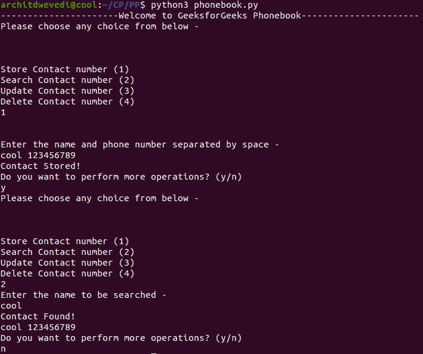

# 电话目录菜单驱动程序

> 原文:[https://www . geeksforgeeks . org/菜单驱动-电话程序-目录/](https://www.geeksforgeeks.org/menu-driven-program-for-phone-directory/)

**问题陈述:**编写一个菜单驱动的程序来使用具有以下特征的开关盒:

*   存储人员的联系号码
*   使用姓名搜索联系人号码
*   使用联系号码搜索联系号码
*   删除联系人号码
*   更新联系人号码

**示例:**

**方法:**思路是使用 switch case 为电话簿目录切换菜单驱动程序的 case，并将联系人号码存储在 hash-map 中，在 O(1)时间内在 hash-map 中搜索联系人。

下面是上述方法的实现:

## 蟒蛇 3

```
# Python implementation of menu driven
# Phone Book Directory

contact = {}

# List of Inputs
inputLis = ["1", "cool 123456789", 
            "y", "2", "cool", "n"]
indi = -1

# Function to provide sample inputs
# Remove this function to run on 
# Custom Inputs
def input():
    global indi
    indi += 1
    print(inputLis[indi])
    return inputLis[indi]

# Function to delete a contact
def delete():
    global contact
    print("Enter the contact"\
        " name to be deleted")

    name = input().strip()

    if name in contact:
        del(contact[name])
        print("Contact Deleted !\n")
    else:
        print("Contact not found !\n")

    print("Do you want to perform more"\
        " operations? (y / n)")

    choice = input().strip()
    if choice == "y":
        main()

# Function to update a contact number
def update():
    global contact
    print("Enter the contact name"\
        " to be updated - ")

    name = input().strip()

    if name in contact:
        print("Enter the new"\
            " contact number - ")
        phone = int(input())

        contact[name] = phone

        print("Contact updated\n")
    else:
        print("Contact not found !\n")

    print("Do you want to perform "\
        "more operations? (y / n)")

    choice = input().strip()
    if choice == "y":
        main()

# Function to search a contact 
def search():
    global contact
    print("Enter the name to be searched - ")

    name = input().strip()

    if name in contact:
        print("Contact Found !")
        print(name, contact[name])
    else:
        print("Contact not found !\n")

    print("Do you want to perform more"\
        " operations? (y / n)")

    choice = input().strip()
    if choice == "y":
        main()

# Function to store a contact
def store():
    print("\n\nEnter the name"\
        " and phone number"+\
        " separated by space - ")

    name, phone = map(str, \
                    input().strip()\
                            .split(" "))

    global contact
    if name in contact:
        print("Contact Already exists !\n")
    else:
        contact[name] = phone
        print("Contact Stored !")

    print("Do you want to perform more"\
        " operations? (y / n)")

    choice = input().strip()
    if choice == "y":
        main()

# Main Function for Menu-Driven
def main():
    print("Please choose any choice"\
        " from below -\n\n\n")
    print("Store Contact number (1)")
    print("Search Contact number (2)")
    print("Update Contact number (3)")
    print("Delete Contact number (4)")

    choice = int(input())

    choice_dict = {
        1: store,
        2: search,
        3: update,
        4: delete
    }

    choice_dict[choice]()

if __name__ == "__main__":
    print("----------------------"+\
        "Welcome to GeeksforGeeks Phonebook"+\
        "----------------------")

main()
```

**输出:**

