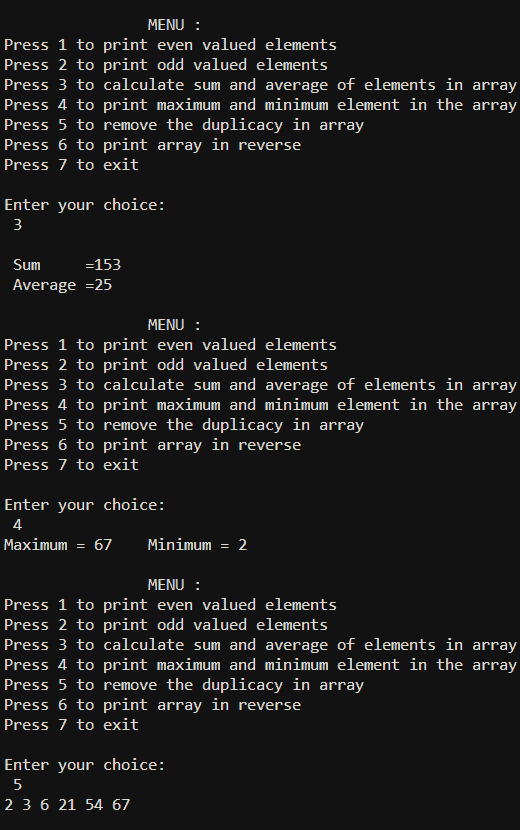

# c++中菜单驱动程序对数组进行各种基本操作

> 原文:[https://www . geesforgeks . org/menu-driven-program-in-CPP-to-perform-basic-operations-on-array/](https://www.geeksforgeeks.org/menu-driven-program-in-cpp-to-perform-various-basic-operations-on-array/)

**先决条件:**[C/c++](https://www.geeksforgeeks.org/switch-statement-cc/)中的 Switch 语句，[C/c++](https://www.geeksforgeeks.org/functions-in-c/)中的函数，[C 和 C++](https://www.geeksforgeeks.org/loops-in-c-and-cpp/) 中的循环， [C/C++边做边循环，示例](https://www.geeksforgeeks.org/c-c-do-while-loop-with-examples/)

编写[菜单驱动程序](https://www.geeksforgeeks.org/menu-driven-program-using-switch-case-c/)，在[数组](https://www.geeksforgeeks.org/introduction-to-arrays/)中执行以下各种基本操作:

*   [打印数组](https://www.geeksforgeeks.org/python-program-to-print-even-numbers-in-a-list/)中所有的偶数值。
*   [打印数组中所有的奇数](https://www.geeksforgeeks.org/sum-even-odd-elements-array/)。
*   [数组中元素的总和&平均值](https://www.geeksforgeeks.org/program-average-array-iterative-recursive/)。
*   求数组中最大[和最小元素。](https://www.geeksforgeeks.org/program-find-minimum-maximum-element-array/)
*   [从阵列中删除重复项](https://www.geeksforgeeks.org/remove-duplicates-sorted-array/)。

**进场:**

*   **检查一个数字是奇数还是偶数:**有 2 种方法可以实现:
    *   通过对 1 和该数字进行[位“与”](https://www.geeksforgeeks.org/bitwise-operators-in-c-cpp/)，如果结果为 1，则该数字为奇数，否则为偶数。
    *   除以 2。如果一个数不能被 2 整除，就说它是奇数，否则就是偶数。
*   **求和，将和除以元素总数:**通过迭代整个数组，并将其加到变量和中。将总和除以元素总数得出平均值。
*   **求数组中的最大值和最小值:**将最小值和最大值分别初始化为前两个元素的最小值和最大值。从第 3 个开始，将每个元素与最大值和最小值进行比较，并相应地更改最大值和最小值。如果元素小于最小值，则更改最小值，否则如果元素大于最大值，则更改最大值，否则忽略该元素
*   **从数组中删除重复项:**使用内置的[排序()](https://www.geeksforgeeks.org/sort-c-stl/)功能对数组进行排序。创建一个辅助数组 temp[]来存储唯一元素。遍历输入数组，并将 arr[]的唯一元素逐个复制到 temp[]。此外，记录独特元素的数量。将 j 元素从 temp[]复制到 arr[]并返回 j
*   **反向打印数组:** [反向打印数组或字符串](https://www.geeksforgeeks.org/write-a-program-to-reverse-an-array-or-string/)

下面是上述方法的实现:

## C++

```
// C++ program for the above approach
#include <bits/stdc++.h>
using namespace std;

// Function to display all the menu in
// the current program
void menu()
{
    cout << "\n\t\tMENU :";
    cout << "\nPress 1 to print even "
         << "valued elements\n";
    cout << "Press 2 to print odd valued"
         << " elements\n";
    cout << "Press 3 to calculate sum "
         << "and average of elements in "
         << "the array\n";
    cout << "Press 4 to print maximum"
         << " and minimum element "
            "in the array\n";
    cout << "Press 5 to remove the "
         << "duplicacy in array \n";
    cout << "Press 6 to print array"
         << " in reverse\n";
    cout << "Press 7 to exit\n";
}

// Function to print even valued
// elements in the array arr[]
void even(int arr[], int len)
{
    cout << "Even numbers in the "
         << "array are - ";
    for (int i = 0; i < len; i++) {
        if (arr[i] % 2 == 0) {
            cout << arr[i] << "\t";
        }
    }
}

// Function to print odd valued
// elements in the array arr[]
void odd(int arr[], int len)
{
    cout << "Odd numbers in the "
         << "array are - ";
    for (int i = 0; i < len; i++) {
        if (arr[i] % 2 != 0) {
            cout << arr[i] << "\t";
        }
    }
}

// Function to print sum and the
// average of elements in array
void SumAverage(int arr[], int len)
{
    int sum = 0;
    for (int i = 0; i < len; i++) {
        sum += arr[i];
    }
    cout << "\n Sum     =" << sum;
    cout << "\n Average =" << sum / len;
}

// Function to print maximum and
// minimum elements in an array
void MaxMin(int arr[], int len)
{
    int max = arr[1], min = arr[0];

    // Traverse the array
    for (int i = 0; i < len; i++) {

        // Update the maximum
        if (arr[i] > max)
            max = arr[i];

        // Update the minimum
        if (arr[i] < min)
            min = arr[i];
    }
    cout << "Maximum = " << max
         << "\t";
    cout << "Minimum = " << min;
}

// Function to remove duplicate
// elements in an array
void RmDuplicacy(int arr[], int n)
{
    if (n == 0 || n == 1)
        cout << "No Duplicates";

    // sorting array using inbuilt
    // sort() function
    sort(arr, arr + n);
    int temp[n];

    // Start traversing elements
    int j = 0;
    for (int i = 0; i < n - 1; i++)

        // If current element is not
        // the same as the next element
        // then store the current element
        if (arr[i] != arr[i + 1])
            temp[j++] = arr[i];

    // Store the last element as whether
    // it is unique or repeated, it hasn't
    // stored previously
    temp[j++] = arr[n - 1];

    // Modify original array
    for (int i = 0; i < j; i++)
        arr[i] = temp[i];

    // j is now the size of the array
    // without duplicates
    for (int i = 0; i < j; i++) {
        cout << arr[i] << " ";
    }
}

// Function to print array
// in reverse order
void Reverse(int arr[], int len)
{
    cout << "\nArray in reverse"
         << " order:\n ";
    for (int i = len - 1; i >= 0; i--) {
        cout << arr[i] << "\t";
    }
}

// Driver Code
int main()
{
    int arr[100], i, num, choice;
    printf("Enter the size of "
           "an array :\n");

    cin >> num;
    printf("Enter the elements of "
           "the array :\n");

    for (i = 0; i < num; i++) {
        cin >> arr[i];
    }

    do {
        cout << "\n";
        menu();
        cout << "\nEnter your "
             << "choice:\n ";
        cin >> choice;

        switch (choice) {
        case 1:
            even(arr, num);
            break;
        case 2:
            odd(arr, num);
            break;
        case 3:
            SumAverage(arr, num);
            break;
        case 4:
            MaxMin(arr, num);
            break;
        case 5:
            RmDuplicacy(arr, num);
            break;
        case 6:
            Reverse(arr, num);
            break;
        case 7:
            exit(0);
            break;
        default:
            cout << "INVALID CHOICE :-(";
        }

    } while (choice != 7);

    return 0;
}
```

**输出:**

[](https://media.geeksforgeeks.org/wp-content/uploads/20210120230056/output1.png)[](https://media.geeksforgeeks.org/wp-content/uploads/20210120230327/output2.png)[](https://media.geeksforgeeks.org/wp-content/uploads/20210120230941/output3.png)