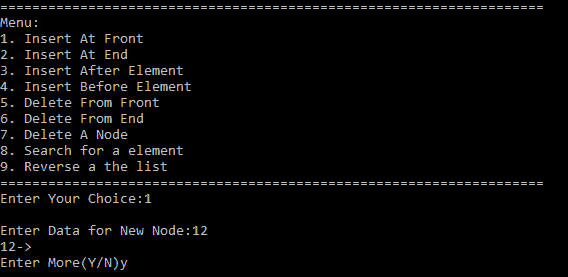
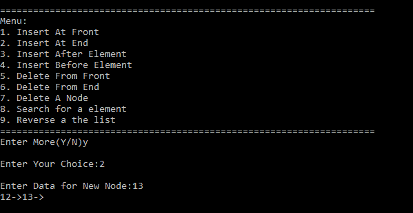
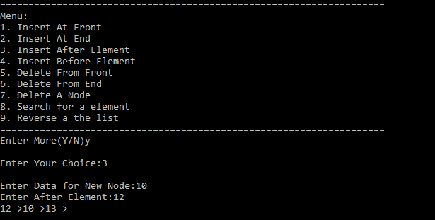
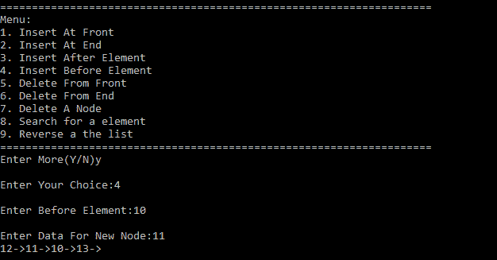
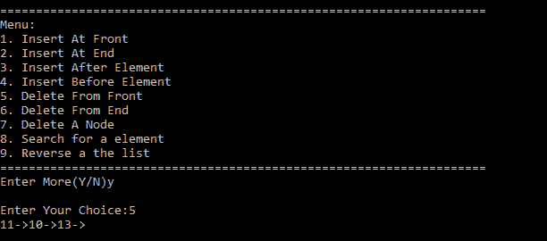
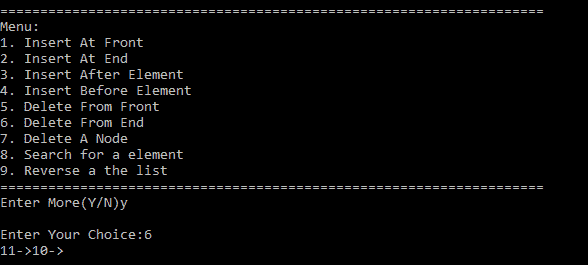
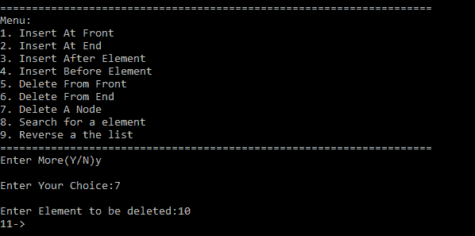
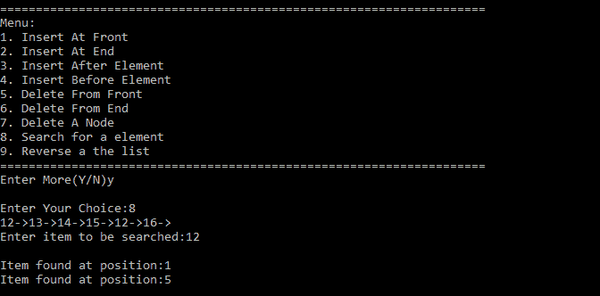
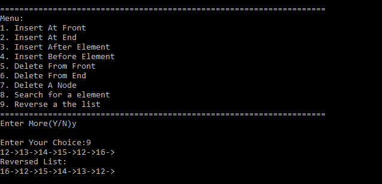

# 菜单驱动程序，实现双循环链表的所有操作

> 原文:[https://www . geesforgeks . org/menu-driven-program-to-implement-all-operations-of-double-circular-link-list/](https://www.geeksforgeeks.org/menu-driven-program-to-implement-all-the-operations-of-doubly-circular-linked-list/)

[循环双链表](https://www.geeksforgeeks.org/doubly-circular-linked-list-set-1-introduction-and-insertion/)同时具有[双链表](https://www.geeksforgeeks.org/doubly-linked-list/)和[循环链表](https://www.geeksforgeeks.org/circular-linked-list/)的属性，其中两个连续的元素通过上一个和下一个指针链接或连接，最后一个节点通过下一个指针指向第一个节点，第一个节点也通过上一个指针指向最后一个节点。该程序实现了菜单驱动程序中功能之后的双循环列表中所有可能的功能和操作。

**方法:**每个功能(除了显示)将[指针](https://www.geeksforgeeks.org/pointers-in-c-and-c-set-1-introduction-arithmetic-and-array/)的地址指向头部，即列表的第一个元素。这允许我们改变头指针的地址。想法是只使用一个节点类型的指针来执行所有操作。节点是包含三个数据成员的类。一个成员属于 int 类型，存储节点的数据，两个成员属于 node*，一个存储下一个元素的地址，另一个存储前一个元素的地址。通过这种方式，可以在任一方向上遍历列表。可以使用单个指针修改、插入、删除对元素的搜索。

**涵盖的功能:**

*   **void insert_front(节点**head):** 该功能允许用户在列表的最前面输入一个新节点。
*   **void insert_end(节点**head):** 该功能允许用户在列表末尾输入新节点。
*   **void inser_after(节点* *头):**该功能允许用户在输入一个节点后，再输入一个新的节点。
*   **void insert_before(节点**head):** 该功能允许用户在输入节点之前输入新节点。
*   **void delete_front(节点* *头):**该功能允许用户从列表的前面删除一个节点。
*   **void delete_end(节点**head):** 该功能允许用户从列表末尾删除一个节点。
*   **void delete_mid(节点* *头):**该功能允许删除用户输入的节点。
*   **void search (node *head):** 功能搜索用户输入的数组的位置。
*   **void reverse(节点**head):** 功能是对列表进行反向，使列表的最后一个元素成为 head。
*   **作废显示(节点*表头):**功能打印列表。

下面是实现上述方法的 C++程序:

## C++

```
// C++ program for the above approach
#include <iostream>
using namespace std;

class node {
public:
    node* next;
    node* prev;
    int data;
};

// Function to add the node at the front
// of the doubly circular LL
void insert_front(node** head)
{
    // Function to insert node
    // in front of list
    cout << "\nEnter Data for New Node:";

    // Create a new node named
    // new_node
    node* new_node = new node;

    // Enter data for new_node
    cin >> new_node->data;

    if (*head == NULL) {

        // If there is no node in
        // the list, create a node
        // pointing to itself and
        // make it head
        new_node->next = new_node;
        new_node->prev = new_node;
        *head = new_node;
    }

    else {

        // If there already exists
        // elements in the list

        // Next of new_node will point
        // to head
        new_node->next = *head;

        // prev of new_node will point
        // to prev of head
        new_node->prev = (*head)->prev;

        // next of prev of head i.e. next
        // of last node will point to
        // new_node
        ((*head)->prev)->next = new_node;

        // prev of head will point
        // to new_node
        (*head)->prev = new_node;

        // new_node will become the
        // head of list
        *head = new_node;
    }
}

// Function to add the node at the end
// of the doubly circular LL
void insert_end(node** head)
{
    // Function to insert node at
    // last of list
    cout << "\nEnter Data for New Node:";

    // Create new node
    node* new_node = new node;
    cin >> new_node->data;

    if (*head == NULL) {

        // If there is no element in the
        // list create a node pointing
        // to itself and make it head
        new_node->next = new_node;
        new_node->prev = new_node;
        *head = new_node;
    }
    else {

        // If there are elements in the
        // list then create a temp node
        // pointing to current element
        node* curr = *head;

        while (curr->next != *head)

            // Traverse till the end of
            // list
            curr = curr->next;

        // next of new_node will point to
        // next of current node
        new_node->next = curr->next;

        // prev of new_node will
        // point to current element
        new_node->prev = curr;

        // prev of next of current node
        // i.e. prev of head will point to
        // new_node
        (curr->next)->prev = new_node;

        // next of current node will
        // point to new_node
        curr->next = new_node;
    }
}

// Function to add the node after the
// given node of doubly circular LL
void insert_after(node** head)
{
    // Function to enter a node after
    // the element entered by user

    // Create new node
    node* new_node = new node;
    cout << "\nEnter Data for New Node:";
    cin >> new_node->data;

    if (*head == NULL) {

        // If there is no element in
        // the list then create a node
        // pointing to itself and make
        // it head
        cout << "\nThere is No element in the List";
        cout << "\nCreating a new node";
        new_node->prev = new_node;
        new_node->next = new_node;
        *head = new_node;
    }
    else {
        int num;

        // Ask user after which node new
        // node is to be inserted
        cout << "Enter After Element:";
        cin >> num;

        // temp node to traverse list
        // and point to current element
        node* curr = *head;

        while (curr->data != num) {
            curr = curr->next;

            // If current becomes equal
            // to head i.e. if entire list
            // has been traversed then
            // element entered is not found
            // in list
            if (curr == *head) {

                cout << "\nEntered Element"
                     << " Not Found in "
                        "List\n";
                return;
            }
        }

        // Control will reach here only if
        // element is found in list

        // next of new node will point to
        // next of current node
        new_node->next = curr->next;

        // prev of new node will
        // point to current node
        new_node->prev = curr;

        // prev of next of current node
        // will point to new node
        (curr->next)->prev = new_node;

        // next of current node will
        // point to new node
        curr->next = new_node;
    }
}

// Function to add the node before the
// given node of doubly circular LL
void insert_before(node** head)
{
    // Function to enter node before
    // a node entered by the user
    node* new_node = new node;

    if (*head == NULL) {

        // If there is no element in the
        // list create new node and make
        // it head
        cout << "List is Empty!! Creating New node...";
        cout << "\nEnter Data for New Node:";
        cin >> new_node->data;

        new_node->prev = new_node;
        new_node->next = new_node;
        *head = new_node;
    }

    else {
        int num;

        // Ask user before which node
        // new node is to be inserted
        cout << "\nEnter Before Element:";
        cin >> num;

        // If user wants to enter new node
        // before the first node i.e.
        // before head then call insert_front
        // function
        if ((*head)->data == num)
            insert_front(head);

        else {

            // temp node current for traversing
            // the list and point to current
            // element we assign curr to
            // *head->next this time because
            // data of head has already been
            // checked in previous condition
            node* curr = (*head)->next;

            while (curr->data != num) {
                if (curr == *head) {

                    // If current equal head then
                    // entire list has been traversed
                    // and the entered element is not
                    // found in list
                    cout << "\nEntered Element Not Found "
                            "in List!!\n";
                    return;
                }
                curr = curr->next;
            }

            cout << "\nEnter Data For New Node:";
            cin >> new_node->data;

            // Control will reaach here only
            // if entered node exists in list
            // and current has found the element

            // next of new node will point to
            // current node
            new_node->next = curr;

            // prev of new node will point
            // to prev of current node
            new_node->prev = curr->prev;

            // next of prev of current node
            // will point to new node
            (curr->prev)->next = new_node;

            // prev of current will
            // point to new node
            curr->prev = new_node;
        }
    }
}

// Function to delete the front node
// of doubly circular LL
void delete_front(node** head)
{
    // Function to delete a node
    // from front of list
    if (*head == NULL) {

        // If list is already empty
        // print a message
        cout << "\nList in empty!!\n";
    }
    else if ((*head)->next == *head) {

        // If head is the only element
        // in the list delete head and
        // assign it to NULL
        delete *head;
        *head = NULL;
    }
    else {
        node* curr = new node;

        // temp node to save address
        // of node next to head
        curr = (*head)->next;

        // prev of temp will
        // point to prev of head
        curr->prev = (*head)->prev;

        // next of prev of head i.e.
        // next of last node will point
        // to temp
        ((*head)->prev)->next = curr;

        // delete head
        delete *head;

        // assign head to temp
        *head = curr;
    }
}

// Function to delete the end node
// of doubly circular LL
void delete_end(node** head)
{
    // Function to delete a node
    // from end of list
    if (*head == NULL) {

        // If list is already empty
        // print a message
        cout << "\nList is Empty!!\n";
    }
    else if ((*head)->next == *head) {

        // If head is the only element
        // in the list delete head and
        // assign it to NULL
        delete *head;
        *head = NULL;
    }
    else {

        // Create temporary node curr
        // to traverse list and point
        // to current element
        node* curr = new node;

        // Assign curr to head
        curr = *head;
        while (curr->next != (*head)) {

            // Traverse till end of list
            curr = curr->next;
        }

        // next of prev of curr will point
        // to next of curr
        (curr->prev)->next = curr->next;

        // prev of next of curr will point
        // to prev of curr
        (curr->next)->prev = curr->prev;

        // delete curr
        delete curr;
    }
}

// Function to delete the middle node
// of doubly circular LL
void delete_mid(node** head)
{
    // Function to delete a node
    // entered by user
    if (*head == NULL) {

        // If list is already empty
        // print a message
        cout << "\nList is Empty!!!";
    }

    else {
        cout << "\nEnter Element to be deleted:";
        int num;
        cin >> num;

        if ((*head)->data == num) {

            // If user wants to delete
            // the head node i.e front
            // node call delete_front(head)
            // function
            delete_front(head);
        }

        else {

            // temp node to traverse list
            // and point to current node
            node* curr = (*head)->next;
            while ((curr->data) != num) {
                if (curr == (*head)) {

                    // If curr equals head then
                    // entire list has been
                    // traversed element to be
                    // deleted is not found
                    cout << "\nEntered Element Not Found "
                            "in List!!\n";
                    return;
                }

                curr = curr->next;
            }

            // control will reach here only
            // if element is found in the list

            // next of prev of curr will
            // point to next of curr
            (curr->prev)->next = curr->next;

            // prev of next of curr will
            // point to prev of curr
            (curr->next)->prev = curr->prev;
            delete curr;
        }
    }
}

// Function to search any node in the
// doubly circular LL
void search(node* head)
{
    if (head == NULL) {

        // If head is null list is empty
        cout << "List is empty!!";
        return;
    }

    int item;
    cout << "Enter item to be searched:";

    // Ask user to enter item to
    // be searched
    cin >> item;

    // curr pointer is used to
    // traverse list it will point
    // to the current element
    node* curr = head;

    int index = 0, count = 0;

    do {

        // If data in curr is equal to item
        // to be searched print its position
        // index+1
        if (curr->data == item) {
            cout << "\nItem found at position:"
                 << index + 1;

            // increment count
            count++;
        }

        // Index will increment by 1 in
        // each iteration
        index++;
        curr = curr->next;

    } while (curr != head);

    // If count is still 0 that means
    // item is not found
    if (count == 0)
        cout << "Item searched not found in list";
}

// Function to reverse the doubly
// circular Linked List
void reverse(node** head)
{
    if (*head == NULL) {

        // If head is null list is empty
        cout << "List is Empty !!";
        return;
    }

    // curr is used to traverse list
    node* curr = *head;
    while (curr->next != *head) {

        // use a temp node to store
        // address of next of curr
        node* temp = curr->next;

        // make next of curr to point
        // its previous
        curr->next = curr->prev;

        // make previous of curr to
        // point its next
        curr->prev = temp;

        // After each iteration move
        // to element which was earlier
        // next of curr
        curr = temp;
    }

    // Update the last node separately
    node* temp = curr->next;
    curr->next = curr->prev;
    curr->prev = temp;

    // only change is this node will now
    // become head
    *head = curr;
}

// Function to display the doubly
// circular linked list
void display(node* head)
{
    node* curr = head;
    if (curr == NULL)
        cout << "\n List is Empty!!";
    else {
        do {
            cout << curr->data << "->";
            curr = curr->next;
        } while (curr != head);
    }
}

void display_menu()
{
    cout << "=============================================="
            "======================";
    cout << "\nMenu:\n";
    cout << "1\. Insert At Front\n";
    cout << "2\. Insert At End\n";
    cout << "3\. Insert After Element\n";
    cout << "4\. Insert Before Element\n";
    cout << "5\. Delete From Front\n";
    cout << "6\. Delete From End\n";
    cout << "7\. Delete A Node\n";
    cout << "8\. Search for a element\n";
    cout << "9\. Reverse a the list\n";
    cout << "=============================================="
            "======================";
}

// Driver Code
int main()
{
    int choice;
    char repeat_menu = 'y';

    // Declaration of head node
    node* head = NULL;
    display_menu();
    do {
        cout << "\nEnter Your Choice:";
        cin >> choice;
        switch (choice) {
        case 1: {
            insert_front(&head);
            display(head);
            break;
        }
        case 2: {
            insert_end(&head);
            display(head);
            break;
        }
        case 3: {
            insert_after(&head);
            display(head);
            break;
        }
        case 4: {
            insert_before(&head);
            display(head);
            break;
        }
        case 5: {
            delete_front(&head);
            display(head);
            break;
        }
        case 6: {
            delete_end(&head);
            display(head);
            break;
        }
        case 7: {
            delete_mid(&head);
            display(head);
            break;
        }
        case 8: {
            search(head);
            break;
        }
        case 9: {
            reverse(&head);
            display(head);
            break;
        }
        default: {
            cout << "\nWrong Choice!!!";
            display_menu();
            break;
        }
        }
        cout << "\nEnter More(Y/N)";
        cin >> repeat_menu;

    } while (repeat_menu == 'y' || repeat_menu == 'Y');
    return 0;
}
```

**输出:**

**1。void insert_front(节点* *头):**



**2。void insert_end(节点* *头):**



**3。void insert_after(节点**head):**



**4。void insert_before(节点**head):**



**5。void delete_front(节点* *头):**



**6。void delete_end(节点* *头):**



**7。void delete_mid(节点* *头):**



**8。无效搜索(节点*头):**



**9。无效反转(节点* *头):**

