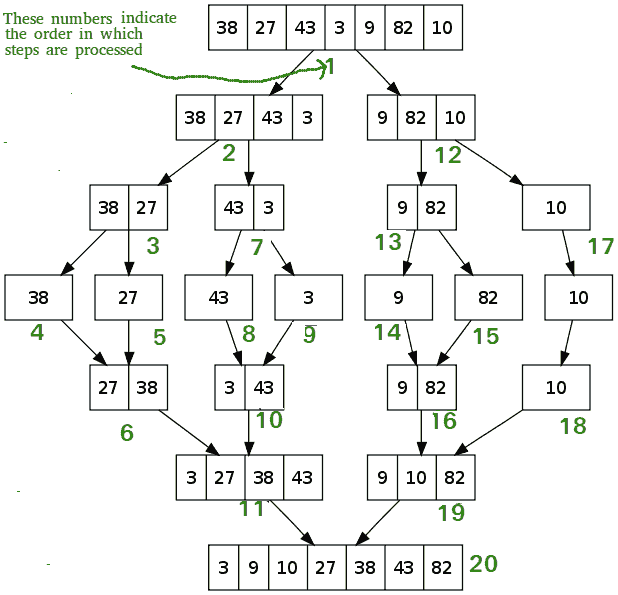

# 合并排序与插入排序

> 原文:[https://www.geeksforgeeks.org/merge-sort-vs-insertion-sort/](https://www.geeksforgeeks.org/merge-sort-vs-insertion-sort/)

**先决条件:[合并排序](https://www.geeksforgeeks.org/merge-sort/)、[插入排序](https://www.geeksforgeeks.org/insertion-sort/)**

**<u>[合并排序](https://www.geeksforgeeks.org/merge-sort/)</u> :** 是一个外部算法，基于分治策略。在本[排序](https://www.geeksforgeeks.org/sorting-algorithms/)中:

1.  元素被一次又一次地分成两个子阵列 **(n/2)** ，直到只剩下一个元素。
2.  合并排序使用额外的存储空间对辅助数组进行排序。
3.  合并排序使用三个数组，其中两个用于存储每一半，第三个外部数组用于通过合并其他两个数组来存储最终的排序列表，然后每个数组被递归排序。
4.  最后，合并所有子数组，使其成为数组的 n 个元素大小。

下图说明了**合并排序**:

**<u>[【插入排序】](https://www.geeksforgeeks.org/insertion-sort/)</u>** 是一种排序算法，从未排序的项目中取出元素，在其他项目前面按排序顺序插入，重复直到所有项目都按顺序排列。该算法实现简单，通常由两个循环组成:一个外部循环用于挑选项目，一个内部循环用于遍历数组。它的工作原理是把我们手中的扑克牌分类。

下图说明了**插入排序**:

**<u>合并排序和插入排序的区别</u> :**

*   **时间复杂度:**合并排序中最差情况: *O(N*log N)* ，平均情况: *O(N*log N)* ，最佳情况: *O(N*log N)* ，
    而
    插入排序中最差情况: *O(N 2 )* ，平均情况: *O(N 2 ) 【T17*
*   **空间复杂度:** **合并排序**递归占用 *O(N)* 的辅助空间复杂度，因此不能优先于内存有问题的地方，
    而**插入排序**中的
    只占用 *O(1)* 辅助空间复杂度。它只使用一个额外的变量对整个数组进行排序。
*   **数据集:**对于庞大的数据集，合并排序是首选。它碰巧比较了数组中的所有元素，因此对小数据集没有太大帮助，
    而
    插入排序更适合较少的元素。当数据已经排序或接近排序时，它会变得很快，因为它会跳过已排序的值。
*   **效率:**考虑到两种算法的平均时间复杂度，我们可以说 Merge Sort 在时间上是高效的，Insertion Sort 在空间上是高效的。
*   **排序方法:**合并排序是一种外部排序方法，其中要排序的数据不能容纳在内存中，需要辅助内存进行排序，
    而
    插入排序是基于这样一种思想，即在每次迭代中消耗输入元素中的一个元素来找到其正确位置，即它在排序数组中所属的位置。
*   **稳定性:**合并排序是稳定的，因为两个具有相同值的元素在排序的输出中以相同的顺序出现，就像它们在输入的未排序数组中一样，
    而
    插入排序在两个[数据结构](https://www.geeksforgeeks.org/data-structures/) ( [数组](https://www.geeksforgeeks.org/introduction-to-arrays/)和[链表](https://www.geeksforgeeks.org/data-structures/linked-list/)上花费 *O(N 2 )* 时间。如果中央处理器有一个有效的内存块移动功能，那么阵列可能会更快。否则，可能不会有太大的时间差。

**表格表示法:**

| 因素 | 合并排序 | 插入排序 |
| --- | --- | --- |
| 最坏情况复杂性 | o(N *对数 N) | O(N 2 ) |
| 平均案例复杂性 | o(N *对数 N) | O(N 2 ) |
| 最佳案例复杂性 | o(N *对数 N) | O(N) |
| 辅助空间复杂性 | O(N) | O(1) |
| 很适合 | 在庞大的数据集上。 | 在小数据集上。 |
| 效率 | 相对高效。 | 相对低效。 |
| 就地分拣 | 不 | 是 |
| 算法范式 | 分治法 | 增量方法 |
| 使用 | 用于 O(N*log N)中链表的排序，用于倒计数问题，外部排序等。 | 当元素数量较少时使用。当输入数组几乎被排序，只有很少的元素被错放在完整的大数组中时，它也很有用。 |